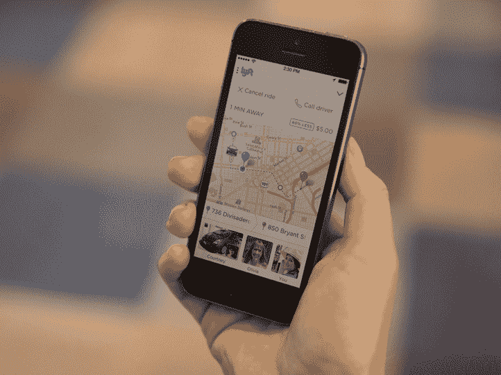

# 通过 Lyft Line，乘客可以分摊拼车费用 TechCrunch

> 原文：<http://techcrunch.com/2014/08/06/lyft-line/?utm_source=wanqu.co&utm_campaign=Wanqu+Daily&utm_medium=website>

按需拼车初创公司 Lyft 今天在旧金山推出了一款新产品，希望能让更多人使用其服务。该产品名为 Lyft Line，旨在通过让多人在共用一条路线时一起乘坐来降低乘客的成本。

Lyft Line 是在 [Rover](http://www.roversf.com) 背后的团队的帮助下建立的，这家由 [Y Combinator](http://www.crunchbase.com/organization/y-combinator) 支持的初创公司试图将多种交通方式结合起来——无论是步行、骑自行车、乘坐公共交通，还是使用市场上的一种新的打车应用。根据 Green 的说法，创始人已经发现并使用一个未记录的 API 来连接 Lyft 并确定最近的乘车点。

通常在这种情况下，公司会切断对 API 的访问，然后收工。Lyft 的人没有这样做，而是与 Rover 的人进行了交谈，他们决定一起工作。结果是 Rover 创始人 Lev Popov 和 David Dryjanski 加入了 Lyft 团队，并开始在 Lyft Line 上工作。

### 它是如何工作的

对于旧金山的 Lyft 用户来说，Lyft Line 将成为用户在尝试搭车时可以切换的另一个选项。选择后，乘客选择他们的起点和终点，以及他们将乘坐的乘客人数。该应用程序实际上提前告诉乘客乘车费用，Lyft 表示，根据某人的出发地点或目的地，票价可能低至 60%。

一旦乘车被确认，Lyft 就会派出一辆车，同时试图匹配另一名同方向的乘客。据 Lyft 首席执行官 Logan Green 称，如今，约 90%的 Lyft 请求在五分钟内让附近的乘客前往同一方向。

当 Lyft 搭载一名用户时，人们的期望将是乘客已经在他们的前门，准备好出发了——没有懒散地闲逛。原因是显而易见的:共享乘车服务依赖于乘客准时工作，否则每个人都会迟到、沮丧和脾气暴躁。司机会等乘客一分钟，但之后就会去下一站。

对于乘客来说，折扣的多少实际上取决于 Lyft 在后端运行的一种算法，以确定匹配的可能性。据 Lyft 联合创始人兼总裁约翰·齐默(John Zimmer)称，如果确定找到另一名乘客共乘的可能性很低，折扣将只有 10%左右。

另一方面，如果附近可能有多名乘客，折扣会更大。Lyft 宣传最高端票价降低 60%的可能性，但对于在旧金山交通相对繁忙的地区之间旅行的乘客来说，即 Mission、SOMA、金融区和 Marina，折扣可能在 30%至 40%之间。

### 对乘客好，对司机好，对 Lyft 好？

因此，很明显，Lyft Line 可能对那些希望每次旅行节省几块钱并且不怕共乘的乘客，或者那些在到达目的地时没有完全时间限制的乘客有好处。

该产品也将有利于司机，他们将受益于票价数量和每次乘坐平均时间的普遍增加，因为这两个方面都意味着他们从乘客那里获得更大的收入。根据 Zimmer 的说法，Lyft Line 将在推出时面向所有旧金山司机开放，因此他们都将从推出中受益。

不过，最重要的是，这种产品可能对 Lyft 有利，Lyft 受益于票价上涨，这可能使它能够再次开始收取佣金。

今年早些时候，Lyft 降低了票价，以提高其在全国 65 个市场的使用率和份额。但为了做到这一点，该公司将其在所有客运票价中的份额实际上削减至零。这意味着司机不会受到票价下降的影响，这很重要，因为司机是其业务的命脉。

通过 Lyft Line，该公司不仅可以提高司机收取的车费，还可以灵活地恢复之前的佣金结构。

### 没那么快！

Lyft 不是该领域唯一一家在同一条线路上推出多辆载客汽车的公司。昨天，优步[宣布了一项类似的产品，名为](https://beta.techcrunch.com/2014/08/05/uberpool-lets-you-split-uber-fares-with-other-passengers-along-the-same-route/) [UberPool](http://blog.uber.com/uberpool) 的，它将允许乘客通过同意共乘而削减 40%的票价。我们[以前写过关于 Hitch](https://beta.techcrunch.com/2014/06/11/hitch-ride-share/) 的报道，一家实际上也是抱着同样想法推出的公司。

当 Lyft 召集了一群旧金山科技媒体来演示这款应用并讨论 Lyft Line 背后的想法时，他们不太可能想到优步会在发布前一天宣布同样的产品。毕竟，即使是优步[也在其博客文章](http://blog.uber.com/uberpool)中承认，UberPool 正在“推出私人测试版”,该测试版的扩展将在 10 天后进行。

(值得一提的是，这并不是这两家公司第一次试图抢对方的风头。几个月前，Lyft 宣布，在优步[准备宣布类似事情](https://beta.techcrunch.com/2014/03/14/following-lyft-uber-offers-insurance-gap-coverage/)的前一天，它将在乘车之间增加[保险。我想善有善报吧。)](https://beta.techcrunch.com/2014/03/13/lyft-insurance-between-rides/)

### 一切旧的都是新的

两年前，当我第一次见到格林和齐默时，那是在他们创业公司的新产品发布会上。他们花了五年时间建立了一个拼车平台，帮助用户找到同路的人，这样他们就可以共乘。

Zimride 成立的简单目标是提高道路上车辆的占用率。在任何给定的时间里，大约 80%的汽车座位都是闲置的，Zimride 非常专注于减少这一数字。但当时的站台主要用于长途旅行——也就是说，在旧金山和太浩湖或洛杉矶和圣地亚哥之间乘车。

问题是这些旅行并不经常发生。

Lyft 的推出本应通过增加乘客可以连接的汽车的密度和可用性来解决这个问题。新产品本质上是优步的克隆，但有所改变——Lyft 不再与有执照的出租车或黑车司机合作，而是允许 Zimride 社区的成员互相开车。

我提到这一点是因为，如果该公司的创始使命是提高周围行驶的汽车的占用率，Lyft Line 比 Zimride 或 Lyft 的第一个版本更接近这一目标。

### 改变个人交通的面貌

然而，可能值得注意的是，Lyft Line 基本上是该公司创始原则的最真实体现，即在任何一个时间增加乘坐车辆旅行的乘客数量。通过新产品，Lyft 将在一辆汽车中支持多达四个人——即三名乘客和一名司机——这将大大提高占用率，这是 Zimmer 和 Logan 在推出 Zimride 时非常关心的。

几天前，格林在新闻发布会上说:“我们正在建设我们所谓的个人交通，而不是公共交通。”。

通过大幅降低成本和增加便利性，Lyft 线可以成为缓慢而低效的公共交通的替代选择。但更大的情况是，Lyft Line 可能会让拥有一辆汽车和独自通勤变得过时，这是创始人真正希望的。

在旧金山这样的地方，相对较小，公共交通系统还不错(但绝不是很棒)，Lyft Line 可能是一个不错的方式，可以省去乘坐公共汽车或担心在办公室附近找到停车位的麻烦。但在洛杉矶这样的地方，高速公路上满是只有一名乘客的车辆，提供一种负担得起的替代独自驾驶的方式可能会改变游戏规则。

毕竟，这是这些家伙一直希望做的。