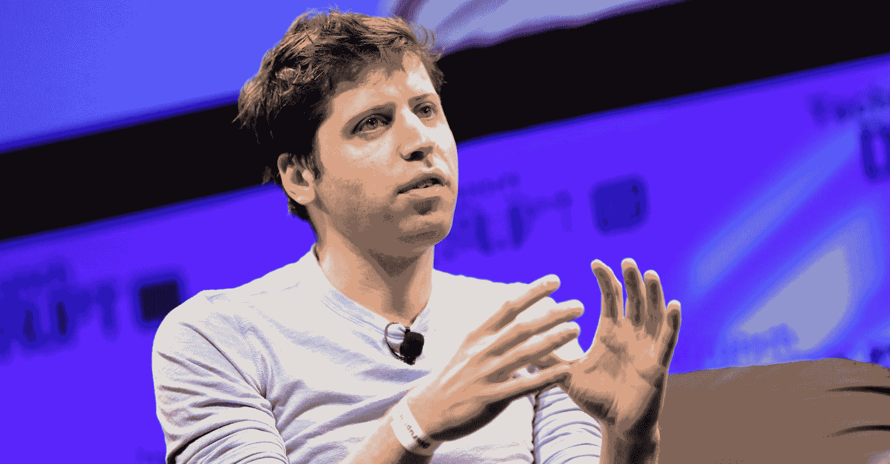

# 新的 At Y Combinator:创业公司解决巨大的问题！TechCrunch

> 原文：<http://techcrunch.com/2014/08/19/new-at-y-combinator-startups-solving-huge-problems/?utm_source=wanqu.co&utm_campaign=Wanqu+Daily&utm_medium=website>

在今天的 Y Combinator 演示日期间，在出席的初创公司中，有一个显著的群体没有散发出我们在硅谷这类活动中习惯看到的那种氛围:用大胆的大方案解决实际问题的公司。我们谈论的不是我们都有的小问题——比如[让墨西哥卷饼快速送达](https://beta.techcrunch.com/2014/08/14/free-startup-idea-burritocannon/)——而是可能对我们整个世界产生巨大影响的问题。

以下是最明显的例子:

*   有两家 T2 公司在建造核反应堆，这将从根本上改变我们在国内和发展中国家的供电方式。
*   免疫项目正在寻找一种可以消灭艾滋病毒和艾滋病的疫苗。
*   发光植物和[银杏生物工程](https://beta.techcrunch.com/2014/07/16/why-the-first-yc-backed-biotech-company-may-just-be-the-future-of-pharma/)希望通过创造转基因植物来改变我们所知的制造业和制药业，这些转基因植物可以生产燃料、牛奶等材料和产品，以及积极治疗疾病的细菌。
*   [贝叶斯影响](https://beta.techcrunch.com/2014/07/15/harnessing-big-data-for-social-good-yc-backed-nonprofit-bayes-impact-launches/)利用数据科学赋予私营部门项目的洞察力，并与非营利机构分享。
*   比坎塔公司正在制造纳米钻石，这使得发现癌症变得更加容易。
*   One Codex 的基因组数据搜索引擎将让追踪病原体的研究人员有一种更快、更可靠的方法来识别潜在的致命病毒和细菌。
*   UBiome 正在对生活在我们体内的微生物进行私有化研究，这些微生物对我们的情绪和健康有着未知的影响。
*   Rigetti 计算公司正在建造一台用于商业应用的量子计算机。

当我第一次与 Y Combinator 总裁山姆·奥特曼(Sam Altman)谈论第一家从加速器获得资金和支持的核聚变创业公司 Helion 时，他告诉我，YC 投资于能源领域的一个潜在游戏规则改变者绝非偶然——一年半以来，他一直将研究能源创业公司作为个人爱好。

事实证明，这也适用于今天出席的其他雄心勃勃的公司。在我们午休时间的一次简短聊天中，奥尔特曼证实，加速器有一个大问题的清单，它想资助解决方案，尽管他开玩笑说，它在“一个加密的 DMG 文件中，除了 Y Combinator 之外，没有人能看到。”奥尔特曼说，其他 YC 合作伙伴的热情也反映在加速器的批量公司阵容中。

他还指出，还有一些其他重大问题不像核聚变和量子计算那样引人注目。这些包括从稳定的长期雇佣到短期雇佣、自由职业和独立承包的趋势。

虽然这不是一个需要等离子体密封或量子物理学进步的问题，但劳动力的长期转移将改变我们对劳动力市场的看法。Y Combinator 支持的初创公司，如 [Zen99](https://beta.techcrunch.com/2014/08/15/zen99/) 、 [Fixed](https://beta.techcrunch.com/2014/01/15/fight-parking-ticket-fixed/) 和 [Checkr](https://beta.techcrunch.com/2014/07/24/checkr/) ，虽然乍看起来很简单，但会使这种转变更加平稳。

也就是说，按照奥特曼的说法，YC 并没有多大变化。正如他在今天早些时候的一次采访中告诉我的同事 Kim-Mai 的，“YC 从未涉足软件行业。YC 从事为大公司提供资金的业务。”

一家建造核反应堆的公司可能看起来不太像 Airbnb，但任何颠覆性的初创公司都需要正确的文化、计划和大量的运气才能成功。从这个角度来看，这两者并没有什么不同，Y Combinator 希望能帮助他们。