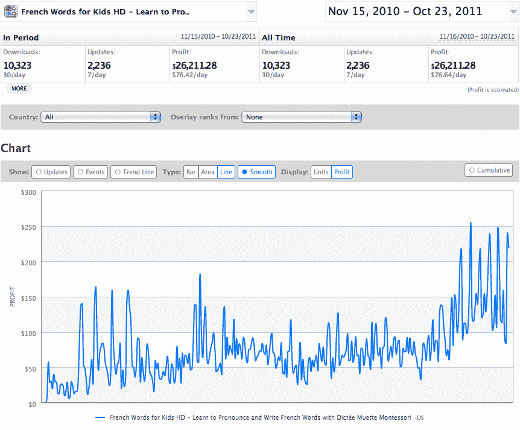
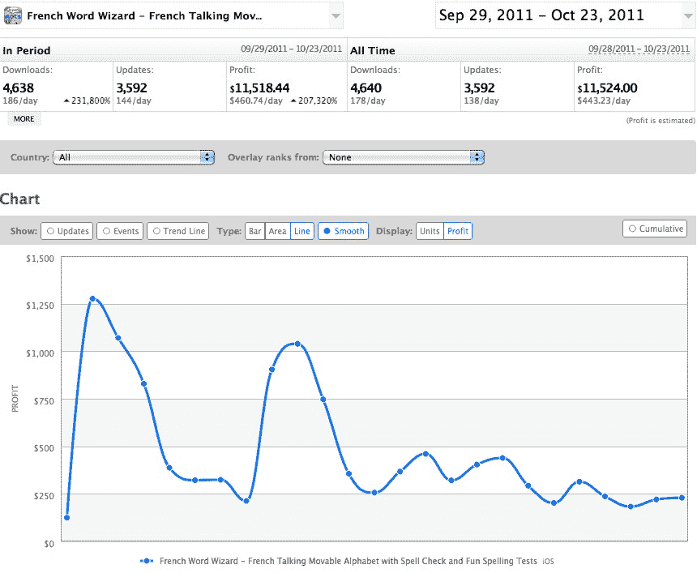
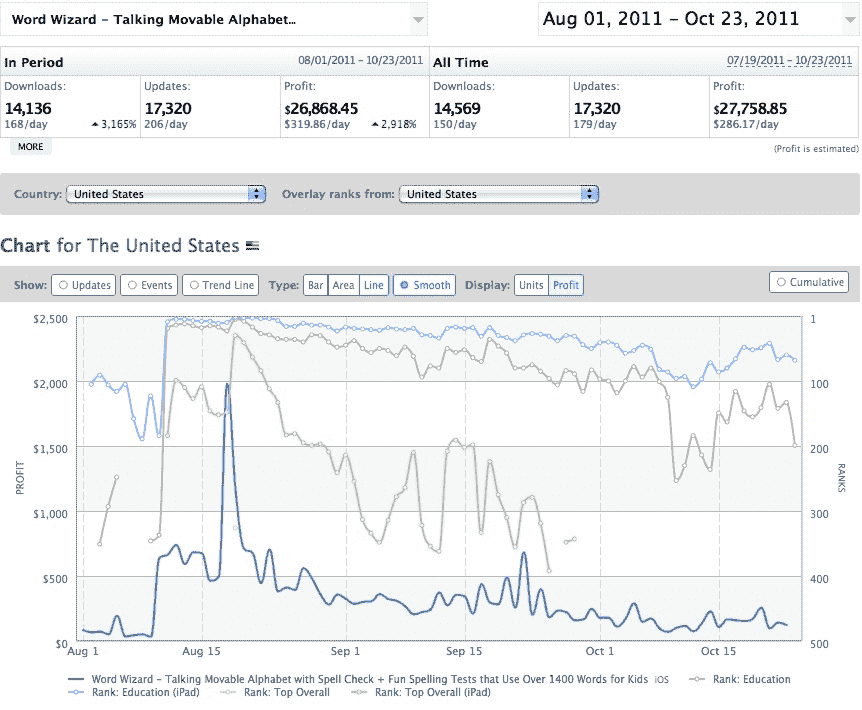

# L'Escapadou 博客——iPhone/iPad 儿童教育和娱乐应用程序:我如何在 iOS 教育市场赚了 20 万美元——数字&我作为独立开发者的第一年

> 原文：<http://blog.lescapadou.com/2011/10/how-ive-made-200000-in-ios-education.html?utm_source=wanqu.co&utm_campaign=Wanqu+Daily&utm_medium=website>

考虑到我自 2011 年 8 月以来已经赚了 9 万美元，这是因为我的第二个应用程序 Word Wizard(英语和法语版)的成功(你可以看到，一旦该应用程序发布，斜坡的陡峭程度就会好得多)。T3】

T4】

现在让我们来看看 4 款应用的一些细节，它们是最重要的(收入的 90%以上——其他应用见下文)。注意我所有的应用都是通用的(iPad+iPhone)T3】

T4】

T4】

T4】

 T4】

  I am French, so I logically decided to release a French version of Montessori Crosswords. Even if I thought  the French market was small, I wanted to do it for my kids and friends (but eventually it was a good business decision too). Since there is much less quality educational apps in France, the app was mentioned by major blogs in France and Apple France did add it to its “Apps for kids” section, and it was almost every time in the top 10 educational apps on iPad in France. I didn't need to promote it a lot (I did it a little bit in January) or create nice updates to stay in the top 10, due to the lack of competition. There was a nice boost recently due to the huge success of French Word Wizard in France (see below).

T4】

T4】

<iframe allowfullscreen="allowfullscreen" frameborder="0" mozallowfullscreen="mozallowfullscreen" src="https://www.youtube.com/embed/rFV2Wv6LKFY?feature=player_embedded" webkitallowfullscreen="webkitallowfullscreen">视频</iframe>

I worked hard on [Word Wizard](http://bit.ly/wordwizard) for 5/6 months, lots of design, testing, graphics to find the right balance, and I was really excited by the innovation inside this app, and feedback from beta testers. When it launched, it did get noticed by teachers, educators and people involved in chidren’s technology but it lacked a very good promotion to be visible. Then everything gone wild, [Children's Technology Review](http://childrenstech.com/) awarded the app, there was an article in The New York Times online and then in the paper edition  (this the huge peak), in Wired Geek Dad blog, Apple mentioned it on its Facebook page and selected it as “New and  Noteworthy” for iPhone and iPad in the US and most of English speaking countries.  Then after one month sales went down surely because I did not promote it afterwards - this is a good lesson, even with a lot of good press you need to continue to promote your app. Now I’ve just released V2.0 (adding all users requests - more than 20 options and features), things are getting better and I'm publishing a costly press release on PRWeb to see if it has some effects.

 T4】

T6】

T6】

<iframe allowfullscreen="allowfullscreen" frameborder="0" mozallowfullscreen="mozallowfullscreen" src="https://www.youtube.com/embed/S7Eb-7WBsSM?feature=player_embedded" webkitallowfullscreen="webkitallowfullscreen">VIDEO</iframe>

 T6】

这是一个大惊喜。一天之内，该应用程序在 iPad 上进入了前 10 名(总排名)，并在那里停留了 2 周。每一次高峰都是由于法国主要苹果相关博客上的一篇帖子。它随后被苹果选为“新的和值得注意的”，但令人惊讶的是，其影响真的比博客帖子轻。

**其他应用:**

I’ve released a small app ([Draw With Stars](http://itunes.apple.com/us/app/draw-stars-!-play-musical/id367460661?mt=8)) in March 2010 to understand how the App Store was working and to learn how to program for the iPad and the iPhone. Apparently, people love the app and it generates an average income is $10 a day (so $6,000 since it has been published). I’ve also published Montessori Crosswords on the Mac App Store but it does not sell very well ($6,000 in 9 months for the English version and $1,600 for the French version). I also did an experiment with the French Montessori Crosswords and offered a cheaper iPhone only version but it does not work as well as on the iPad ($2,800 for a price of $1.99). I've also released a free app, [Hearts Extravavaganza](http://itunes.apple.com/us/app/hearts-extravaganza/id419003288?mt=8) ,an app to draw with hearts especially made for my daughters.Ranking vs Sales Now what’s interesting is to see these sales figures in relation with the rank on the App Store. This gives an idea of the size of the educational market (and even some hints on the size of overall market), and you will see that my apps are almost never in the top 10 educational apps (despite their quality). All my apps are universal (iPad+iPhone) and Apple does not tell how many apps have been sold on each type of device, so it’s not really possible to know how many sales are made on iPad and how many are made on iPhone. However, ranks are available by device so you can get an idea. The general opinion is that the education market is bigger on iPad even if there is a lot more of iPhone, but if you are in the top 10 education on iPhone it seems that it is better than if your are in the top 10 education on iPad because it seems that sales are more evenly distributed on iPad than on iPhone. Anyway, one should do a better analysis to be sure of that. *Disclaimer:* My goal is not to make a detailed analysis of the education market. It is only to offer you some data to understand it and view that it is relatively big (at least for an indie). I think one can say a lot of things with these graphs but I have not the willingness to do it. US Market Figures below are for the US market (of course the biggest), that’s why sales are lower that the one displayed above. It is also a way to compare the US market to the Worldwide market. [Word Wizard ($2.99](http://bit.ly/wordwizard))  it is an interesting figure because [Word Wizard](http://bit.ly/wordwizard) was very successful in August. The day The New York Times wrote an article (in the paper edition) about it, it was #2 in iPad Education, #5 in iPhone Education, #30 in iPad overall (and only #326 on iPhone overall!).  Now let’s see the Grossing Ranks for the same period, which is important to understand the size of the market (sorry there is no sales on this graph because I did not succeed to make it with AppFigures which is sometimes changing its mind)

 T2】

Interesting, isn't it ? The NYT day I was ranked #104 in overall grossing on iPad (and not even in the top overall on iPhone) I’ve made $2,000 - So how much ca you expect when you are ranked in the top 10 iPad ? There are some hints below because the French version was in the top 10 but I don’t know if this can be extrapolated.  [Montessori Crosswords ($2.99)](http://bit.ly/montessoricrosswords) Here are the figures for [Montessori Crosswords](http://bit.ly/montessoricrosswords). It is interesting to see the difference in sales for the same rank in 2010 and 2011.

 T4】

当然，法国市场更小，但如果你排名靠前，这也是一个不错的市场——然而根据我的计算，这个市场要小 7 到 10 倍(在教育领域)。

所以这一个很有趣，因为这些应用程序在 iPad 上总排名第五，这些天的收入在 900 美元到 1 美元之间， 000 美元(顺便说一下，这些天的总收入排名在第十左右)。当你把它与我在美国 iPad 上排名第 30、赚了 2000 美元的那一天相比，你就能想象我为什么首先瞄准美国市场了。
 我的 iOS 独立开发之旅

Enough figures and numbers, now I just want to talk about my experience. As I've said I've read a lot of posts about this when I was starting and it was interesting - so I hope it can help somebody. The Start I decided to develop educational apps for iPad and iPhone some weeks after the iPad was announced. My first try to build a kind of startup with a friend was not successful, I was looking for a new project, and after some friends told me that I was not the best candidate to join their own startup (Thanks Matthias to have understood that it was not exactly what I was looking for ! ), I remember that I really wanted to develop something for the iPad. After reading some blog posts and understanding that there was already some opportunities in the education market on iPhone, I finally found the perfect match :  develop educational apps for my kids on iPad ! We are a homeschooling family and so we (especially my wife) did have some experience with the education of kids. In addition, it was very interesting for me to be able to work a little bit with my wife and my kids (my kids are testing all the apps!). In others words, I just followed the advice given all over the Web : find a good problem that you have (and of course enough other people have) and develop a solution. The iPad seemed perfect for my kids, who already enjoyed playing on the iPhone, and I am perfectly sure that kids learn better when they play. I started with a small app (did it in 2/3 weeks) to understand how the App Store worked and after some brainstorming we decided to create [Montessori Crosswords](http://bit.ly/montessoricrosswords) because one of my kids was doing this Montessori activity and it seemed perfect to put it on the iPad. Actually, at the beginning we wanted to do something bigger, Montessori Crosswords only being a part of it. However, I soon realized that I had - as often - underestimated the resources needed, so I decided to release Montessori Crosswords as a standalone app. After releasing it, I realized that I had a lot of promotions and support to do, and eventually the big app was never developed.

 T4】

Once the iPad version was released, the first thing was to make the app universal which pushed sales a little bit but not so much (it is a little expensive for an iPhone app). Then I began to try to understand better how I could promote the app, found some good advices in [MomsWithApps forums](http://forum.momswithapps.com/), and was featured in an AppFriday event by MomsWithApps (which, luckily, resulted to a mention in the NYT) . I gathered all the feedback I could and released a really nice update. I then began to promote it everywhere (I remember writing [this expensive PR](http://www.prweb.com/releases/2010/12/prweb4869054.htm) for one week, it was not an easy job for me - I'm French - and eventually I do not know if it was useful or not). I wanted to release a French version quickly but due to the use of cursive letters, accented letters and recording my wife voice it took me a lot of time (I thought I was crazy to do this and not to concentrate on the US market!).

 T4】

**Word 向导，第二个 App**

T6】

2011 年 1 月，我开始尝试一个新的拼写 app 的新思路。我想做一些更像游戏的新东西，人们可以输入自己的话。我做了两三个原型，但并不完美。然后，我开始寻找语音合成库，这样人们就不需要录制自己的声音来输入新单词，并迅速开始尝试一个会说话的移动字母表的想法，很快意识到这真的真的很棒！孩子们和成年人都对原型很感兴趣，我最初看到的一个小项目开始了一个为期 6 个月的项目，因为我想从 UX 的角度做到完美，还因为市场分析告诉我，除了会说话的移动字母表之外，我还需要添加一个拼写测验部分。主要问题是语音合成库，因为他们占了你销售额的 20%到 30%(你买不到这个库)，但是这个项目太令人兴奋了，所以我冒了这个险。T3】

 T4】

我有幸从蒙特梭利填字游戏中获得了一些收入，这让我有时间开始开发 Word Wizard。然而，销售并不太好，我开始得到一些关于 Word Wizard 的非常有希望的反馈。所以在五月，我花了 3-4 周发布了另一个蒙特梭利纵横字谜的更新，这是一个很好的投资。然后在 7 月底，Word Wizard 的英文版发布了，然后在 9 月发布了法文版。我现在计划更新蒙特梭利填字游戏，并发布德语和西班牙语版本的 Word Wizard。T3】

 T4】

 T4】

What I Do Everyday I’ve tried to sum up what what I do to give you an idea of my choices as an indie dev and what was difficult for me. The percentage are approximated and of course it could be very different for another dev. Of course, some days I do only development and others days only artworks or promotions.  **Development (20-25%):** For me its was really not an issue. I have been a developper for 25 years (I started on Apple IIe when I was 15), did long studies (PhD) in computer science, and worked as developer/UX Designer in a startup for 6 years. I was happy to learn a new language and a new platform, and I love development. Compared to my previous jobs, it was a really easy and gratifying job. **Product Definition & User Experience Design (15-20%):** As for product definition, it was easy because I’m a father, so I have an understanding of what parents wants for their kids (but of course you need to listen to your users to enhance the app afterwards). As of User Experience (UX) I worked a lot on UX previously so I knew how to do it and the pitfalls, and it was a very interesting experience to design apps for kids on touch devices (I was mostly doing enterprise software or Web sites before). UX seems easy to do but eventually it is tricky, and if you don’t have experience in UX, I would advise you to buy some books to understand the basics (personas, users goals, tasks, tests). Without a good UX, it will be difficult to have good feedback and sell a lot of units. **Artworks (20%) :** this one was more tricky for me because I’m not a designer. I love doing this but I need to work very hard to get some nice results. I’ve always played with Photoshop and Illustrator, and I was/am happy to do it even if I think it would be better to hire a real designer to do it (because it would take him less less time to do it). So if you don’t like it or know nothing about it, you should think about hiring or doing a partnership with a designer (you can also buy some artwork on the Web but depending on your needs it may be impossible). Everybody knows that artworks are really important to sell apps, and you need this skill also for your Website, screenshots, app icon, ads, ... **Promotion (15-20%):** As you may imagine, it is also crucial. If you have a software engineer background like me, you must focus on this point (once you’ve got a nice app). Sometimes I only did promotions and support for one month. Promotions include Press Release (PRMac, PRWeb if you’ve got something big), [Web Site](http://lescapadou.com/), contacting reviewers, [Facebook](http://facebook.com/lescapadou), [Twitter](http://twitter.com/#!/lescapadou), ads, participate in forum but also understand how to do it. I knew that marketing was very important but I have no experience at all. Actually, marketing is not so difficult to do, it is just very time consuming, and when you’re more on the creative side than on the marketing side, it’s sometimes hard to push you to do your marketing. You must try to find some promotions techniques that you love to do (this post is also a kind of promotion). As for everything, you will improve yourself and it will take less time in the end, you will know who to contact, where to find information, ... **Be in the loop, participate (?%):** I was looking for advice from others devs and also a kind of community of educational developers. I find a fantastic one in 2010 : [MomsWithApps Forum](http://forum.momswithapps.com/) (Hello and Thanks Lorraine!). It is a very useful place where you can discuss everything and they also can make you some promotions on their [Facebook Page](http://www.facebook.com/momswithapps) and [Website](http://momswithapps.com/). I’ve met nice people (Hello Evan from Apps Kids Love) that helped me to be better in the fields where I needed some education.  I also try to help people when I can. I tried to participate to others forums but none is so good as this one. **Support (5%?)** : When you begin to sell a lot of units, you have to do some support, and it’s great to do the support for the product you have done. Actually, this is the best way to know how to enhance your product. Of course a lot of people would send you an email because the sound is not working and you have to help troubleshooting the issue, but some will send you amazing suggestions. To get feedback, you must have a button in your app that allows users to contact you easily. It's also a good way to ask people to add a review if they like your app. **Others (the rest):** there are some other tasks, like analysing the app store to know what people love (your reviews but also the reviews of others apps), playing guitar when you don’t have enough energy to work, reading news and blogs , and a lot of other minor stuff . Of course, some holidays (but not much this year I would say 2 weeks but I'm always doing the support and participating in forums). By the way, I think I work 45 hours a week and never work on week-ends (this is family time!). I try to always be productive and when I can't, I stop working.

 T4】

 T4】

希望你对这篇文章感兴趣。如果人们感兴趣，我可能会就此发表新的帖子。如果没有，下一个帖子将在一年后(上一个帖子是一年前！).T3】

 T4】

皮埃尔(pierre @ lescapadou . com)T3]

 T4】