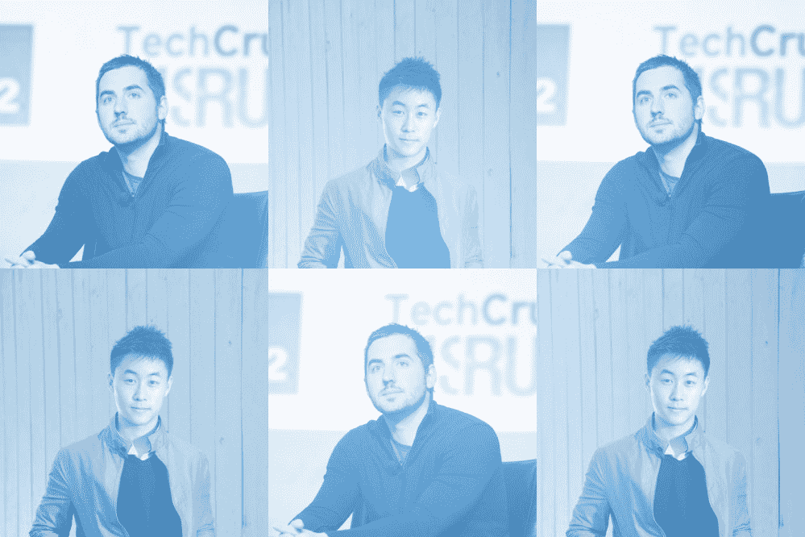

# 两个应用的故事 TechCrunch

> 原文：<http://techcrunch.com/2014/09/14/a-tale-of-two-apps?utm_source=wanqu.co&utm_campaign=Wanqu+Daily&utm_medium=website>

有时多个应用程序采用相似的想法和设计，作为某种特殊文化时代精神的一部分。但是，当想法被长期的朋友分享和采纳，重复类似的概念时，事情就变得更加模糊了。

这似乎就是发生在凯文·罗斯和丹尼·崔恩身上的事情，他们开发了不同的照片分享应用，但最终看起来惊人地相似。

9 月 4 日，前 Digg 和 Path 设计师 Trinh [推出了一款名为](https://twitter.com/dtrinh/status/507685499709169664) [Cap](http://getcap.co/) 的新照片分享应用，它的特色是一个三层平铺的小照片网格，24 小时后就会消失。

一周后，连续创业者和投资者罗斯推出了第一个应用程序，他认为这将是他的新公司 North 的一系列项目。名为 [Tiiny](http://tiiny.com/) ，其定义特征是一个由短暂照片和循环视频组成的[网格，这些照片和视频被传播给粉丝。](https://beta.techcrunch.com/2014/09/12/tiiny/)

没过多久，一些人就注意到了相似之处。正如人们猜测的那样，这些应用程序共享一些共同元素的事实并不完全是巧合。

毕竟，Rose 和 Trinh 已经认识很多年了。在高中时期是 Digg 的超级粉丝后，Trinh 搬到了旧金山，并在 17 岁时以实习生的身份加入了 Rose 的初创公司。当 Trinh 决定创办自己的公司时，Rose 不仅仅是一名导师，还是一名投资者和顾问。

据多位知情人士透露，正是 Rose 的建议让 Trinh 将网格接口集成到 Cap 中。虽然 Rose 当时并不知道，但这个功能是在他着手将其构建到自己的应用 Tiiny 之前添加的。

我们与 Rose 和 Trinh 谈论了他们应用程序的发展，以及其他一些熟悉他们开发的人。这些人中没有一个人愿意在这篇文章中直接引用，但在与他们的交谈中，我们能够拼凑出这两个应用程序是如何产生的，以及它们是如何变得如此相似的。

## 从免费到免费

在与 Digg 的 Rose 和 Path 的 Dave Morin 等人共事六年后，去年秋天，Trinh 决定创办自己的公司。

他感兴趣的是开发一个名为 Free 的位置共享应用程序，让人们可以更容易地提醒朋友何时可以出去玩。他从包括罗斯在内的一群投资者那里筹集了少量资金，并着手开发他的应用程序的第一个版本。

Trinh 和他的联合创始人前往奥斯汀，在不受旧金山干扰的情况下开发这款应用，几个月后，他们就完成了最初的原型。不幸的是，三月份看到它的少数用户的反馈显示，该应用程序需要大量的工作。

与此同时，该建筑中的一些元素让人们兴奋不已，包括罗斯在内。其中一个功能是前置摄像头中出现的一个小的、始终打开的缩略图，以及一个允许用户按住捕捉按钮来创建一个短循环视频的机制。Trinh 把这个想法的核心放在一边，开始建造后来成为 Cap 的东西。

7 月初，Rose 看到了一款新的照片和视频分享应用，并建议 Trinh 开发这款应用，而不是免费的。他建议在应用程序中添加一个追随者模型，这样用户就可以向朋友播放他们的图像和循环播放视频，Trinh 后来采纳了这个想法。

大约一周后，Rose 和 Trinh 和其他几个朋友在酒吧里讨论如何改进产品。Rose 建议增加 Cap 图像和循环视频的网格显示，Trinh 将其合并到 Cap 中。这也是罗斯为诺斯设计的第一个项目中的一个元素。

## 从微小到微小

八月中旬，罗斯宣布他将在谷歌风投公司兼职，专注于他自己的创业公司 North。虽然直到那时他才正式提出搬迁，但罗斯在几个月前就已经开始思考他想要建造什么。

诺斯背后的理念是在朋友和业内熟人的帮助下，快速构建一系列项目的原型。他们会发布一个应用程序，看看它是否卡住了，然后继续下一个项目。

Rose 最初计划为他的第一个项目开发一个名为 Tiny 的博客平台，但是他决定开发一种新型的照片分享应用。其背后的想法来自于几个月前[玩 Instagram 标签页面](https://medium.com/@kevinrose/meet-tiiny-our-first-project-23069bb4ae8f)，能够快速浏览多张图片。

它有着和他为 Cap 建议的相同的网格设计元素，但是 Trinh 不是唯一一个得到这个建议的人。Rose 还向其他合作过的创始人推荐了这个功能，包括 Cluster 的创始人 Brendan Mulligan。然而，当 Rose 开始开发 Tiiny 时，他还没有看到任何人成功地实现它，所以他决定自己开发。

Tiiny 还将加入“保持以创建无声循环视频”机制，这是 Free 早期版本的一部分，核心部分 Trinh 已经从该应用程序中分离出来，以构建 Cap。

在宣布离开谷歌风投后不久，罗斯告诉 Trinh，他正在开发一款照片分享应用。Rose 说，他意识到两者会有一些重叠，并告诉 Trinh，他不想让他认为他在看自己的想法。Trinh 说不要担心，他还没有用 Cap 或 Free 击中目标，所以没有什么需要保护的。

也就是说，直到他和 North 的联合创始人 Marc Hemeon 完成了他们的设计冲刺，Rose 才知道 Trinh 已经实现了他与 Tiiny 一起工作的网格元素。Trinh 没有意识到 Tiiny 会有一个视频捕捉功能，类似于他在 Cap 和 Free 中内置的功能。

两人都不知道这两款应用之间会有多少重叠。卡普和蒂尼就像两艘外形非常相似的船在黑夜中驶过。

## 特征划分

那时，Rose 和 Trinh 已经意识到他们正在用一些非常相似的设计元素构建应用程序。Cap 和 Tiiny 都包含相同的“保持录制视频”手势，这是 Free 的早期版本，并且每个都有类似的小图像网格显示，在 24 小时后消失。它们也包含相同的不对称的、类似 Twitter 的模型，用于向追随者传播媒体。

但这就是应用程序的不同之处。Tiiny 的用户发送图像和视频的预览屏幕很小，而 Cap 显示的是它将捕捉的全尺寸预览。虽然 Tiiny 将所有图像和视频保存在网格中，但可以点击 Cap 上的媒体来查看更多细节。

Cap 允许用户在其图像上覆盖滤镜和表情符号，而 Tiiny 则专门关注用户用相机捕捉的内容。

从根本上说，这两个应用程序在如何考虑媒体共享的相似计数的重要性上也有所不同。Rose 的 Tiiny 有一个排行榜，显示在任何给定时间分享的最受欢迎的图片和视频。

然而，对 Trinh 来说，保持类似计数的私密性是很重要的。他希望个人用户知道他们的追随者何时喜欢一个“帽子”，但不希望这个数字被分享。这一点很重要，因为他不想让这款应用沦为接管 Instagram 或 Path 等应用的那种“[成功剧场](http://bits.blogs.nytimes.com/2012/12/28/digital-diary-facebook-poke-and-the-tedium-of-success-theater/)”。

尽管存在这些差异，很难不看一眼这两个应用程序，并看到定义它们的共同元素。

> 丹尼和我……(正在)尝试或多或少两种不同的方式来处理一个类似的想法。没有戏剧，只是在同一个操场上的想法。<cite>凯文·罗斯</cite>

不仅在他们的一些用户体验元素上有重叠，在测试这两个应用的紧密团结的社区中也有重叠。

随着 Cap 和 Tiiny 的早期版本开始分发给测试版用户，Rose 和 Trinh 的共同朋友注意到了两者之间的相似之处。在 Tiiny 的一些早期测试用户询问后，Rose 给所有人发了一条消息，承认有相似之处。

他写道，“丹尼和我已经集思广益好几个月了，我们正在尝试对一个类似的想法采取或多或少两种不同的方式。没有戏剧，只是在同一个操场上的想法。我希望你两样都尝尝。:)"

这大部分是真的，但在幕后，两人之间有一些关于如何前进的讨论。两人都不想被视为抄袭了对方的想法，但两人都计划继续进行发射。

在某些方面，这种承诺更多的是由于未来的产品计划，而不是每个人目前正在开发的应用程序。North 的模式是每个季度开发一款新产品，所以 Rose 并没有把赌注押在这个特别的应用上。虽然 Trinh 想创建一个尽可能完整的 Cap 版本，但他也一直在免费修改他最初的想法。

这也是 Trinh 选择悄悄发布测试版 Cap 的原因之一，他将 Cap 列在产品搜索列表中，而不是与媒体一同发布。Trinh 的目标，就像其他一些在那里试运行的初创公司的目标一样，主要是让更多的初始用户注册，并在通过苹果应用商店更广泛地发布之前解决问题。那天，罗斯甚至[在推特上发布了关于 Cap](https://twitter.com/kevinrose/status/507644579017793536) 的消息，以及他在谷歌风投的另一笔投资。

相比之下，罗斯在媒体上推出了一个完整的背景故事和 T2 的新闻报道。他的目标显然是让尽可能多的用户注册 Tiiny 的第一个版本，并随着时间的推移不断增加新的功能。

## 没有什么是原创的

最终，没有人真正拥有网格设计元素。毕竟，Rose 和 Trinh 最终都从 Instagram 上借用了它，并且它已经被用于其他应用程序，如 TapTalk。

SnapChat 等应用程序的“保持录制视频”功能也是如此。或者，实际上，Cap 和 Tiiny 的图像都是短暂的，24 小时后就会消失。每个元素都源于之前发布的应用。

一切都是衍生的，没有什么是真正的原创。

然而，正是这些元素的组合使得应用程序独一无二，也正是设计和用户体验在很大程度上决定了应用程序会有多受欢迎。在这方面，现在判断每部电影的表现还为时过早，尽管《玫瑰》更广泛的发行肯定有助于获得一些早期的人气。

除了目前已经推出的产品，Rose 和 Trinh 都有其他产品的计划，所以两人都不指望照片分享会成为他们所谓的杀手级应用。但与此同时，观察用户对分享和观看一系列微小、短暂的照片和视频的反应将会很有趣。

毕竟，你永远不知道 Instagram 和 PicPlz 之间的差异最终会是什么样的设计调整或 UI 流程。

**附录:**在发表这篇文章后，一些人认为更大的问题不是这些应用程序如此相似，而是凯文·罗斯开发了一个产品，与他作为谷歌风投投资的一家公司竞争。

Rose 投资时，Cap 并不是 Trinh 的重点，但当他开始为 Tiiny 工作时，他知道这是在工作中，这可能代表 Rose 和 Google Ventures 本身的利益冲突。作为上限股东，这种冲突将违反受托责任，这是美国法律中最严格的标准。