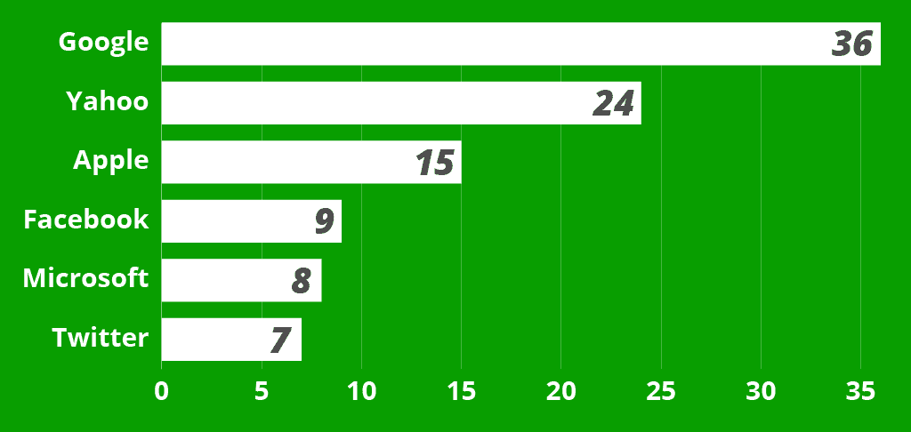

# M&A 的回归 TechCrunch

> 原文：<http://techcrunch.com/2014/09/20/return-of-the-ma/?utm_source=wanqu.co&utm_campaign=Wanqu+Daily&utm_medium=website>

彭纳撰稿人

**编者按:** *安德里亚斯·彭纳(Andreas Penna)是一家并购和投资咨询公司的[彭纳&公司的董事总经理和创始人。他也是天使投资人。](http://www.pennaco.co)*

2014 年，全球 M&A 交易数量空前，尤其是在科技领域。全球科技股 M&A 比去年上涨了 55%，飙升至 2000 年以来的最高水平。仅今年与技术相关的交易就产生了超过 1000 亿美元的收入。

现在，我们都听说过大规模、引人注目的对 WhatsApp、Nest、Beats、Oculus VR、Waze 和 T9 的收购。它们是初创企业创始人的饲料，也是睡眼惺忪的企业家努力致富的希望灯塔。然而，尽管这些大规模的并购交易一直沐浴在媒体的光芒中，但在这个主要位于硅谷的科技热点地区，已经达成了许多规模较小的交易。最近，从小型的招聘到大型的超级交易，技术世界充斥着大量的并购活动。

移动化推动了 M&A 的魅力。在过去的 12 个月里，M&A 移动互联网的总交易额达到了 470 亿美元。仅专注于移动业务的 M&A 就超过了前一年的 5X。根据 Digi Capital 的数据，如果排除 WhatsApp 的交易，M&A 剩余的最大移动细分市场中有 50%是游戏、信息、音乐和食品饮料。

玛丽·米克尔最新的互联网趋势评估了全球的大买家，并显示了顶级收购者的主要竞争。从 2012 年到 2014 年 5 月，M&A 在脸书的交易额为 240 亿美元，谷歌和阿里巴巴分别以 60 亿美元和 50 亿美元紧随其后。下图显示了过去 12 个月美国主要科技公司之间的交易数量:

那么，是什么推动了大型科技公司买家最近对 M&A 的狂热呢？有几个关键的催化剂:高股价、大量现金、支出相对于投资者股息以及人才收购。这些强有力的因素帮助酝酿了一个高度竞争的环境，推动 M&A 超速行驶。大型科技公司正在全力冲刺收购相关公司，尤其是在知识产权和用户群收购方面。

尽管出现了 M&A 狂潮，但许多公司似乎痛苦地意识不到估值等式中的关键变量。当潜在的收购者接近时，大多数首席执行官都蒙在鼓里。尽管他们了解风险资本融资的来龙去脉，但他们往往对 M&A 世界的倍数和估值方法知之甚少。

对于那些想要快速了解基本情况的人来说，这里是我关于如何计算收购估值的简略版本:*收购价值+投资者资本回报+溢价=总收购估值。*

**获得雇佣价值:**按照目前硅谷的价格，在四到五年的时间里，每个工程员工的价值在 100 万到 200 万美元之间。被吸收的工程师的确切人数取决于个别面试。

在这种情况下，非工程资产通常不会被吸收，除非有本地营销需求、卓越的人才和关键的执行管理成员。如果这成为围绕收购子公司的 M&A 交易，那么整个人力资源资产可能会保持完整。在这两种情况下，公司都将提供一份条款清单，其中考虑到 4 到 5 年内每位员工的总薪酬(其中股票和期权将在这段时间内授予)。

**投资者资本的回报:**这通常至少 100%支付，投资者首先收回资本。

**保险费:**为了计算这个数字，必须考虑一些保险费:

*   知识产权/专利，价值
*   制造价值与购买价值
*   正现金流企业价值
*   竞争劣势价值(从潜在竞争对手收购中移除目标)

**给希望收购公司的 CEO 们的 6 条建议**

当机会来敲你的门时，你要做好准备。这将是正式的比赛日，你最好希望你已经热身，拉伸，系好鞋带，戴上头盔。想成为防备的巅峰？遵循这些规则。

1.  尽职尽责。弄清楚一家公司为什么以及如何评估你的价值。他们是否希望在竞争对手之前抓住你的价值？他们想要你的 IP 吗？还是他们希望欢迎你才华横溢的团队？发掘这些答案将为你提供关键的洞察力，让你知道如何在谈判中定位自己。

2.  获得可靠的 BATNA(谈判协议的最佳替代方案)。你应该毫不留情地努力建立一个 BATNA。你如何做到这一点？通过在市场上购买你的公司！尽你所能争取报价和还价。这样做将有助于你无缝运用经典的市场竞价原则:竞价者越多，资产价格越高。

3.  **寻找一位资深的内部执行发起人。**在建立您的 BATNA 时，您必须联系合适的内部执行发起人(或接近 C 级人员)。决策者，尤其是并购的决策者，集中在大多数并购公司的高层。如果你无法接触到这些人，那就找一个能接触到他们的顾问。

4.  了解资本和资产结构的基础知识。确保您了解一项交易的不同资本和资产结构，例如预付与现金支出交易、股票交易和股权归属计划等等。

5.  熟悉各种收购方法。了解不同收购方法的分类。这些将根据公司对收购感兴趣的具体原因而有所不同。例如，如果一家公司正在寻求收购，通常最简单的方法是让员工离开公司实体，然后单独关闭。这种策略减少了债务和风险，同时降低了双方的法律费用。如果他们追求的是知识产权，那么在保持目标公司结构完整性的同时，有一些非常微妙的方法可以解决这个问题(对于那些对持续经营感兴趣的人来说)。底线是:收购公司可以有很多动机；找出推动交易的因素，并利用这一点。

6.  聘请一名顶尖的独立创业律师。你将不可避免地需要一名律师。当你开始接触律师时，一定要找一个擅长并购和公司重组的律师。相信我，它值这个价。没有必要的专业知识，许多关键部分可能会从缝隙中溜走，导致彻底的灾难。但是现在还不要担心收费率；有一些独立律师收取的费用远低于标准事务所的价格，但他们提供的服务却很好。