# 遵循通过 Postgres 内部的 Select 语句-帕特·沙乌格内西

> 原文：<http://patshaughnessy.net/2014/10/13/following-a-select-statement-through-postgres-internals?utm_source=wanqu.co&utm_campaign=Wanqu+Daily&utm_medium=website>

 *Captain Nemo takes Professor Aronnax on a tour
of the engine room, a fascinating description
of future technology from an 1870 perspective.*

这是我在巴塞罗那 Ruby 大会上发表的名为“ActiveRecord 下的 20，000 个联赛”的演讲的四篇系列文章中的第三篇(岗位:[一个](https://patshaughnessy.net/2014/9/17/20000-leagues-under-activerecord)T3】两个 T5】四个和[视频](https://www.youtube.com/watch?v=rnLnRPZZ1Q4))。

为了准备这个演示，我决定通读部分 PostgreSQL C 源代码。我执行了一个非常简单的 select 语句，并使用 LLDB(一个 C 调试器)观察 Postgres 对它做了什么。Postgres 是如何理解我的查询的？它实际上是如何找到我正在寻找的数据的？

这篇文章是我通过 Postgres 的内脏旅行的非正式日志。我将描述我走的路和一路上我所看到的。我将使用一系列简单的概念图来解释 Postgres 如何执行我的查询。如果你理解 C，我也会给你留下一些地标和路标，如果你决定破解 Postgres 内部的话。

最终，Postgres 源代码让我欣喜不已。它是干净的，有据可查的，易于理解。跟随我深入探索您日常使用的工具，亲自了解 Postgres 的内部工作方式。

## 寻找尼莫船长

这是我演讲的前半部分中的示例查询。我们将跟随 Postgres 寻找尼摩船长:

 *Professor Aronnax and Captain Nemo
plot the course of the Nautilus.*

像这样在 string 列中查找单个名称应该很简单，不是吗？当我们探索 Postgres 内部时，我们将紧紧抓住这个 select 语句，就像深海潜水员用来找到返回水面的路的绳子一样。

## 大局

Postgres 用这个 SQL 字符串做什么？它如何理解我们的意思？它怎么知道我们在找什么数据？

Postgres 使用四个步骤处理我们发送的每个 SQL 命令。

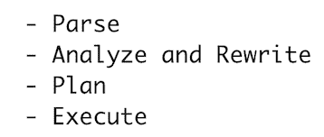

第一步，Postgres *解析*我们的 SQL 语句，并将其转换成一系列 C 内存结构，一棵*解析树*。接下来 Postgres *分析并重写*我们的查询，使用一系列复杂的算法优化并简化它。之后，Postgres 生成一个*计划*来查找我们的数据。就像一个强迫症患者不把每个行李箱都打包好就不会离开家一样，Postgres 在有计划之前不会运行我们的查询。最后，Postgres 实际上*执行*我们的查询。在本次演示中，我将简要介绍前三个主题，然后重点介绍最后一步:*执行*。

Postgres 内部实现这 4 步过程的 C 函数称为 exec_simple_query 。您可以在下面找到它的链接，还有一个 LLDB 回溯，它给出了 Postgres 调用 exec_simple_query 的具体时间和方式。

## 从语法上分析

Postgres 如何理解我们发给它的 SQL 字符串？它如何理解 select 语句中的 SQL 关键字和表达式？通过名为*解析*的过程，Postgres 将我们的 SQL 字符串转换成它理解的内部数据结构，即解析树。

原来 Postgres 使用了和 Ruby 相同的解析技术，一个叫做 [Bison](http://www.gnu.org/software/bison/) 的*解析器生成器*。Bison 在 Postgres C 构建过程中运行，并基于一系列语法规则生成解析器代码。当我们向它发送 SQL 命令时，生成的解析器代码在 Postgres 内部运行。当生成的解析器在 SQL 字符串中找到相应的模式或语法，并将新的 C 内存结构插入解析树数据结构时，每个语法规则都会被触发。

今天我不会花时间详细解释解析算法是如何工作的。如果你对这类事情感兴趣，我建议你看看我的书《显微镜下的红宝石》。在第一章中，我详细介绍了 Bison 和 Ruby 使用的 LALR 解析算法。Postgres 以完全相同的方式解析 SQL 语句。

使用 LLDB 并启用一些 C 日志记录代码，我观察到 Postgres 解析器为 Nemo Captain 查询生成了这个解析树:

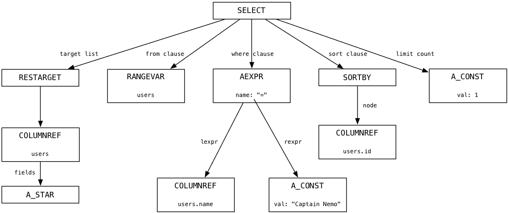

顶部是代表整个 SQL 语句的节点，下面是代表 SQL 语句语法不同部分的子节点或分支:目标列表(列的列表)、from 子句(表的列表)、where 子句、排序顺序和限制计数。

如果您想了解更多关于 Postgres 如何解析 SQL 语句的信息，请遵循从 exec_simple_query 到另一个名为 pg_parse_query 的 C 函数的控制流程。

如您所见，Postgres 源代码中有许多有用的详细注释，它们不仅解释了正在发生的事情，还指出了重要的设计决策。

## 所有的努力都白费了

上面的解析树应该看起来很熟悉——它几乎与我们之前看到的 ActiveRecord 创建的抽象语法树(AST)完全相同。回想一下[演示的前半部分，当我们执行这个 Ruby 查询时,](https://patshaughnessy.net/2014/9/17/20000-leagues-under-activerecord) ActiveRecord 生成了我们的 Captain Nemo select 语句:

我们看到当我们调用诸如 where 和 first 这样的方法时，ActiveRecord 在内部创建了一个 AST。后来(参见[的第二篇文章](https://patshaughnessy.net/2014/9/23/how-arel-converts-ruby-queries-into-sql-statements))，我们看到 Arel gem 使用基于访问者模式的算法将 AST 转换成我们的示例 select 语句。

考虑到这一点，具有讽刺意味的是，Postgres 对 SQL 语句做的第一件事就是将它从字符串转换回 AST。Postgres 的解析过程逆转了 ActiveRecord 之前所做的一切；Arel gem 所做的所有努力都是徒劳的！创建 SQL 字符串的唯一原因是通过网络连接与 Postgres 通信。一旦 Postgres 获得了字符串，它就将其转换回 AST，这是一种更方便、更有用的表示查询的方式。

了解到这一点，你可能会问:有更好的方法吗？有没有什么方法可以在不写 SQL 语句的情况下从概念上指定我们想要 Postgres 的数据？不用学习复杂的 SQL 语言或者付出使用 ActiveRecord 和 Arel 的性能开销？从一个 AST 生成一个 SQL 字符串，只是为了再次将它转换回 AST，这似乎是浪费时间。也许我们应该使用 NoSQL 数据库解决方案？

当然，Postgres 使用的 AST 与 ActiveRecord 使用的 AST 有很大不同。ActiveRecord 的 AST 由 Ruby 对象组成，而 Postgres 的 AST 由一系列 C 内存结构组成。相同的想法，但实现方式非常不同。

## 分析并重写

一旦 Postgres 生成了一个解析树，它就会使用一组不同的节点将其转换成另一个树结构。这被称为*查询树*。回到 exec_simple_query C 函数，你可以看到它接下来调用了另一个 C 函数 pg_analyze_and_rewrite 。

我挥了挥手，掩饰了许多重要的细节，分析和重写过程应用了一系列复杂的算法和试探法来优化和简化您的 SQL 语句。如果您执行了一个包含子选择和多个内部和外部连接的复杂 select 语句，那么就有很大的优化空间。Postgres 很有可能减少子选择子句或连接的数量，从而产生一个运行速度更快的更简单的查询。

对于我们简单的 select 语句，下面是 pg_analyze_and_rewrite 生成的查询树:

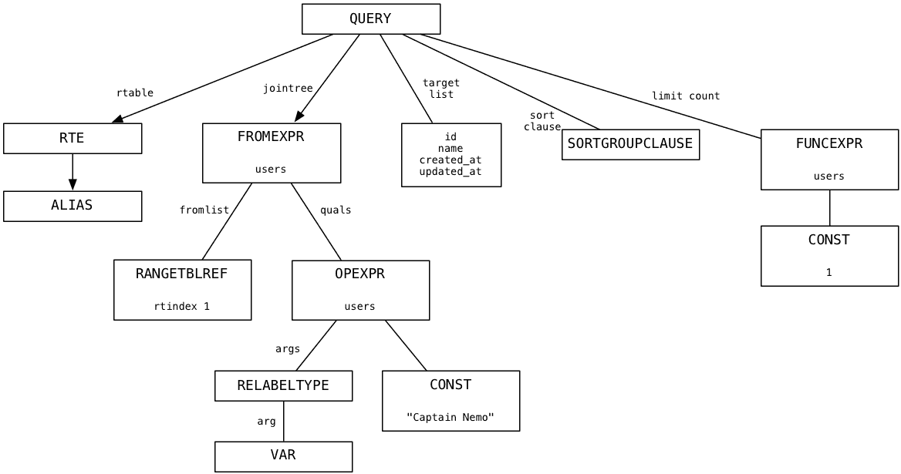

我不假装理解 pg_analyze_and_rewrite 背后的详细算法。我只是观察到，对于我们的例子，查询树很大程度上类似于解析树。这意味着 select 语句非常简单，Postgres 无法进一步简化它。

## 计划

Postgres 在开始执行我们的查询之前采取的最后一步是创建一个计划。这包括生成第三个节点树，形成 Postgres 要遵循的指令列表。这是我们的 select 语句的计划树。

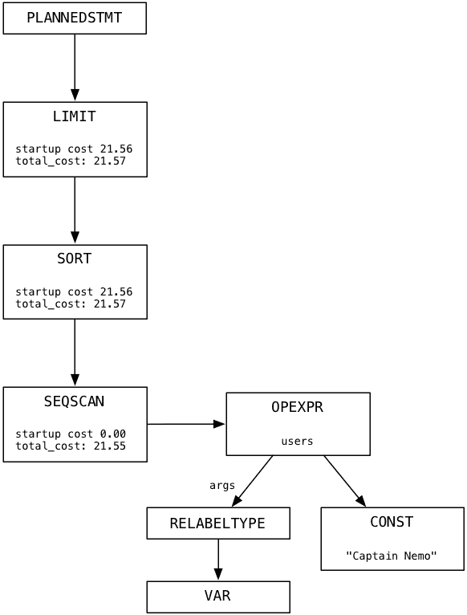

假设计划树中的每个节点都是某种机器或工人。计划树类似于工厂中的数据管道或传送带。在我的简单例子中，树中只有一个分支。计划树中的每个节点从下面的节点获取一些输出数据，对其进行处理，并将结果作为输入返回给上面的节点。在下一节中，我们将跟踪 Postgres 执行计划的过程。

启动查询规划过程的 C 函数称为 pg_plan_queries 。

注意每个计划节点中的启动成本和总成本值。Postgres 使用这些值来估计完成计划需要多长时间。您不必使用 C 调试器来查看查询的执行计划。只需在查询前添加 SQL 解释命令，如下所示:

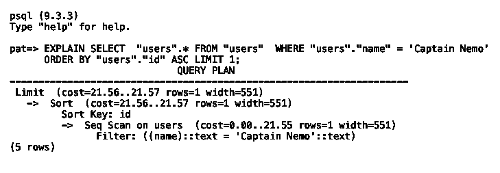

这是理解 Postgres 在内部对你的一个查询做什么，以及为什么它可能很慢或效率低下的一个强有力的方法——尽管在 pg_plan_queries 中有复杂的计划算法。

## 执行限额计划节点

到目前为止，Postgres 已经解析了您的 SQL 语句，并将其转换回 AST。然后，它优化并重写了您的查询，可能是以一种更简单的方式。第三，Postgres 编写了一个计划，它将按照这个计划找到并返回您正在寻找的数据。最后，是时候让 Postgres 实际执行您的查询了。它是怎么做到的？当然是按照计划来的！

让我们从计划树的顶部开始，向下移动。跳过根节点，Postgres 为我们的 Captain Nemo 查询使用的第一个 worker 称为 Limit。正如您可能猜到的，Limit 节点实现了 LIMIT SQL 命令，该命令将结果集限制为指定的记录数。同一个计划节点还实现了偏移命令，该命令在指定行启动结果集窗口。

Postgres 第一次调用 limit 节点时，它会计算 Limit 和 offset 的值，因为它们可能会被设置为某个动态计算的结果。在我们的示例中，偏移为 0，限制为 1。

接下来，Limit plan 节点重复调用子计划，在我们的例子中是 Sort，计数直到它达到偏移值:

在我们的例子中，偏移值为零，所以这个循环将加载第一个数据值并停止迭代。然后 Postgres 将从子计划加载的最后一个数据值返回给调用计划或上层计划。对我们来说，这将是子计划中第一个值。

最后，当 Postgres 继续调用 Limit 节点时，它将一次传递一个来自子计划的数据值:

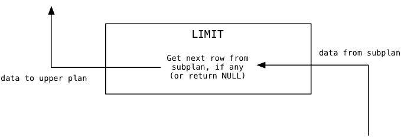

在我们的示例中，因为限制值为 1，所以限制将立即返回 NULL，向上层计划指示没有更多可用的数据。

Postgres 使用名为 nodeLimit.c 的文件中的代码实现了 Limit 节点

你可以看到 Postgres 源代码使用了诸如*元组*(一组一个值，每列一个)和*子计划*这样的词。本例中的子计划是排序节点，它出现在计划中的 Limit 下面。

## 执行排序计划节点

数据值限制过滤器从何而来？从显示在计划树中“限制”下的排序计划节点。Sort 从子计划中加载数据值，并将它们返回给其调用计划 Limit。下面是当 Limit 节点第一次调用 Sort 时，它所做的事情，以获取第一个数据值:

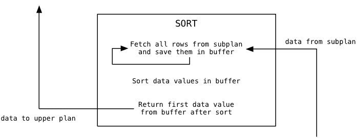

您可以看到排序功能与极限功能非常不同。在返回任何内容之前，它会立即将子计划中的所有可用数据加载到缓冲区中。然后它使用[快速排序](http://en.wikipedia.org/wiki/Quicksort)算法对缓冲区进行排序，最后返回第一个排序后的值。

对于第二次和随后的调用，Sort 只是从排序后的缓冲区返回额外的值，而不再需要再次调用子计划:

排序计划节点由一个名为 ExecSort 的 C 函数实现:

## 执行序列扫描计划节点

ExecSort 从哪里获取其值？从其子计划或出现在计划树底部的 SeqScan 节点。SeqScan 代表*序列扫描*，意思是查看表中的值，返回与给定过滤器匹配的值。为了理解扫描如何与我们的过滤器一起工作，让我们通过一个充满假名的假想用户表来寻找 Nemo 船长。

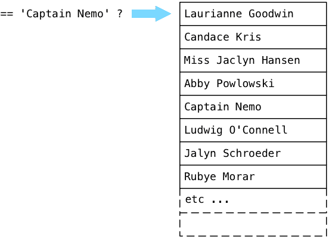

Postgres 从表中的第一条记录开始(在 Postgres 源代码中称为*关系*),并执行计划树中的布尔表达式。简单来说，Postgres 问的问题是:“这是尼摩船长吗？”因为 Laurianne Goodwin 不是 Nemo 船长，Postgres 走下到下一个记录。

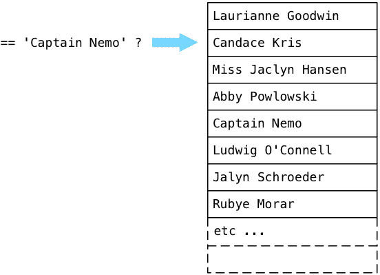

不，坎迪斯也不是尼摩船长。Postgres 继续说道:

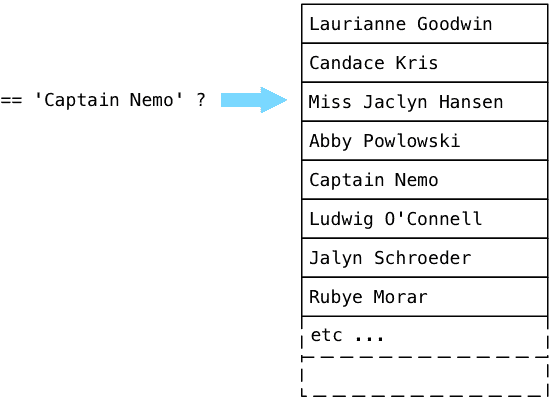

…最终找到了尼摩船长！

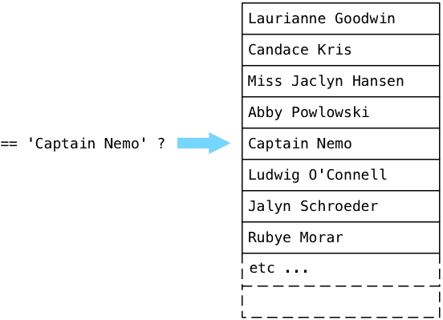

Postgres 使用一个名为 ExecSeqScan 的 C 函数实现 SeqScan 节点。

## 我们做错了什么？

现在我们完成了！我们已经跟随一个简单的 select 语句贯穿了 Postgres 的内部，并且已经看到了它是如何被解析、重写、计划和最终执行的。在执行了数千行 C 代码后，Postgres 找到了我们正在寻找的数据！现在 Postgres 所要做的就是将 Nemo 船长字符串返回给我们的 Rails 应用程序，ActiveRecord 就可以创建一个 Ruby 对象。我们终于可以回到应用程序的表面了。

但是 Postgres 并没有停止！Postgres 不是简单地返回，而是继续扫描用户表，即使我们已经找到了 Nemo Captain:

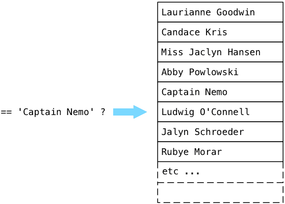 *While returning from the South Pole, the air
supply inside the Nautilus began to run out.*

这是怎么回事？为什么 Postgres 浪费时间，继续搜索，即使它已经找到了我们要找的数据？

答案就在排序节点中计划树的更高层。回想一下，为了对所有用户进行排序，ExecSort 首先将所有值加载到一个缓冲区中，方法是重复调用子计划，直到没有值剩余为止。这意味着 *ExecSeqScan 将继续扫描到表*的末尾，直到找到所有匹配的用户。如果我们的用户表包含数千甚至数百万条记录(假设我们在脸书或 Twitter 工作)，ExecSeqScan 将不得不遍历每一条用户记录，并对每一条记录执行字符串比较。这显然是低效和缓慢的，并且随着越来越多的用户记录被添加，速度会变得更慢。

如果我们只有一个 Nemo Captain 记录，那么 ExecSort 将只“排序”这一个匹配的记录，ExecLimit 将通过它的偏移/限制过滤器传递这一个记录…但是只有在 ExecSeqScan 遍历了所有的名字之后。

## 下次

我们如何解决这个问题？如果我们在 users 表上的 SQL 查询花费越来越多的时间来执行，我们该怎么办？答案很简单:我们创建一个指数。

在本系列的下一篇也是最后一篇文章中，我们将学习如何创建 Postgres 索引并避免使用 ExecSeqScan。更重要的是，我将向您展示 Postgres 索引是什么样子的:*它是如何工作的，以及*为什么*它会加速像这样的查询。*

