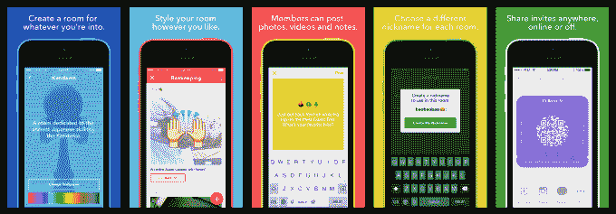
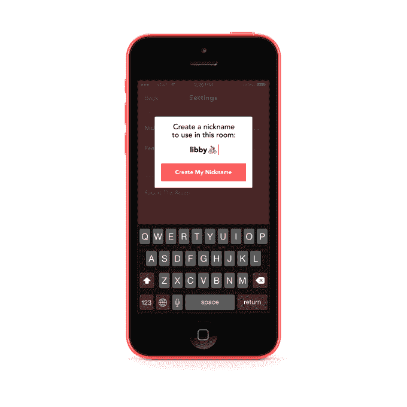
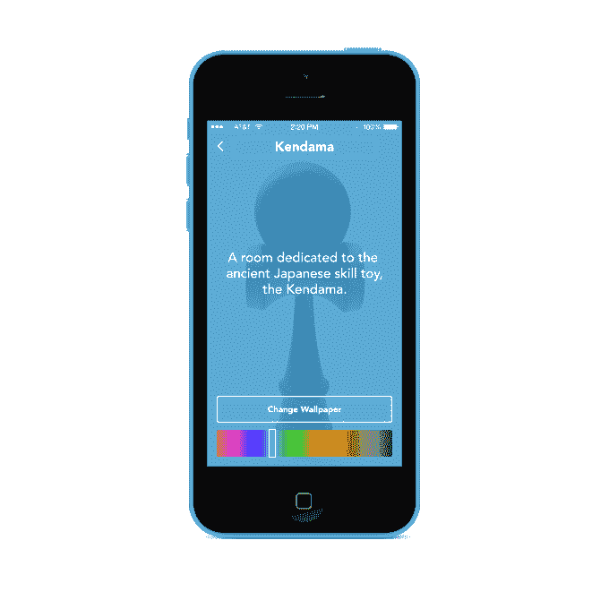
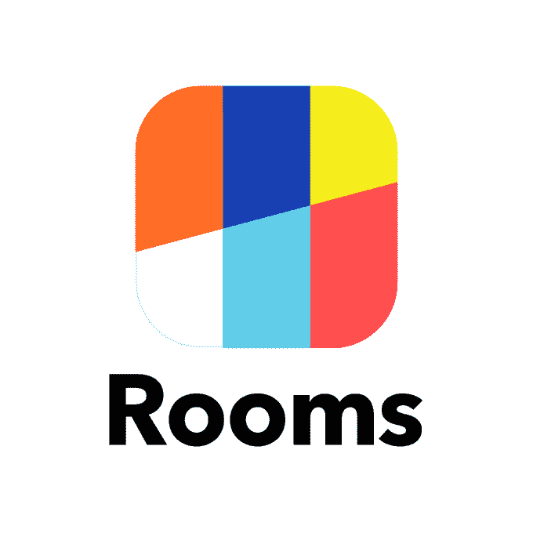

# 脸书的乔希·米勒就为什么他的 Rooms 应用程序不是匿名的，而是早期网络的重生进行了问答

> 原文：<http://techcrunch.com/2014/10/23/josh-miller-rooms/?utm_source=wanqu.co&utm_campaign=Wanqu+Daily&utm_medium=website>

是[房间](http://www.rooms.me)匿名的脸书 app 们[期待的](http://bits.blogs.nytimes.com/2014/10/07/facebook-readies-app-allowing-anonymity/?_php=true&_type=blogs&_r=0)？“不，绝对不……因为你不能在我们的应用中匿名，”[乔希·米勒](http://www.crunchbase.com/person/josh-miller)告诉我。这位分支创始人今天启动了脸书产品经理的新论坛应用程序室，他说 Tumblr、Twitter、Snapchat 和早期网络的经验指导了它的建设。

Rooms 不是一个一刀切的社交网络或匿名应用程序，而是模仿具有不同规则和目的的不同网站。在这个问答中，米勒解释了他的目标，即让一个仅限移动设备的应用程序具有 web 1.0 时代的灵活性和自我表达能力，当时我们是屏幕名称，而不是真实名称。

为了更深入地了解房间是如何工作的，[来看看我的发布故事](https://beta.techcrunch.com/2014/10/23/facebook-rooms/)。

基本上，iOS 和 Android 应用程序允许你创建一个关于任何主题的“房间”或论坛，定制其外观和感觉，为该房间选择你的屏幕名称，并决定在多大范围内共享允许人们加入的二维码邀请。然后，成员们通过 Instagram 风格的文本、照片和视频帖子及其附带的评论线程的垂直订阅源，围绕房间的主题进行分享。从对“权力的游戏”的极客化到为癌症幸存者创造一个相互支持的安全空间，Rooms 旨在围绕人们想要的任何主题产生社区。

房间看起来别致新颖，但其根源可以追溯到脸书之前，甚至是 Myspace 之前。

*问&为清晰起见，A 进行了编辑*

TechCrunch 的乔希·孔斯蒂内:让我们从头说起。  早期互联网中你最喜欢的部分是什么？

脸书的乔希·米勒:所以有很多。我想当你第一次打开浏览器时，会有一种互联网是无限的感觉。你知道一点点，但你不能看到全部，这让我觉得很酷。它是无限的。你不确定外面有什么。

第二，我喜欢你从一个地方跳到另一个地方的感觉。我的教父是洛杉矶的规划总监，我对城市空间有点着迷，我喜欢在互联网上当你从一个网站转到另一个网站时的感觉，你实际上是在一个完全不同的地方，与上一个网站无关。每个地方看起来都与前一个地方大不相同。  我们的表现非常不同，我们在那里谈论的内容也不一样，你也可以带来自己不一样的一面。不知何故，这一切真的，真的很酷。

**Constine** :移动已经能够体现这些元素了吗？

米勒:我认为这是一种趋势。一个很好的例子是我最喜欢的产品之一，Tumblr。  我非常喜欢 Tumblr 和戴维·卡普，以及他们在那里做的一切。我最喜欢 Tumblr 的一点是当我开始在互联网上时，它允许我在互联网上建立自己的空间，它看起来反映了我，并且看起来与下一个 Tumblr 博客不同。但是在 Tumblr iOS 应用程序的初期，你失去了所有的模板、定制和外观。  我相信上次更新他们带回来的。但总的来说，我确实觉得移动世界已经失去了很多定制，甚至是独特空间的概念，其中一部分只是应用程序的性质，而不是网站。

我认为，人们看着移动设备和应用程序说，“好吧，这不是万维网，这是理所当然的。  如果我们在手机上做，会是什么样子？”  我认为这是很多公司问自己的问题。  “如果我们今天重新发明 X，它在手机上会是什么样子？”因此，我认为这并不是反对移动应用和移动世界，但我确实认为万维网上发生的许多事情可以被移动设备所采用。

在早期网络时代，匿名和假名是件大事。  你认为他们带来了哪些好处？

米勒:实际上，我发了一条推特问人们他们的 AIM 屏幕名称是什么，我得到了大概 50 个回复。它真的，真的很酷，让我想起了很多往事。有趣的是每个人的网名，几乎没有一个…我想说可能只有 10%的人…和他们的真实姓名有任何相似之处。  大约 90%的 AIM 屏幕名称要么是指他们真正喜欢的乐队，要么是他们真正喜欢的运动队。因此，我认为，首先，对我们自己的称呼的灵活性允许我们展现自己真正喜欢的一面。  这是对人的创造性表达。

另外，我认为更实际的是，你想给自己起的名字会根据你所处的环境而改变。

例如，如果我想了解一些事实，或者我对健康问题有疑问，或者任何有点敏感的事情，你可能不想把这些事情和你的真实身份联系起来。但是，在某些地方，你确实想成为你真正的身份。  所以当我去寻找产品时，我喜欢我是乔希·米勒，人们知道我是 Branch 的联合创始人，在脸书工作。

所以我认为我喜欢的是根据我在哪里和我在和谁说话来展示我想展示的一面的灵活性。但同时也是创造性的表达。应该会很好玩。  你应该能够发挥创造力，根据你在哪里来表达你想要的东西。

所以我认为，在许多关于身份的讨论中，通常会失去一个元素，那就是乐趣。就像 AIM 很有趣，想出网名很有趣，有一个客场消息也很有趣。

**Constine** :但是匿名和假名带来了一些问题，对吗？

**米勒**:是的。

康斯坦丁:挑战或问题是什么？

米勒:所以我认为其中之一，也是脸书真正利用的，就是在很多情况下，你*想知道你在和谁说话，对吗？  所以脸书的伟大之处就在于它的出现。我记得我在 Myspace 上，是一个有点上瘾的 Myspace 用户，我记得当我成为一年级学生时，我非常渴望进入圣莫尼卡高中脸书网络，因为你知道你高中的每个人都在一个地方，这太棒了。  所以不一定是问题，但我还是认为，“真实身份”对于很多事情来说是非常伟大的。*

然后就匿名和匿名的负面影响而言，我认为这些事情本身并不一定是坏事，但是当在一个不受约束、不受控制和不受关注的地方，人们可能会做坏事。但我认为这并不一定是匿名和假名本身的反映。去看看元过滤器。  元过滤器就像是互联网上最安全、最棒的地方，而且它很大程度上不是你的真实身份。

所以我认为这与形式认同关系不大，而与谁在观看关系更大。你可能知道真实身份也会变得很糟糕，这取决于谁在那里。  所以我认为更多的是什么样的人在统治和寻找空间，而不是一个人名字旁边的文字是什么。

Constine :房间如何在没有问题的情况下，结合这个古老互联网的匿名和假名的最佳部分？

米勒:这听起来很奇怪，但我认为它吸取了  【早期】互联网的精华，并没有试图将其与互联网的新部分相结合。许多现代人在手机上使用匿名和假名，试图采取这种形式的身份，但将它与你的社交图结合起来，与你所有的朋友结合起来，与你所有的同事结合起来。但在此之前，你在互联网上的组织方式并不是围绕着你的通讯录联系人或你的高中同学，而是围绕着这些你感到亲近的人和事:兴趣、话题等等。

因此，我认为我们做得很好，或者说我真正感到兴奋的是，我们采用了那些原始的概念，而不是说，“嘿，我们需要将它们与你的地址簿联系人相匹配。”你还想和别人谈论其他的事情。

**Constine** :那么 Rooms 是人们以为的匿名应用吗？

**米勒**:不[笑]。毫无疑问，没有。我认为最大的原因是因为你不能在我们的应用程序中匿名。在内部，我们花更多时间讨论“您如何构建社区？而不是“你如何构建下一个大的社交应用程序？”  我们痴迷于您如何构建社区。

在社区中，你需要某种重复出现的身份，不管是真名还是假名，你都需要一个名字，所以我认为许多“匿名应用”的定义部分是你没有重复出现的身份。  你没有任何定义性的身份，这就是卖点。我们只是认为，(像那样)建立一个社区真的很难。  即使你像我一样是  PNK4352，我们认为这也能告诉你一些关于这个人的事情，这让你能够以匿名应用无法做到的方式了解他们。

**Constine** :那么你对这个应用程序有什么设想呢？

**米勒**:一个是我开始的一个房间。我喜欢旅行，特别是  去背包旅行，但是我发现当我去一个新的地方时，我真的很难想出去哪里，因为孤独星球在某种程度上已经变得相当旅游化了。如果是在孤独星球，每个去那里的人都会去那里。所以我发现我去过的最特别的地方都是我无意中发现的人迹罕至的地方，所以我为旅行者创造了一个房间，让他们与其他旅行者分享他们发现的这些人迹罕至的地方。我把一些我最喜欢的放在那里，我也让我的一些脸书同事把他们最喜欢的放在那里。我真的很高兴能让来自世界各地的人分享他们的经历，这是一个很好的例子，说明只有我的朋友做不到。我真的希望各地的人。

另外一件对我来说非常重要的事情是我的女朋友在一家名为圣约之家的非营利机构工作，这是一家儿童无家可归者收容所。具体来说，她为新泽西的一家公司工作，他们有一个庞大的跨性别社区，我和那里的一位董事交谈，他提到他们如何很难在各种收容所找到彼此，然后互相交谈，提供支持，只是有点了解对方，以及脸书或其他鼓励真实身份的社交网络如何不一定对这一点很好。我们为跨性别群体的人准备了一个房间，这让我非常非常兴奋。  具体来说，我认为这是一个很好的地方，我们在应用程序中没有发现，我们允许你灵活地使用你的身份，这将是一个巨大的优势。

**:脸书在很长一段时间内都坚持自己的真实身份，超过十年。你认为它忽略了房间正在利用的空间吗？**

 **米勒:不  我认为我从我所有的“导师”身上学到的最大的东西，无论是约拿、伊夫还是马克，都是你必须专注。许多本可以成为伟大公司的公司已经失败，失去了他们所擅长的，他们所关心的，以及他们的使命。  所以我认为脸书的使命，我认为是什么让脸书如此棒——我再次提到圣莫尼卡高中网络——是朋友和家人，为你认识的人创造一个社区。

所以我认为他们忽视了这一点，就像苹果公司忽视了亚马逊的市场一样。这并不是公司成立的初衷。所以，不，我不知道。再说一次，我认为这就是为什么现在他们已经达到了一定的规模，他们开放了创造性的实验室，并说，“嘿，现在让我们在一堆不同的方向上进行实验。”  其中之一就是不同形式的身份论坛和留言板，但我不认为直到现在不关注它是一个错误。我对如何经营公司一无所知。  我不是这个决定是好是坏的专家，但从远处看似乎很有道理。

我们有一个平台——一个 WordPress 而不是一个社交网络——我认为这是早期网络的定义。我们制造工具是为了让别人制造东西，而不是为人们制造东西。我认为，客房和脸书的最大区别比身份更大。最重要的是，我们没有建立社交网络，我们为你建立工具，让社交网络对你来说是完美的。

Constine :独立应用已经成为一个大趋势，在试图推出新的小产品的大公司或专门为他们服务的整个孵化器之间。  你认为这会分散脸书的注意力，还是这是一个可控制的策略？

**米勒**:不不不  我绝对不认为这是分心。我确实认为这是可以控制的。

我认为马克真正相信的主要一点是，我认为我已经看到其他地方出了问题，这些东西需要很长时间才能成长。

我在推特上和 Snapchat 的创始人埃文·斯皮格尔聊天，他在推特上对我说，Snapchat 花了一年时间才实现增长，现在他认为很多产品看到了这种不必要的压力，需要更快地增长，我认为这是真的。  所以我认为，如果有什么不同的话，脸书是一个做这件事的好地方，因为马克知道，如果你要建造一些新奇的东西，人们需要一段时间来理解它，也需要一段时间来成长。

所以，我认为对脸书来说，现在他们的核心业务越来越大、越来越成熟，在他们没有涉足的领域进行实验是一个好策略，我认为这是一个很好的地方，因为马克不会像其他创始人那样焦虑。

Constine :看看人们对脸书其他独立应用如 Paper 和 Slingshot 的反应，你认为媒体对他们太苛刻了吗？  你是如何管理客房期望值的？

米勒:是的，我只能说房间。  我的团队由许多最初的分支人员组成，我们是由 Twitter 的人指导和培养的，他们说，“看，使用 Twitter 一年半了，我们真的不确定它是否在工作。增长有点平淡“这些事情需要很长时间，你应该寻找的是，”有人对你的产品上瘾吗？  是否有一批核心员工喜欢你所创造的东西？”因此，当我们发布时，我不会看媒体说什么，但我肯定会看，我也不会看总体增长数字来了解我们是否创造了伟大的东西。  我要去看看，“我们有足够多的房间让足够多的人每天或每隔一天回来吗？”因为我认为这就是在线社区论坛的神奇之处，人们查看它们就像他们查看脸书一样多。

所以，我再次寻找“有人对我们建造的东西上瘾吗？”  不是“世界上每个人都马上明白了吗？”  因为如果世界上的每个人都马上得到它，我们可能就不会造出那么有趣的东西了。

我们有一个平台——一个 WordPress 而不是一个社交网络——我认为这是早期网络的定义。我们制造工具是为了让别人制造东西，而不是为人们制造东西。我认为，Rooms 和脸书最大的区别是——比身份更重要，比其他任何东西都重要——事实上，我们没有建立社交网络，我们为你建立了工具，使社交网络对你来说是完美的。**