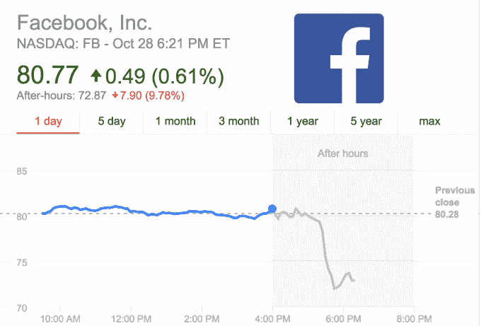

# 脸书用户增长放缓和 WhatsApp 收入疲软导致股价下跌 9%

> 原文：<http://techcrunch.com/2014/10/28/facebook-slowing-user-growth/?utm_source=wanqu.co&utm_campaign=Wanqu+Daily&utm_medium=website>

# 脸书用户增长放缓和 WhatsApp 收入疲软导致股价下跌 9%

华尔街想要增长，否则。推特报道昨天增长缓慢，从上个季度的 6.3%下降到 4.8%，今天股价下跌了 9.8%。现在，脸书的[增长从上个季度的 3.125%放缓至本季度的 2.27%](https://beta.techcrunch.com/2014/10/28/facebook-q3-2014/)，现在 [$FB 在盘后交易中下跌了 9.76%](https://www.google.com/finance?cid=296878244325128)。与此同时，脸书首次披露了其 220 亿美元收购 WhatsApp 的财务数据，这些数据有点令人失望。尽管 WhatsApp 拥有 6 亿用户，但它在 2014 年上半年的收入仅为 1500 万美元。

脸书回避了一个本可以灌输信心的问题……或者把它送进死亡漩涡:青少年参与。

该公司拒绝透露任何关于青少年使用水平的数据，人们普遍认为青少年正在放弃脸书，转而使用 Snapchat 等应用。当被问及不同人群的参与度时，脸书首席财务官大卫·韦纳(David Wehner)表示，该公司对特定的用户群体没有什么可报告的。

这可能是明智的。一年前，当前首席财务官大卫·埃博斯曼(David Ebersman)表示，脸书“[确实看到了日常用户的减少，特别是在更年轻的青少年中，](https://beta.techcrunch.com/2013/10/30/facebook-teens-drop/)”尽管这是一个杀手级的季度，但股价却大幅下跌。

仅仅是缺乏关于青少年的令人放心的声明，加上用户增长放缓，抵消了脸书的其他成功。尽管其 32 亿美元的收入和 66%的广告收入来自移动，但其股价仍处于低谷。

华尔街似乎更看重社交网络的长期增长潜力，而非短期盈利能力。Twitter 或许能够从每个用户身上赚到一大笔钱，但投资者认为它可能没有足够多的用户来保证更高的股价。

同样，尽管脸书已经征服了大部分发达国家，但增长放缓表明，每个人都拥有脸书个人资料可能不只是时间问题。有些人可能只是不想变得更加开放和有联系。