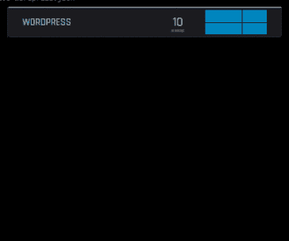

# 亚马逊 EC2 容器服务(ECS)——AWS 云的容器管理| AWS 新闻博客

> 原文：<https://aws.amazon.com/blogs/aws/cloud-container-management/?utm_source=wanqu.co&utm_campaign=Wanqu+Daily&utm_medium=website>

今年早些时候，我写了关于[容器计算](https://aws.amazon.com/blogs/aws/container-computing/)的文章，列举了当你使用它作为分布式应用平台的基础时所获得的一些好处:一致性& amp 保真度、开发效率和操作效率。因为容器比虚拟机重量更轻，内存和计算开销更少，所以它们很容易支持由成百上千个小的、孤立的“活动部件”组成的应用程序适当容器化的应用程序易于扩展和维护，并能有效利用可用的系统资源。

**介绍亚马逊[亚马逊 EC2 容器服务](https://aws.amazon.com/ecs/)**
为了帮助您实现这些好处，我们宣布了我们新的容器管理服务 EC2 容器服务(简称 ECS)的预览版。这项服务将使您能够使用强大的 API 和其他工具，在一个由[亚马逊弹性计算云(Amazon EC2)](https://aws.amazon.com/ec2/) 实例组成的托管集群中轻松运行任意数量的 [Docker](https://www.docker.com/) 容器。使用 ECS 时，您不必安装群集管理软件、购买和维护群集硬件，也不必将硬件清单与软件需求相匹配。您只需在集群中启动一些实例，定义一些任务，然后启动它们。ECS 是围绕一个可扩展、容错的多租户基础构建的，它代表您处理集群管理的所有细节。

对了，不要让“集群”这个词把你吓跑了！集群只是一个计算、存储和网络资源池，充当一个或多个容器化应用程序的主机。事实上，您的集群甚至可以由单个 **t2.micro** 实例组成。一般来说，一个中等规模的 EC2 实例拥有足够的资源，可以作为一个启动集群来有效地使用。

**EC2 容器服务的好处**
以下是该服务将如何帮助您构建、运行和扩展基于 Docker 的应用程序:

*   **简单的集群管理**–ECS 设置并管理由 Docker 容器组成的集群。它启动和终止容器，并维护关于集群状态的完整信息。它可以扩展到包含跨多个可用性区域的数万个容器的集群。
*   **高性能**–您可以将容器用作应用程序构建块。您可以在几秒钟内启动、停止和管理数千个容器。
*   **灵活的调度**–ECS 包括一个内置的调度程序，它努力将您的容器分散到您的集群中，以平衡可用性和利用率。因为 ECS 为您提供了对完整状态信息的访问，所以您还可以构建自己的调度程序或修改现有的开源调度程序以使用服务的 API。
*   **可扩展&可移植**–ECS 运行的 Docker 守护程序与您在本地运行的相同。您可以轻松地将内部工作负载迁移到 AWS 云，然后再迁移回来。
*   **资源效率**–容器化的应用程序可以非常有效地利用资源。为了充分利用所有可用的资源，您可以选择在同一个 EC2 实例上运行多个不相关的容器。例如，您可以决定在同一个实例上混合运行短期图像处理作业和长期运行的 web 服务。
*   **AWS 集成**–您的应用可以利用 AWS 特性，如弹性 IP 地址、资源标签和虚拟私有云(VPC)。这些容器实际上是一个新的基础级构建块，与 EC2 和 S3 一脉相承。
*   **安全**–您的任务在[亚马逊虚拟私有云(亚马逊 VPC)](https://aws.amazon.com/vpc/) 内的 EC2 实例上运行。这些任务可以利用 IAM 角色、安全组和其他 AWS 安全特性。容器在多租户环境中运行，只能通过定义的接口相互通信。容器在您拥有和控制的 EC2 实例上启动。

**使用 EC2 容器服务**
ECS 被设计为易于设置和使用！

您可以启动一个启用了 ECS 的 AMI，您的实例将自动登记到您的默认集群中。如果要启动到不同的集群，可以通过修改映像中的配置文件或在启动时传递用户数据来指定。要使 Linux AMI 支持 ECS，只需安装 ECS 代理和 Docker 守护进程。

ECS 会将新启动的实例添加到其容量池中，并按照调度程序的指示在其上运行容器。换句话说，您可以通过在集群中启动额外的 EC2 实例来增加集群的容量！

ECS 代理将在 Apache 许可下以开源形式提供。您可以将它安装在任何现有的 Linux AMIs 上，并调用`registerContainerInstances`将它们添加到您的集群中。

这里有几个词汇表帮助您熟悉 ECS 使用的术语:

*   **集群**–集群是特定 AWS 区域中的 EC2 实例池，全部由 ECS 管理。一个集群可以包含多种类型和大小的实例，并且可以驻留在一个或多个可用性区域中。
*   **调度器**–调度器与每个集群相关联。调度器负责充分利用集群中的资源，以尊重任何放置约束的方式将容器分配给实例，同时驱动尽可能多的并行性，同时还以高可用性为目标。
*   容器(Container)——容器是一个打包的(或者像酷孩子喜欢说的那样“Dockerized ”)应用程序组件。集群中的每个 EC2 实例可以充当一个或多个容器的主机。
*   **任务定义**–将任务定义为一组容器的 JSON 文件。文件中的字段定义每个容器的映像，传达内存和 CPU 要求，还指定任务中的容器相互通信所需的端口映射。
*   **任务**–任务是由一个或多个容器组成的任务定义的实例化，由它们所做的工作以及它们彼此之间的关系来定义。
*   **支持 ECS 的 AMI**——一个运行 ECS 代理和 **dockerd** 的亚马逊机器镜像( [AMI](http://docs.aws.amazon.com/AWSEC2/latest/UserGuide/AMIs.html) )。我们计划让 Amazon Linux AMI 支持 ECS，并且正在与我们的合作伙伴合作，以类似的方式支持他们的 AMI。

EC2 容器服务包括一组简单而强大的 API。您可以创建、描述和销毁集群，并且可以在其中注册 EC2 实例。您可以创建任务定义，并启动和管理任务。

为了在 ECS 上运行您的应用程序，下面是一组基本的步骤。我假设您已经通过将您的应用程序分解成细粒度的组件，对其进行了 Dockerized，每个组件都用一个`Dockerfile`来描述，并且每个组件都可以在您现有的基础设施上很好地运行。网上有很多好的资源可以帮助你完成这个过程。许多流行的应用组件已经被 Docker 化，可以在 [Docker Hub](https://hub.docker.com/) 上找到。您可以将 ECS 用于您可以访问的任何公共或私有 Docker 存储库。好了，步骤如下:

1.  创建一个集群，或者决定在目标区域为您的帐户使用默认集群。
2.  创建您的任务定义，并将它们注册到集群。
3.  启动一些 EC2 实例，并向集群注册它们。
4.  开始每项任务所需的份数。
5.  监控集群的整体利用率和应用程序的整体吞吐量，并根据需要进行调整。例如，您可以启动并注册额外的 EC2 实例，以便扩展集群的可用资源池。

 **EC2 集装箱服务定价和供货情况该服务今天以预览形式推出。如果你有兴趣报名，[点击这里](https://aws.amazon.com/ecs/preview)加入等候名单。**

 **ECS 不额外收费。像往常一样，你只为你使用的资源付费。

— [杰夫](https://twitter.com/jeffbarr)；

###### 2021 年 1 月 26 日修改——为了确保良好的体验，本帖中过期的链接已被更新或从原帖中删除。** 