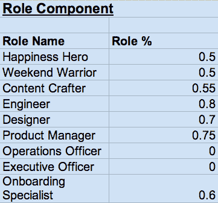
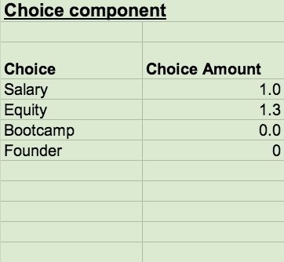
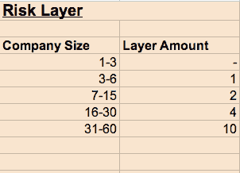
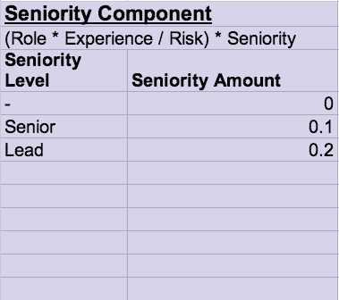
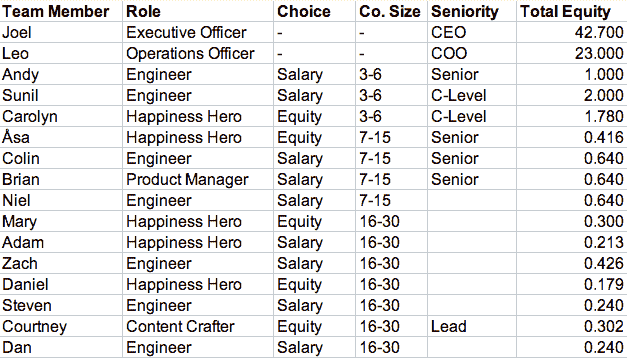

# 开放式权益:Buffer 的权益公式和完整的个人细分

> 原文：<https://open.bufferapp.com/buffer-open-equity-formula/?utm_source=wanqu.co&utm_campaign=Wanqu+Daily&utm_medium=website>

自从我们建立了作为我们公司文化核心的[缓冲值](http://www.slideshare.net/Bufferapp/buffer-culture-04)以来，我们每天都在不断寻找实现这些价值观的新方法——特别是我们默认透明的重要价值观。

去年，Buffer [分享了我们所有的薪水](https://buffer.com/resources/introducing-open-salaries-at-buffer-including-our-transparent-formula-and-all-individual-salaries/)和他们背后的公式。我们定期分享[我们正在阅读的内容](https://buffer.com/resources/buffer-book-reading/)，我们[如何努力提高自己](https://buffer.hackpad.com/The-Buffer-Teams-Weekly-Improvements-Week-11-public-FXZGVW8qpll)——甚至我们犯的错误。如果没有这种持续的承诺，我们的透明度价值就只不过是写在纸上的一句话。

这就是为什么今天，我们通过分享我们的股权结构和个人细分，朝着将 Buffer 变成一家完全“开放的公司”的方向又迈进了一步。

## 什么是开放式股票？

我一直想揭开股权的神秘面纱。尽管这个概念在创业文化中根深蒂固，但它通常是一个模糊的话题。许多科技公司会给你一些选项，但解释这些选项非常复杂，以至于员工仍然很难理解它们的含义。Buffer 是一个完全分布式的团队，我们的许多团队成员都远离硅谷的技术世界，以前也没有过这方面的经验。

利奥和我一开始不知道如何处理股权。我们最终做了相当多的研究，与我们信任的人交谈，他们为我们提供了很好的指导。最后，我们留出 20%的缓冲资金作为股票期权发放给我们的团队和顾问。

目前，有 11，256，468 股已发行和可用的缓冲股。我们通过向整个团队开放的“开放式股权”(一个简单的计算股权的公式)向团队成员发放股票。它是这样工作的。

## 公式

这是公式中每个元素的分解，以及我们是如何计算的。

**角色类型:**
Buffer 的每个关键角色都有一个基本的股权百分比。(注意:运营和执行主管角色只有 0，因为这些角色目前由 Leo 和我担任，他们没有任何选择权。下表显示了我们的创始人股权。)

**选择:**
当你完成两个月的" [Buffer Bootcamp](https://www.youtube.com/watch?v=Ox1-pRFM4fw) "期并全职加入 Buffer 时，你需要做出选择:10，000 美元的额外工资或 30%的额外股权。

**风险层:**
当你加入一家创业公司时，从第 5 个人开始和从第 50 个人开始有很大的风险差异。对于缓冲，我们用公司的规模来确定一个相对的[风险层](https://gist.github.com/isaacsanders/1653078)来反映这种风险。

**资历:**
现在，我们有两个级别的资历:领导和高级。领导级别的团队成员已经或将要管理一个团队，而高级别的团队成员已经表现出模范领导能力，但可能没有要管理的团队。我们的规模还不够大，还不能增加像副总裁这样的级别。将来我们会在这里添加这些内容。

## 按个人细分

这些是公式的组成部分。下面是该公式如何分解为今天缓冲团队每个成员的股权百分比(这是一个简化版本；你可以在我们的[公开薪资和权益电子表格](https://docs.google.com/a/bufferapp.com/spreadsheet/ccc?key=0AgrWVeoG5divdE81a2wzcHYxV1pacWE1UjM3V0w0MUE&usp=drive_web#gid=4)中看到更多信息。

我们在大多数领域使用百分比的原因是，这使得这个概念稍微更容易理解——你持有一家公司价值的 10%似乎比你在一家公司有 1，125，646 个期权更容易理解。(另外 500，279 份期权属于一小批缓冲顾问和前团队成员，他们保留了部分授予的期权。)

## 示例采集场景

一般来说，选择更多的股票意味着承担更多的风险。但股本的微小变化可能意味着货币结果的巨大变化。因此，我们还与每位团队成员分享了一些缓冲区退出场景的示例。例如，让我们看一下有人选择 0.5%的缓冲:

*   Buffer 售价 3000 万美元。他们挣 15 万美元。
*   Buffer 售价 6000 万美元。他们挣 30 万美元。
*   Buffer 售价 6 亿美元。他们挣 300 万美元。

请记住，这些数字必须扣除员工为期权支付的金额(例如，如果他们是 Buffer 的早期员工，则为 0.02 美元/股)和任何适用的税收。因此，在 150，000 美元的示例中，扣除这些费用后，实际金额为 148，874.35 美元。

确定 0.02 美元/股或 0.17 美元/股的方法是通过一个名为 409a 估价的过程，由外部公司对 Buffer 进行估价。他们提出价格/股份，然后用于向所有缓冲员工发行期权。每个公司每年都要进行一次新的 409a 评估。

我们对 Buffer 的愿景是长期保持下去，所以我们可能不会退出。然而，团队成员可能仍然有机会出售他们的期权。

## 重要提示:期权与股权

团队成员加入 Buffer 时实际得到的是 Buffer 中的若干期权，而不是实际股权。根据维基百科的定义，选项的含义如下:

> 期权是一种合同，它赋予买方(所有者)在某一特定日期或之前以特定的执行价格购买或出售基础资产或工具的权利，但没有义务

假设 Buffer 有 100 股。当你加入 Buffer，你会得到 10%的期权作为你薪酬的一部分。这意味着你有 10 份期权，每份期权都有权以固定价格购买 100 股中的 1 股。假设价格是 1 美元。因此，如果你想获得 10 股缓冲股，你将支付 10 美元，然后你将持有公司 10%的股份。现在，假设 Buffer 以 1000 美元的价格将公司卖给了谷歌。由于你有 10 份期权，你可以为你的 10 份股票支付 10 美元，由于 Buffer 刚刚卖出，你将得到 100 美元。实际上，你将获得 90 美元的利润——相当不错！

缓冲时间越长，公司就越有价值(希望如此！)就变成了。因此支付期权的固定价格也会上升。举个例子，Buffer 刚开始的时候，最初几个人可以出 0.02 美元/股。下一批，在 Buffer 变得更有价值之后，必须支付 0.17 美元/股。因此，期权价格和实际股票价值之间的差额略有下降——应该总是如此，因此拥有这些期权仍然非常值得。

## 关于 Buffer 开放式基金未来的思考

我希望这是揭开股权神秘面纱的开始——至少在缓冲方面。

特别感谢 goes to:
**Joel Spolsky:**Joel 的指导和他在这里[描述的层次概念](https://gist.github.com/isaacsanders/1653078)对我们获得公式非常有用。

**Wealthfront 的权益计算器:**[wealth front 权益计算器](https://blog.wealthfront.com/startup-employee-equity-compensation/)也为我们提供了极好的指导，因为我们试图在我们的公式中提出公平且可扩展的权益期权。

我们的股权公式——就像我们在 Buffer 所做的许多事情一样——仍在进行中。我们可能不得不做出一些改变，也不能保证它会随着我们的成长而扩展，但最终开放缓冲区的这个元素感觉很好。

我希望您能就我们的配方以及如何进一步改进提出想法、观点和反馈。在下面的评论中问我任何问题，或者简单地告诉我你的想法。

附:如果你喜欢这篇文章，你可能会喜欢我们的[缓冲博客简讯](http://bufferapp.us7.list-manage.com/subscribe?u=8109206415f7c9e3b2ddc83ad&id=98d602610c&utm_source=blog&utm_medium=ps&utm_campaign=ps)。收到每一个新的帖子，直接发送到您的收件箱！[在这里报名](http://bufferapp.us7.list-manage.com/subscribe?u=8109206415f7c9e3b2ddc83ad&id=98d602610c&utm_source=blog&utm_medium=ps&utm_campaign=ps)。