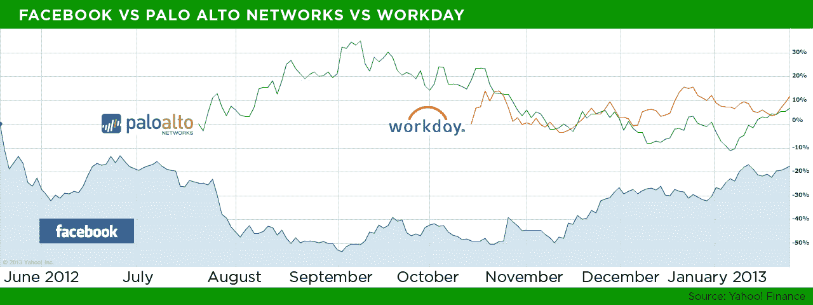
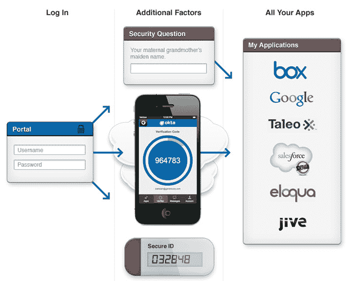
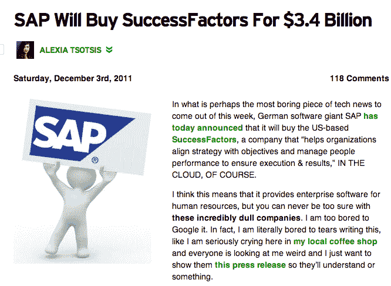

# 企业酷小孩 TechCrunch

> 原文：<http://techcrunch.com/2013/01/27/the-enterprise-cool-kids/?utm_source=wanqu.co&utm_campaign=Wanqu+Daily&utm_medium=website>

不，这不是由[亚伦·李维](http://www.crunchbase.com/person/aaron-levie)撰写的[嘉宾专栏](http://www.crunchbase.com/person/aaron-levie/posts)。尽管他和他的初创公司 Box、[“性感企业”的典型代表](https://beta.techcrunch.com/2010/07/25/enterprise-software-is-sexy-again/)绝对在这一批人之列。“你绝对应该把艾伦踢出名单。Zendesk 的创始人 Mikkel Svane 在听到我们写的东西后评论道。

随着风投用脚投票和[避开消费类创业公司](http://www.nytimes.com/2013/01/14/technology/start-up-investors-grow-wary-of-tech-ventures-after-facebooks-ipo.html?pagewanted=all&_r=0)这个游戏期，我们看到情绪和动力向企业创业公司的重大转变。就我们记忆所及，这可能是最近最大的一次。一年前进入消费者交易的风险资金[现在正流入](http://blogs.wsj.com/venturecapital/2013/01/18/startups-face-tighter-market-for-venture-capital-fuel/)企业，因为 A 轮危机和对脸书乏善可陈的首次公开募股的沉默已经[挫伤了投资者对图片分享应用及其同类产品的热情](http://online.wsj.com/article/SB10001424127887324731304578193631342612220.html)。

与脸书形成对比的是，帕洛阿尔托网络公司(Palo Alto Networks)、Splunk 和 Workday(或许是最初的企业酷小子)等一系列明星企业 IPO 激发了集体的创业想象力。“我们看到企业家每隔一天就来告诉我们他们将如何重塑 Splunk，”红杉的 Aaref Hilaly 告诉我。"成功的企业首次公开募股为后来的公司指明了方向."

尽管风投利润基线传统上来自企业交易，但它们肯定不是媒体的宠儿。尽管消费者创业公司的 beta 值很高，而且有成为局外人的趋势，但它们是主流科技博客舞会上的美女。“消费技术往往会产生更少的赢家。NetSuite 首席执行官扎克·尼尔森指出:“与无数企业软件供应商相比，跟踪脸书或 Twitter 可能在做什么更容易。“(在那里)可能需要几十年才能决定真正的赢家。”

但是炒作*正在*改变。在 Coupa、Creamery 或 Caltrain 上关于“下一个 Instagram”的讨论已经被对大数据、存储和云的未来的严肃评估所取代。至少就消费者互联网而言，2011 年的移动、社交和本地淘金热已经暂停。风投们正在[配备企业专家来应对业务重心的急剧转移。我们甚至听说有人在做一些只被描述为“企业之路”的事情。](https://beta.techcrunch.com/2013/01/16/vmware-cto-steve-harrod-joins-general-catalyst-to-boost-enterprise-investments/)

 [T3】](https://beta.techcrunch.com/wp-content/uploads/2013/01/fb-vs-wday-vs-panw.jpg)

虽然这种现象是最近才出现的，以至于投资资金从消费者流向企业的确切流向还没有在一项研究中被捕捉到，但数据点正开始出现。例如，根据首轮资本本周发布的一份报告，2012 年是首轮资本历史上消费类公司投资不足 50%的第一年。期待看到更多这样的报告。以及 TechCrunch 上更多的企业报道。

企业初创公司终于成了酷孩子。不，性感。

“我要说市场是精神分裂的，”马克·安德森在解释为什么《工作日>脸书》可能不意味着投资者对社交网站兴趣的终结时说。“现在我们处在一个市场需要企业公司的时代。我只是说，'等一年，这将再次翻转；再过一年，情况会再次逆转。"

现在是企业大放异彩的时候了。由于移动计算、云和自带设备运动的无处不在，企业创业公司和消费者创业公司之间的界限正在变得模糊。Google Apps 是企业产品吗？是 Dropbox？是 Evernote？随着这种类型的创业公司越来越多，我们已经远离了 T2 的 IBM SAGE 时代，在那个时代，唯一的计算客户是真正的大企业。

过去一切都是自上而下的。大公司和政府在 R&D 花了很多钱，在那个 R&D 发展起来的技术，如主机/计算机、彩色电视甚至互联网，会从大机构渗透到主流用户。一旦这些产品冲击到主流，主流的引力和它的购买力慢慢改变了自上而下到自下而上的采用周期。

“消费者可以比企业更快地做出购买决定，”安德森指出，“因为对于消费者来说，他们要么喜欢，要么不喜欢，而企业必须经历这些漫长而复杂的过程。”他坚持认为，在 2000 年至 2008 年期间，企业对许多企业家没有特别吸引力的原因是，消费者软件是唯一任何人都可以采用的软件。“随着企业世界[从销售驱动型向产品驱动型](http://www.forbes.com/sites/tomiogeron/2012/05/02/benchmarks-peter-fenton-on-the-air-war-disrupting-the-enterprise-midas-list/)发展，情况不再如此。

[T2】](https://beta.techcrunch.com/wp-content/uploads/2013/01/screen-shot-2013-01-27-at-3-46-19-pm.png)

mobile first metrics management 初创公司 [Tidemark](http://www.tidemark.com/) 的首席执行官 [Christian Gheorghe](http://www.crunchbase.com/person/christian-gheorghe) 概括了这种演变的因素，他说:“用户现在是买家，重心不再是 IT，而是业务本身。“云不仅仅是基于成本的改进，而是一个新的计算平台。而且移动正在超越桌面。”

“从拥有强大的 UX、移动性和平台不可知性的角度来看，对‘消费级’企业技术的需求是一个不可逆转的趋势，”Levie 说。“难以使用的企业软件将很快变得比设计良好的企业软件更令人惊讶(再过几年)。”

Andreessen 解释道:“如今，小型企业和大型企业都可以轻松使用所有消费化的企业产品。“事实上，小型企业可能比大型企业更容易使用它，因为对于小型企业来说，就好像您可以直接使用它一样。你不需要经历一个漫长的过程，不需要开很多会，不需要有委员会，不需要所有这些东西。你可以开始拿起并使用它。”

由于各种因素的融合，一家创业公司的“开拓和扩张”战略变得比拥有一支庞大的销售队伍或请首席信息官吃饭更为复杂。它实际上可以归结为制造一种人们想要使用的产品，因为消费者已经在使用云产品，并且当他们的旧企业解决方案失败时，可以依靠云产品。

“交换服务器坏了？没问题，我会用 Gmail。电子邮件策略不允许附件超过 2 GB。没问题，我会用 YouSendIt、Dropbox 或 box，”Ron Miller [简洁地说。Box 早期的商业客户是首席信息官，他们打电话给公司，对安全性表示担忧，对员工利用该平台秘密共享文件感到愤怒。这些电话最终变成了交易。事实上，有人可能会说，消费者创业公司 Dropbox 是 box 有史以来最好的事情，让外行人熟悉了云文件共享。Box 随后对用例进行了创新，通过提供增强的安全性和控制来满足首席信息官和企业高管的需求。](http://www.real-user-monitoring.com/five-forces-driving-consumerization-of-it/)

“第一代新的企业浪潮是价格更低的替代技术(如 Salesforce 和网络安全管理软件产品)，”Asana 的联合创始人贾斯汀·罗森斯坦说，“但新的浪潮是通过更好的产品来竞争的技术。与新的低效率竞争的不仅仅是总运营成本(通过 SaaS)或成本，而是用更好的产品击败他们。”

由于采用变得越来越容易以及其他相关因素，我们看到企业家们为企业制造员工实际上可以使用或想要使用的产品。我们甚至看到像 [Okta](http://www.okta.com/) 这样的公司的出现，它们只是企业，但仍然展示了消费者创业的轻松。不仅越来越多的公司从消费互联网中获取设计灵感，这也正迅速成为一种常态。

[T2】](https://beta.techcrunch.com/wp-content/uploads/2013/01/screen-shot-2013-01-27-at-11-34-27-am.png)

Workday 联合创始人 Aneel Bhusri 表示:“‘企业性感’来自于越来越多的人意识到，新一代供应商已经正确地实现了消费化(尤其是在用户界面和移动设备方面)，而且商业模式是可持续和可行的。”。“事实上，在 Asana 和 Cloudera 这样的公司中，一些创始人本身就来自消费互联网。”

这种消费者背景正在帮助下面的公司获得更多来自风投、消费者和媒体的关注，因为他们知道如何推销自己——是的，他们中的许多人都有非常酷的产品，专门针对刚刚进入职场的千禧一代。美国在线的人力资源管理软件 PeopleSoft 使用起来就像它的名字一样糟糕——我更愿意使用 Workday。

虽然这个列表并不全面(有很多很酷的企业初创公司，大多数人都非常喜欢)，但这里只是几个迅速成为家喻户晓的名字的新卫士——通过他们对直觉和设计的关注，对移动设备的意识以及对几十年前的问题的新方法。“现有的企业玩家正在构建人们能够容忍的软件，”罗森斯坦简洁地说道。“未来的玩家正在开发人们喜爱的软件。”

## 天空的八分之一

[Okta](http://www.okta.com/) 是面向企业的单点登录服务，即“脸书连接”。作为用户，您可以登录到您公司的管理页面，访问托管在您公司服务器(内部网)上的私有数据以及来自 Box、Salesforce 和 Google Apps 等云产品的数据。管理员可以轻松管理各种应用程序和设备的凭据。

**竞争对手:** Salesforce 刚刚推出 Salesforce Identity，与 Okta 直接竞争。

**秘制酱:** Okta 兼容你能想到的每一个 web app。这家初创公司已经从 Greylock Partners、Khosla Ventures、Andreessen Horowitz、FLOODGATE 和 Sequoia 获得了 5250 万美元的资金。

## **Cloudera**

[Cloudera](http://www.cloudera.com/) 是当今管理公司大数据的解决方案*，为数据库提供软件、服务和支持。当用户需要分析原始数据以找到趋势或查看他们是否可以在未使用的数据中找到有价值的答案时，Cloudera(构建于 Hadoop 之上)允许他们完成更高效的查询。*

 ***竞争对手:** MapR 和 Hortonworks，但是规模小很多。对于大公司来说，他们可以向 IBM 寻求定制解决方案，但这要贵得多。

**秘笈:**计时，它处理一切(软件、开发、支持……)。Cloudera 也获得了大量资金，从 Greylock、Accel、Meritech Capital Partners、In-Q-Tel 和其他公司筹集了 1.41 亿美元。

## 箱子

最初的“性感”企业初创公司， [Box](https://www.box.com/) 允许你在云端存储、管理和协作你的文档。成立于 2006 年(在 Dropbox 之前！)，该公司由才华横溢的亚伦·李维(Aaron Levie)执掌。像 Okta 一样，Box 的主要优势是它可以与许多企业应用程序很好地集成，并在协作功能之外提供安全性。互操作性至关重要:用户可以在他们喜欢的 CRM 应用程序中找到上传到 Box 的文件。

**竞争对手:**微软 SharePoint，消费产品，Dropbox，Google Drive…

**秘制酱:**先有了！Box 通过不断迭代其产品来有效竞争，即使 Dropbox 流行，也专注于企业，以及良好的合作伙伴关系。迄今为止，Box 已经从 Draper Fisher Jurvetson、Scale Venture Partners、Andreessen Horowitz 和其他公司筹集了 2.84 亿美元。

## 开源代码库

开发人员需要一个地方来跟踪和分享他们的代码变更，而具有社交编码特性的 GitHub 是首选的存储库。GitHub 如此受欢迎，以至于它的版本控制技术 Git 正在取代 SVN。GitHub 提供高级订阅和自托管版本，许多公司和初创公司已经转向私有 GitHub 存储库，有些很早(Spotify)。

**竞争对手:** Google Code 在社交编码方面，是内联网上的自托管存储库。

**秘制酱:** Git。g it 是一项王牌技术，开发人员无法抗拒采用它，GitHub 是使用 Git 的最佳方式。GitHub 在 2011 年的 Crunchies 上获得了[自举初创企业](https://beta.techcrunch.com/2012/01/31/crunchies-dropbox/)类别的亚军，它最终松口了，去年从安德森·霍洛维茨那里获得了 1 亿美元的首轮融资。

## Zendesk

Zendesk 是一款用户友好的服务台软件，允许公司批量处理支持请求。Zendesk 即将上市，和企业伙伴 Workday 一样，它可能会成为一系列黯淡的科技公司 IPO 中的另一个亮点。

**竞争对手:**成吨的公司都在构建桌面软件，还有很多面向中小公司的开源应用。[Desk.com](http://Desk.com/)(以前的 Assistly，被 Salesforce 收购)和招标支持都很受欢迎，但是招标支持没有 Zendesk 那么广泛的资源。

Zendesk 是第一个现代服务台，但是 Desk.com 在 Salesforce 的支持下获得了很大的吸引力。该公司银行存款充足，已从 Charles River Ventures、Benchmark Capital、Matrix Partners、Redpoint Ventures、Index Ventures、GGV 资本、高盛和硅谷银行筹集了 8550 万美元。

## 阿萨纳

吸取他们在脸书早期工作的经验教训， [Asana](http://asana.com/) 的联合创始人达斯汀·莫斯科维茨和贾斯汀·罗森斯坦建立了一个漂亮而精简的协作工具，专注于待办事项清单。界面灵活，易于理解。在体式中，一切都是待办事项。该平台并不试图做到这一切，但它的设计非常非常直观，谦逊地坚持其核心目标，即简化团队内部的沟通。

**竞争对手:**来自 37signals 的 Basecamp，【Salesforce 的 Do.com，以及其他可能让它无用的通讯工具(想想 Yammer)和很多小的替代品(Producteev，Flow 等。).对于所有这些公司来说，最接近的竞争对手可能是基本电子邮件。

Asana 产品相对容易使用，这对于协作软件领域的后来者来说很重要。价格也很友好。对于小公司来说，很多还没有转换到协作工具，你基本上可以免费使用它。Asana 已经从[彼得·泰尔](http://www.crunchbase.com/person/peter-thiel)、Founders Fund Benchmark Capital、Andreessen Horowitz 以及像[罗恩·康韦](http://www.crunchbase.com/person/ron-conway)和[亚当·安吉洛](http://www.crunchbase.com/person/adam-d-angelo)这样的天使投资人那里筹集了超过 3820 万英镑。

## GoodData

[GoodData](http://www.gooddata.com/) 是一款面向大公司的廉价数据分析解决方案。公司可以将 GoodData 的平台集成到他们自己的基于云的 SaaS 产品(即 Salesforce、Zendesk)中，然后访问运营仪表板、数据仓库和高级数据报告。

**竞争对手:** IBM、SAP、甲骨文。

**秘方:**good data 比竞争对手更便宜，可以轻松地与 Zendesk 和 Salesforce 集成，以跟踪、汇总和分析数据。其简单性和“开箱即用”的集成使其成为中小型企业的理想选择。GoodData 从 Andreessen Horowitz、General Catalyst Partners、Tim O'Reilly 和其他人那里获得了 5350 万美元的资金。

## 亚特兰蒂斯人

根据 Accel 的[李萍](http://www.crunchbase.com/person/ping-li)、 [Atlassian](http://www.atlassian.com/) 的说法，“澳大利亚最酷的东西”是低成本的项目管理软件。它提供了一系列企业网络应用程序:吉拉是一个专注于软件开发的项目跟踪工具；Confluence 是更传统的协作和交流工具；开发人员在他们的工作流程中使用许多其他的小型产品。最后，Atlassian 收购了 HipChat，一款 hip chat 应用。

竞争对手:开源项目管理解决方案和本地应用与吉拉竞争。Confluence 与 Basecamp、Yammer 等竞争。HipChat 与来自 37signals 的 Campfire 竞争。

**秘制酱:**成立于 2002 年的 Atlassian 已经不是小孩子了。多年来，它被证明是一个可靠的 web 应用程序开发者。迄今为止，该公司仅从 Accel Partners 获得了 6000 万美元的首轮融资。

## 灵活的存储

[Nimble Storage](http://www.nimblestorage.com/) 是闪存优化混合存储解决方案的提供商。它找到了一种方法来提供大容量存储，其性能和容量分别是 EMC 和 NetApp 现有产品的 5 倍。Nimble Storage 拥有一个独特的缓存系统，该系统基于个人电脑和手机中常见的闪存。其结果是速度大幅提升，相当于在你的旧电脑中安装一个固态硬盘。那项技术获得了在线数据存储的专利。

**竞争对手:** EMC、NetApp、亚马逊 S3 和其他在线存储解决方案。

**秘方:**如今，提高读写速度是托管解决方案的一大挑战，Nimble 比其竞争对手更快，但成本相同。它获得了红杉资本(Sequoia Capital)、Accel Partners、Lightspeed Venture Partners 等机构的 8170 万美元融资。

## 移动加速器

[MobileIron](http://www.mobileiron.com/) 是面向系统管理员的设备管理工具。现在，BYOD 趋势正在接管企业，管理员必须找到新的方法来处理安全设置并向员工推送移动应用程序-所有这些都跨多部手机、平板电脑和操作系统。MobileIron 提供单一平台来管理所有设备，即使其中大多数是员工带到工作场所的个人设备。

**竞争对手:**内部解决方案和限制，一次检查一部手机的安全设置，或者选择不关心安全性。

**秘方:** MobileIron 让系统管理员更容易处理定制手机设置。如果您转换一个系统管理员，整个公司将切换到 MobileIron。自 2007 年以来，它已从红杉资本(Sequoia Capital)、暴风风险投资公司(Storm Ventures)和 Norwest Venture Partners 筹集了 9680 万美元。

[T2】](https://beta.techcrunch.com/wp-content/uploads/2013/01/screen-shot-2013-01-27-at-3-49-18-pm.png)

“它们基本上都是新公司，”安德森说，他同意许多“酷孩子”的选择。“我认为不在名单上的是所有销售商业软件的现有公司。”更年轻、更灵活的公司自然会让它们更有趣。对于任何读过我关于 SAP 收购 SuccessFactors 的帖子并误解它的人来说，这不是 SuccessFactors 无聊(一点也不无聊),而是 SAP——其股票表现积极反映了其对 SuccessFactors 等更时髦公司的收购。

“关于 SAP 的笑话一直是，它将 50 年代的德国制造方法，在 60 年代的软件技术中实现，交付给 1970 年代风格的制造组织，”Andreessen 说。“现任——他们仍然是网络泡沫破灭后挥之不去的后遗症。”

Zendesk 的 Svane 说:“我们都暗暗害怕犯与上一代企业软件公司相同的错误——膨胀我们的产品，扩大昂贵的销售业务。"避开这些陷阱的新企业软件公司将是明天的赢家."

所以我错了，至少在宏观层面上是这样:也许在今天的技术领域，没有比大卫和歌利亚的企业剧变故事更引人注目的故事了。“今天是企业技术历史上最激动人心的时刻……”success factors 首席执行官 Lars Dalgaard 分享道，“我们没有借口为我们推出的任何产品建立良好的用户体验。我们的基准比苹果看起来更美味，比 Twitter 更简单。”

[T2】](https://beta.techcrunch.com/wp-content/uploads/2013/01/screen-shot-2013-01-27-at-2-31-54-pm.png)

公共和私人投资者越来越认同这样一个观点:既然我们正处于消费的定势中，我会在接下来的两年里写关于企业的文章吗？

消费者业务的优势在于，它们往往有更广泛的基础，拥有更多的客户和相对更快的采用模式。企业公司的优势在于，如果他们表现良好，他们会立即获得收入数字，因此他们不会受到消费者趋势、时尚或行为的影响，这就是为什么投资者在 2013 年筹集的资金较少，因此变得谨慎。

罗森斯坦说:“人们已经意识到，企业购买了价值近 3000 亿美元的软件(根据 Gartner 2012 年的数据，价值 2850 亿美元)，表现出这些品质的公司有潜力建立*非常*大的企业。快速增长的机会加剧了这一点，因为后端的亚马逊和前端的自助销售已经永远改变了扩展软件业务的经济学。”

“业务很好，这很好，”安德森补充道，“然后我认为这也是行业轮换。我们与许多大型对冲基金、共同基金进行了交流。真的很搞笑。我们谈论的是大型对冲基金、共同基金——大约六个月前，他们都开始说，嗯，你知道，我们真的认为消费者和企业将会轮换，我们真的会走在前面。我说，是的，你和其他 10 个人在过去的两周里也告诉了我同样的事情。这就像，干得好，就像你在这方面遥遥领先。”

你不得不承认征税的远见，Bhusris，Svanes 的世界谁把赌注押在企业，而不是在学校的新女孩。尤其是埃里森和贝尼奥夫夫妇建造了这所学校。事实上，有一个淫秽的谣言正在流传，李维实际上有一张埃里森的照片作为他的 iPhone 主屏幕。“无可奉告，”他说。

正如 DFJ 合伙人 Andreas Stavropoulos 提出的，“有趣的是，像 Box 这样现在越来越受欢迎的企业公司是在 2004-2007 年成立的，当时专注于企业并不酷。这表明一些最好的创新是在大部分市场都在观望的时候出现的。”

“我的连续笑话是，这就像小孩子，”安德森说。“就像每个人都从消费者池中出来，每个人都进入企业池。所以每个人都离开浅水池，进入热水浴缸。”

现在企业号是一个非常热的浴缸。

*罗曼·迪莱特、[亚历克斯·威廉姆斯](https://beta.techcrunch.com/author/alex-williams/)和[琳娜·拉奥补充报道。布莱斯·德宾拍摄的图片。](https://beta.techcrunch.com/author/leena-rao/)你可以在[“马克·安德森谈企业的未来”中了解更多关于企业计算的精彩世界](https://beta.techcrunch.com/2013/01/27/marc-andreessen-on-the-future-of-the-enterprise/)T11】**