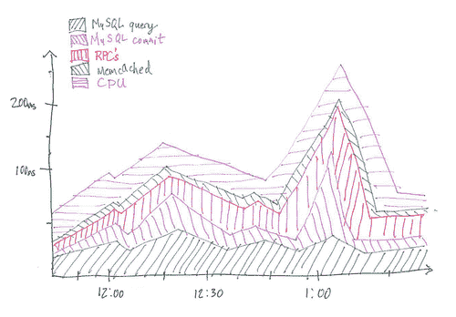

# Rajiv 在 Dropbox 学到的博客扩展经验，第 1 部分

> 原文：<http://eranki.tumblr.com/post/27076431887/scaling-lessons-learned-at-dropbox-part-1?utm_source=wanqu.co&utm_campaign=Wanqu+Daily&utm_medium=website>

[Scaling lessons learned at Dropbox, part 1](https://eranki.tumblr.com/post/27076431887/scaling-lessons-learned-at-dropbox-part-1)

*Rajiv eraki[<Rajiv . eraki @ Gmail . com>](mailto:rajiv.eranki@gmail.com)*

有一段时间，我负责扩展 Dropbox，从大约 4000 个用户扩展到 4000 万个用户。在大部分时间里，我们有一到三个人在后端工作。这里有一些关于扩展的建议，特别是在资源受限、快速发展的环境中，这种环境不能总是以“正确的方式”做事(例如，任何真实世界的工程项目；-).如果人们觉得这很有用，我会试着想出更多的技巧并写第 2 部分。

# 带额外负荷运行

我们反复使用的一种技术是在实时站点中创建人工的额外负载。例如，我们会做很多不必要的 memcached 读取。然后当 memcached 崩溃时，我们可以快速关闭重复的查询，有时间想出一个解决方案。为什么不提前计划呢？因为大多数时候，这是一个非常突然的故障，我们无法用监控检测到。但有了这只煤矿中的金丝雀，我们可以为自己赢得时间来计划，并注意到明显的限制。

请注意，仅仅进行额外的读取并不完美，因为高写入负载更有可能导致问题，但是写入很难模拟(危及数据的风险，没有获得实际数量的锁争用)。根据我的经验，仅仅额外的阅读就足以赢得时间。

作为一个想法，你可以有一个服务器，只是坐在那里，在你的前端回放 10%的只读日志，并可以根据需要关闭。比关闭功能要好！

# 特定于应用的指标

另一件变得越来越有用的事情是将数千台服务器上的数千个自定义统计数据汇总成图表。大多数开箱即用的监控解决方案并不打算处理这种负载，我们想要一种添加统计数据的单行方式，这样我们就不必考虑它是否有任何成本，或者只是为了添加一个统计数据而在配置文件上做文章(减少测试和监控的摩擦是一个重要的优先事项)。

我们选择在 memcached、cron 和 ganglia 的组合中实现一个解决方案。每当发生我们想要绘制的事情时，我们会将它存储在线程本地内存缓冲区中。每秒钟，我们都会将该统计数据发送到 memcached 中的一个带时间键的存储桶(timestamp mod 什么的),而在一台中央机器上，每分钟 memcached 中的存储桶都会被清空、聚合并发送到 ganglia。非常可扩展，这使得我们能够近乎实时地跟踪数千个统计数据。即使像“读取一个 memcached 键的平均时间”这样细粒度的统计数据(每个请求发生几十次)也能很好地执行。

当然，当你有成千上万的统计数据时，仅仅“看图表”来发现异常是很困难的。下面是一张我们认为最有用的总结图:



顶行代表站点的平均响应时间(我们有一个 web 流量的图表，一个客户端流量的图表)。每个部分代表一个工作的划分。因此，您可以看到在 1:00 左右出现了一个响应时间峰值，这是由 MySQL 提交阶段的某个问题引起的。我们的实际图形有更多的段，所以你可以想象当你试图计算时，这节省了多少屏幕空间。“CPU”是欺骗，它实际上只是平均响应时间减去我们排除的所有其他因素。

如果有一种方法可以做到这一点，那么在图形上标记出可以注释的事件(比如代码推送或 AWS 中断)也是很酷的。

# 可怜人的 bash 分析

如果您没有经常使用 shell，那么它会让您大开眼界，某些任务的速度有多快(并且有助于揭开像 Perl 这样的语言的结构的神秘面纱)。看看这个:

假设您正在尝试调试您的 web 服务器中的某个东西，您想知道最近是否有一个活动高峰，而您所拥有的只是日志。为该 web 服务器绘制图形是很好的，但是如果像大多数系统一样间隔 1 或 5 分钟，可能不够细粒度(或者您可能只想查看某一类请求，或者其他什么)。

```
Apr 8 2012 14:33:59 POST ...
Apr 8 2012 14:34:00 GET ...
Apr 8 2012 14:34:00 GET ...
Apr 8 2012 14:34:01 POST ...
```

您可以像这样使用您的 shell:

`cut -d’ ’ -f1-4 log.txt | xargs -L1 -I_ date +%s -d_ | uniq -c | (echo “plot ’-’ using 2:1 with lines”; cat) | gnuplot`

嘣！很快你就有了一个很好的图形，你可以很容易地修改它(只选择一个 URL，特定的时间范围，改变成柱状图，等等。).几乎所有的命令行工具都将行分隔、空格分隔的 2D 数组作为输入，并在必要时进行隐式数值转换，因此通常不需要对管道程序一起进行反向操作。它们也不会在坏数据上抛出异常，我认为这是一件好事，当你只是试图快速做一些事情，而不在乎一些丢失的数据点时。如果您不熟悉命令行工具，我推荐您熟悉以下列表:

`sed, awk, grep, cut, head, tail, sort, uniq, tr, date, xargs`

对于 sed 和 awk 这两个更丰富的命令，我保留了一些书签，以防我忘记如何做一些事情。[这个](https://href.li/?http://sed.sourceforge.net/sed1line.txt)真的很适合 sed，[这个](https://href.li/?http://www.pement.org/awk/awk1line.txt)适合 awk。其他命令学起来非常快。

然后输出会是一个摘要文件，或者用 gnuplot 绘制，或者如果你想制作一个交通图，点。

# 垃圾日志真的很有帮助

垃圾日志并没有那么糟糕。我们曾经有如此多的随机打印语句分散在代码中，这些语句最终会出现在我们的 web 服务器日志中，但我无法计算有多少次它被证明是无意中有用的。这几乎是一种随机跟踪代码的方式。例如，在调试一个特别糟糕的竞争条件时，我注意到一个特殊的“FUUUCCKKKKKasdjkfnff”没有打印在它应该打印的地方，这就清楚地表明了问题发生在哪里。最好保留一个干净的日志文件，一个包含所有非结构化垃圾邮件的脏日志文件，但是要确保将干净的内容复制到脏日志文件中，这样就不必加载两个文件并匹配时间戳。

偶尔删除超级详细的日志记录很有诱惑力，但当我这样做时，我几乎总是会后悔。

# 如果有些事情可能会失败，那就确保它会失败

如果您知道某些东西可能会在任何时候失败，并且您认为故障转移会很顺利，那么您实际上应该经常测试这一点。随机将该服务器从网络上断开，并确保故障转移正常工作，因为可能会发生以下几种情况:

1.  自上次故障切换以来，增加的负载意味着故障切换过程现在会导致级联。
2.  从上次故障转移到现在，已经有大量的代码推送、数据库模式更改、内部 DNS 重命名等。因此，从那以后没有运行过的任何脚本都可能依赖于旧的假设。

这些事情最好在和平时期解决，所以最好有意识地让这些事情发生(在 cron 上重启您的进程，偶尔清空 memcached)。也许在现场运行消防演习听起来很愚蠢，但是测试环境是不够的，这是非常好的保险。

# 一般来说，更经常地运行不常用的东西

以上几点也适用于那些不经常在你的代码库中运行的东西。如果您能够更频繁地通过不常用的代码路径推送代码，这将省去一些麻烦。例如，如果您有一个每月运行的 cron，可以每天或每周运行一次，以确保至少假设是一致的，这样您就不必在一个月的提交后调试它。即使只是检查模块导入也会有所帮助。除了祈祷每个月都能运行之外。对于只手动运行的脚本也是如此(例如，修复用户状态或运行诊断的脚本)——最好将它们放在 cron 中并捕捉错误，即使它们没有做有用的工作(同样，测试环境不太可能满足这种需求)。

# 尽量保持事物的同质性

很久以前，我们有两个用户数据碎片，一旦它开始变满，我就添加第三个碎片来放入新用户。该死，真让人头疼！然后我们有两个碎片以几乎完全相同的速度生长，一个新的生长得更快，这意味着我们必须在不同的时间重新生长。更好的办法(但显然更棘手)是将每个碎片一分为二，并保持它们看起来都一样。

同质性对硬件也有好处，因为容量规划变成了一个更简单的问题。最好是机种少。举例来说，细分可能是高 CPU、高内存、高磁盘和“野兽”(在所有方面都达到极限—分析和重数据库)类型的机器。把所有的东西都归入你的类别可能会多花一点钱，但我认为这种简单性是值得的(你也可以在需要的时候更容易地切换机器)。

# 记录停工日志

每当站点停机或降级时(即使是短暂的停顿)，记下停机的开始和结束时间，然后标记任何适用的原因(糟糕的代码审查、不充分的监控、日志溢出)。然后，当你看着列表时，你可以客观地回答这个问题“我现在该怎么做才能最大限度地减少停机时间？”通过找出如何完成最多的时间。解决方案可能跨越多个问题，每个问题可能有多种解决方式，所以尽可能多地写下来会有所帮助。例如，适当的监控可能会提醒您即将出现的磁盘已满问题，或者您可以限制写入磁盘的数据量。

# 协调世界时。亦称 COORDINATED UNIVERSAL TIME

将 UTC 的所有东西都保存在内部！服务器时间，数据库里的东西，等等。这将省去很多麻烦，不仅仅是夏令时。有些软件甚至不能正确处理非 UTC 时间，所以不要这样做！我们在墙上挂了一个时钟，设置为协调世界时。当您想要向用户显示时间时，请在最后一秒进行时区转换。

# 我们使用的技术

对于那些对我们的选择和原因感到好奇的人，我们使用的软件是:

1.  Python 几乎无所不包；不超过几千行 C 语言
2.  关系型数据库
3.  Paster/Pylons/Cheetah (web 框架——除了模板和处理表单输入之外的最小使用)
4.  用于存储和服务文件块的 S3/EC2
5.  memcached 位于数据库前面，用于处理服务器间的协调
6.  ganglia 用于绘图，drraw 用于定制图形，如上面提到的堆栈图
7.  nginx 用于前端服务器
8.  haproxy 用于应用服务器的负载平衡，在 nginx 之后(比 nginx 的平衡模块更好的可配置性)
9.  nagios 用于内部健康检查
10.  用于外部服务监控和分页的 Pingdom
11.  用于将 IP 映射到位置的 GeoIP

相当标准。我们选择这些东西的原因都是一样的——可靠性。即使是 memcached，这种概念上最简单的技术，被许多其他公司使用，也有一些我们必须处理的非常糟糕的内存损坏错误，所以我不敢想使用更新更复杂的东西。MySQL vs. Postgres 是因为 Postgres 当时没有内置的复制功能，MySQL 有一个巨大的支持网络，我们非常确定如果我们有问题，谷歌、雅虎或脸书会在我们之前处理并修补它。:)

我们在 ORM 中使用了 SQLAlchemy，但是我真的很讨厌 ORM，这是一个需要处理的大麻烦。我们最终将所有东西都转换成 SQLAlchemy 的最低级语言来构造 SQL(离原始 SQL 只有一步之遥)。ORM 的辩护者喜欢说，如果你正确地使用它们，知道什么时候使用它们，理解它们，它们是没问题的。但实际上，有时 SQLAlchemy 只是简单地**错了**并给出了不正确的结果。没必要这样。使用 one 至少会降低 MySQL 通常坚如磐石的性能。

对于选择技术，我唯一的建议是选择轻量级的东西，这些东西已知可以工作，并且在你的公司之外有很多用途，或者准备成为项目的“主要贡献者”。

# 尝试之前先模拟/分析

与难以推理的产品不同，后端工程相当客观(优化页面加载时间、正常运行时间等)。)所以我们可以利用这一点。如果你认为某事会产生结果，你可以考虑在实施之前用一种更简单的方式来模拟结果。比如，如果你认为更快的进程会有所帮助，也许只运行一台只有一个工作人员的机器，看看是否会有很大的不同(或者你真的只是 I/O 受限？).或者，如果您正在考虑将您的数据库服务器移动到一个延迟更长的地方，在您的低级数据库胶中添加几毫秒的延迟，看看会发生什么。或者，如果您打算从数据库中缓存一些东西，模拟效果并统计命中次数，这样您就可以证明花费时间担心无效策略是合理的，等等。

# 安全性和便利性的权衡

安全对于 Dropbox 来说真的很重要，因为这是人们的个人文件。但是所有的服务都是不同的，许多安全决策会给某人带来不便，无论是程序员还是用户。

例如，几乎每个网站都有这样一个东西，如果你输入了错误的用户名或密码，它会告诉你你错了，但不会告诉你是哪一个。这有利于安全，因为你不能使用这些信息来找出用户名，但对于像我这样的人来说，这是一个巨大的痛苦，因为他们不记得他们是用哪个用户名注册的。所以，如果你真的不在乎暴露用户名(也许在论坛或 Pinterest 上，它们是公开的)，考虑暴露信息，让用户更方便。

在不需要相互通信的服务器之间安装内部防火墙——这也是一个好主意。但是，如果你的服务实际上不需要这样做，不一定要这样做，或者在重要的地方这样做(一定要把你的第三方论坛软件从你的核心网站中分离出来——那些东西漏洞百出，比你的网站更容易被黑客攻击)。

也许这是有争议的…但是安全是人们喜欢口头上说说和纸上谈兵的东西，但是实际上我认为很多服务(甚至银行！)有严重的安全问题，似乎还能经受住一场小小的公关风暴。所以弄清楚它是否真的对你很重要(你值得被黑吗？你真的在乎自己被黑吗？是否值得工程或产品成本？)在你走之前，锁好一切。

1.  [显示更多备注](#) 加载...