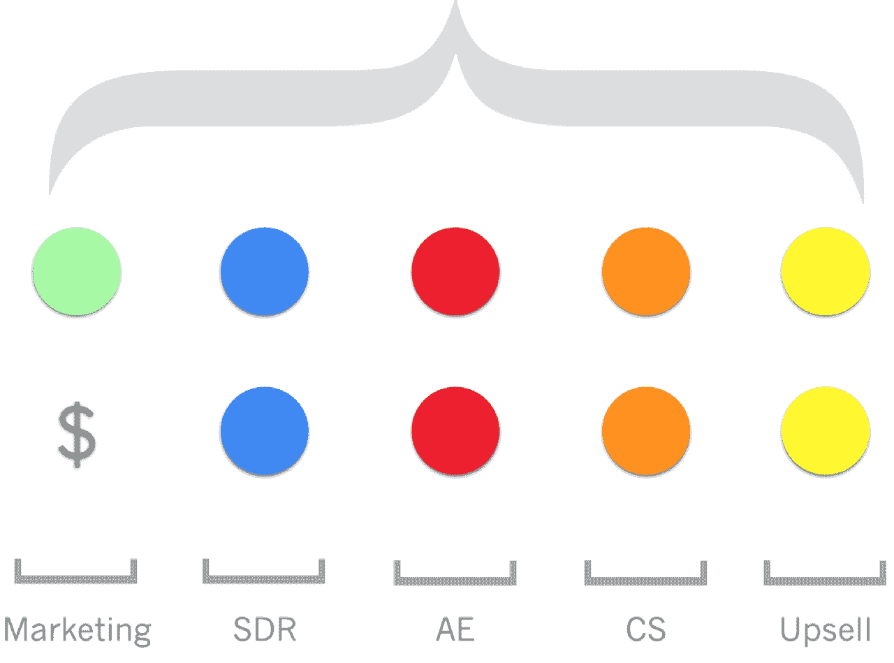
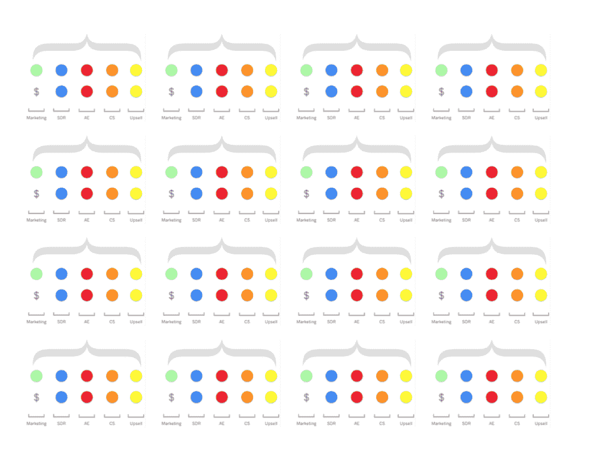

# SaaS 增长的基本单位

> 原文：<http://tomtunguz.com/fundamental-unit-of-saas-growth/?utm_source=wanqu.co&utm_campaign=Wanqu+Daily&utm_medium=website>

[T2】](https://res.cloudinary.com/dzawgnnlr/image/upload/q_auto/f_auto/w_auto/building-block-single.png)

当你的 SaaS 创业公司找到适合市场的产品后，下一步的业务发展就是发现 SaaS 增长的基本单位。一个基本单位是原子走向市场团队:营销、销售和支持角色中能够支持 X 个客户并产生 Y 个收入的最少人数。

当一家初创公司发现了他们的基本单元时，时间、现金和执行就成了业务的限制因素。公司发展道路上的大多数其他[风险已经被减轻](http://tomtunguz.com/the-11-risks-vcs-evaluate/)。换句话说，是时候筹集一轮增长资金来扩大业务规模了。

基本单位的主要成员如上所述。当确定一个基本单位的组成时，有以下问题:需要多少营销团队成员和多少营销支出来创造足够的线索，以满足一个为一个[客户经理](http://tomtunguz.com/sales-team-structure/)安排会议的[销售发展代表](http://tomtunguz.com/sales-team-structure/)？一旦 AE 关闭了客户，需要多少[客户成功(CS)经理](http://tomtunguz.com/categories/customer-success/)来让客户满意，需要多少[追加销售代表来产生负流失率](http://tomtunguz.com/upsell-ratios/)？

[T2】](https://res.cloudinary.com/dzawgnnlr/image/upload/q_auto/f_auto/w_auto/building-block-panoply.png)

每个创业公司的基本单位在特定的比率上会有所不同。以下是我看到的这些比率的范围，但请记住，不同类型的企业有很大的可变性(中小企业与企业，口碑与海外客户获取等):

1.  **营销**:变数很大；要看商家的主要获客渠道。
2.  **SDR 与 AE** :从 1:1 到 1:3 不等，取决于销售线索数量和销售线索合格率
3.  **每位客户的 CSM:**[一个行业的经验法则](http://tomtunguz.com/gross-margin-trends-saas/)是每 1 美元——ACV 的 2M 中有 1 个 CSM。但是这个数字有所不同。每个客户的平均收入较小、产品开发程度较低的公司将需要配备更大比例的客户经理。
4.  **按 AE 追加销售高管:**根据 2014 年 PacCrest 调查的数据，这一数字因公司收入规模不同而异，约为 1:8 至 1:3

一旦一家公司算出了数字，即每个角色的人员比例和总支出，企业必须尽快过渡到招聘、入职和管理尽可能多的基础部门。此时，公司精确地知道每个团队的收入贡献和成本。换句话说，就是增加现金来增长。