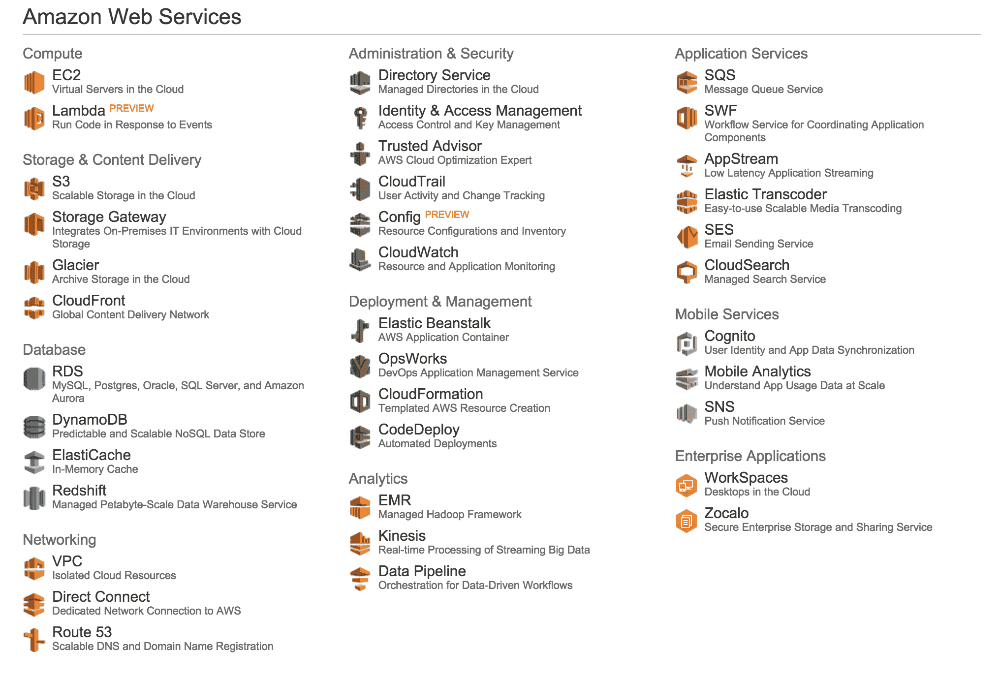
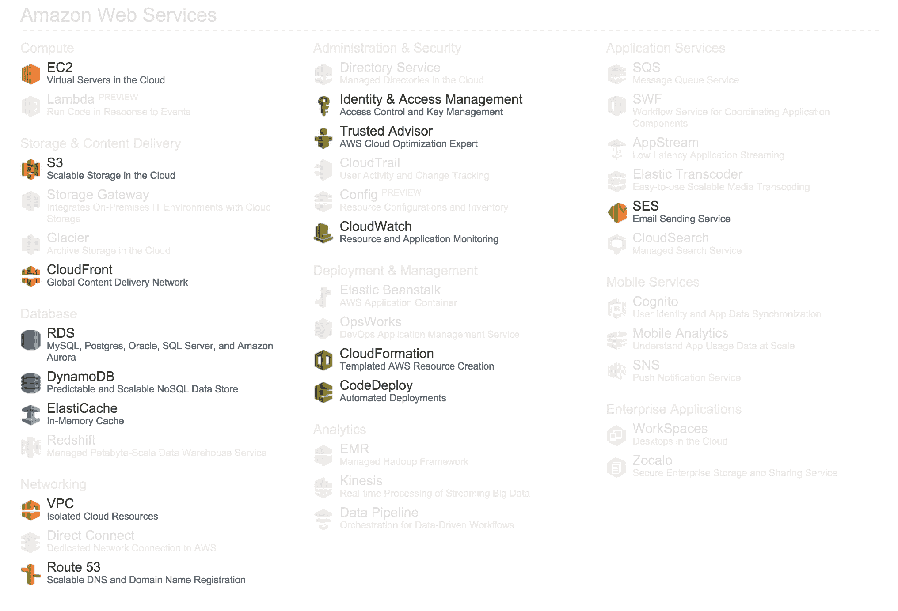
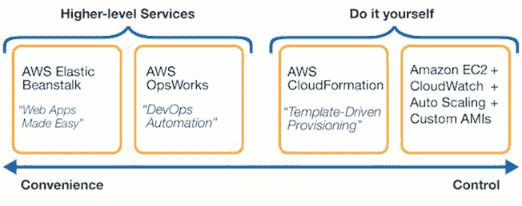
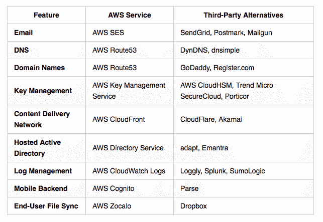
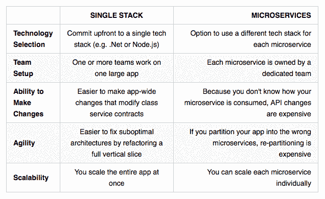
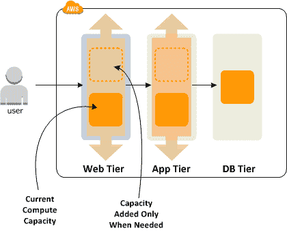

# 在 Amazon Web Services 上构建可伸缩 Web 应用程序的综合指南——第 1 部分

> 原文：<https://www.airpair.com/aws/posts/building-a-scalable-web-app-on-amazon-web-services-p1?utm_source=wanqu.co&utm_campaign=Wanqu+Daily&utm_medium=website>

 <post no-compile="">似乎今天每个人都想构建下一个伟大的可扩展 web 应用。而且，至少根据 Gartner 的说法[，亚马逊网络服务已经成为无可争议的领先云提供商，你应该在那里建立它。](http://aws.amazon.com/resources/gartner-mq-2014-learn-more/?sc_icountry=en&sc_ichannel=ha&sc_idetail=ha_en_42&sc_icontent=ha_en_d_ed_42_1&sc_iplace=ha_en_ed&sc_icampaign=ha_en_Gartner&trk=/)

但是 AWS 可能看起来势不可挡。现在有超过 40 种不同的 AWS 服务，在构建应用程序时需要考虑许多概念。AWS 为他们的每一项服务提供了[优秀的文档](http://aws.amazon.com/documentation/)、[有用的指南](http://aws.amazon.com/solutions/)和[白皮书](http://aws.amazon.com/whitepapers/)、[通用应用的参考架构](http://aws.amazon.com/architecture/)，甚至还有一个专门针对初创公司的[项目](http://aws.amazon.com/activate/)，初创公司可以免费与 AWS 云支持工程师交谈一个月，在特定情况下，还可以获得免费的 AWS 积分。

但是你怎么把它们放在一起呢？比方说，你听说的“正常工作”的弹性负载平衡器(ELB)和看似无关的 DevOps 服务发现概念之间有什么关系？什么时候使用非 AWS 解决方案有意义(例如使用 nginx 而不是 ELB)？

此外，你如何平衡快速和廉价地构建一个应用程序的需求，但这种需求是可扩展的？

我在本指南中的目标不仅是回答这些问题，更重要的是，提供一个总体框架让你思考*如何回答这些问题。*

 *我的目标受众是开发人员，他们有一些 web 或移动应用程序，并且了解核心编程概念，但现在想学习如何在 AWS 中构建可伸缩的应用程序。本指南对于已经在运行 AWS 应用程序的大型组织中工作的开发人员，或者那些希望迁移到 AWS 的开发人员也很有价值。

我将涵盖高层次的概念和细节。我不会描述 AWS 的基础知识，比如“如何启动 EC2 实例”，但是我会提供这些领域的最佳实践和观点。最后，我不会明确讨论大数据、事件驱动或其他类型的架构，尽管这里肯定有很多材料适用于这些。

让我们开始吧。

## 1.我们将涵盖的内容

本指南分为两部分。您正在阅读第 1 部分，其中我将重点介绍 AWS 中的高级概念以及如何构建 AWS 架构。在第 2 部分中，我们的重点将是开发运维以及维护基础设施。

### 1.1 如何看待 AWS 和可伸缩性(第 1 部分)

我们将从关于如何对待和考虑 AWS 的高级指导方针开始。

### 1.2 AWS 概念(第 1 部分)

你需要学习一些，但不是全部！-深度 AWS 服务。我将简要介绍构建可伸缩 web 应用程序所需的 AWS 服务:

*   EC2
*   S3
*   VPC
*   无线电数据系统
*   InternationalAssociationofMachinists 国际机械师协会
*   53 号公路
*   云锋
*   云观察
*   云形成对比弹性豆茎对比 OpsWorks

### 1.3 架构概念(第 1 部分)

当您考虑应用程序将做什么以及如何扩展时，您将需要设计一种让数据流动和持久化的方法，以及许多辅助问题。我们将讨论:

*   建筑范式
*   应用层
*   可扩展性架构
*   高可用性架构
*   码头和集装箱
*   安全性

### 1.4 开发运维概念(第二部分)

在第 2 部分中，我将讨论日常运行基础设施的操作方面，特别强调自动化。

最近,“DevOps”一词已经成为指代这些概念的流行方式。从技术上来说，DevOps 指的是应用程序开发人员必须积极考虑他们代码的操作方面，而运营人员则使用源代码控制和自动化测试等“开发”概念来管理基础架构。但是现在人们用 DevOps 来泛指“基础设施自动化”。

我们将涵盖这些概念:

*   结构管理
*   简化开发环境设置
*   管弦乐编曲
*   服务发现
*   日志和错误管理
*   监控和警报
*   仪表盘
*   自动化部署
*   备份和灾难恢复
*   安全性
*   可量测性
*   电子邮件服务

## 2.如何看待 AWS 和可伸缩性

我想从建立你的心智模型开始，这样你就知道*如何考虑*你在 AWS 上的可扩展 web 应用。我将分享一些不难理解的基本想法，但它们会让你的起步过程更容易。

### 2.1 您不需要学习所有 40 多种 AWS 服务

第一个好消息是，在 40 多种 AWS 服务中，您只需要深入了解其中的一小部分。截至 2014 年 12 月，以下是所有 AWS 服务的最新列表:

如果您正在构建一个不具备“大数据”资格的标准可扩展 web 应用程序，以下是您可能会使用的 AWS 服务:

在这些服务中，你的大部分学习将在 **EC2** 、 **VPC** 、 **S3** 以及一个或多个持久性服务中进行，包括 **RDS** 或 **DynamoDB** 。

查看 [AWS 解决方案](http://aws.amazon.com/solutions)页面是确定您的独特应用程序所需的特定服务集的一个好方法。

### 2.2 做出正确的架构决策

您做出的大多数架构决策都是对这些因素的权衡:

*   **时间:**设置需要多长时间
*   **团队:**你的团队对这一决策的生产力如何
*   **成本:**您将为这些服务向 AWS 支付多少费用
*   **风险:**您面临多少停机时间/数据丢失/安全风险
*   **规模:**你能服务多少用户/你的应用有多快

AWS 是一个平台，但组装这些部件取决于您。本质上，AWS 允许您“购买”您需要的可用性、冗余、安全性或规模级别。

例如，考虑如何在 AWS 中建立一个 Wordpress 站点？这里有两种在 AWS 上托管同一个站点的不同方式。不要担心每个缩略词或概念的含义。我们稍后会谈到这一点；现在的重点是展示对于同一个应用程序，不同的需求如何驱动不同的决策。

*   所有东西都托管在一个被称为 EC2 实例(Cost)的虚拟机上。你可以使用一个预先构建和测试的亚马逊机器映像(AMI ),比如 [Bitnami Wordpress](https://bitnami.com/stack/wordpress) ,它可以在几分钟内启动并运行。Bitnami 是有据可查的，我们将每 24 小时设置 EC2 实例的自动快照，这样，如果服务器离线，我们可以恢复到 24 小时前(团队、风险)。但是我们将面临长达 24 小时的数据丢失风险。价格会很低(成本)，我们可以升级实例类型，如果我们得到更多的流量(团队)。如果服务器关闭，网站将离线，直到我们恢复它(风险)。

*   我们将使用 S3 和 CloudFront 来服务所有的静态文件，这样我们可以改善站点加载时间(规模)。我们将在每个可用性区域设置一个 Wordpress 服务器，这样如果任何一个服务器或可用性区域失效，网站将保持运行(风险)。我们将使用亚马逊的托管关系数据库服务(RDS)来托管我们的数据库，并提供多可用性区域选项，这样我们就可以自动备份我们的数据库，实现良好的性能，并降低数据丢失的风险(风险、规模)。因为我们将有多个 Wordpress 服务器，我们将需要设置一个特殊的部署方法来确保所有的 Wordpress 服务器总是同步的(团队，成本)。由于我们正在使用多种 AWS 技术，如 CloudFront、S3、EC2 和 RDS 以及多个 EC2 实例，我们将支付更多(成本)。

我认为最重要的因素是“团队”我喜欢 Edmond Lau 在他的一篇博客文章中的说法:

> 评估大多数权衡的指导性启发最终应该是:“什么行动过程将最终增加团队成功的概率？”

### 2.3 认识 AWS 服务固有的“频谱”

许多 AWS 服务存在于一个范围内。认识到这些有助于指导您选择使用哪些 AWS 服务。

例如，AWS Elastic Beanstalk、OpsWorks 和 CloudFormation 都提供相同的核心服务来协调您的基础设施(例如，启动 EC2 实例、设置安全组等)。)，但你是在便利与控制之间做交易。

*图片来源: [DevOps，PaaS 以及中间的一切](http://getcloudify.org/2013/03/18/devops_paas_and_everything_in_between.html)T3】*

或者，在处理存储数据时，您可以将文件存储在 S3，在那里可以在请求文件后的几毫秒内检索到文件，或者存储在 Glacier，在请求文件后 2 - 6 小时可以获得文件，但成本是 S3 的 1/3。这里的频谱是“速度与成本”

### 2.4 识别 AWS 服务的第三方替代方案

AWS 一直非常积极地“横向”扩展其服务。举个例子，你知道你可以通过 AWS 购买域名吗？这是 AWS Route53 (AWS 的 DNS 即服务)的一部分。

AWS 最近还发布了 Dropbox 的竞争对手( **AWS Zocalo** )甚至是 GitHub 的替代品( **AWS CodeCommit** )。

事实上，这里列出了 AWS 提供的服务，其他第三方公司也成功地提供了这些服务:

我的默认立场是从 AWS 服务开始。首先，它集成到了我的 AWS 环境中。第二，如果适用，它将通过 AWS 简单通知服务(SNS)使用电子邮件、文本消息或其他方式向适当的人生成特定于服务的警报。第三，我可以授予我现有的 AWS IAM 用户(即我团队中需要登录 AWS 控制台或通过 API 访问 AWS 的其他成员)对该服务的细粒度权限。还有，通常是最便宜的。

但也有很多第三方服务更胜一筹的情况。日志管理就是一个很好的例子。AWS CloudWatch Logs 允许您基于应用程序日志数据定义自己的自定义指标(“指标过滤器”)。然后，您可以以图表格式查看这些指标，或者对它们设置警报。它还允许您查看流入的实时日志数据。

但是像 Loggly 和 SumoLogic(两者都有免费版本)这样的工具允许复杂的搜索，并且可以以比 AWS CloudWatch 日志更有趣和有用的方式总结您的日志数据。

### 2.5 AWS 将允许您纵向和横向扩展，但计划横向扩展

随着流量的增长，你可以通过使用越来越强大的 EC2 实例来“扩大规模”,或者通过简单地添加更多实例来处理应用程序的负载来“扩大规模”。

#### 2.5.1 横向扩展

经典的观点是，你应该设计你的应用程序向外扩展。向外扩展意味着您可以随着应用负载的增加或减少来调整系统容量(通过添加或删除 EC2 实例)。这对于偶尔经历活动激增的应用程序尤其适用，比如网络星期一上的一个电子商务网站。

向外扩展还意味着，如果您的一个服务器停止工作，这将成为一个非事件，因为您已经将您的应用程序设计为独立于任何单个 EC2 实例。

横向扩展的最大好处之一是您可以实现自动化。AWS 提供了一组构建块来促进这一点。例如，自动扩展组是一项 EC2 功能，您选择的指标(例如实例的 CPU 负载或自定义应用程序指标)可以在超过您定义的阈值时触发启动或终止其他 EC2 实例。

*图像来源:[通过 AWS 管理控制台](http://blog.celingest.com/en/2013/12/19/auto-scaling-with-the-aws-management-console/)自动缩放 T3】*

但是设计应用程序的横向扩展并不简单。我们稍后将更详细地讨论这一点。

#### 扩大规模

一定要利用纵向扩展。一旦创建了 EC2 实例，就可以停止它，升级实例类型，然后启动它。

有时，一个专门的“扩大规模”战略可以创造奇迹。StackOverflow 因在这方面的出色表现而闻名。但是，专门的纵向扩展策略通常无法动态地上下调整容量，并且在 AWS 等公共云平台中通常更加昂贵。

#### 我做什么

当我构建自己的应用程序时，我从第一天起就设计它们以支持水平扩展，主要是通过确保我的 web/应用程序层完全无状态(稍后将详细介绍)。然后我用 t2 实例(AWS 的入门级实例类型)启动它们，如果我的 CPU 负载、内存使用、网络 I/O 或平均 API 响应时间等指标太慢，我会升级到更强大的实例。在某种程度上，我停止纵向扩展，开始横向扩展。

AWS 最近也宣布支持 Docker，作为其 EC2 容器服务的一部分。这改变了何时/如何向外扩展的计算方法，我们稍后也会谈到这一点。

### 2.6 始终构建多可用性区域(多 AZ)体系结构

当您启动一个 EC2 实例时，您正在启动一个运行在 Amazon 的一个数据中心的物理服务器上的虚拟机。这意味着以下任何事件都可能导致您的实例停机:

*   您的实例本身可能会失败，或者其底层硬盘驱动器卷(弹性块存储卷)可能会损坏
*   EC2 实例所在的物理机器可能会出现故障
*   物理机所在的数据中心可能会发生故障

用 AWS 的话说，“数据中心”被称为**可用性区域(AZ)** 。距离一个 AZ 大约 5 - 15 英里的地方至少还有一个 AZ。整个阿兹星团被称为**区域**。美国有 3 个地区，全球有 11 个地区。

*图片来源:[AWS 官方文档](http://docs.aws.amazon.com/AWSEC2/latest/UserGuide/using-regions-availability-zones.html)*

#### 2.6.1 多轴高可用性

您应该假设您的任何 EC2 实例在任何时候都会以上述任何方式失败。当单个 EC2 实例或整个 AZ 离线时，您的架构应该检测到这一点，并简单地停止将流量路由到受影响的实例。这是多 AZ 设置背后的想法，我们将在后面更详细地介绍它。

一些 AWS 服务如 AWS RDS(其中 AWS 管理您的关系数据库实例)内置了对多 AZ 的支持，启用它只需在配置中选中一个框。

您可以超越多 AZ 并使用多区域架构，在这种架构下，您的应用程序可以在整个区域离线时继续运行，但多区域设置会带来新的复杂性和额外的成本，通常只有大型组织才会实施。

### 2.7 您很少预先付款，并且只为您需要的东西付款

AWS 反复强调他们的目标是让你的思维“从资本支出转向运营支出”或“为你使用的东西付费”。换句话说，在过去，要实现 AWS 提供的那种基础设施，您需要在前期投入大量资金(“资本支出”或 CapEx)。如今，AWS 从理念上致力于消除资本支出，以便您只需支付持续的“运营支出”(OpEx)来运行您的基础架构。

这意味着 AWS 服务几乎总是按使用情况定价。例如，当您运行 EC2 实例时，您按小时付费。如果停止了，你不用付钱。S3 按存储的每 GB 数据收费，同时还有一些带宽成本。

该规则的一个显著例外是“保留实例”的概念这是 AWS 提供的一个计费选项，您可以通过预先支付来“购买”EC2 实例的较低小时费率。我们很快会谈到这一点。

### 2.8 计划和监控您的成本，并使用预留实例

AWS 最困难的事情之一是管理您的成本。我们大多数人都喜欢“按使用付费”的模式，但实际上，你最终会使用各种各样的服务，而且很难跟踪所有的服务。

AWS 认识到了这一挑战，值得称赞的是，它提供了几种工具来帮助您管理成本。

#### 2.8.1 预先估算成本

AWS 提供了一个[在线成本计算器](http://calculator.s3.amazonaws.com/index.html),您可以使用它根据您计划使用的服务来估算您的每月(如果适用的话，还包括前期)成本。

#### 2.8.2 使用计费提醒

你的 AWS 账单应该符合你对计算器的期望，并且应该保持相当稳定，除非你使用更多的服务。您可以通过设置[计费警报和通知](http://docs.aws.amazon.com/awsaccountbilling/latest/aboutv2/monitor-charges.html)来保证这些假设是正确的。

Rich Adams 有一篇关于 AWS 提示的优秀文章，我希望我在开始使用之前就知道了，他建议每周为他的预期使用量设置一个计费提醒。

> 因此，第一周的警报是 1000 美元，第二周是 2000 美元，第三周是 3000 美元，等等。如果第二周的闹钟在 14/15 号之前响起，那么我知道可能出了什么问题。

#### 2.8.3 正确的 EC2 定价模型

当您启动 EC2 实例时，您需要按小时付费。但是你支付的时薪会根据你使用的定价模式而有所不同。

##### 按需 2.8.3.1 实例

如果你只是启动一个实例，你需要支付**随需应变**的费用。例如，一个 m3.large 实例的成本是 0.140 美元/小时，或者大约 100 美元/月，如果您一个月 24/7 全天候运行您的实例，那么您的实例使用的 EBS 卷的费用可以忽略不计(20GB 为 2 美元/月)。如果您停止您的实例，您只需为您的 EBS 卷支付费用，而无需为 EC2 实例支付任何费用。

##### 2.8.3.2 保留实例

如果您希望让 EC2 实例长时间运行(例如一年 24/7)，您可以注册一个**保留实例**，节省高达 60%！这只是一个计费概念。这将影响您的计费方式，并且不会以任何方式影响 EC2 实例的技术性能。

保留实例的基本思想是您向 AWS 承诺您将使用 EC2 实例的特定配置文件(例如，Oregon region、m3 实例类型等)。)为期 1 年或 3 年。您可以通过以下方式表明您的承诺:

*   100%预付，无需任何后续工作(最高节省)
*   0%预付，但您承诺在整个期限内每月支付(最低储蓄)
*   一些前期费用以换取较低的时薪(中等节省)

根据您的承诺期限和您对服务的利用情况，这方面的节省是显著的，从大约 30% - 60%不等。如果您知道您将使用 EC2 实例一年，这是显而易见的。

这里需要说明的是，你可以改变你预订实例的某些条件，但不是所有条件，而且 AWS 不会正式退款。更多信息参见 [AWS 保留实例常见问题解答](http://aws.amazon.com/ec2/faqs/#reserved-instances)。

虽然 AWS 不会发放任何退款，但你实际上可以在公开市场上以你通过 AWS 提供的[保留实例市场](http://aws.amazon.com/ec2/purchasing-options/reserved-instances/marketplace/)设定的价格出售你剩余的合同。

##### 2.8.3.3 Spot 实例

最后，你可以购买 **Spot 实例**，这意味着你出价愿意支付的小时费率，如果你的出价高于 AWS 设定的当前“Spot”费率，一个实例就会启动。截至 2014 年 11 月 28 日，同一个 m3.large 实例的价格仅为 0.0165 美元/小时(相当于每月 11 美元！).但问题是，一旦现货价格高于你的出价，你的实例将立即终止。这个模型适合于大规模的持续计算，显然需要一些特殊的架构。

请参见 [EC2 定价页面](http://aws.amazon.com/ec2/pricing/)了解更多信息。

#### 2.8.4 AWS 可信顾问

如果您碰巧有业务支持计划或更好的计划，您可以访问 AWS Trusted Advisor 的完整版本，它会自动分析您的帐户中哪些实例适合保留实例，哪些实例处于空闲状态。

## 3.关键 AWS 服务

现在，您已经对 AWS 有了一个高层次的了解，让我们更深入一个层次，简要总结一下对可伸缩 web 应用程序至关重要的 AWS 服务。使用 [AWS 文档](http://aws.amazon.com/documentation/)或其他资源来学习“如何”，我的目标是给你“什么”和“为什么”

### 3.1 EC2

弹性计算云(EC2)是您启动服务器的地方。在 AWS 中，“服务器”实际上是虚拟机，在 AWS 行话中，单个虚拟机是“EC2 实例”。

每个 EC2 实例都由一个或多个“虚拟硬盘”支持，这些虚拟硬盘被称为**弹性块存储(EBS)卷**。您可以启动基于“硬盘快照”的 EC2 实例，这种快照被称为**亚马逊机器映像(AMI)** 。例如，您可以选择 Ubuntu 14.04 AMI、Windows Server 2008 AMI 等。

EC2 实例由被称为**安全组**的“防火墙”保护。例如，要 SSH 到您的实例，与您的实例相关联的安全组必须允许来自您的 IP 地址的端口 22。

每个 EC2 实例都有一个私有 IP 地址，这个私有 IP 地址只有在 EC2 实例所在的网络中可见(称为 **VPC** ，见下文)。一些 EC2 实例还可以有一个或多个公共 IP 地址。如果您可以将一个 EC2 实例的公共 IP 地址分配给另一个 EC2 实例，那么这个 IP 地址就是所谓的**弹性 IP 地址**。

EC2 实例可以被停止(比如关闭服务器)、启动(比如打开服务器)或终止(比如销毁服务器)。

### 3.2 VPC

虚拟专用云(VPC)是一个放置 EC2 实例的专用网络。

最初在 AWS 中，每个 EC2 实例都直接暴露于公共互联网，仅由其上设置的安全组规则保护。许多用户认识到，在传统的数据中心，您可以使用直接布线建立专用网络；VPC 试图在云中实现这一版本。

每个 EC2 实例被放入一个特定的**子网**。子网指定了一个 IP 地址范围，并且存在于一个特定的**可用区域中。**子网要么直接暴露于互联网(“公共子网”)，要么无法从互联网访问(“私有子网”)。例如，您可能不希望您的数据库服务器暴露在公共 Internet 中，因此您应该将其放在专用子网中。

当您想要设置高可用性架构时，您可以将 EC2 实例分布在不同的子网中，从而分布在不同的可用性区域中。

### 3.3 S3 和冰川

简单存储服务(S3)用于在云中存储文件。

Glacier 就像 S3，但更便宜，代价是一旦你请求一个文件，可能需要 2 - 6 个小时才能下载。

要上传一个文件到 S3，首先你要选择或创建一个 **S3 桶**，它只是一组文件的名称空间。你在 S3 上传的文件可以通过 URL 公开下载，也可以是私人的，只在特定情况下可用。

网络和移动应用的一个常见模式是将所有用户生成的文件存储在 S3。此类文件通常不应公开，因此当用户需要下载文件时，您可以颁发一个临时访问令牌，该令牌可用于在规定的时间段(例如 60 秒)内从 S3 的 URL 下载文件。

您可以将“策略”分配给 S3 存储桶，以了解存储桶中的文件会发生什么情况。例如，存储桶中的文件可以在一段时间后自动删除，自动归档到 Glacier，或者两者都有。

上传到 S3 的文件可以使用您提供的密钥或 AWS 透明管理的密钥进行加密。

### 3.4 RDS 和 DynamoDB

**关系数据库服务(RDS)是 MySQL、PostgreSQL、SQL Server 或 Oracle 的托管关系数据库服务。**

DynamoDB 是一项托管的 NoSQL 服务，使用专有的 AWS NoSQL 引擎。

管理自己的数据库服务器面临许多挑战。RDS 和 DynamoDB 自动处理备份、扩展、主备用复制、读取副本、数据库版本更新和安全补丁。

RDS 和 DynamoDB 的主要替代方法是管理自己的 EC2 实例，运行自己选择的数据库软件。

AWS 最近宣布了 Aurora，这是一个大规模可扩展的 MySQL 兼容的数据库服务。

### 3.5 IAM

身份和访问管理(IAM)是一组用于管理团队成员和 AWS 资源之间权限的服务。

当您第一次创建 AWS 帐户时，您使用的电子邮件地址将是“root”帐户，并拥有超级管理员权限。最好不要使用这个帐户登录，而是使用 IAM 为团队中的每个成员创建单独的帐户。

然后，您可以为每个帐户分配权限，例如，一些团队成员可以查看所有信息，但不能启动或停止 EC2 实例。

IAM 权限也可以分配给 AWS 资源，比如 EC2 实例本身。这使得具有正确权限的 EC2 实例能够自动访问例如 S3 的特定文件夹，而不需要单独的认证。

最近，AWS 向 IAM 添加了**密钥管理服务**，以便您可以集中管理对称加密密钥。

### 3.6 53 号公路

**Route 53 是 DNS 即服务，还包括购买域名的能力。**

使用 Route 53，您可以为任何域名设置公共 DNS 记录。Route 53 最近还引入了设置专用 DNS 的功能(只有您的专用网络可以查询，但外部世界无法查询的 DNS)。

您可以将 Route 53 与许多其他 AWS 服务结合使用。例如，结合 S3 使用 53 号公路，你就可以在 S3 建立一个静态网站。

### 3.7 云锋

**CloudFront 是由 AWS 管理的内容交付网络。**

CloudFront 包含遍布全球的**边缘位置**，可以缓存某些内容。因此，当用户访问 CloudFront 缓存的内容时，您的应用程序不会受到任何影响，用户接收数据所需的物理网络跳数也更少。

CloudFront 可以使用 S3 或 HTTP 服务器作为原始服务器，从那里获取原始内容。

CloudFront 还支持流媒体文件。

### 3.8 云观察

**CloudWatch 为您的 AWS 资源提供监控和警报。CloudWatch 还提供了管理 EC2 实例上的应用程序日志数据的基本特性。**

每个 AWS 服务都有一组向 CloudWatch 公开的独特指标。例如，EC2 实例公开了 CPU 利用率、内存利用率等等，而 RDS 实例公开了数据库连接、读取 IOPS 和 CPU 利用率。

您可以设置当指标超过您定义的阈值时触发的自动警报。警报的结果可能是通知某人，或者在 AWS 内采取行动。例如，一个典型的模式是，当现有 EC2 实例上的平均 CPU 利用率超过某个阈值时，自动启动额外的 EC2 实例。

### 3.9 云形成与弹性豆茎和 OpsWorks

CloudFormation 是一种将您在 AWS Web 控制台中所做的一切捕获为单个 JSON 文件的方式。这意味着您可以“版本控制”和“代码审查”您的 AWS 基础设施设置。

OpsWorks 实现了与 CloudFormation 相同的基础设施管理，但在更高的抽象层次上，并特别关注应用程序部署。

Elastic Beanstalk 实现了与 CloudFormation 和 OpsWorks 相同的基础设施管理，但处于最高的抽象层次。例如，只需点击几下鼠标就可以启动 NodeJS 堆栈。

最原始(也最常见！)在 AWS 上设置基础设施的方法是使用 web 控制台。但是当你在大型团队中工作时，这可能会带来问题。假设工程师 A 更改了一个安全组设置，然后回家了。一个小时后，工程师 B 收到一个警报，提示某项服务已关闭。如果工程师 B 没有变更记录，发现问题的根本原因就变得很困难。

管理 AWS 基础设施的最佳实践是通过 CloudFormation 运行每个变更，并将您的变更提交给版本控制。在上面的例子中，工程师 B 现在可以立即检查 CloudFormation 模板的更新，以查看是否是它导致了问题。

但是有时 CloudFormation 是多余的，特别是对于 AWS 初学者。另一端是 Elastic Beanstalk，它让您“点击”即可部署一整套通用技术，甚至是 Docker 容器！虽然您可以使用“点击”来配置基础架构，但是您仍然可以在通常的位置看到所有相关的 AWS 资源(例如 EC2 实例)。

OpsWorks 是由 AWS 收购的，以前称为 [Scalarium](http://www.scalarium.com/) ，是一种中间立场。OpsWorks 提供了比 Elastic Beanstalk 更多的控制，还引入了“点击式”部署选项，但也比使用 CloudFormation 有更多的限制。

### 3.10 其他 AWS 服务

长话短说，我只总结了对可伸缩 web 应用程序最重要的 AWS 服务，当然，除了我列出的服务之外，您还会使用其他服务。

## 4.架构概念

现在是时候讨论在 AWS 上创建系统架构时将做出的决定了。

如果你想从另一个角度了解你的架构如何从一个 EC2 实例发展到数百个自动扩展的实例，请观看 Chris Munns 在 AWS re:Invent 2014 上的精彩演讲[扩展到你的第一个 1000 万用户](https://www.youtube.com/watch?v=ccojvcQq858)。

### 4.1 架构范例

首先要做的一个决定是将你的应用构建为“单一堆栈”还是“许多小的单一堆栈”

#### 4.1.1 单一堆栈:整体架构

传统上，新软件项目的默认架构是经典的 n 层架构。维基百科对此给出了一个很好的概述。

正如 Wikipedia 链接所描述的，这意味着将持久层设置为数据库(例如 PostgreSQL 或 MongoDB)和/或缓存(例如 Redis 或 Memcached)，设置中间层以处理业务逻辑，以及设置前端层，通常使用类似 Nginx 或 Apache 的 web 服务器。

单栈架构的定义特性是所有或大部分代码都包含在这些层中。您的持久层将拥有所有数据库表或文档类型。您的中间层将包含您的*整个*领域模型和业务逻辑。每一层可能有一个 EC2 实例或分布在多个可用性区域的多个 EC2 实例。

几年前，许多软件团队开始抱怨他们的 N 层架构变得如此之大，以至于增强和维护它变得越来越痛苦和昂贵。在这种情况下，他们轻蔑地将 N 层架构称为“整体架构”

事实上，有许多[在线](http://www.slideshare.net/renaudvisage/renaud-visage-apidaysparis2013)公司分享他们从整体架构到微服务架构的旅程。

#### 4.1.2 许多小型单栈:微服务架构

那么什么是微服务架构呢？微服务架构是一种范式，其中每个微服务都是一个独立的“单个堆栈”，正如 Sam Newman 在[构建微服务](http://shop.oreilly.com/product/0636920033158.do)中简要总结的那样:

> *   Very small, focus on doing one thing well
> *   It is a separate and independent process.
> *   Communicate through language agnostic API
> *   Is highly decoupled.

微服务架构可以被认为是面向服务架构(SOA)的一种“方法”，尽管这两个术语之间通常没有明显的区别。

作为微服务架构的一个例子，如果您正在构建一个杂货店购物应用程序，您可能会有一个微服务用于创建、管理和验证用户，一个用于管理您的 SKU 目录，一个用于管理您的库存水平。这些微服务中的每一个都将位于它们自己独立的 EC2 实例堆栈上，可以由单独的团队管理，甚至使用不同的技术选择，通过 RESTful APIs 相互连接。

微服务架构有许多好处，这无疑是当今构建新应用的时髦方式。但是，就像软件中的一切一样，也有利弊。查看 Martin Fowler 的[微服务](http://martinfowler.com/articles/microservices.html)文章，获得很好的概述和比较。我也喜欢[艾蒙·达德加尔的总结](https://speakerdeck.com/armon/consul-service-oriented-at-scale?slide=6)。

以下是我对这个问题的看法，尽管有些泛泛而谈:

正如你所看到的，微服务架构有很多好处，但它也有缺点。

#### 4.1.3 微服务和基础设施自动化

微服务架构的一个关键点是基础设施自动化(我将在第 2 部分中讨论)变得极其重要。手动管理包含 N 层的单个堆栈基础架构已经够难的了。想象一下手动管理 5 个单一堆栈？

微服务如今成为可行架构的部分原因是因为基础设施自动化的最新进展。理想情况下，在设置微服务架构时，您应该“模板化”整个堆栈，以便可以轻松重用。

例如，您可以使用**配置管理**技术，如[主厨](https://www.chef.io/)、[木偶](http://puppetlabs.com/)、 [Ansible](http://www.ansible.com/) 或 [Saltstack](http://www.saltstack.com/) 来自动化您每一层的服务器配置，使用**编排**工具，如 AWS CloudFormation 或 [Terraform](http://terraform.io) 来自动化 AWS 基础设施的部署，如 EC2 实例、RDS (Amazon 托管关系数据库商店)实例或弹性负载平衡器。您将在您的服务器配置中加入一个通用标准，用于处理日志记录、警报、监控、进程管理、安全程序等。这方面的细节是我们第 2 部分文章的核心。

实际上，简化基础设施的要求本身就是一种优势，但是，根据我们之前讨论的决策指南，如果您的团队没有准备好设置这种级别的基础设施自动化，微服务可能是一种非常昂贵的架构。

就我个人而言，我今天用微服务架构开始我的绿地项目，但这只是因为我愿意前期投入大量开销来尽可能多地自动化我的基础架构。

#### 4.1.4 微服务和异步消息传递

正如我们已经说过的，每个微服务都可能调用其他微服务。这将在你的脑海中提出一个重要的问题:当有人调用你的一个微服务时:这需要是一个**同步**还是**异步**调用？

想象你正在经营一个电子商务网站。如果你从用户那里收集信用卡，当用户点击“提交”时，我们需要立即让他们知道他们的信用卡是否被批准。这个业务规则意味着“处理信用卡审批”必须是同步调用。“提交按钮”代码在等待“处理信用卡”服务的响应时应该暂停(顺便说一下，它希望以一种“非阻塞”的方式暂停，以便它所操作的线程被释放出来做其他事情)。这是同步调用的一个经典例子，通常会使用 HTTP RESTful web 服务进行调用。

但是一旦信用卡被批准，用户准备提交订单，这可以异步完成。您的企业很少会“拒绝”新提交的订单，所以在这种情况下，我们可以不通过 RESTful API 调用同步提交订单，而是使用消息队列异步提交。使用消息队列，我们只需将订单提交给队列。与此同时，其他一些服务，如“订单处理服务”，正在以最快的速度消耗队列中的消息。在我们的例子中，“订单处理服务”可能使用先进先出(FIFO)处理订单。

在 AWS 中，您可以通过使用 Redis(或 AWS 的托管 Redis，ElastiCache)之类的键值存储来实现这样的队列，或者您可以使用 **AWS 简单队列服务(SQS)** ，它提供了完全托管队列的好处，但对 AWS 造成了一些额外的限制。

#### 4.1.5 微服务和 AWS

AWS 特别适合微服务所需的基础设施自动化。例如:

*   您可以使用 **AWS CloudFormation** 以代码的形式表示整个应用堆栈，包括启动的 EC2 实例、自动扩展组、安全组(服务器的单独防火墙)以及几乎所有其他内容。
*   简化部署的一个选择是使用类似于 [packer](https://www.packer.io/) 的工具来自动创建用于启动新 EC2 实例的**亚马逊机器映像(AMI)** 。
*   AWS 最近宣布了 **[EC2 容器服务](http://aws.amazon.com/ecs/)** ，以简化使用 Docker 容器跨 EC2 实例集群部署多个微服务堆栈。

### 4.2 应用层

无论您处理的是单个堆栈还是微服务架构，您最有可能拥有至少一个 N 层架构实例，也就是说，至少一个完整的堆栈。体系结构中最常见的层如下，最后将讨论如何处理 SSL。

#### 4.2.1 负载平衡层

这一层的作用是将传入流量平均分配到下一层，下一层可能是 Web 层或应用程序层，但也可能是任何层。这一层的官方 AWS 解决方案(也是最受欢迎的解决方案)是一个**弹性负载平衡器(ELB)** ，但是您也可以设置自己的 EC2 实例，使用 [HAProxy](http://www.haproxy.org/) 或 [Nginx](http://nginx.org/) 之类的软件来处理这个功能。

您的负载平衡器通常是应用程序的“入口点”,因此这里的高可用性至关重要。当使用 ELB 时，AWS 为您管理高可用性，而管理您自己的 EC2 实例可能需要设置自动故障转移之类的东西。

如果您使用 AWS Route 53 来处理您的 DNS，您可以利用 [Route 53 健康检查](http://docs.aws.amazon.com/Route53/latest/DeveloperGuide/dns-failover.html)，这意味着 Route 53 检查它要路由到的端点的健康状态，如果它不符合您指定的标准，将把流量路由到健康的端点。

但是这里要小心，因为来自 Route 53 的 DNS 响应包括一个“生存时间”属性，该属性指示 DNS 响应应该被本地互联网服务提供商的 DNS 服务器缓存多长时间。并不是所有的 DNS 服务器都尊重这个值，所以您不能保证所有客户端的即时故障转移。不过，这仍然是一个方便的选择，因为这是一种自动的重新路由流量的方式。

#### Web 层

这一层的作用是向用户提供静态文件，并且通常将流量路由到应用程序层中的正确端点。

Web 层的一个流行选项是使用安装在 EC2 实例上的软件，比如 Apache T1 或 T2 Nginx T3。这些服务器通常是应用程序发送回客户端的 HTTP 响应的最终仲裁者，定义了 HTTP 头、跨源资源共享(CORS)首选项等属性。有时它们也可以作为负载平衡器，Nginx 就是这种情况，但是您仍然可以使用 ELB 来进行负载平衡，并将 Nginx 作为您的 web 服务器。

事实上，利用 ELB 的高可用性并拥有一个多 AZ web 层是一个最佳实践，这样，如果您的 web 层中有一个 EC2 实例出现故障，没有人会注意到。

虽然 web 服务器软件被设计成可以非常快速地提供静态文件，但使用 **S3** 或 **AWS CloudFront** (AWS 的内容交付网络)来交付静态文件仍然是最佳实践。

Web 服务器也是使用自动缩放组的绝佳场所。如果 CPU 负载、网络流量或 I/O 超过某个阈值，您可以配置您的 ASG 来简单地启动更多实例。

#### 应用程序层

这一层的作用是运行应用程序的主进程。例如，如果您已经构建了一个 Java 应用程序，这一层正在运行一个监听传入连接的 Java 程序。如果您已经构建了一个 PHP 应用程序，这一层将运行一个支持 PHP 的 web 服务器，并监听传入的连接。

基本上，您的技术选择将决定如何设置该服务器。出于这个原因，AWS 对这一层最不“固执己见”,它只为您提供一个服务器(EC2 实例加上它的底层 EBS 卷)和支持工具，如弹性 IP 地址、安全组和 ami，

你的应用服务器有时是你的应用中存储“状态”的地方。例如，登录的用户可能在应用程序层的特定 EC2 实例上有他的会话信息。这样做的问题是，这个用户现在被“固定”在一个 EC2 实例上，如果它失败了，您的用户的会话也会随之死亡。

这里的最佳实践是使您的应用程序层实例无状态，并将会话状态等内容存储在不同的层中。我们将在 *4.3 可扩展性架构*中对此进行更多讨论

#### 4.2.4 缓存层

缓存层的作用是存储短暂的数据，如用户会话信息或经常请求的查询结果。当从缓存层请求数据时，缓存层要么拥有请求的数据并将其返回(称为“命中”)，要么没有请求的数据(称为“未命中”)，您的应用程序必须将新数据写入缓存层(例如会话密钥)，或者从数据库层提取现有数据(例如常用的运行查询)并将其存储在缓存层中。

缓存背后的想法是，访问内存(即 RAM)比访问磁盘上的数据快几个数量级，并避免重复查询数据库中的相同信息。因此，我们尽可能将负载从数据库层转移到缓存层。

请注意，没有什么可以阻止您将会话数据存储在关系数据库中，但是您不必要地给未来的瓶颈增加了额外的负载。

理论上，由于缓存服务器处理短暂的数据，它应该能够完全重置，而不会影响您的应用程序(除了重置所有活动会话)。但是在实践中，如果缓存层出现故障，数据库层会突然承受巨大的负载，有时会导致一连串的问题。出于这个原因，一些缓存服务器(如 Redis)支持将数据保存到磁盘，以支持快速恢复。

##### 4.2.4.1 AWS 中的缓存层

您可以在 EC2 实例上设置您选择的任何缓存服务器，或者 AWS 提供**elastic Cache**服务作为托管缓存层，并让您选择是否应该使用 [Memcached](http://memcached.org/) 或 [Redis](http://redis.io/) 作为底层软件。Redis 通常是新项目中更新、更受欢迎的解决方案。

当您的缓存层保存所有短暂状态(如会话值)时，您的应用程序层不再需要自己维护该状态。这意味着您可以启动额外的 EC2 实例，只要它们被配置为在缓存层寻找临时数据，在数据库层寻找持久数据，它们就会“正常工作”因此，缓存层通常是自动扩展的重要组成部分。

#### 4.2.5 数据库层

数据库层是管理所有持久数据的地方。一般来说，数据要么保存在关系数据库管理系统(RDBMS)中，如 PostgreSQL、MySQL、SQL Server 或 Oracle，要么保存在“文档存储”(通常称为 NoSQL)数据库中，如 MongoDB 或 AWS 专有的 DynamoDB。

决定是使用 RDBMS(关系型)还是 NoSQL 数据库是一个非常重要的架构决策，超出了本指南的范围。

##### 4.2.5.1 AWS DynamoDB

如果你决定使用 AWS DynamoDB，你将进入一个我所见过的接近零管理的世界。DynamoDB 有一个单一的指标——吞吐量——随着应用程序的扩展而修改，加上关于数据一致性的设置和其他大多数是一次性设置的项目。

否则，就没什么可管理的了。也许最能说明问题的是，AWS 在 DynamoDB 发布两年后才发布了 DynamoDB 的备份/恢复功能。用户担心他们自己的应用程序可能会写入坏数据或损坏数据库，但 AWS 对确保您的数据本身的持久性负有主要责任。

也就是说，您仍然应该考虑备份 DynamoDB 并将其存储在异地。当 AWS 事件发生时，它们往往会引起事件的连锁反应，导致 AWS 难以预测的突发行为。参见【2012 年 10 月 AWS 大修事后分析以了解我在说什么。

##### 4.2.5.2 其他一切

如果您正在使用 DynamoDB，您应该担心数据库层会出错。如果你没有使用 DynamoDB，你应该非常非常担心事情会出错。如果您的应用程序离线，您最终可以恢复它，但是即使丢失少量数据通常也被认为是灾难性的。最常见的问题是:

*   您可能会丢失数据，因为...
    *   数据库服务器出现故障，您没有实时数据复制
    *   您的实时复制已设置，但运行不正常
    *   您的备份失败
    *   您的备份已发生，但已损坏或不可用
    *   您的备份已发生，但未能传输到您的场外存储
    *   一名流氓员工删除了备份数据
*   您可能会失去可用性，因为...
    *   数据库服务器出现故障，并且您没有自动故障转移设置
    *   自动故障转移花费的时间比预期的长得多
    *   自动故障转移本身失败
    *   自动故障转移工作正常，但服务发现问题阻止了自动故障转移正常工作
*   **您可能会遇到性能缓慢的问题，因为...**
    *   对于正在运行的 EC2 实例类型，您的数据库服务器接收的负载太多
    *   您没有卸载足够的负载来读取副本
    *   您没有向缓存层卸载足够的负载

我甚至还没有涵盖所有内容。那么你如何处理这些问题呢？这里的主要解决方案是:

*   **使用实时数据复制实现高可用性。**这可以启用热备用，这样，如果您的主数据库服务器出现故障，热备用将立即成为新的主服务器。
*   **使用实时数据复制创建读取副本。**随着数据库负载的增加，您可以将所有写入发送到一个服务器，并将所有读取放在“读取副本”服务器上，以减少“写入”服务器上的负载。但是，这可能会引入数据一致性问题，因此请确保您了解您的体系结构对从读取副本读取数据所做的一致性保证。
*   **设置自动数据备份。**每台数据库服务器都带有内置备份功能，可对数据库进行完整备份。例如，在 PostgreSQL 世界中，这是`pg_dump`命令。在 MongoDB 中，这是`mongodump`命令。有时，您的数据集非常大，只有连续备份是一种选择。有时，将文件系统快照等替代数据库备份策略与日志重放结合使用是正确的策略。

##### 4.2.5.3 AWS 中的数据库层

正如您所看到的，在您的数据库层中有很多东西需要管理。AWS 认识到了这一点，并为关系数据库创建了 **AWS RDS** 服务，为文档存储数据库创建了 **AWS DynamoDB** ，这意味着 AWS 为您管理几乎所有上述问题，您的工作只是配置、最低限度的管理以及偶尔的验证。

AWS RDS 可用于 MySQL、PostgreSQL、SQL Server 和 Oracle。RDS 将为您提供“一键式”多 AZ 复制、创建读取副本的简单步骤、自动化备份、时间点恢复、对数据库配置选项的控制，以及根据需要扩展存储和 CPU 的能力。

AWS RDS 对于您的关系数据库来说是一个很好的选择，但是它仍然没有完全放开。在*第 4.5.2 节有状态层的高可用性*中，我们将讨论 RDS 的一些“疑难杂症”问题。另外，请记住，您总是可以在自我管理的 EC2 实例上自己设置上述所有内容。

如果使用 NoSQL 数据库，AWS DynamoDB 是完全托管的 NoSQL 选项，几乎不需要管理。请记住，DynamoDB 是 MongoDB 或其他第三方产品的托管版本。这是 AWS 的专有产品。和以前一样，主要的选择是在自我管理的 EC2 实例上使用您最喜欢的 NoSQL 数据库。

#### 4.2.6 辅助层

您的应用程序可能会附带其他实例。例如，您可以使用一个 **Bastion 主机**更安全地连接到实例，一个**持续集成/持续部署**实例，一个运行后台作业的实例，一个显示仪表板的实例，或者像 ElasticSearch 一样积累数据。

我在这里不讨论这些，因为这些是附带的，不是我们应用程序的基础。但是在第 2 部分中，当我们讨论 DevOps 概念时，我们将更详细地讨论这些概念。

#### SSL

如今，大多数应用程序都需要通过 SSL 提供服务。因为我们在“应用层”的上下文中讨论这个问题，所以一个明显的问题是**SSL 应该在哪一层终止？**(如果你不熟悉与 SSL 相关的“终止”一词，请看这篇[维基百科短文](http://en.wikipedia.org/wiki/SSL_termination_proxy)。)

答案是“您可能希望在您的 ELB 上终止 SSL，但这可能还不够。”

如果可以，我建议在您的 ELB 上终止 SSL。设置起来相对简单，并且从自我管理的 EC2 实例中消除了终止 SSL 的 CPU 负载。

有些情况下，法规要求您的每台服务器之间的每个连接都要加密，即使在您的专用网络中也是如此。在这种情况下，您仍然可以在您的 ELB 上使用 SSL 终端，但是将 HTTPS 流量从您的 ELB 转发到您的下一层也是有意义的。

#### 4.2.8 我们对每一层都有一套通用的考虑因素

除了我们希望从层中获得的固有功能，我们还关心:

*   **高可用性:**如果层中的一个实例失败，或者如果整个 AZ 失败，该层应该继续运行。
*   **负载平衡:**负载应该均匀地分布在给定层中的实例上。
*   **扩展:**每一层都应该能够扩展和缩小以满足需求
*   **备份&灾难恢复:**在云中，失败不应该是一场危机，只是我们计划好的一种状态。对于任何层，我们都必须准备好如何从单个实例故障中恢复。
*   **日志记录:**默认情况下，生成的日志数据可能会存储在一个文件中，但如果我们将它视为一个我们可以聚合、搜索和主动监控的事件流，那就更好了
*   **监控&警报:**如果我们的一个或多个实例遇到问题，我们希望得到警报，以便采取行动。

我们将在下面介绍前 3 个概念。我们将在第 2 部分讨论 DevOps 时讨论剩余的概念。

### 4.3 可扩展性架构

正如我们前面所讨论的，您总是可以将 EC2 实例类型升级到“纵向扩展”,但是最终您会希望通过向您的基础设施添加更多 EC2 实例来“横向扩展”。

当谈到向外扩展时，关于 AWS 的高级演示总是鼓吹根据负载动态地向上或向下扩展 EC2 实例集群的能力。要真正实现这一点，最常见的解决方案是 **[自动缩放组](http://docs.aws.amazon.com/AutoScaling/latest/DeveloperGuide/WhatIsAutoScaling.html)** 。

自动扩展组可以根据预设的计划(例如，每天上午 9 点，启动 4 个新实例)或基于 AWS CloudWatch 的指标(例如，当 CPU 利用率超过特定阈值时)启动(或终止)EC2 实例。

您为要扩展的应用程序的每个层创建一个唯一的**自动扩展组(ASG)** 。来自[官方 AWS 文档](http://docs.aws.amazon.com/AutoScaling/latest/DeveloperGuide/how-as-works.html)的这张图很好地说明了这一点，显示了一个用于 Web 层的 ASG 和一个用于应用程序层的:

自动启动或终止 EC2 实例是难题的一部分。另一个是您的架构必须支持动态添加/删除实例。这里需要考虑两个关键因素(有时更多取决于您的架构):

#### 4.3.1 服务发现

在上图中，假设 ASG 刚刚向您的应用程序层添加了一个新的 EC2 实例。这意味着您的 Web 层需要知道这个服务器的存在，然后才能向它发送任何流量！这是 DevOps 的一个关键概念，称为**服务发现**。

在 Web 层配置中对 IP 地址进行硬编码是最基本的服务发现形式，并且存在当添加新服务器时不能动态更新以及不能自动删除不健康实例的问题。为 ASG 处理服务发现的经典方法是使用一个**弹性负载平衡器**，如[官方文档](http://docs.aws.amazon.com/AutoScaling/latest/DeveloperGuide/US_SetUpASLBApp.html)中所述。

我将在第 2 部分详细讨论实现服务发现的选项。现在，请注意，您要么必须利用 AWS 的内置特性来处理这个问题，要么自己实现它。

#### 4.3.2 管理状态

在云中进行架构设计的最重要的考虑因素之一是状态。你的应用程序的某些部分本质上是有状态的。例如，您的持久层被设计为有状态的，以永久存储您的数据。您的缓存层也是有状态的，但它意味着保存短暂的数据，比如关于用户会话的信息。

但是其他的都应该是无状态的。任何进入 Web 层的用户请求都应该不知道 Web 层中的哪个实例处理它，也不知道应用程序层中的哪个实例处理它。由于这些层是无状态的，我们可以启动或终止实例，一旦我们的服务发现机制将流量路由到它们那里，它们就应该“正常工作”

但是，如果应用层是无状态的，如何处理用户会话呢？这里最常见的解决方案是使用缓存层，如前面“应用层”一节中所述缓存将其数据存储在内存中(在某些情况下，可以将数据存储到磁盘以用于备份或扩展)，因此速度非常快。现在，应用程序层中的所有实例只需查询缓存或数据库的状态。

#### 4.3.3 扩展您的数据库层

当然，您的缓存层和数据库层也需要伸缩，但是因为它们都是有状态的，所以我们以不同的方式处理伸缩。我们不能只是“添加服务器”

首先，让我们讨论一下 NoSQL 数据库。如果您使用 AWS DynamoDB，伸缩就像指定您的应用程序所需的调配吞吐量一样简单。更高的吞吐量需要更多的钱，但是 AWS 声称对您的要求没有限制。

现在让我们讨论关系数据库。扩展关系数据库是一个深刻而丰富的主题，其细节超出了本指南的范围。但是我会介绍一些亮点。

基本上，扩展数据库的策略相当于:

1.  使用更强大的硬件，以及
2.  以多种方式减少单个数据库服务器的负载。

##### 4.3.3.1 使用更强大的硬件

使用更强大的硬件相当于使用更强大的 EC2 实例和更快的 I/O(即 EBS 卷上更多的 IOPS)。目前，最强大的数据库实例 db.r3.8xlarge 可以提供 32 个内核和 244 GB 的 RAM！每个实例每月也要花费大约 3，000 美元。

在 I/O 方面，您可以支付更多费用来使用 **EBS 供应的 IOPS** ，这可以提高吞吐量并减少延迟，从而实现更高的数据库性能..如果您正在为数据库层管理自己的 EC2 实例，您甚至可以跨多个 EBS 卷实现 RAID 来提高吞吐量。

AWS RDS 使得使用 API 或 web 控制台升级实例类型变得很容易。最近，AWS 为 Aurora 推出了 AWS RDS，这是一个 AWS 专有的 MySQL 兼容数据库(值得注意的是，不是 MySQL 本身)。Aurora 旨在从相同的硬件中获得比 MySQL 更高的性能。这意味着您可以从“使用更强大的硬件”中获得更多优势

##### 4.3.3.2 减少单个数据库服务器上的负载

你不能只是在你的应用上“减少流量”，但你肯定可以用不同的方式分配和管理流量带来的负载。以下是一些常见选项:

*   **读取副本:**将所有写入发送到一个服务器，将所有读取发送到一个或多个“读取副本”，而不是对所有数据库流量使用一个服务器
*   **Shard:** 不要使用一个服务器来处理所有的数据库流量，而是将您的数据集划分到多个数据库服务器上。每个分区都有自己的主分区，也可以利用读副本。
*   **使用任务&队列模型:**默认情况下，代码对数据库的每个调用都是同步的，这意味着它会等待——占用宝贵的数据库连接和相应的资源——直到得到响应。您的团队可以通过创建一个“数据库处理任务”，然后将它添加到一个队列中，来实现对数据库的一些异步调用，而不是使 100%的数据库调用同步。这使得您的总体数据库负载更加可预测，而不是出现负载高峰和低谷。
*   **优化数据本身:**你可以反规范化数据以避免昂贵的`JOIN` s，查看现有索引，实现部分索引等。

### 4.4 高可用性架构

如果单个 EC2 实例或整个 AWS 可用性区域出现故障，您的应用程序应该保持运行。这是高可用性(HA)架构的本质。

正如我们所说的，实现 HA 的关键思想是通过将多个 EC2 实例放置在多个可用性区域来消除单点故障。如果你能负担得起(在时间和金钱上)，你也可以考虑多区域甚至多云策略。我将把这个讨论限制在多 AZ。

在处理可用性时，一个基本的问题是“我们是只需要恢复功能，还是还需要恢复状态？”。让我们来看看两者。

#### 4.4.1 无状态层的高可用性

对于您的无状态层，HA 非常简单:

*   每层必须有多个 EC2 实例
*   每层必须在至少两个可用性区域(最好更多)中有 EC2 实例
*   当 EC2 实例失败时，您的架构必须能够动态地发现健康的、活动的 EC2 实例

为了详细说明第三点，这也是关于服务发现的讨论。

为了实现有效的服务发现，我建议在每个无状态层前面使用弹性负载平衡器(ELB)。通过这种方式，您可以将所有流量定向到 ELB(其本身被设计为高可用性),然后由 ELB 负责服务发现，这为您提供了关于 EC2 实例不健康的含义以及其他配置选项的灵活性。

主要的替代方法是使用第三方服务发现工具，如[consult](https://www.consul.io/)，或者使用第三方负载平衡器，如 HAProxy。我将在第 2 部分讨论服务发现时讨论这些方法的利弊。

最后，您可以使用自动伸缩组来监控 EC2 实例的健康状况，并自动终止和重新启动不健康的实例。

#### 4.4.2 有状态层的高可用性

对于您的*有状态*层，HA 取决于您选择的技术和您使用的 AWS 服务。

对于缓存层，如果您使用 AWS ElastiCache，HA 将为您进行管理。配置缓存集群时，可以选择节点数(对于 Memcached)或读取副本数(Redis)。您可以将它们放在多个可用性区域中。

对于数据库层，如果您使用 DynamoDB，AWS 会自动跨三个可用性区域复制 DynamoDB 数据，所有这些都在后台进行。本质上，您可以通过这项服务免费获得 HA。

如果您使用 AWS RDS，RDS 为您提供了进行多 AZ 部署的选项。这意味着(引用自 AWS 文档):

> RDS 将在与数据库实例不同的可用性区域中维护同步备用副本。如果主服务器发生计划内或计划外停机，Amazon RDS 将自动故障转移到备用服务器。

RDS with Multi-AZ 是一个很好的选择，这也是我向我的客户推荐的，但是它有一些警告:

*   亚马逊的服务水平协议保证 99.95%的可用性，即每月约 20 分钟的停机时间。
*   完成故障切换通常需要大约 2 - 3 分钟。
*   你的应用将使用 DNS 查询来发现正确的数据库 IP 地址，因此一旦故障转移完成并更新了私有 DNS 记录，你的应用的 DNS 缓存必须过期(通常也是 3 分钟，但最终取决于你的应用)
*   自动故障转移本身失败的边缘情况越来越少

因此，需要明确的是，如果您的主数据库实例出现问题，RDS with Multi-AZ 并不意味着零宕机。但至少故障转移应该全部自动化。

如果您觉得这种可用性风险太大，那么您可以选择使用 AWS RDS for Aurora 来提高可用性，使用 DynamoDB 来提高可用性，或者管理您自己的数据库并实现更具响应性的机制来避免停机。

### 4.6 码头和集装箱

五年前，随着我们从物理服务器转向虚拟机(VM ),整个行业发生了范式转变。一台物理服务器可以运行许多“虚拟”服务器的想法使得提供“基础设施即服务”(IaaS)成为可能，即通过 API 调用而不是电话调用来配置新服务器的能力。你可以说 AWS 是 IaaS 领域的主要供应商。

现在是 2014 年 12 月，另一个范式转变已经开始:容器。

如果我告诉你基础设施即服务行业有一个肮脏的秘密，平均而言，数据中心只有 8 - 15%的已部署和活动资源得到利用( [Source](http://radar.oreilly.com/2014/12/why-the-data-center-needs-an-operating-system.html) )？这意味着您为 100%的资源(即 CPU、内存、磁盘空间)付费，即使您只使用其中的 15%。

此外，开发人员已经意识到他们不再想为单个服务器构建应用程序。我们希望构建高度可用、负载平衡的应用程序，这些应用程序分布在许多虚拟机上，每个虚拟机位于不同的可用性区域。但是打包和分发应用程序来做到这一点可能很难。如果您有一个新的应用程序，您如何轻松地将其部署到新的服务器上？

这是 Docker 和它所代表的“容器”范例如此迅速发展的一些潜在原因。事实上，当我在 2014 年 11 月参加 AWS re:Invent 大会时，Docker 上的大多数会议都非常拥挤，会议室达到了消防法规的限制，人们(包括我)被拒之门外。

#### 学习 Docker

Docker 迅速崛起的后果之一是为“集装箱化的世界”提供的解决方案激增。坦率地说，这是一个令人困惑的丛林，仅仅理解生态系统本身就可以保证有自己的文章。但是这里有一些关于从哪里开始的简单指导。

首先，你要了解 [Docker](https://www.docker.com/) 本身。Docker 代表了容器范例，学习所有关于 Docker 的知识将有助于你理解如何使用容器。请注意，最近，一个 Docker 的竞争对手出现了，叫做[火箭](https://coreos.com/blog/rocket/)。Rocket 非常早期(目前在 0.1 中)，但是它强调了容器概念是非常重要的，比它的特定实现更重要。

有很多很好的资源可以用来学习 Docker。我最喜欢的是这个 [3 小时的视频概述](https://www.youtube.com/watch?v=ddhU3NMrhX4)和杰夫·尼克洛夫即将出版的[码头工人在行动](http://www.manning.com/nickoloff/)的书。

#### 4.6.2 了解 Docker 生态系统

一旦您开始使用 Docker，您会很快发现有一些管理任务与容器相关联。您希望在一个集群或“舰队”服务器上部署您的容器，您需要工具来帮助实现这一点。随着容器在集群中的部署，您必须弄清楚如何处理:

*   保护集装箱(尤其是在多租户设置中)
*   动态链接容器(即 Docker 版本的服务发现)
*   从整体上监视容器和集群
*   处理容器日志记录
*   自动缩放容器
*   虚拟机/主机死亡时自动修复
*   托管一个存储容器的私有容器注册表

AWS 认识到了这些挑战，并发布了 [EC2 容器服务(ECS)](http://aws.amazon.com/ecs/) 来解决其中的一些问题。ECS 旨在帮助您提供 EC2 实例集群，然后在集群中部署 docker 容器。观看来自 AWS re:Invent 的[官方演示。这是一项令人兴奋的技术，但它仍是第一代产品，最佳实践尚未确立。](https://www.youtube.com/watch?v=LE5uBqNp2Ds)

但是随着我越来越深入到容器生态系统中，我越来越觉得 ECS 是这个激动人心的范式转变中的一个“小故事”。ECS 的一个替代品是 [CoreOS](https://coreos.com/) ，它是 Linux 的精简版(精简到你甚至不能在上面安装新的软件包！)附带预装的`docker`软件。它包括一个在集群中运行的内置服务发现工具(`etcd`)和一个在集群中部署容器的内置工具(`fleet`)。至少在这一点上，它似乎比 ECS 更“垂直整合”。

Docker 自己最近也用 Docker Machine、Docker Swarm 和 Docker Compose 参与了竞争。这些看起来也是很有前途的技术，但是 Docker 声称在 2015 年 Q2 之前它们不会普遍可用。

还有更多的产品。Apache Mesos 是一个开源的“分布式系统内核”,旨在公开一个 API，允许开发人员在一个集群而不是一台服务器的抽象级别上工作。2014 年 12 月 7 日，中间层数据中心操作系统[发布](https://gigaom.com/2014/12/07/mesospheres-new-data-center-mother-brain-will-blow-your-mind/)。有趣的是，这个工具可以运行在任何 Linux 发行版之上，包括 CoreOS。

如果这还不够的话，还有 [Dokku](https://github.com/progrium/dokku) ，这是一个非常轻量级的程序，使你能够将 Heroku 兼容的应用程序推到你自己的私有容器中；[弗林](https://flynn.io/)，试图提供船队管理作为一个平台即服务的产品，有点像一个更“私人 Heroku”的码头集装箱，以及许多其他产品。

#### 4.6.3 码头和 AWS

正如我提到的，AWS 提供了它的 **EC2 容器服务**。除此之外，AWS 还支持使用 **AWS Elastic Beanstalk** 从 docker 容器部署应用程序，或者使用 **AWS CloudFormation** 引导 Docker 软件安装。

当然，您也可以使用准备好支持 Docker 容器的 AMI 来启动 EC2 实例。CoreOS 提供了这样一个 AMI。或者您可以利用像 [CloudInit](http://brandon.fuller.name/archives/2011/05/02/06.40.57/) 这样的特性，它适用于大多数 Linux 发行版，可以在加载时运行任意脚本，包括在第一次加载后立即安装 Docker 的脚本。

在 EC2 中使用 CoreOS 或 Ubuntu 运行 Docker 的最佳实践超出了本文的范围，但这绝对是您在构建 AWS 应用程序时应该考虑的事情。

### 4.7 安全性

如果摩根大通、家得宝和塔吉特可以被黑，你也可以。我鼓励您非常认真地对待安全性，并从第一天就开始考虑它。未经授权访问你的 AWS 账户的流氓团体可以[一手摧毁你的公司](http://arstechnica.com/security/2014/06/aws-console-breach-leads-to-demise-of-service-with-proven-backup-plan/)。

我将列出最佳实践的子集，但这不是一个完整的列表；这仅仅是一个起点。

#### 有用的资源

安全是很难做好的。我将主要描述与 AWS 相关的基础设施级别的安全性，但是当然您的应用程序本身也需要得到保护。对于应用程序级别的安全指南，请查看非常有用的 [OWASP 十大安全漏洞报告](http://owasptop10.googlecode.com/files/OWASP%20Top%2010%20-%202013.pdf)。

要获得端到端安全性的良好参考点，请查看 [PCI DSS 3.0 标准](https://www.pcisecuritystandards.org/security_standards/documents.php?agreements=pcidss&association=pcidss)。任何存储信用卡数据的人都要遵守这些要求，但不管怎样，其中大多数都代表了良好的安全实践。

当然，AWS 自己发布了一份关于[安全最佳实践](http://media.amazonwebservices.com/AWS_Security_Best_Practices.pdf)的白皮书，这是必读的。

#### 4.7.2 切勿使用您的主账户登录

创建 AWS 帐户时，您已经创建了拥有超级管理员权限的主 AWS 帐户。就像 Linux 上的`root`一样，这个帐户如此强大，除非绝对必要，否则我们希望避免使用它。

因此，在创建您的主帐户后，立即创建一组 **IAM 组**，代表您想要分配给团队的不同权限级别(例如，管理、开发、测试、只读)，然后为团队的每个成员创建 **IAM 用户**。您可以将 IAM 用户分配到 IAM 组，以赋予他们适当的权限。

您应该做好准备，将您的主帐户用户名和密码锁定在一个安全的地方，并且只将密钥分发给最受信任的一方，但在此之前...

#### 4.7.3 设置多因素身份认证并要求强密码

如果您的 AWS 登录密码被泄露，您需要一个自动防故障装置。因此，我建议为您的主帐户设置多因素身份验证(MFA ),并授权所有 IAM 用户使用。

此外，IAM 允许您为 IAM 用户设置密码策略。您应该强制使用长而难懂的密码，这将使暴力攻击在计算上不可行(尽管 Amazon 已经对此进行了保护)。

但是如果你不能解决下一点，即使 MFA 也不能保护你。

#### 4.7.4 不要将 AWS API 访问密钥提交给源代码

[此人的经历](http://zacharybears.com/amazon-aws-account-hacking-and-how-to-avoid-it/)表明，向 GitHub repo 发布 AWS 凭证相当于向 repo 发布您的用户名和密码。

实际上，凭证是“配置信息”的一个特例，通常，您希望将配置信息放在代码之外。[亚当·威金斯在 12factor.net](http://12factor.net/config)上对此进行了更详细的解释。相反，应该将密码存储在环境变量中。有些人赞成通过命令行参数传递配置值，但我担心这会将密码包含在您的`bash`命令历史中。

此外，永远不要为您的主帐户生成 API 访问密钥。相反，只为您的 IAM 帐户生成 API 密钥。您可能希望为每个需要 API 访问的第三方服务创建一个 IAM 用户，这样您就可以明确地跟踪 API 键是如何使用的，并分配最小的权限。

想想看，如果你使用第三方供应商向 S3 发送数据，当你向他们提供你的 API 密钥时，你无法控制他们如何管理你的秘密。如果你的供应商搞砸了，你想限制可能造成的损失。

#### 4.7.5 对 EC2 实例使用 IAM 角色而不是 API 键

许多 AWS 用户会生成一个 API 键，然后通过环境变量将它直接传递给 EC2 实例，或者更糟，硬编码它。

AWS 有一个很好的工具，可以用更简洁的方式启用这些权限。您可以创建一个 **IAM 角色**，并将其分配给一个特定的 EC2 实例。然后，您可以授予该 IAM 角色访问特定 S3 文件夹或几乎任何其他 AWS 资源的权限。当您这样做时，AWS 将自动使用临时 API 凭证填充 EC2 实例上的环境变量。

这是允许访问 AWS 资源的最安全的方式，因为根本不需要管理密钥！请注意，在启动 EC2 实例时，您只能将 IAM 角色分配给它。

#### 4.7.6 集中管理员工访问

理想情况下，所有员工身份都在一个中心位置进行管理。例如，您可能有一个公司范围的活动目录服务器，或者一个集中托管的 LDAP 服务器，或者甚至使用像 [OneLogin](https://www.onelogin.com/) 这样的第三方服务。

在 Linux 环境中，您可以将服务器配置为只允许 LDAP 服务器中列出的特定用户组登录。这样做的好处是可以为任何员工的每次登录启用审计日志。这也意味着服务器没有根 SSH 密钥。

但是，在构建新的应用程序时，中央身份服务器有时并不是首要任务，尤其是在可信人员较少的情况下。所以这可能是“第二阶段”安全措施。

#### 4.7.7 制定离职员工政策

如果您信任的员工离开了，您应该确切地知道此人可以访问哪些资源，以便您可以根据需要重置任何密码。理想情况下，离开的员工只不过是撤销存储在 LDAP 服务器上的 SSH 密钥并停用 IAM 用户帐户。当然，开发团队使用的许多第三方服务并不总是提供个人帐户，所以您可能也需要重置多个第三方帐户。

#### 4.7.8 使用堡垒主机或通过 VPN 连接到您的 VPC

理想情况下，您的基础设施足够自动化，您很少需要直接登录到服务器。但当你必须登录时，直接向公共互联网开放登录端口(Linux SSH 为 22，Windows 远程桌面为 3389)风险太大。

一种选择是将每台服务器的端口锁定到登录的特定 IP 地址，但是由于您将管理许多服务器，这很快变得难以维护。

一个更好的选择是要么将这些端口完全锁定在公共互联网之外，通过 VPN 连接，要么使用**堡垒主机**。堡垒主机(有时称为“跳跃箱”)是一台允许从公共互联网登录的服务器，但它是你的网络中唯一允许直接登录的*这样的服务器。*

这允许您强化单台服务器，而不是每台服务器。该服务器上额外加固的一些示例包括只允许来自指定 IP 地址的访问，甚至使用像 [Duo](https://www.duosecurity.com/) 这样的工具设置双因素身份验证。

黑客新闻上有一个很好的讨论，关于堡垒主机与 VPN 的相对优势，以及一些进一步加固堡垒主机的想法。

#### 4.7.9 重视密钥管理

根据我的经验，大多数开发人员认为加密和密钥管理是一件麻烦事，是事后才想到的。事实上，关于正确的密钥管理有一整套知识。我最喜欢的资源之一是 OWASP 加密存储密钥表。

您会注意到有很多关于在哪里以及如何存储密钥的讨论。直到最近，在 AWS 中还没有什么好的选择。本质上，你可以将密钥存储在 S3(最好加密，最好通过 IAM 权限锁定)，或者你可以花费数千美元(和工时)使用 [AWS CloudHSM](http://aws.amazon.com/cloudhsm/) ，这对许多公司来说是不切实际的。

于是在 2014 年 11 月，AWS 发布了 [AWS 密钥管理服务](http://aws.amazon.com/kms/)。这项服务是对 OWASP 建议的完美补充，它提供了一个集中管理所有密钥的地方。当然，您仍然需要在您的应用程序本身中实现最佳实践。

#### 4.7.10 存储密码和机密以及加密静态数据

当你构建你的应用时，你会积累秘密。这包括您的数据库密码、对称加密密钥、非对称私钥、用于访问第三方服务的凭据，以及通常任何其他信息(如果已知)，这些信息允许访问敏感数据。

那么我们把所有这些秘密储存在哪里呢？您首先想到的可能是加密秘密本身，但是您将主加密密钥存储在哪里呢？最终，重要的秘密必须存放在某个地方。

事实证明，在哪里存储密钥以及如何保护它们是加密静态数据的关键部分。一旦保证了密钥本身的安全，您就可以选择在哪里存储实际数据以及如何保护数据，无论是在 S3 上，还是在您自己的 EC2 实例中，等等。

这又是一个比我在这里所能涵盖的更大的主题，我鼓励您阅读 AWS 白皮书[用加密保护静态数据](http://media.amazonwebservices.com/AWS_Securing_Data_at_Rest_with_Encryption.pdf)。

#### 4.7.11 加密传输中的数据

当用户使用你的应用程序时，你要确保(a)没有人能看到他们的流量，(b)他们给你的信息在传输过程中没有被改变，即使是被一个不能阅读它的人改变，以及(c)没有人在对用户假装你(和对你假装用户！).简而言之，我们关心**隐私**、**诚信**、**真实性**。

解决这些问题的方法很简单:除非你能明确保证你在一个可信的网络中(例如，从你的 Web 层到应用程序层)，否则一直使用 SSL/TLS。但是，当然，这里需要考虑一些细微差别和边缘情况，尤其是在处理对等连接时。

我将再次遵从 AWS 安全最佳实践白皮书。

#### 额外的安全措施

我不可能在一篇甚至不是专门针对安全性的文章中涵盖所有的安全性。除了我上面列出的，您应该考虑在您的安全组上设置出口规则(毕竟您的数据库没有理由连接到俄国的 IP 地址)，设置漏洞扫描，使用基于主机的入侵检测(HIDS)系统，等等。

## 5.摘要

祝贺您阅读完本指南！

我想强调的是，还有很多很多重要的 AWS 技术和技巧我们没有涉及。AWS 是一个广阔的领域，需要多年的时间来构建，因此也需要时间来学习。

但是我们已经覆盖了很多领域，现在您已经有了一个心智框架，可以在其中整合您发现的新 AWS 服务和技术。更重要的是，你有了在 AWS 上构建和扩展应用的基础。*</post>