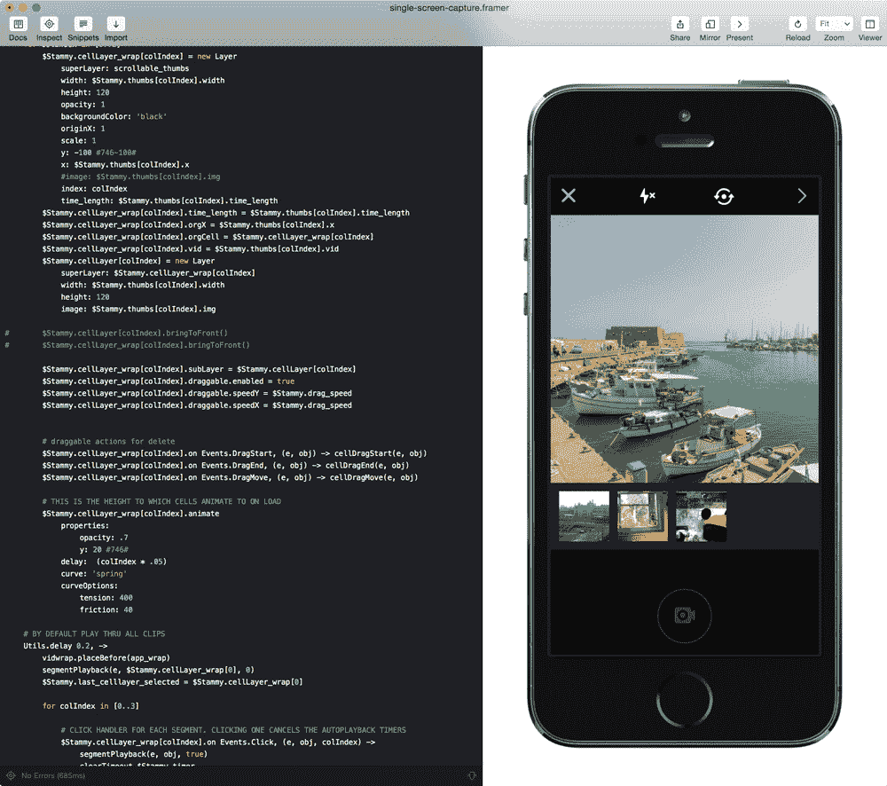
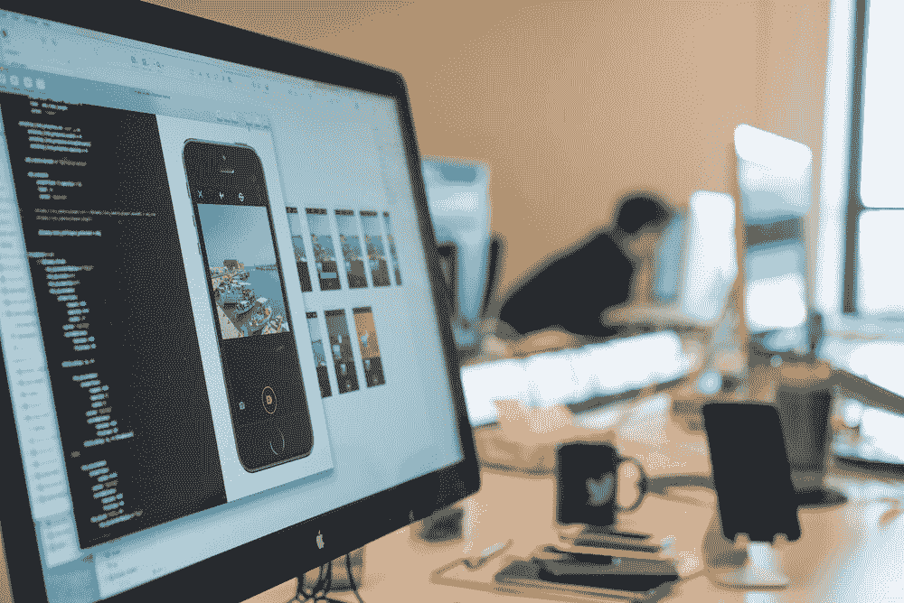
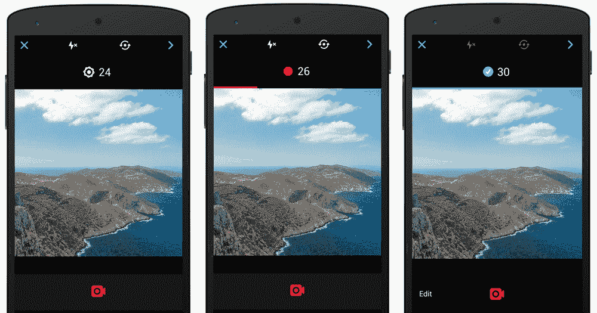
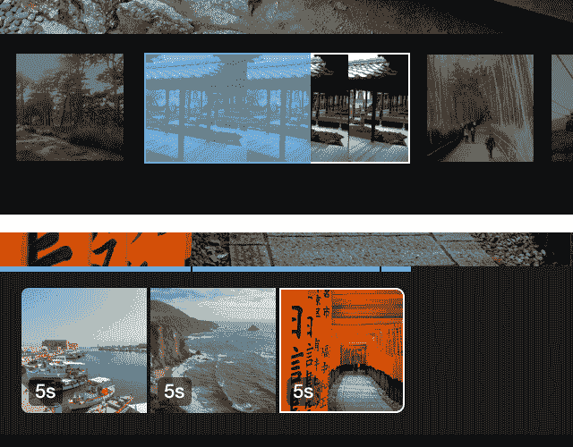
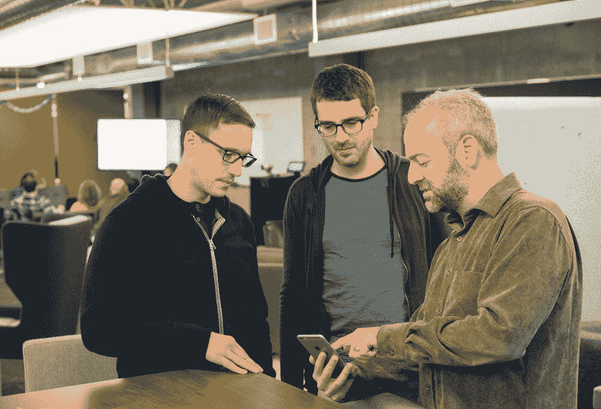

# 设计推特视频——PaulStamatiou.com

> 原文：<http://paulstamatiou.com/twitter-video/?utm_source=wanqu.co&utm_campaign=Wanqu+Daily&utm_medium=website>

# 设计 Twitter 视频

### 深入了解设计和原型制作流程

2011 年年中，Twitter 推出了原生推文照片的功能。2013 年带来了内嵌照片的媒体时间轴。2014 年迎来了多照片推文和动画 GIF 支持。我们刚刚发布了 **[Twitter 视频](https://blog.twitter.com/2015/now-on-twitter-group-direct-messages-and-mobile-video-capture "Now on Twitter: group Direct Messages and mobile video camera")** ，帮助你在 iOS 和 Android 应用中捕捉瞬间并发布视频。

我为我们能够在此版本中捕捉到的契合度和光洁度感到自豪。这是设计、产品和工程组织之间巨大合作的结果，包括分散办公室的人们(主要是[我们的西雅图办公室](https://paulstamatiou.com/photos/seattle/))。向我的产品和工程同行[乔伊·丁](http://twitter.com/yjoyding)和[杰夫·库里耶](http://twitter.com/jeff_currier)致敬。

看看【WIRED 是怎么说 Twitter 视频的。

Twitter Video on my Nexus 6 on an [M2 stand](http://www.amazon.com/gp/product/B002OLM56K/ref=as_li_tl?ie=UTF8&camp=1789&creative=390957&creativeASIN=B002OLM56K&linkCode=as2&tag=paulstamatiou-20&linkId=RSMIN3C2P3GK7V5C), with a pile of test devices behind.

> “当然，有一点是肯定的:把一个真正的原型放在你的团队面前是最好的沟通方式。”

在这篇文章中，我将先睹为快地介绍我的 Twitter 视频设计过程。这不是另一篇无聊的草图和模型迭代文章。为什么会这样？因为我们*真正*拥抱了原型设计。

你可能还记得我的文章[为运动提供意义](https://paulstamatiou.com/design-provide-meaning-with-motion/)，在那里我提出了为什么设计师需要开始考虑运动和原型的案例。大约在那个时候，我开始大量使用 Framer.js 和 [Framer Studio](http://framerjs.com/ "Framer Studio") 进行交互式移动原型开发。这个时机再好不过了。当时我一点也不知道这对我的过程有多重要。

但是这并没有止步于 JavaScript 原型。正如我将在下面更详细提到的，我还与我们新的 iOS 原型团队合作，快速探索用原生 iOS 代码构建的概念。

#### 什么是推特视频？

我工作的团队——照片和视频——隶属于我们所说的表达团队，以及其他团队，如 direct messages 和 tweet composer。我们努力积累人们表达自我所需的经验和工具。

> 对于一个公开、实时、对话和广泛分布的平台，我们需要**原生视频支持，让人们捕捉瞬间**并分享他们周围的世界。

这是我们审视这个问题的视角。

我们开始能够分享长达 **30 秒的视频**——足够长以传达重要信息，但又足够短以快速观看。我们希望非常小心地权衡额外的亲用户功能的体验。即使我们支持更长的视频，我们也不一定想让人们觉得他们需要填满它。因此，我们采用了一个简单的界面来捕捉多个视频片段，而没有填满进度条的压力。

> 让我们来看看这款产品，它在一个屏幕上很好地传达了你可以用它做什么，这令人印象深刻。更令人印象深刻的是，这一切基本上只有两个按钮:记录和发送。
> 
> WIRED

Twitter for iOS

已发布的 iOS 视频拍摄体验的一部分，记录在我的 iPhone 6+上。

<video preload="none" muted="" poster="https://turbo.paulstamatiou.com/uploads/2015/01/stammy-twitter-video-launch-ios-capture-poster.jpg"><source src="https://turbo.paulstamatiou.com/uploads/2015/01/stammy-twitter-video-launch-ios-capture.mp4">T3】</video>

我们需要从在我们的 iOS 和 Android 应用中构建一个定制摄像头开始。你只能用原生操作系统相机做这么多。现在有两个挑战——我们还需要建立一个引人注目的照片模式。同为设计师的[韦恩·范](http://twitter.com/wwayneee)在我开始考虑视频模式的时候，开始着手相机的 chrome 和照片模式。

#### 迭代次数

### 原型设计如何改变游戏？

750+ 草图实体模型

54 帧器原型

虽然一路上有大量的草图、视觉设计变化和原型，但我将展示几个主要方向。在了解了问题所在并对如何解决有了预感之后，我开始尽可能多地勾画出不同的方向，挑选出最好的，然后在原型中进行测试。Google Ventures 的设计团队谈到了类似这样的东西，叫做“理解、分歧、决定、原型和验证”冲刺。

在 Sketch 中每次迭代都达到一个好的位置后，我会转向 **Framer Studio** 。在那里，我不得不密切思考每一个互动和动画。这是暴露每个设计的一些问题的最快方法。我最近的设计会因为我在飞行中改变东西而结束在 Framer 工作室的生活。素描是一个出发点。

One of the later iterations built in Framer Studio. Lots of quick and dirty code :)

我的原型通常完全与手势、滚动、跟踪状态等交互。然而，由于我无法轻松访问电脑或设备摄像头(尽管你可以导入一个 JavaScript 库，让你在 Chrome 中访问原生摄像头...)使用的图片和视频都是伪造出来的。

虽然我喜欢鼓吹原型，但我也清楚地认识到什么时候有用，什么时候是浪费时间。当您开始需要考虑存储状态和数组操作时，原型化需要花费大量的时间，并且经常是一个不相关的技术挑战。所以，只有当我需要回答一些关于感觉如何的大问题时，我才会去做原型；正如我们的一位设计师所说，我在“我的心眼”中无法理解的事情。**我会让原型具有足够的功能来表达我的观点**，但不会花额外的一两天时间来尝试编码每一点功能。

你在为谁做原型？原型在一定程度上是为了让我对某样东西的感觉有所了解，并验证概念的交互作用。然而，他们也非常适合与所有利益相关者交流设计意图。除了给视频团队发电子邮件外，我还经常在设计评论会上向我的经理[布伦丹·多诺霍](http://twitter.com/bdonohoe)展示早期原型，征求他和其他人的想法。

> 一个原型抵得上一千次会议。

至于我为什么选择 Framer 作为我的原型开发工具:我有前端 web 开发的背景，所以我对 JavaScript 非常熟悉。我不想在构建原型的过程中遇到其他工具的限制；你几乎可以用 CSS/HTML/JS 构建任何东西。

## 迭代#1

工作到这一点是探索性的，正如我们喜欢说的“蓝天”。没有什么是不可能的。考虑的项目包括:导航、录制进度指示、摄像机中的模式切换如何工作、考虑摄像机短期和长期可扩展性需要什么功能以及考虑录制的视频片段需要什么编辑功能。

我们很早就知道的一件事是**观看肖像视频并不是一种很好的体验**。它们要么对于时间线或 tweet 细节视图来说太高，而用户没有采取行动让它们全屏显示，或者更糟的是，我们必须将视频缩小很多并将其放入邮箱。因此，我们希望阻止它，但不是不允许 Twitter 上的肖像视频。用 capture experience 录制的视频将是方形的，但人们仍然可以导入他们相机胶卷上已经有的任何纵横比的视频。

我的第一个设计有两个页面的流程:在第一个页面上记录视频，在第二个页面上回放、重新排列和删除视频片段。看起来这是通过分离关注点来解决问题的合理方法。录制模式有一个简单的蓝色进度条线，带有一个保持录制的机制。编辑页面也有这个概念，为超过 5 秒的视频片段提供*迷你电影*。这样，您可以一目了然地看到哪些数据段较长，而无需通过时间戳进行解析。

**Framer Studio

在第一个原型中，我开始考虑拥有一个快速撤销功能，甚至是按住它来倒带和删除的能力。

此时，我正在使用占位符图标，而我们的明星图标设计师[杰里米·赖斯](http://twitter.com/jeremyreiss)正在以我们标志性的 Twitter 风格制作一些图标。**  **<video preload="none" muted="" poster="https://turbo.paulstamatiou.com/uploads/2015/01/stammy-twtr-and-2-pages-retranscode-poster.jpg"><source src="https://turbo.paulstamatiou.com/uploads/2015/01/stammy-twtr-and-2-pages-retranscode.mp4">T3】</video>**  **#### 关系

此时，我已经完成了一两个设计评论。出现了一些建议。一个是在分段上放置删除“X”图标对于点击目标的大小来说有点冒险。它还需要不必要的逻辑来撤销删除，因为您很容易删除一个段。

另一个建议是将视频片段隔开，因为它们看起来不像你可以与之互动的独特元素，而且看起来太像单一的电影胶片了。

我的项目经理、EM 和我还讨论了在录制后查看录制的视频片段作为下一步工作的有用性。这是不是太亲用户了，大多数人只想快速录制一个片段并发布出去？

#### 修理

我的下一个原型解决了这些问题，用拖动删除代替了删除“X ”,我让流的下一页只是一个预览，可以选择在记录页或预览页上捕捉您的编辑意图。这样，我们会偏向于快速捕捉，而不是编辑。

Framer Studio

我开始想要强调这样一个概念，即进入编辑模式不会感觉像是一个新的页面或加载一个新的模态。它只是在同一个屏幕上添加了一些新元素。

我会开始向用户讲述如何捕捉一个片段，轻松切换到编辑模式，删除一个片段，然后继续快速录制，而不需要等待页面加载。

<video preload="none" muted="" poster="https://turbo.paulstamatiou.com/uploads/2015/01/stammy-twtr-and-2-pages-v2-retranscode-poster.jpg"><source src="https://turbo.paulstamatiou.com/uploads/2015/01/stammy-twtr-and-2-pages-v2-retranscode.mp4">T3】</video>

#### 关系

这开始感觉很好。我在另一次设计评论会上展示了这一点，并得到了一些反馈，以探索片段删除行为的其他解决方案。让垃圾桶出现在你拖动的片段上感觉有点奇怪，而且不太清楚它什么时候会删除，什么时候你可以释放它而不删除它。还有人担心这一姿态会被发现。

#### 修理

我探索了一个新的删除方向，你可以把片段拖到屏幕上出现的垃圾桶里。当垃圾桶打开，背景覆盖变成红色时，你会知道你在“删除区”。我还开始引入 NUX 工具提示，其中一个告诉人们他们可以重新排列片段或拖动它们删除。我这次用的是 iOS 原型机。

Framer Studio

大约在这个时候，Framer 开始支持原型中的视频，所以我加入了一些来自我的日本之旅的视频剪辑。

在这些早期的原型中，许多项目仍然有点夸张和太有弹性。

<video preload="none" muted="" poster="https://turbo.paulstamatiou.com/uploads/2015/01/stammy-twtr-video-ios-segmented-draft2-framer-poster.jpg"><source src="https://turbo.paulstamatiou.com/uploads/2015/01/stammy-twtr-video-ios-segmented-draft2-framer-retranscode.mp4">T3】</video>

## 迭代#2

一直以来，我都定期向团队提供设计更新，并征求反馈。我也想对技术上的可能性有一个强烈的感觉。例如，从工程的角度来看，我拥有的不需要加载新模型就能让片段在屏幕上浮动的原型乍一看似乎很有挑战性。

经过几周与工程人员的合作，我们在 iOS 上有了一个**粗糙但功能强大的录制和编辑体验。**

**The first real iOS build** early Twitter app build

真的能玩一个真的东西真是令人耳目一新！JavaScript 原型只能帮你做到这一步。

<video preload="none" muted="" poster="https://turbo.paulstamatiou.com/uploads/2015/01/stammy-twtr-ios-build-proto-poster.jpg"><source src="https://turbo.paulstamatiou.com/uploads/2015/01/stammy-twtr-ios-build-proto-retranscode.mp4">T3】</video>

#### 关系

现在我们有了真实的东西，我们开始玩它。我们向首席执行官迪克·科斯特罗展示了这一进展。

有一件事变得很清楚——在使用它的时候没有好的反馈感。罪魁祸首是进度条。有 30 秒的时间限制，那个东西移动*非常*慢，它不能加强你在记录。它还有一个副作用，就是鼓励用户加油，或者更糟，让他们觉得他们*需要*来加油。

进度条不是理想解决方案的另一个原因是技术性的:相机需要一段时间才能真正开始记录。我们需要告诉用户有事情发生了，但是我们还没有完全记录下来。这主要是安卓系统的问题。相机需要一段时间才能在 Android 上开始录制。就一秒钟。当你想记录什么的时候，一秒钟感觉像是永远。

当你按下录音按钮时，它周围的圆圈缩小了，这也于事无补。后来它被改变了，所以它会变大，即使你的拇指放在上面也能看得见。

#### 修理

我花了一些时间探索进度条的替代品。从动画图形和其他视觉表现到计时器，我大概经历了大约 40 次迭代。在探索过程中，我会与团队分享模拟和简单的原型视频。我的工程经理杰夫会坦率地向西雅图办公室的人展示它们，并发送反馈。

一种变化包括当相机准备记录时的某种动画图形，然后是递增计时器和脉冲记录红点。在最后的 5 秒钟里，一条红线会在屏幕上增长，以提供一种紧迫感，并表明你快没时间了。** 

 **

I avoided displaying a check mark when you hit the time limit as I didn't want to encourage recording for the entire duration.

当我们设计和构建这个功能时，我们总是在谈论最初的使命:帮助人们**捕捉瞬间**。对话变成了“如果你真正想要的时刻不是在那 30 秒结束之前呢？”我们讨论了允许人们录制超过 30 秒的想法。我们可以让人们无限地记录下来，然后再删减，或者只保留最后的 30 秒。

最后，这变得越来越复杂，令人毛骨悚然。按照竞争标准，30 秒实际上是一段很长的时间，我们在这里有点忘乎所以了。**简化**。

Framer Studio

虽然仍然是两个页面的流程(捕获，然后预览/编辑)，但进度条的删除使它感觉比以前非常慢的进度条反应更快。

但这仍然不太对。

<video preload="none" muted="" poster="https://turbo.paulstamatiou.com/uploads/2015/01/stammy-twtr-ios-timer-proto-poster.jpg"><source src="https://turbo.paulstamatiou.com/uploads/2015/01/stammy-twtr-ios-timer-proto-retranscode.mp4">T3】</video>

#### 关系

去掉进度条解决了我们之前的一些问题，但是在修补了这个原型和随后的真实 iOS 版本之后，我和团队开始感觉到一些新的问题。在录制了一些视频片段后，除了增加一个数字之外，你并不觉得自己真的完成了很多。我们想要更多的视觉反馈。计时器本身并不令人愉快。

你知道什么是令人愉快的吗？在录制的同时，在同一个屏幕上看到您刚刚录制的片段。我们质疑通过隐藏用户编辑意图背后的视频片段来简化界面的初衷。现在我们有理由让它们浮出水面了。如果您还记得迭代#1，我希望片段像在同一页面上一样加载，当用户点击编辑按钮时没有新的模态转换。

我们对这个想法研究了一段时间。最大的问题是，在相机取景器的同一页上看到视频片段缩略图可能会觉得太忙，分散了对主要任务(录制)的注意力。人们可能会花更多的时间摆弄回放和编辑工具，然后我们会看到成功的视频推文的转化率较低。

在 design crit 上，我们讨论了能够在同一个视图上切换回放和录制的优点。我认为有第二页主要是为了预览你刚刚录制的视频是多余的，如果你想看，你只需点击一个片段。这将消除对第二页的需要。

让团队开始构建这个未经验证的 UI 是非常危险的。工程成本相当高。**原型拯救**。

#### 修理

大约在这个时候，我开始与来自 **Twitter iOS 原型团队**的[阿维·西普林斯基](https://twitter.com/sf_avi)和[大卫·哈特](https://twitter.com/iamdavidhart)密切合作。我不能夸大这两个大大加快了我们的设计探索，验证和执行的步伐。他们不仅仅是工程师或有设计头脑的工程师；我认为他们是设计师。那是非常难得的。他们不仅知道动画曲线、弹簧、手势和计算机视觉，还在内部编写了自己的动画框架。

在他们的帮助下，前一天的“如果”,第二天就变成了可运行的原生 iOS 原型。我会带着一些想法来找他们，告诉他们我是如何处理交互问题的，他们会自己探索，并在构建中快速尝试许多方法。

Avi 和我正在讨论我最新的计时器迭代，以及如何将片段合并到屏幕上。我们反复讨论了每个片段的第一帧在你按下的第二秒显示出来的想法，这样你就可以立即得到屏幕上弹出的东西的满足感，并显示你的录制状态。

第二天，我路过 Avi 的桌子，看到他更进一步:自动播放，循环播放你录制的单个片段。

iOS prototype

视频中有一点错误(忽略蓝色的播放进度覆盖)，但在我看来这是一个令人印象深刻的概念证明。

<video preload="none" muted="" poster="https://turbo.paulstamatiou.com/uploads/2015/01/stammy-twtr-avi-video-autoloop-proto-retranscode-poster.jpg"><source src="https://turbo.paulstamatiou.com/uploads/2015/01/stammy-twtr-avi-video-autoloop-proto-retranscode.mp4">T3】</video>

## 迭代#3

看到 Avi 的原型让我着迷。我意识到自动播放、循环播放视频片段是一种挑战(性能！我怀疑它是否能在所有设备上运行良好，肯定不是 Android ),但看到我刚刚录制的内容的即时反馈令人振奋。

Avi 把这个版本放在我的手机上，我四处向人们展示并获得反馈。在这一点上，在任何人正式开始研究一个新方向之前，我已经从我们的工程团队那里争取了一些时间来探索这个新概念。我需要验证它，并确保它解决了我们所有的问题，并彻底思考了 UX 问题。

杰夫·库里耶同样被这个原型迷住了。在看到它后的几天里，他一直提到他认为这是一个更好的解决方案。我开始向前迈进，做 UX 尽职调查:

*   找出一个更好的放置计时器的地方，因为这必须在 iPhone 4 上工作。
*   仔细考虑回放将如何工作以及所有相关的逻辑。
*   如果我们不能足够快地从新片段中获得帧，想出一种显示录制进度的方法。Android 上的情况肯定是这样。

Framer Studio

在这个原型中，我有一个占位符的概念，当你开始录制时，它会自动出现在屏幕上。即使我们不能立即显示第一帧，屏幕上也会立即出现一些东西，让你知道它正在工作。

我把脉冲记录点放在那里，让你知道它正在记录那个片段。通常的模式是将记录点与定时药丸配对，我将定时药丸放在视频的顶部。

<video preload="none" muted="" poster="https://turbo.paulstamatiou.com/uploads/2015/01/stammy-twtr-video-iteration-3-poster.jpg"><source src="https://turbo.paulstamatiou.com/uploads/2015/01/stammy-twtr-video-iteration-3.mov">T3】</video>

## 研究和可用性测试

现在，我们想揭示人们在视频捕捉体验中可能遇到的任何挑战。来自我们可爱的研究团队的 Dave Dearman 将人们带到 Twitter 办公室，向他们展示 Twitter 视频捕捉原型，看看他们如何使用它，并提出问题。

在任何可用性测试开始之前，我们需要想出一些问题来问参与者。特别是，他们需要提供实际的答案，并提供一种方法来构建他们与我们的应用程序的交互。乔伊和我与戴夫一起集思广益。我们的目标是获得他们对体验的反馈，并了解他们在我们向 Twitter 发布媒体的过程中遇到的挑战。

唯一的问题？**我们离真正的视频捕捉用户界面还远着呢**。

再次进入 iOS 原型团队。Avi 和 David 构建了一个完全伪造的应用程序。人们无法分辨其中的区别。我提供了将在可用性研究中显示的其他屏幕的真实资产和模拟，我们让 Dave 准备好如何指导人们完成这项工作。

Dave Dearman 首先询问每个研究参与者更多关于他们自己和他们的兴趣，以及他们如何在其他服务上分享媒体，以了解 Twitter 如何融入他们的整个媒体分享流程，以及他们何时想到使用 Twitter 来分享以及为什么。在展示应用程序时，他非常善于让人们敞开心扉，提供坦诚的反馈，比如说“这不是我做的，你不会伤害我的感情的”。

原型的某些部分不起作用，所以 Dave 会问这样的问题:“假设你想删除一个剪辑。在不接触应用程序的情况下，你能给我演示一下如何删除一个剪辑吗？”

观看可用性研究令人大开眼界，尤其是当你自己的设计成为主题的时候。我在西雅图的办公室里，一边看着戴夫在旧金山的直播，一边做着大量的笔记，写下引语。

**Things learned**

*   当看到多个片段并被问及当他们点击完成时会发生什么时，一些参与者认为它只会添加高亮显示的片段。设计是你录制的每个片段都是一个作品的一部分。
*   通过展示较长片段的迷你电影，人们有点困惑，认为他们可以修剪或分割片段。当他们意识到事实并非如此时，他们变得沮丧起来。迪克在之前的一次会议上也指出了这一点。
*   每个人都知道如何打开相机，切换到视频模式，知道保持记录 UI 是如何工作的(当你没有保持足够长的时间时会出现工具提示),并且定时器变红意味着他们几乎没有时间了。
*   当被问及他们认为我们的时间限制是多长时，甚至在我们让他们使用该功能之前，一些人猜测是 30 秒。
*   原型也没有内置重新排序或删除片段的功能，但当被问及如何工作时，大多数人说了一些将它拖出片段栏的话。一个人将你如何在 iOS 应用切换器中杀死应用进行了类比。

#### 修理

我们需要让每个视频片段感觉像是更大整体的一部分。此时，我已经在每个片段的顶部显示了蓝色的回放进度。尽管视频片段从一个片段自动播放到下一个片段，但不幸的是，只在一个片段上有进展强化了你必须选择一个片段来发布的观念。

我移动到一个全局播放进度条，显示整个视频合成的进度。如果你有 4 个等长的线段，点击第二个线段，进度条将从 25%的宽度开始。Avi 和 Dave 还建议在这一行添加小记号，以便在提供全局播放进度的同时，给出您所在片段的概念。

Twitter for iOS

我们推出的播放体验。隐藏的专业提示:你可以在视频的任何地方左右滑动来控制全局播放位置。

<video preload="none" muted="" poster="https://turbo.paulstamatiou.com/uploads/2015/01/stammy-twitter-video-launch-ios-playback-poster.jpg"><source src="https://turbo.paulstamatiou.com/uploads/2015/01/stammy-twitter-video-launch-ios-playback.mp4">T3】</video>

我们还试图通过简单地将片段拉近，并只对第一个和最后一个片段进行圆角处理，来解决片段感觉过于个性化的问题。David Hart 为此做了一个很棒的原型(后来为它写了产品代码),当你移动或举起片段时，圆角会产生动画效果。当你在举起一个片段的时候把作品分开，我们把每一个新的部分的角弄圆。

可用性修复的最后一个值得注意的地方是删除了我的长视频片段的迷你电影。虽然我认为这是查看剪辑长度的一个漂亮而优雅的解决方案，并使你拍摄的东西更加清晰，但人们只是觉得它令人困惑。我们去掉了这一点，并放置了小的时间戳标记，当您进入回放模式时，这些标记会淡入。

> 细节不是细节。他们进行设计。
> 
> Charles Eames

我对这个设计方向很满意，可用性会议没有发现任何障碍。

在这一点上，新设计完全是一个原型。目前真正的 Twitter 版本是带有计时器的旧设计，带有用于预览和编辑视频的第二个页面。可用性会议帮助团队中的每个人验证了这个概念，并解决了我们遇到的大部分问题。

Jeff、Joy 和我与团队一起做了一些工程成本计算——详细检查设计，了解开发需要多少时间——然后向 Dick 和运营委员会展示新的设计和时间表，征求他们的意见。他们喜欢它，我们继续朝着这个方向前进。

通过这个复杂的设计-原型-验证的迭代过程，我们突破了第一个版本中所能提供的极限——不再有 MVP。我们会说，如果绝对必要的话，我们可以**削减范围，但绝不牺牲质量**来满足最后期限。

Dave, Avi and our VP of Design [Mike Davidson](http://twitter.com/mikeindustries) talking gesture physics. Design crit in the back.

当我们开始调整构建来使用这个新的单页 UI 时，我们会不断地在各种设备上进行测试。正是在这里，我很快注意到我们不能使用相同的视频片段缩略图大小。例如，在 iPhone 6+上保持一个适合 iPhone 4 的尺寸看起来很荒谬。我列出了三种我觉得在各种设备上看起来不错的尺寸，我们将根据设备自适应地使用正确的尺寸(50dp、70dp 和 90dp 段)。

#### 与工程配对

当设计师谈论制作规格并把它们交给工程部门时，我很恼火。“制定规格”的过程意味着在开发时没有与工程同行的对话。虽然我有技术背景，但我远不如 Twitter 的工程师，所以我利用这个机会与他们密切合作，了解更多关于我们的 iOS 和 Android 代码库，事情是如何构建的，并确定什么是可行的。

我只会通过问一些简单的问题来知道什么是可能的，比如“你如何做一个 EaseIn 或 EaseOut”以及“有没有可能指定它的因子，比如得到一个二次方程？”对于这些小任务，我发现自己做起来更容易，在报告之前，修改一些值，找到看起来最好的。这比让工程人员为您提供使用不同值的各种构建供您测试要快得多，尤其是在我们分散的办公室与工程师一起工作时。

对于更大的改变，我会试着让整个团队都参与到设计中来。这很难；设计师有一种自然的倾向，在作品完全烤熟之前不想展示。然而，你最不想做的事情就是去你的设计洞穴呆上几个星期，用那些由于这样或那样的技术原因而无法实际建造的设计震惊你的团队。

我会尽可能详细地描述 JIRA 门票中的动画。例如，早期我问我们如何在 Android 上做一个微妙的反弹效果。我了解到，我们没有像在 iOS 上那样的自定义动画框架，但 [Gordon Luk](http://twitter.com/getluky) 向我展示了一些基本的 Android 插值器，如 OvershootInterpolator，这是朝着正确方向迈出的一步。

我们也有能力在我们的 iOS 版本中设置可以动态调整的参数，再次感谢 Avi 和 Dave 对他们的动画框架所做的工作。例如，在基于 iOS 制作快门环弹簧时， [Dave](https://twitter.com/iamdavidhart) 向 [Gary Morrison](http://twitter.com/kamiro) 展示了如何用框架实现它，然后使用他的自定义参数化框架对它进行参数化。

然后，我拉出并构建了他的代码，并能够在我玩这个应用程序的时候在里面调整弹簧值，比如`Magnification`、`NaturalFrequency`和`DampingRatio`。在找到我一直在寻找的微妙反弹之后，我自己将更改提交给了 iOS 存储库。

**我开始在 iOS 和 Android 代码库中发现许多我可以修复的设计问题**。我开始在应用程序中寻找任何一个值会立即改变或者线性变化的地方。从在`UIView animateWithDuration`动画块中包装不透明度变化和指定缓和曲线，到花了一个深夜与[耀西](http://twitter.com/niw)一起编码来重构一些代码，以便我可以根据设备自适应地改变 iOS 上的录制点大小(就像我们改变视频片段的缩略图大小)。

在我们启动的时候，我已经完成了大约 10 次提交，并被合并到 master 中。我对工程过程有了新的认识，对代码审查的严谨性有了新的认识，对工程师们等待每个版本编译的痛苦有了新的理解。

在项目的这一点上，我的日常工作从[草图](http://bohemiancoding.com/sketch/)和[框架工作室](http://framerjs.com/ "Framer Studio")的工作转移到每天测试几个新的构建，提供详细的反馈，同时坚持不懈地提出新的设计问题和错误。

新的构建将来自不同的工程师，他们处理不同的标签，从[克里斯](https://twitter.com/cjburrows)完成他实现缩放动画的一些 iOS 导入工作，到验证[帕布罗](http://twitter.com/pablojamar)实现视频片段时间戳徽章。

#### Dogfood

我们的一个重大里程碑是我们能够让员工访问 Twitter 视频。当你让成千上万的人开始使用你的功能时，你会发现漏洞...包括一些绝对疯狂的虫子。像“轻按模式切换器 20 次，屏幕变黑”和“当我用一个手指开始录制，另一个手指开始拖动之前录制的片段时，应用程序崩溃。”

随着 Joy 的发布越来越近，Jeff 和我会召开每日会议，对剩余的任务、新的 bug 进行分类，并相应地进行优先级排序。

我们养成了在 JIRA 上添加一个验证标签的习惯，我每天早上都会运行这个标签，直到我在最新的夜间构建中检查了它，才认为标签完成了。这通常包括截图和测量，或者截屏来帮助记录错误(我经常录制截屏来浏览动画)。我们还与 QA 密切合作，寻找各种设备上的问题。

很难说明这种紧张的工程师配对、构建测试和票证跟踪过程对看到设计按预期实现有多重要。

#### 结束了

如果没有从一开始就将原型融入我的设计过程，并与我们才华横溢的工程团队密切合作，设计和制作 Twitter 视频是不可能的。看到世界各地的人们开始使用并享受你所做的东西，这是一件令人惊奇的事情。这绝对是我喜欢在 Twitter 工作的一个原因。

虽然这篇博客文章只讨论了视频捕捉体验的设计和迭代，但我也在从事其他项目，如 iOS 和 Android 导入修剪页面、NUX 工具提示，以及与其他设计师合作，如媒体上传者 UX 的乔恩·贝尔。

**iOS trimmer** Framer Studio

即使像修剪器这样简单的东西也需要做出一系列的设计和产品决策。例如，我们只预选 20 秒而不是 30 秒，以鼓励更短的视频。我们选择从视频的结尾开始，因为我们的数据显示，大多数人过早开始录制，并希望保留后面的部分。

当达到 30 秒的限制时，夹爪会暂停一小会儿，然后继续移动并随之移动整个选区。虽然我们想过让它做一些像撞墙一样的事情，只有当你再次尝试时才会移动。还有更多需要考虑的，比如放大电影胶片的动画。

<video preload="none" muted="" poster="https://turbo.paulstamatiou.com/uploads/2015/01/stammy-twtr-ios-trim-retranscode-poster.jpg"><source src="https://turbo.paulstamatiou.com/uploads/2015/01/stammy-twtr-ios-trim-retranscode.mp4">T3】</video>

#### 推特在招人！

这就是我在推特上做的事情。在设计团队中，还有更多类似这样的挑战。如果你对视觉设计、原型快速迭代和与工程师密切合作感兴趣，看看我们的职业列表[。](https://about.twitter.com/careers/teams/design-and-ux-research)

<time class="date published" datetime="2015-02-02 17:00:00 +0000">Published 02 Feb 2015</time>**