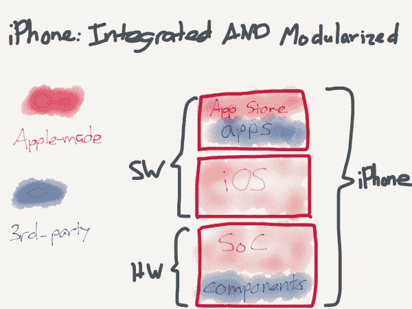
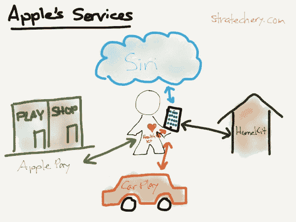
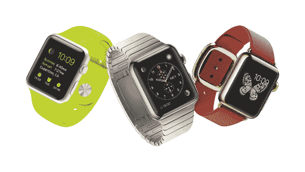

# 苹果的新市场——本·汤普森的战略

> 原文：<https://stratechery.com/2015/apples-new-market/?utm_source=wanqu.co&utm_campaign=Wanqu+Daily&utm_medium=website>

或许没有什么比低端产品的颠覆和 iPhone 不可避免的厄运更能引起本博客的强烈反对了。现在很难想象，但当我在 2013 年创办 Stratechery 时，传统观点认为，随着 Android 设备变得越来越“足够好”,价格只有原来的一半，苹果已经达到了顶峰，这一切都归功于它们的模块化。集成的 iPhone 很快将不得不降低价格，或者开始不可避免的衰落——很可能两者兼而有之。然而，事实上，在过去的这个季度里，iPhone 不仅销量大幅增长，而且平均售价上涨了令人难以置信的 50 美元。

老实说，尽管我很想说我预测到了这种增长，但我以前的论文——最著名的是《克莱顿·克里斯滕森错在哪里》——更关心的是认为 iPhone 不会崩溃，克里斯滕森似乎仍然相信这一结局。摘自去年秋天对[商业内幕](http://www.businessinsider.com/clay-christensen-defends-disruption-theory-2014-10)的采访:

> 在一个行业生命的早期，几乎所有的主导产品都是专有的，并且在架构上相互依赖。在智能手机领域，第一个是诺基亚——极度相互依赖的架构——然后是 RIM，这是一个更加极度相互依赖的架构，然后是苹果。而苹果则处于中间位置。在设备内部，它是专有的，但它开创了模块化，因为你可以开发应用程序并把它们放进去。但是就像 IBM 确定了 PC 的模块化一样，谷歌给了我们 Android。现在，我认为 Android 操作系统作为一个平台，模块化，占了大约 90%的份额，尽管苹果公司赚取了所有的利润。
> 
> 因此，如果苹果继续保持高价策略，他们的市场份额将会减少。所以最终他们会在 100 个单位上赚很多钱。而三星，如果他们赢了，他们将生产这个行业所有的产品，但没有利润。无论哪种方式，你都完蛋了，但这就是我为什么说苹果不会成功背后的理论，因为最终模块化总是会赢。

我对这一论点的反对意见是，克里斯滕森的模型只适用于买方不是用户的企业对企业市场；另一方面，在消费者市场中，市场不是铁板一块的，一些细分市场关心并愿意为用户体验的某些方面付费，这些方面无法衡量，但只能通过集成的体验来提供。

我确实[仍然认为这个批评是正确的](http://stratechery.com/2015/bad-assumptions/)，但是我也相信有三个额外的因素需要考虑:

*   iPhone——以及所有现代苹果产品[1](#fn1-1437 "By “modern” Apple I mean Apple since Steve Jobs’ return")——远比看起来更加模块化。了解苹果整合到哪里以及为什么整合是至关重要的
*   苹果正在创造一个全新的服务类别，融合了集成和模块化
*   iPhone 竞争的市场大得难以想象——事实上，比智能手机市场大得多

我将依次探讨每一个问题，并解释为什么苹果不仅能保持其地位，而且事实上还能继续增长。

#### iPhone 是集成和模块化的混合体

当关于集成和模块化的讨论被归结为谁制造操作系统的问题时，我总是感到困惑。毕竟，集成和模块化的思想传统上与工业生产和供应链有关。例如，亨利·福特为了满足对他的 T 型车的需求，垂直整合到该公司在巴西拥有橡胶种植园以提供轮胎原料的地步；通用汽车通过更加模块化的方法，允许更多的定制和不同水平的质量，在一定程度上抢了福特的风头。

从这个角度来看——从硬件角度来看 iPhone 相当模块化。苹果有 785 个不同的供应商，虽然不是所有的供应商都为 iPhone 做贡献，但绝大多数都这样做，制造从螺丝到内存再到 T2 相机镜头组件的所有东西。事实上，虽然我不知道三星供应链中有多少供应商，但我敢打赌，它的*比 iPhone 的*少，原因很简单，因为三星本身就是一个零部件制造商。换句话说，从纯硬件角度来看，比苹果更一体化的是三星。

当然，最明显的例外是 2010 年 iPad 首次推出的 A 系列片上系统。然而，回过头来看，这是一个证明规则的例外:在处理器的设计中，苹果可以最好地利用他们制造在芯片上运行的软件这一事实，提高性能，延长电池寿命，并实现触控 ID 等关键技术。这些都是客户直接体验到的*(在触控 ID 的情况下，实际上是直接接触到的)；这就是苹果整合的地方。*

在软件方面，克里斯滕森完全正确地认为，iPhone 凭借 App Store 实现了模块化。应用程序是 iPhone 软件体验的组成部分(对开发者来说，可悲的是，同样被商品化了)；尽管如此，苹果还是通过应用商店和应用审查控制了尽可能多的客户体验点。这类似于 iTunes 商店的安排(尽管没有评论):在苹果控制的包装中有效地无限制选择。

结果是 iPhone 堆栈看起来像这样:

Apple products have many modular components wrapped inside an integrated experience

数百个组件，数百万个应用程序，数千万首歌曲和视频，所有这些都包含在苹果控制的体验中。

#### 重新定义服务

在我绘制的 iPhone 堆栈中没有 iCloud，这是一个令人惊讶的遗漏，因为蒂姆·库克已经开始提到苹果不仅集成硬件和软件，还集成服务的能力。

事实上，我认为 iCloud 是苹果服务产品中最不有趣——也最不重要——的一个方面，我想该公司也同意这一点。请注意 iCloud 的功能有多少变得*不那么*差异化，而不是更多:试图将 iCloud 集成到苹果数据 API 的 iCloud Core Data 已经被放弃，转而支持 CloudKit，这是一种相当通用的产品，类似于开发人员可能从 AWS 或微软 Azure 获得的产品。类似地，iCloud Drive 与 Dropbox 并没有什么不同——每个应用程序的集成都消失了。

而且，你并不真的需要使用 iCloud 才能获得完整的 iPhone 体验；你可以用谷歌或微软管理你的电子邮件、联系人和日历，大多数主要应用程序，如脸书或推特，只是他们公司云应用程序的接口。诚然，iCloud 可以做“查找我的 iPhone”之类的事情，但 iCloud 绝不是对 iPhone 的长期预后特别乐观的理由。

问题在于这种对服务的狭隘定义，这是我在《小米的雄心》中第一次提到的:

> 写小米已经有点老生常谈了……他们以成本价或接近成本价销售智能手机，并将通过服务赚钱。围绕小米 1 的许多评论的问题在于确定这些“服务”到底是什么。简单的假设是传统的互联网服务，如谷歌提供的服务，包括应用商店、在线门户等等。不过，这很难证实 450 亿美元的估值…
> 
> 相反，理解小米以及它们为什么如此有价值的方法是更深入地理解雷军所说的“服务”是什么，以及最终为什么小米实际上很像苹果。

在那篇文章中，我得出结论，小米正在寻求围绕家庭创建一个完整的生态系统；诚然，智能手机的利润率可能很低，但通过将从空气净化器到可穿戴设备再到电视的一切都整合到小米智能手机层 MiUI 中，小米既可以增加智能手机的粘性，又可以通过向整整一代人销售产品赚很多钱，这一代人既经济上进入了中产阶级，又实际上进入了自己的家。

然而，苹果公司也在做同样的事情，但是有着更大的野心:他们希望 iPhone 不仅仅是你家的重要部分，而是你生活的几乎每一个方面，为此，该公司正在建立五项基础服务:

*   HomeKit 是苹果的物联网解决方案，鉴于苹果客户的可支配收入和强烈偏好，我预计苹果在这里会比其他任何人都更受欢迎(小米是一个例外，主要是因为他们自己建造——或资助公司建造——一切)。你家里的一切，都由你的 iPhone 控制
*   CarPlay 是不言自明的:美国人尤其花大量时间在通勤上，苹果正试图让你的 iPhone 成为你在车上体验的中心
*   Apple Pay 是面向全世界的；我们在家庭之外的大多数互动都是基于金钱的转手，Apple Pay 正在寻求成为默认机制。我看好它的机会
*   Siri 代表云中的信息和一切:通过你的 iPhone，你可以找到任何问题的答案，只需提问
*   最后，HealthKit 可能是最深刻的，因为它是关于与你自己的身体互动并跟踪你自己的身体。一个服务没有比这更粘的了

这五项服务将 iPhone 的重要性延伸到您日常生活的几乎每一个方面:

Apple’s services are extending the iPhone’s impact to every part of our lives

不过，请注意，这些服务都遵循与苹果用于 iPhone 本身的模式相似的模式:苹果没有为 HomeKit 创造家具，为 CarPlay 创造汽车，为 Apple Pay 创造银行或零售商，也没有为 Siri 创造信息服务。相反，他们以一种模块化的方式让市场来决定；唯一的集成是苹果层和你的 iPhone 之间的实际交互。

可以肯定的是，苹果在这些领域的成功并不确定，尤其是苹果正在与谷歌竞争的 Siri。然而，iPhone 是苹果的王牌，正如库克在昨天的高盛技术和互联网大会上解释的那样:

> 我们已经将 iOS 扩展到你的汽车、你的家庭、你的健康。所有这些都是你生活中非常重要的部分，我们都不想在生活的不同部分拥有不同的平台。我们想要一种无缝的生活。我认为这对我们的未来意义重大。不是每天都可以种植那么多基础技术的。

#### 苹果的新市场

克里斯滕森[之前解释过](http://www.newyorker.com/reporting/2012/05/14/120514fa_fact_macfarquhar)他误解了 iPhone，因为它是对笔记本电脑的破坏，而不是手机。然而，这并不特别有意义，因为全球智能手机市场远远超过了笔记本电脑，尽管个人电脑没有增长，但它们仍然存在。相反，正如我在[过时的](http://stratechery.com/2013/obsoletive/)中所说，iPhone 让手机的旧观念过时了:它只是电脑上另一个适合你放在口袋里的应用程序。

这比地球上几乎每个人都将很快拥有一部智能手机的事实更有意义。回想一下史蒂夫·乔布斯在描述了骑自行车的人比秃鹰更有效率之后是如何描述计算机的: [3](#fn3-1437 "I’ve discussed Jobs’ bicycle of the mind analogy previously <a href="http://stratechery.com/2014/face-future/">here</a> ")

> 我们人类是工具的制造者，我们可以制造工具，将我们拥有的这些能力放大到惊人的程度。所以对我来说，电脑一直是思想的自行车。

那辆自行车现在无论我们走到哪里都带在身边；苹果正在建设的是新的道路。

在这方面，假设克里斯滕森是对的:也许从长远来看，苹果做的一切都将是模块化的。然而，如果模块化在一个成熟市场胜出，那就意味着——正如克里斯滕森所说——集成在一个新市场胜出。一个新的市场正是 iPhone 的发展方向:苹果即将完全抛弃狭义的智能手机市场，转而涉足消费者生活的方方面面。而且，如果集成体验的重要性对你的手机比对你的电脑更重要，因为你用得更多，那么触及你生活每个细节的集成体验又有多重要呢？

[T2】](https://i0.wp.com/stratechery.com/wp-content/uploads/2015/02/AplWatch-Hero-Tumble-PRINT.png)

### *相关*