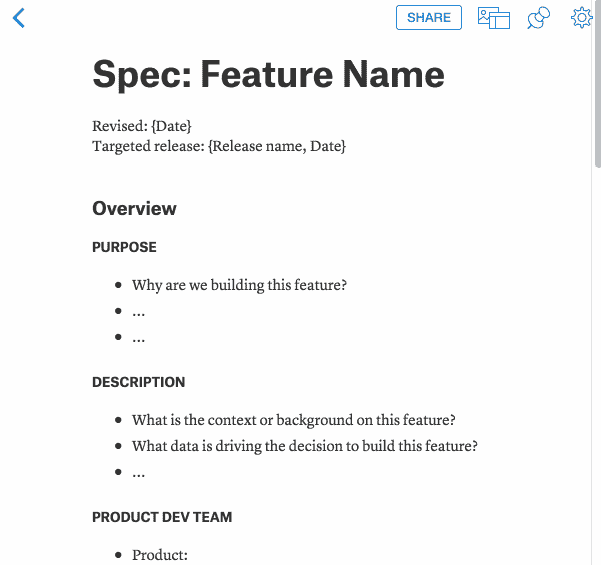
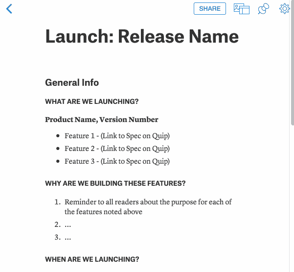

# Quip -创建连接:产品开发之路

> 原文：<https://quip.com/blog/path?utm_source=wanqu.co&utm_campaign=Wanqu+Daily&utm_medium=website>

## 创造联系:产品开发的路径

亚当·范·福森

Path 是一家技术公司，致力于拉近您与您最关心的人之间的距离。这不仅反映在他们的产品中，也反映在他们创造的协作工作文化中。我们与 Path 产品团队的 Cynthia、Nate 和 Libby 坐在一起，详细了解他们的产品开发方法以及他们如何在日常生活中使用 Quip。

Path 有两个核心产品:[Path](https://itunes.apple.com/us/app/path/id403639508?mt=8)——一个为你和你最亲密的朋友和家人提供的优雅的社交网络，以及[Path Talk](https://itunes.apple.com/us/app/path-talk/id867760913?mt=8)——一个能够与人和地方(如餐馆和商店)进行智能和私人通信的消息应用。你可以在[应用商店](https://itunes.apple.com/us/artist/path-inc./id403639511)或 [Play 商店](https://play.google.com/store/apps/details?id=com.path&hl=en)免费下载这两款应用。

在 Path，功能是在一个鼓励开放和协作的头脑风暴的环境中概念化的。产品团队相信伟大的想法可以来自任何地方，所以他们每周举行一次“开放办公时间”这样任何人都可以来讨论一个功能或产品的想法。走廊对话成为功能，或者工程师将他们一直想要构建的想法原型化，并在下一个版本中结束，这也并不罕见。

Quip 也是 Path 管理开放但有组织的产品流程的重要组成部分。在 Quip 之前，Path 团队已经尝试了许多不同的产品来帮助他们宣传路线图，制定产品规格，并组织产品发布。Quip 使 Path 简化了他们用于实时通信的工具数量，Quip 是他们的 wiki /生产力套件，红笔用于讨论模拟。整个公司组织在 Quip 上的一个共享文件夹中，他们将 Quip 称为他们当前正在进行的一切以及所有过去的发布和项目的“真理之源”。

## 有重点、有条理的路线图

所有正在进行的工作的记录计划——无论是产品的规格、设计团队的模型、工程团队的原型，还是即将发布的产品——都是 Path 的路线图。

即使 Path 有开放的想法流，仍然需要将所有潜在的功能削减到一个优先列表中。当决定哪些特性要优先考虑，以及它们何时应该包含在一个版本中时，公司的基本战略远景被仔细考虑。Nate 解释道:“当我们考虑产品流程时，有几件事对我们非常重要。客户反馈发挥着巨大的作用，正如[努力和影响矩阵](https://www.tuzzit.com/en/canvas/impact_effort_prioritisation_matrix)一样。我们喜欢权衡构建一个功能所需的资源量，以及它对使用我们产品的人的重要性和它对我们关键指标的影响。”

这种努力和影响的平衡也与工程资源一起考虑，“我们与工程一起工作，问‘如果我们要建造这些东西，需要多少时间？’。我们以“天、周、月”来评估努力的程度。Nate 继续说道，“并不是所有的事情都是高影响力/低工作量的，但是这些项目将会移动到路线图的顶部。“这一思考过程反映在产品团队的顶层路线图文档中。路线图文档以协作式 Quip 电子表格的形式存在，并按版本进行组织。当前正在开发的版本位于路线图文档的顶部，下面是下一个版本(以及下一个版本)。文档中概述了每个功能的关键信息，包括谁在项目中工作，需要什么资源，以及基本文档的链接。

该团队最近发布了一个重要的新更新， [Path 4.3 和 Talk 1.3.1](http://blog.path.com/post/112066835412/path-4-3-and-talk-1-3-1-are-here-and-its) 。这一版本包括以更多方式使用贴纸的能力(如在照片上)，快速分享来自无数应用程序的照片，等等。产品团队向我们展示了该版本的规划过程，并展示了他们如何制定路线图，编写产品规格，以及在几个团队之间协调发布。

## 记录发生的功能开发

概念化产品特性有不同的方法。在 Path，创意可以真正来自任何地方。“我们有三个不同的团队致力于产品开发:设计、工程和产品。Nate 解释道:“设计师建造模型，工程师建造原型。"但是产品经理通常用文字和数字来表达他们自己——所以有些特性是从规格开始的."

不管一个特性的想法是如何产生的，它都不可避免地会被产品经理以正式规范的形式记录下来。这个团队有一个有组织的方法来编写规格说明书，随着特性的发展而发展。规范成为产品、设计和工程团队的真理来源。

规格的模板已经被产品团队通过经验磨练出来了。它通常在顶部包含最重要的信息:特性是什么，谁参与其中，目标是什么，以及预计会影响哪些指标。该规范还包含到模型、会议记录和下一版本特性信息的链接。

如果你想亲自尝试一下 Path 的模板，可以看看这个[装备文档](https://quip.com/zGeaAEnPKm2p)。要复制模板，请单击文档右上角的齿轮菜单，然后选择“复制”。它会在你的 Quip 桌面上复制一份。

为了执行这些项目，产品和工程将每个功能分解成任务，并分配人员来完成它们。这些努力的最终结果是一个版本的发布。

## 协调跨多个团队的发布

在 Path，也使用 Quip 计划和执行发射。该团队构建了一个模板“启动文档”，其中包含所有适当的部分，以创建一个有组织且高效的启动。“虽然规范面向设计、工程和产品团队，但发布文档面向公司的外部，”Nate 解释道。“这是一个记录营销、公关、法律、客户支持的计划——每个人都拥有产品发布的一部分。”

该文档用作所有参与面向客户的发布的团队的中心位置。营销团队撰写消息和应用描述，公关团队撰写博客文章，社交媒体团队为他们的各种渠道制定内容计划。查看这个模板来了解 Path 是如何组织这个文档的。你可以复制一份到你的 Quip 桌面上，亲自尝试一下。

最重要的是，该文件还包含了发布日的战术时间表。辛西娅解释道，“每一分钟都很重要。我们使用启动清单来@-提及负责特定任务的每个人。这是为了协调——这是我们工作的一大部分。”有了所有团队的参与，发布会有最大的机会产生影响，并公平对待所有精心制作发布版的辛勤工作。

## 各部分的总和

Path 使用 Quip 帮助运营他们的公司已经一年多了。在这一点上，Quip 不仅是 Path 当前最重要事件的真实来源，也是过去发布和讨论的历史档案。随着时间的推移，Quip 已经不仅仅是一个简单的写文档和一起工作的地方，也是一个团队可以集中所有信息的 wiki 过去的和现在的。

如果你想更多地了解你的团队如何使用 Quip，[给我们写封短信](mailto:sales@quip.com)。

