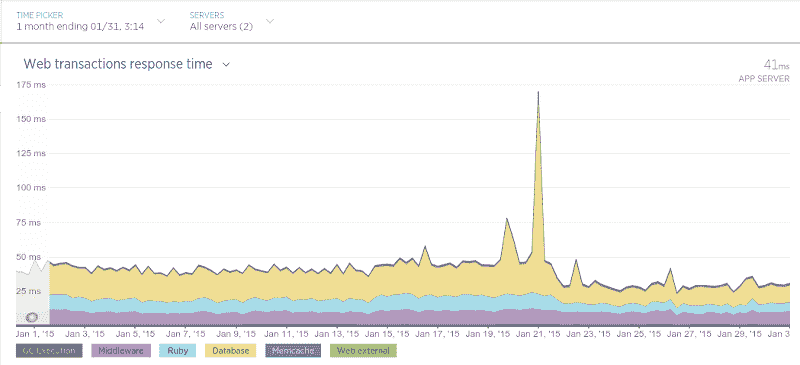
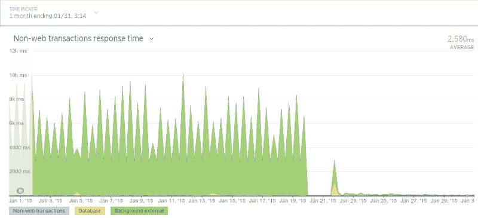
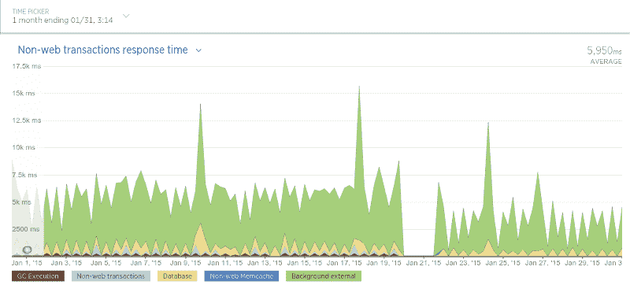
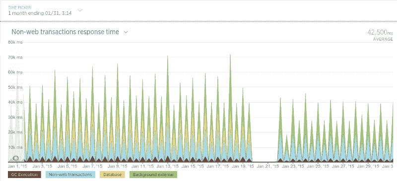

# 再见 MongoDB，你好 PostgreSQL | Olery 开发者门户

> 原文：<http://developer.olery.com/blog/goodbye-mongodb-hello-postgresql/?utm_source=wanqu.co&utm_campaign=Wanqu+Daily&utm_medium=website>


Olery 成立于大约 5 年前。随着时间的推移，由 Ruby 开发机构开发的单一产品已经发展成为一系列不同的产品和许多不同的应用程序。今天，我们不仅拥有产品的声誉，还拥有 [Olery Feedback](http://www.olery.com/feedback/) 、[酒店评论数据 API](http://www.olery.com/api/) 、 [widgets](http://developer.olery.com/api/widgets/) 可以嵌入网站，在不久的将来还会有更多的产品/服务。

在申请数量方面，我们也有了相当大的增长。今天，我们部署了超过 25 个不同的应用程序(都是 Ruby)，其中一些是 web 应用程序(Rails 或 Sinatra)，但大多数是后台处理应用程序。

虽然我们可以为迄今为止所取得的成就感到非常自豪，但总有一些东西潜伏在暗处:我们的主数据库。从 Olery 开始，我们就有了一个数据库设置，涉及 MySQL 来存储关键数据(用户、合同等)，以及 MongoDB 来存储评论和类似的数据(本质上是在数据丢失的情况下我们可以轻松检索的数据)。虽然这种设置最初为我们提供了很好的服务，但随着我们的发展，我们开始遇到各种问题，尤其是 MongoDB。这些问题有些是由于应用程序与数据库交互的方式，有些是由于数据库本身。

例如，有时我们必须从 MongoDB 中删除大约一百万个文档，然后再重新插入它们。这个过程的结果是数据库在几个小时内几乎完全被锁定，导致性能下降。直到我们执行了一次数据库修复(使用 MongoDB 的 [repairDatabase](http://docs.mongodb.org/manual/reference/command/repairDatabase/) 命令)。由于数据库的大小，修复本身也需要几个小时才能完成。

在另一个实例中，我们注意到应用程序的性能下降，并设法追踪到我们的 MongoDB 集群。然而，经过进一步检查，我们无法找到问题的真正原因。无论我们安装什么样的指标、使用什么样的工具或运行什么样的命令，我们都找不到原因。直到我们更换了集群的主服务器，性能才恢复正常。

这只是两个例子，随着时间的推移，我们已经有了很多这样的案例。这里的核心问题不仅仅是我们的数据库出了问题，而且无论我们什么时候查看，都没有任何迹象表明是什么导致了这个问题。

## 无模式的问题

我们面临的另一个核心问题是 MongoDB(或任何其他无模式存储引擎)的基本特性之一:缺乏模式。缺少模式听起来可能很有趣，在某些情况下，它肯定有它的好处。然而，对于许多人来说，使用无模式存储引擎会导致隐式模式的问题。这些模式不是由您的存储引擎定义的，而是基于应用程序行为和预期定义的。

例如，您可能有一个`pages`集合，其中您的应用程序期望一个类型为`string`的`title`字段。虽然没有明确定义，但是这个模式在这里非常明显。如果数据的结构随着时间的推移而改变，*尤其是*如果旧数据没有迁移到新的结构中(这在无模式存储引擎中是很成问题的)。例如，假设您有以下 Ruby 代码:

```
#!ruby
post_slug = post.title.downcase.gsub(/\W+/, '-') 
```

这将适用于每一个具有返回`String`的`title`字段的文档。这对于使用不同字段名(如`post_title`)或没有类似标题的字段的文档来说是无效的。要处理这种情况，您需要如下调整代码:

```
#!ruby
if post.title
  post_slug = post.title.downcase.gsub(/\W+/, '-')
else
  # ...
end 
```

另一种处理方法是在模型中定义一个模式。例如， [Mongoid](http://mongoid.org/en/mongoid/index.html) ，一个流行的用于 Ruby 的 MongoDB ODM，就可以让你这么做。然而，当使用这样的工具定义模式时，人们应该想知道为什么它们不在数据库本身中定义模式。这样做可以解决另一个问题:可重用性。如果您只有一个应用程序，那么在代码中定义一个模式并没有什么大不了的。然而，当您有几十个应用程序时，这很快就会变成一个大混乱。

无模式存储引擎有望通过消除对模式的担忧而使您的生活变得更加轻松。实际上，这些系统只是让你自己负责确保数据的一致性。在某些情况下，这可能行得通，但我敢打赌，对大多数人来说，这只会适得其反。

## 良好数据库的要求

这让我想到了一个好的数据库的要求，更具体地说是 Olery 的要求。对于系统，尤其是数据库，我们重视以下几点:

1.  一致性。
2.  数据和系统行为的可见性。
3.  正确性和明确性。
4.  可扩展性。

一致性很重要，因为它有助于为系统设定清晰的预期。如果数据总是以某种方式存储，那么使用这些数据的系统就会变得简单得多。如果某个字段在数据库级别是必需的，那么应用程序不需要检查这样的字段是否存在。一个数据库还应该能够保证某些操作的完成，即使是在高压下。没有什么比插入数据几分钟后才出现更令人沮丧的了。

可见性适用于两件事:系统本身和从中获取数据的难易程度。如果系统运行不正常，应该很容易调试。反过来，如果用户想要查询数据，这应该也很容易。

正确性意味着系统的行为符合预期。如果某个字段被定义为一个数值，就不能在该字段中插入文本。MySQL 在这方面是出了名的糟糕，因为它让你这样做，结果你可能得到伪造的数据。

可伸缩性不仅适用于性能，还适用于财务方面以及系统处理不断变化的需求的能力。一个系统可能表现得非常好，但不是以大量的金钱为代价，也不是以减缓依赖它的系统的开发周期为代价。

## 远离 MongoDB

考虑到上述价值，我们开始寻找 MongoDB 的替代品。上面提到的值通常是传统 RDBMS 的核心特性，所以我们着眼于两个候选:MySQL 和 PostgreSQL。

MySQL 是第一候选，因为我们已经用它来处理一些小块的关键数据。然而，MySQL 也不是没有问题。例如，当定义一个字段为`int(11)`时，你可以愉快地插入文本数据，MySQL 将*尝试*转换它。一些例子:

```
mysql> create table example ( `number` int(11) not null );
Query OK, 0 rows affected (0.08 sec)

mysql> insert into example (number) values (10);
Query OK, 1 row affected (0.08 sec)

mysql> insert into example (number) values ('wat');
Query OK, 1 row affected, 1 warning (0.10 sec)

mysql> insert into example (number) values ('what is this 10 nonsense');
Query OK, 1 row affected, 1 warning (0.14 sec)

mysql> insert into example (number) values ('10 a');
Query OK, 1 row affected, 1 warning (0.09 sec)

mysql> select * from example;
+--------+
| number |
+--------+
|     10 |
|      0 |
|      0 |
|     10 |
+--------+
4 rows in set (0.00 sec) 
```

值得注意的是，在这些情况下，MySQL *将*发出警告。然而，由于警告仅仅是警告，它们经常(如果不是几乎总是)被忽略。

MySQL 的另一个问题是，任何表的修改(例如，添加一列)都会导致表被锁定，不允许*读写*。这意味着*任何使用这种表的*操作都必须等到修改完成。对于包含大量数据的表，这可能需要几个小时才能完成，可能会导致应用程序停机。这导致 SoundCloud 等公司开发工具，如 [lhm](https://github.com/soundcloud/lhm) 来处理这个问题。

考虑到以上情况，我们开始研究 PostgreSQL。PostgreSQL 做了很多 MySQL 做不到的事情。例如，您不能将文本数据插入数值字段:

```
olery_development=# create table example ( number int not null );
CREATE TABLE

olery_development=# insert into example (number) values (10);
INSERT 0 1

olery_development=# insert into example (number) values ('wat');
ERROR:  invalid input syntax for integer: "wat"
LINE 1: insert into example (number) values ('wat');
                                             ^
olery_development=# insert into example (number) values ('what is this 10 nonsense');
ERROR:  invalid input syntax for integer: "what is this 10 nonsense"
LINE 1: insert into example (number) values ('what is this 10 nonsen...
                                             ^
olery_development=# insert into example (number) values ('10 a');
ERROR:  invalid input syntax for integer: "10 a"
LINE 1: insert into example (number) values ('10 a'); 
```

PostgreSQL 还能够以各种方式*改变表，而不需要*为每次操作锁定表。例如，添加一个没有默认值并且可以设置为`NULL`的列可以很快完成，而不需要锁定整个表。

PostgreSQL 中还有各种其他有趣的特性，例如:基于三元模型的索引和搜索、全文搜索、对查询 JSON 的支持、对查询/存储键值对的支持、发布/订阅支持等等。

最重要的是，PostgreSQL 在性能、可靠性、正确性和一致性之间取得了平衡。

## 转移到 PostgreSQL

最后，我们决定用 PostgreSQL 在我们关心的各种主题之间提供平衡。将整个平台从 MongoDB 迁移到一个完全不同的数据库的过程并不容易。为了简化过渡过程，我们将该过程分为大约 3 个步骤:

1.  设置一个 PostgreSQL 数据库并迁移一小部分数据。
2.  更新所有依赖 MongoDB 的应用程序，改为使用 PostgreSQL，以及支持这一点所需的任何重构。
3.  将生产数据迁移到新数据库并部署新平台。

### 迁移子集

在我们考虑迁移所有数据之前，我们需要使用最终数据的一小部分进行测试。如果你知道即使一小块数据也会给你带来很多麻烦，那么迁移是没有意义的。

虽然现有的工具可以处理这种情况，但我们也必须转换一些数据(例如，字段被重命名、类型不同等)，因此必须为此编写我们自己的工具。这些工具大部分是一次性的 Ruby 脚本，每个脚本执行特定的任务，比如移动评论、清理编码、纠正主键序列等等。

最初的测试阶段没有发现任何可能阻碍迁移过程的问题，尽管我们的数据的某些部分存在一些问题。例如，某些用户提交的内容并不总是正确编码的，因此如果不先清理就无法导入。另一个有趣的变化是将评论的语言名称从全名(“荷兰语”、“英语”等)改为语言代码，因为我们新的情感分析堆栈使用语言代码而不是全名。

### 更新应用程序

到目前为止，大部分时间都花在了更新应用程序上，尤其是那些严重依赖 MongoDB 聚合框架的应用程序。加入一些低测试覆盖率的遗留 Rails 应用程序，你就有了几周的工作价值。更新这些应用程序的过程基本如下:

1.  用 PostgreSQL 相关代码替换 MongoDB 驱动程序/模型设置代码
2.  运行测试
3.  修正一些测试
4.  再次运行测试，冲洗并重复，直到所有测试通过

对于非 Rails 应用程序，我们决定使用 [Sequel](http://sequel.jeremyevans.net/) ，而对于 Rails 应用程序，我们坚持使用 ActiveRecord(至少目前是这样)。Sequel 是一个非常棒的数据库工具包，支持我们可能想要使用的大多数(如果不是全部)PostgreSQL 特定特性。与 ActiveRecord 相比，它的查询构建 DSL 也*强大得多*，尽管它有时可能有点冗长。

例如，假设您想计算有多少用户使用某个区域设置以及每个区域设置的百分比(相对于整个集合)。在纯 SQL 中，这样的查询可能如下所示:

```
#!sql
SELECT locale,
count(*) AS amount,
(count(*) / sum(count(*)) OVER ()) * 100.0 AS percentage

FROM users

GROUP BY locale
ORDER BY percentage DESC; 
```

在我们的例子中，这会产生以下输出(当使用 PostgreSQL 命令行接口时):

```
 locale | amount |        percentage
--------+--------+--------------------------
 en     |   2779 | 85.193133047210300429000
 nl     |    386 | 11.833231146535867566000
 it     |     40 |  1.226241569589209074000
 de     |     25 |  0.766400980993255671000
 ru     |     17 |  0.521152667075413857000
        |      7 |  0.214592274678111588000
 fr     |      4 |  0.122624156958920907000
 ja     |      1 |  0.030656039239730227000
 ar-AE  |      1 |  0.030656039239730227000
 eng    |      1 |  0.030656039239730227000
 zh-CN  |      1 |  0.030656039239730227000
(11 rows) 
```

Sequel 允许您使用普通的 Ruby *编写上面的查询，而不需要字符串片段(ActiveRecord 经常需要):*

```
#!ruby
star = Sequel.lit('*')

User.select(:locale)
    .select_append { count(star).as(:amount) }
    .select_append { ((count(star) / sum(count(star)).over) * 100.0).as(:percentage) }
    .group(:locale)
    .order(Sequel.desc(:percentage)) 
```

如果你不喜欢使用`Sequel.lit('*')`，你也可以使用下面的语法:

```
#!ruby
User.select(:locale)
    .select_append { count(users.*).as(:amount) }
    .select_append { ((count(users.*) / sum(count(users.*)).over) * 100.0).as(:percentage) }
    .group(:locale)
    .order(Sequel.desc(:percentage)) 
```

虽然这两个查询可能有点冗长，但可以更容易地重用它们的一部分，*不必求助于字符串连接。*

将来我们也可能将我们的 Rails 应用程序转移到 Sequel 上，但考虑到 Rails 与 ActiveRecord 紧密耦合，我们还不完全确定这是否值得花费时间和精力。

### 迁移生产数据

这最终将我们带到了迁移生产数据的过程。基本上有两种方法可以做到这一点:

1.  关闭整个平台，并在所有数据完成迁移后将其重新联机。
2.  在保持运行的同时迁移数据。

选项 1 有一个明显的缺点:停机。另一方面，选项 2 不需要停机，但可能很难处理。例如，在这种设置中，您必须考虑到在迁移数据时添加的任何数据，否则您会丢失数据。

幸运的是，Olery 有一个相当独特的设置，对我们数据库的大多数写操作只是以相当有规律的间隔发生。与我们的审查数据相比，*更改更频繁的数据(例如用户和合同信息)是相当少量的数据，这意味着迁移所需的时间要少得多。*

这一部分的基本流程是:

1.  迁移关键数据，如用户、合同，基本上是我们不能以任何方式丢失的所有数据。
2.  迁移不太重要的数据(我们可以重新收集、重新计算等的数据)。
3.  在一组独立的服务器上测试一切是否正常运行。
4.  将生产环境切换到这些新服务器。
5.  重新迁移步骤 1 中的数据，确保同时创建的数据不会丢失。

第二步耗时最长，大约 24 小时。另一方面，迁移步骤 1 和 5 中提到的数据只需要大约 45 分钟。

## 结论

自从我们完成迁移到现在已经快一个月了，到目前为止我们非常满意。到目前为止，这种影响是积极的，在各种情况下，甚至导致我们的应用程序的性能大幅提高。例如，由于迁移，我们的[酒店评论数据 API](http://www.olery.com/api/) (运行在 Sinatra 上)的响应时间比以前更短:



迁移发生在 1 月 21 日，高峰只是应用程序执行硬重启(导致过程中响应时间稍慢)。21 日之后，平均响应时间几乎减少了一半。

我们看到性能大幅提升的另一个例子是我们称之为“持续审查”的例子。这个应用程序(作为守护进程运行)有一个非常简单的目的:保存评论数据(评论、评论评级等)。虽然我们最终为迁移对这个应用程序做了一些相当大的更改，但结果非常令人满意:



我们的铲运机也变得更快了:



这种差异并不像使用 review persister 那样极端，但是因为抓取器只使用数据库来检查是否存在一个评审(一个相对快速的操作)，所以这并不奇怪。

最后是调度抓取过程的应用程序(简称为“调度程序”):



因为调度程序只在特定的时间间隔运行，所以图表有点难以理解，但是迁移后平均处理时间明显下降。

最后，我们对目前的结果非常满意，我们当然不会错过 MongoDB。性能非常好，围绕它的工具在比较中使其他数据库相形见绌，并且与 MongoDB 相比，查询数据更加令人愉快(特别是对于非开发人员)。虽然我们确实有一个服务( [Olery Feedback](http://www.olery.com/feedback/) )仍在使用 MongoDB(尽管是一个独立的、相当小的集群)，但我们打算将来也将其迁移到 PostgreSQL。

