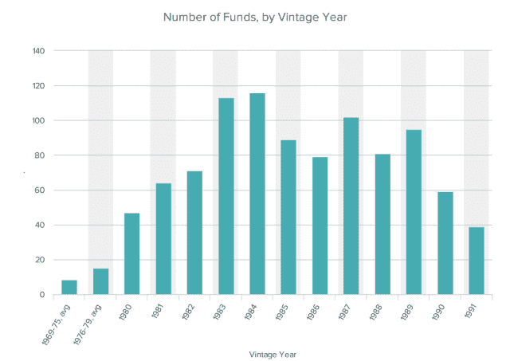
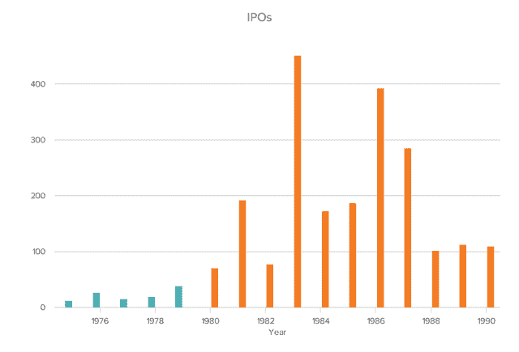
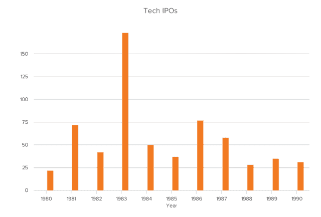
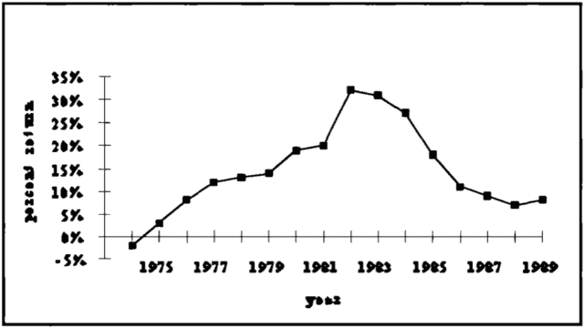
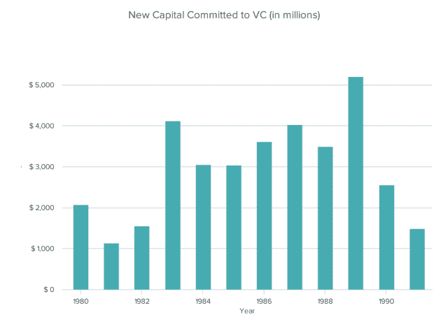
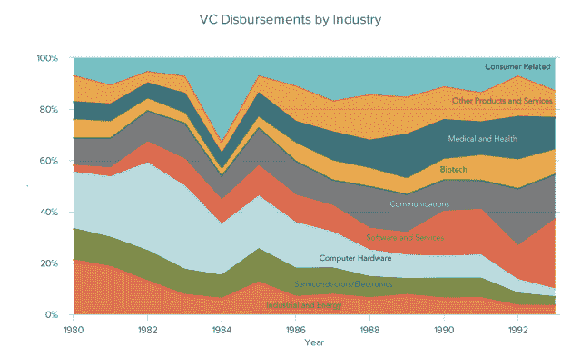
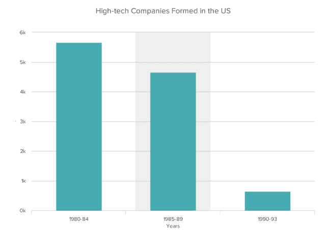
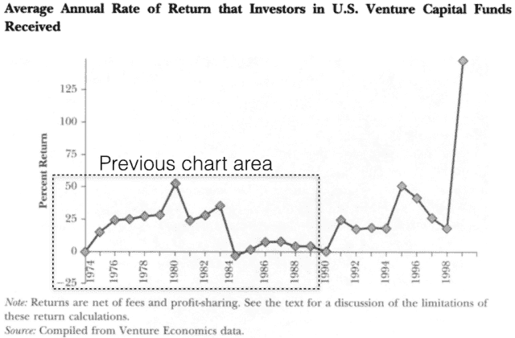
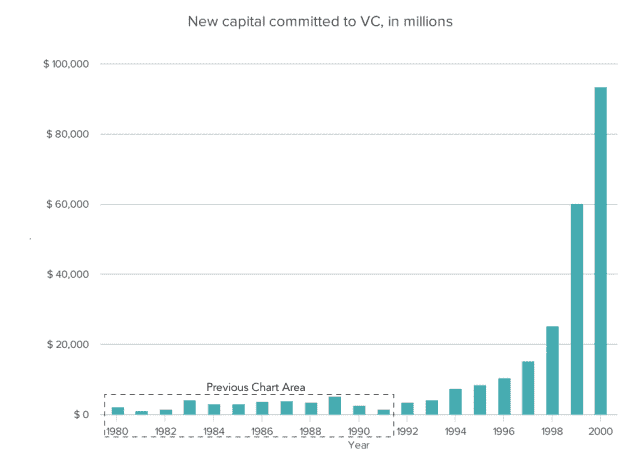
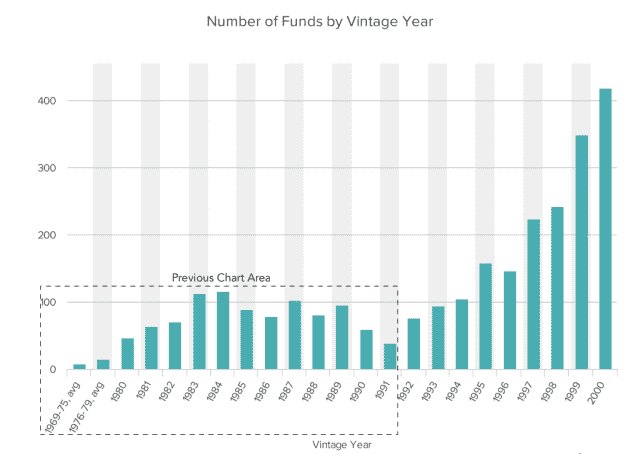

# 热寂:20 世纪 80 年代的风险投资|反应轮

> 原文：<http://reactionwheel.net/2015/01/80s-vc.html?utm_source=wanqu.co&utm_campaign=Wanqu+Daily&utm_medium=website>

历史在重演人们认为迟早会有泡沫。“现在？”他们不断地问，“现在是泡沫吗？”好像历史必须重复上一次最难忘的事情。历史可能会重演，但这个特殊的风险投资周期可能会重复很多历史。下面是 20 世纪 80 年代风险投资的简短历史，我对 90 年代和今天的解释和比较，以及对这意味着什么的一些想法。它很长。如果你注意力不集中，跳到“80 年代对 90 年代”，大概五分之四的地方。

**到 1980 年**

> 宝贝，宝贝开着凯迪拉克来了，我说，“上帝啊，你从哪儿弄来的那辆凯迪拉克？”

> 冲突，1979 年。

卡特时代是艰难的。

他们开始时很好。从 1973-1975 年的衰退中复苏，失业率下降，收入增加。但这一切都被通胀的回归所抵消。到 1980 年，通胀达到顶峰，失业率上升，利率达到二战以来的最高水平，生产率增长放缓，商业投资下降。恐惧统治了市场，一场“信任危机”统治了人民。

风险投资在 20 世纪 70 年代有一个不同的轨迹:直到 1978 年几乎没有，然后突然，它起飞了。

> 风险投资目前令人兴奋的成功的原因之一是像伯尔(Burr，Egan，Deleage 的克雷格·伯尔)和克罗宁(Ampersand Associates 的丹·克罗宁)这样的人在 70 年代中期停滞不前时学到的良好判断力。1972 年到 1978 年这段时间也许有一天会作为风险投资在沙漠中的岁月而被铭记。在经历了 60 年代末令人兴奋的青春期后，1968-69 年的牛市黯然失色，随之而来的是支撑风险业务的新发行市场，风险业务几乎从公众视野中消失。(公司杂志，“十亿美元的赌博”，1981 年 9 月 1 日)

20 世纪 60 年代和 70 年代的先驱们找到了一个成功的公式:建立一个巨大的网络来寻找机会，花几个月的时间来了解管理团队并进行尽职调查，在尽可能早的阶段进行投资，努力帮助创始人组建合适的团队并建立合作关系，只有当公司准备好上市时才上市。结果是，尽管 IPO 市场实际上已经消失，但标志性的风投支持的公司还是进入了这个市场。1976 年 Cray 和 Tandem，1978 年 Evans & Sutherland 和 Federal Express，1980 年 Apple 和 Genentech。里根时代看起来很有希望。

**加速的宇宙，1980-1983
T2】**

> 永远不为钱，永远为爱…
> 我想这一定就是那个地方。

> 说话的头，1983 年。

到了 1981 年，经济上的胜利者欢呼着说，80 年代将是“企业家的十年”

> 回想 20 世纪 60 年代末，这意味着相当大的繁荣。虽然最终数字尚未统计出来，但在大量风险资本的双重吸引下，以及电子和基因工程领域两家前风险公司苹果电脑公司(Apple Computer Inc .)和基因泰克公司(Genentech)令人眼花缭乱的上市首日表现，1980 年成立的高科技公司数量大约是 1979 年的两倍。(《华尔街日报》，1981 年 3 月 18 日，“风险资本家涌入支持新兴高科技公司”)。)

追逐这些交易的资金如此之多，以至于风险资本家们都在相互竞争。他们花精力推销自己，而不是筛选交易。变得很傻。 [1](#fn1-923 "Unattributed quote, Wall Street Journal, “Venture Capitalists Rush in to Back Emerging High-Technology Firms”, 3/18/1981.")

自从 1978 年法规的改变允许养老基金认为风险投资是一种“谨慎的”投资以来，资金一直在涌入风险投资。1977 年风险资本公司管理的 25 亿美元到 1983 年翻了五倍，达到 120 亿美元。 [2](#fn2-923 "“Venture Capital Industry Resources,” Venture Capital Journal (July 1984), pp. 4-6\. Cited in Bygrave & Timmons, p. 165") 五年来，每年投入的新资金增加了 16 倍，从 1978 年的 2 . 18 亿美元增加到 1983 年的 36 亿美元。T5 3T7】风险基金的数量从 1980 年的 47 家，增长到 1982 年的 71 家，再到 1983 年的 113 家。专业投资者的数量几乎增加了两倍，从 1977 年的 597 人增加到 1983 年的 1494 人。

Source: Thomson Reuters, 2008 Investment Benchmarks Report: Venture Capital

经济开始好转。卡特于 1979 年任命的新任美联储主席保罗·沃克尔采取了一项政治上不受欢迎的举措，即在 1981 年中期将利率提高到 20%，以对抗通货膨胀。这很痛苦，但很有效:到 1983 年，滞胀的十年结束了。IPO 市场迎来了自 1969 年以来最大的一年。一位卡特任命的官员兑现了里根的承诺:美国又是早晨了。

风险投资变得更有竞争力，也更昂贵。尤金·克莱纳在《华尔街日报》的一篇文章中说:“我们做决定的时间更少了，过去你只有两三个月的时间。现在是几周甚至几天的问题，因为如果我们不这样做，其他人也会这样做。”在公司的生命周期中，风险投资家开始更早地投资，试图避免竞争性条款清单。

> 如今，风险资本家越来越多地为新公司的诞生提供资金。过去，典型的风险投资公司只有在亲戚和负责人向企业投入几十万美元或更多资金后，并且只有在公司的产品开发进展顺利后，才会提供资金。但现在，年轻公司的价值增长如此之快，以至于在传统阶段投资的风险资本家往往无法获得他们通常要求的五到十倍的利润。(《华尔街日报》，“为了增加利润，风险资本公司更早地投资于新生企业”，1983 年 10 月 31 日。)

融资的后期变得非常拥挤，所以最好的机会是带着种子资金进来，或者甚至在公司有商业计划之前就投资。 [5](#fn5-923 "Wall Street Journal, “To Increase Profits, Venture-Capital Firms are Investing Earlier in Fledgling Concerns”, 10/31/1983.")

初创公司的价格上涨。《华尔街日报》在 1981 年称:“这些公司的价格比去年的首轮融资高出 20%至 100%。有些人把价格上涨归因于缺乏经验。

> 新来者高估新公司价值的倾向导致了最近一些交易规模的急剧上升……一些资深人士放弃了潜在的交易，因为他们担心参与交易的其他风险投资家的能力。(《华尔街日报》，“风险企业缺乏有经验的人”，1983 年 12 月 8 日。)

1983 年，几乎三分之二的风险资本家在五年前还没有涉足这个行业，他们几乎没有风险投资经验。然而，每家公司管理的资本总额平均翻了一番，从 1977 年的 400 万美元增加到 1983 年的 800 万美元。

这个行业一半的人只有两年的经验。“这根本不够。”

## —克里斯·艾尔，梅里尔，皮卡德，安德森&艾尔出版社，1983 年 12 月 [7](#fn7-923 "Wall Street Journal, “Venture Firms Lack People of Experience”, 12/8/1983.")

因此，1983 年的 IPO 窗口是天赐良机。安进、Biogen、LSI、Apollo、Compaq、Lotus Development、Businessland、Trilogy、Stratus、Paychex、凯龙星和许多其他风险投资支持的公司在 1983 年上市，远远超过以前的任何一年。行业民间传说报道每年的投资回报率在 30-50%之间。 [8](#fn8-923 "Bygrave, William and Jeffrey Timmons, <a href="http://www.amazon.com/gp/product/0875843042/ref=as_li_tl?ie=UTF8&camp=1789&creative=390957&creativeASIN=0875843042&linkCode=as2&tag=reacwhee-20&linkId=62UVPLW3LECC4A5J">Venture Capital at the Crossroads</a>, 1992, p. 149\. Although out of print, this book remains one of the best books on venture capital. You can buy it used on Amazon for as little as $4.") 这是风险投资的分水岭一年。

很自然，这就是事情开始出错的时候。

**热死，1984-1992
T2】**

> 我的大厅里有垃圾，我的地方被撕裂了
> 我又坏了一个扩音器，我打电话请病假
> 这是一首超级电台的真空颂歌
> 白日梦国度里的白日梦

> 音速青年，1988 年。

科技股的牛市是短暂的。1984 年，《华尔街日报》指出

> 对许多基金经理和个人投资者来说，“高”和“技术”仍然是一对四个字母的单词。他们记得 1982 年和 1983 年的高科技泡沫，当时无限的市盈率司空见惯，任何以“onics”结尾的股票都被超额认购。他们还记得 1984 年的高科技崩盘，以及华尔街上下痛苦的尖叫。(《华尔街日报》，1984 年 11 月 13 日，“高科技公司再次开始冒一度繁荣的首次公开募股市场的风险”。)

这不是泡沫。正如《华尔街日报》在 1981 年指出的那样，价格曾短暂上涨，然后下跌:

> 自五年前风险资本开始繁荣以来，高科技融资的各个阶段的价格首次下跌。风险资金仍然充裕，一些年轻公司的私人市场价值也在持续上升。然而，总的来说，风险投资者为交易支付的费用比一年前减少了 20%;对于没有兑现承诺的公司，价格下降了 50%或更多。(《华尔街日报》，1984 年 5 月 4 日，“风险资本家投资高科技公司的报酬更低”。)

1984 年，公司突然发现上市又变得困难了。

Source: data compiled by [Prof. Jay Ritter, Univ. of Florida](http://bear.warrington.ufl.edu/ritter/ipodata.htm)

1986 年稍好一些，微软、甲骨文、Sun、Adobe 和赛普拉斯半导体等公司利用了这一机会，但此后 IPO 市场再次陷入低迷。1983 年，科技股首次公开募股达到 173 股的峰值，此后 12 年都不会再达到这个水平。

Source: data compiled by [Prof. Jay Ritter, Univ. of Florida](http://bear.warrington.ufl.edu/ritter/ipodata.htm)

风险回报开始下降。从 1982 年和 1983 年约 30%的中间 IRRs 峰值开始，IRRs 一路下滑至 1988 年的约 8%。

Source: Gompers, “Rise and Fall”, op cit.

下降完全归因于最近筹集的资金。1980 年募集的基金回报在 1983 年达到顶峰，累计回报率接近 20%(1980 年以前的基金表现更好。)1981 年是可敬的。但 1982 年及以后筹集的资金显示，整个 80 年代的早期回报都很糟糕。

Source: Thompson Reuters, 2008 Investment Benchmarks Report: Venture Capital

观察家们开始指责:通常是风险资本家出价太高，或者是缺乏经验的风险投资家。

支付过高是一个显而易见的解释。交易竞争的加剧可能导致价格上涨和回报下降。但是 80 年代早期的高价格不能解释后来年份的低回报，所以这只能是部分原因。

人们也很容易相信新来者可能还不是很好的投资者，他们需要一些时间来学习如何做好投资。但低回报并不仅限于新风投:首次风险投资基金和后续基金的回报显示，新手和有经验的人都产生了类似的惨淡结果。 [9](#fn9-923 "During the 1980s. It’s interesting to note that for post-1990s-vintage venture funds there is a bias towards experience: follow-on funds vastly outperformed first-time funds in the period 1990-1999\. Thompson Reuters, <em>2008 Investment Benchmarks Report: Venture Capital</em>, figure 3.011.")

较新的风险投资基金的糟糕表现反映了上市公司的减少，一些公司被迫以低价上市。[10](#fn10-923 "Wall Street Journal, “Recent Venture Funds Perform Poorly as Unrealistic Expectations Wear Off”, 11/8/1988.")T3】

不过，新基金经理有一个独特的问题。在募集新基金之前，他们需要证明自己能够赚到有限合伙人的钱。他们需要出口。一些观察家称，新的风险投资公司在“哗众取宠”:通过过早退出，尤其是通过首次公开募股，展示他们的退出能力。通过强迫他们的公司在准备好之前上市，他们以次优的 IPO 告终。这不仅伤害了相关的风险投资公司，也给其他希望上市的公司泼了一盆冷水。

在繁荣时期,“风险投资看起来是一项非常容易的业务”,但“风险投资从来都不是一项容易的业务”。要创建一个持久的企业，有许多令人心痛的事情和许多难题需要解决。”

## — Charles Lea，1984 年 12 月[【12】](#fn12-923 "Wall Street Journal, “Venture Capitalists are Assuming Growing Roles in Firms They Fund”, 12/27/1984.")

但事后看来，最大的问题是，那些在 80 年代初创造了最佳回报的行业不再有所作为。投资者争先恐后，押注于任何有证据表明能够成为成功企业的想法，不管它是不是技术。

计算机硬件的繁荣已经悄悄地结束了，因为每个类别都有一个架构。例如，在 IBM 于 1981 年发布个人电脑后不久，个人电脑硬件竞争的基础就从产品创新转移到了制造和营销效率上。几十家试图定义个人电脑的公司被削减到只有几家试图以更低的价格向特定市场销售速度稍快、体积更小的电脑。从苹果这样的个人电脑设计创新者，创业活动转移到了戴尔和 Gateway 这样的高效制造商和营销商。就像之前的大型机和小型机行业一样，工作站市场紧随其后，PC 硬件行业也从激进创新转向了渐进式创新。

因此，到 1984 年 1 月，投资者已经从硬件转向软件。

> 计算机软件公司目前正吸引着风险投资家，因为它们在个人计算机产业中的角色正在蓬勃发展，而且似乎比正在经历震荡的计算机硬件市场风险更小。(《华尔街日报》，“软件公司在行业繁荣时吸引投资者”，1984 年 1 月 3 日。)

但是这些风险投资公司上市已经晚了。到 1984 年，80 年代的软件大赢家已经成立或公开。计算机联合公司(成立于 1974 年)于 1981 年上市；莲花发展公司(成立于 1982 年)成立于 1983 年；1985 年 VM 软件(成立于 1981 年)；1986 年的 Adobe(成立于 1982 年)、Oracle(成立于 1977 年)、微软(成立于 1975 年)；1988 年 BMC(成立于 1980 年)；电子艺界(成立于 1982 年)成立于 1989 年。

了解情况的人立即注意到了这一点。就在前一篇文章发表一个月后，《华尔街日报》报道说，米切尔·卡普尔说“将会有一些重大的俯冲，一些将会退出，一些将会坠毁和烧毁。”那个时代最大的风险投资公司之一 Sevin Rosen Management 的罗宾·格罗斯曼(Robin Grossman)表示，“风险资金已经枯竭……许多投资者将会失望。”仅仅 9 个月后，1984 年 11 月，本杰明·罗森，这个时代最优秀的风险投资家，对整个行业一笔勾销:“飙升的营销成本、激烈的竞争和不利的股票市场……使得新的个人软件公司的成功非常值得怀疑。” [15](#fn15-923 "Wall Street Journal, “In Venture Capitalism, Few are as Successful as Benjamin Rosen”, 11/28/1984.")

在过去的五年里，风险投资家们在十几个小型超级计算机制造商身上损失了大约 5 亿美元，现在已经失败了。 [16](#fn16-923 "Wall Street Journal, “New Computer Firms, Font of Big Fortunes, Grow Increasingly Rare”, 9/8/1989.")

其他高科技领域的焦点也没有泛出。尽管这是几十年产品趋势的自然演变，但几乎没有一家小型超级计算机公司幸存下来。人工智能失败了:

> 人工智能行业仍处于萌芽状态，许多市场研究人员曾预测，到目前为止，该行业的年销售额将达到 40 亿美元。对今天市场的慷慨估计接近 6 亿美元。在吞噬了数亿美元的风险投资之后……数百家人工智能初创企业只产生了少数盈利的上市公司。(《华尔街日报》，1990 年 7 月 5 日，“人工智能的光明前景让位于缓慢增长和大幅削减”。)

生物技术，70 年代末的巨大希望，已经失宠；进展缓慢:1989 年，十大生物技术公司的总收入不到 10 亿美元，合计亏损约 3300 万美元。基于笔的计算、交互式电视和超导体没有成功。并行计算太早了。 [18](#fn18-923 "Wall Street Journal, “Parallel Processing Computers Attract Crowd of Investors Despite Limited Uses,” 10/5/1990")

磁盘驱动器行业(当时被称为“温彻斯特磁盘驱动器”)本身就值得写几段话，因为它说明了一个反复出现的主题:风投对少数成功公司的反应是向该行业过度投资。

一家公司在磁盘驱动器或半导体等领域的成功，立即催生了同一行业的大量模仿交易。 [二十](#fn20-923 "Wall Street Journal, “Recent Venture Funds Perform Poorly as Unrealistic Expectations Wear Off”, 11/8/1988.")

几年来，磁盘驱动器行业一直在快速增长。在 80 年代早期，很少有个人电脑拥有它们，但是随着价格的下降，它们成为了标准配置。从 1978 年到 1983 年，OEM 市场的销售额从 2700 万美元增长到大约 13 亿美元，预计到 1987 年将继续增长到 45 亿美元。像 Memorex、Control Data 和 Storage Technology 这样的公司是大赢家。当人们清楚他们做得有多好时，更多的公司成立了，并得到了资助。

戴夫·马夸特在 1980 年 5 月向希捷投资了 50 万美元。当希捷在 1981 年夏天上市时，那 50 万英镑突然变成了 2000 万英镑。 [21](#fn21-923 "Burton J. McMurtry, quoted in O’Neill, Gerard K., The Technology Edge, p.238.")

1981 年，12 家磁盘驱动器公司成立并获得风险投资。1982 年，19 家公司；1983 年，22 家公司。1977 年至 1984 年间，该行业投资近 4 亿美元，其中仅 1983 年和 1984 年就投资了 2.7 亿美元。到 1983 年，有 70 多家公司参与了该行业的竞争。为了应对竞争的加剧，价格大幅下调，利润大幅下降，但固定 R&D 费用却没有下降。这些公司的估值暴跌。

有超过 64 家软盘制造商。也许那太多了。那只是个人观察。

## —艾伦·克洛韦，IBM，1985 年 6 月 [22](#fn22-923 "Wall Street Journal, “Computer Industry Called Ripe for Mergers”, 6/19/1985.")

风险投资者总是涌向开始显示出前景的行业。例如，有太多受资助的个人电脑制造商。这些过度投资的行业中的个别公司仍然成功， [23](#fn23-923 "Disk drive company Connor Peripheral, for example, was founded in 1985 and went public in 1988\. It produced an excellent return for its VCs.") 但是过度投资导致整体低回报。在 20 世纪 80 年代，新风投的数量之多，他们害怕错过可能是职业生涯决定性胜利的机会，以及出现的少数有前途的行业，加剧了这种情况。

被视为热门的高科技交易越来越少。

## —罗伯特·昆泽，汉布雷希特&奎斯特，1987 年 2 月 [24 日](#fn24-923 "New York Times, “High Tech’s Glamour Fades for Some Venture Capitalists”, 2/6/1987.")

回想起来，我们可以看到地平线上的新领域:思科成立于 1984 年；[25](#fn25-923 "Cisco went public in 1990 and was one of the best performing IPOs of the ’90s. But what was a $6.4 billion revenue company by 1997 was in 1990 only $69 million in revenue. It raised venture only once, in 1988, from Sequoia. The company’s prospects were so iffy at the time that the founders had to sell a controlling interest to Sequoia, who turned around and ousted them before the IPO.")1985 年 AOL1986 年，思维机器公司推出了第一台大规模并行计算机“连接机器”。但当时还不清楚这些想法将如何产生新的市场；太早了。

凯鹏华盈(Kleiner Perkins)的约翰·杜尔登在 1990 年的风险论坛上发表讲话，阐述了该行业疯狂寻找能够支撑下去的创新领域。

业务增长太快，有太多的人试图做科技创业。

## ——凯文·兰德里，TA Associates，1988 年 11 月 [26 日](#fn26-923 "Wall Street Journal, “Recent Venture Funds Perform Poorly as Unrealistic Expectations Wear Off”, 11/8/1988.")

> [Doerr]接着说……悲观主义是完全错误的，因为这个行业不是零和游戏，几个重要的趋势将在 20 世纪 90 年代为十亿美元的公司创造机会。多尔认为，最有希望的机会包括人类基因筛查仪器、为老龄人口开发更有效的药品、新一代视听、笔式计算、神经生物学的新发现以及自动化设计化学品。 [27](#fn27-923 "Bygrave & Timmons, p. 29")

几年后，如果一位面试官问约翰·杜尔登最有前途的机会是什么，他会有一个清晰简洁的回答(Doerr 在 90 年代早期支持 Netscape 和 Amazon.com。)但在 1984 年至 1992 年间，没有明确的答案。

养老基金和其他投资风投的人直到多年后才真正知道他们的风险投资有多糟糕。因此，即使在 1985-1989 年间，近期基金的回报为负，资金仍不断涌入风险投资；风投们必须想办法解决这个问题。

Source: National Science Foundation, “Science and Engineering Indicators–2002”

你还不如去寻找更安全和更当前的回报，因为你有金钱的时间价值。我因为长期投资而受到惩罚。

## ——Steven Gilbert，化学银行的风险投资基金，1988 年 5 月 [28 日](#fn28-923 "Wall Street Journal, “Venture Capital’s New Look”, 5/20/1988.")

风投们认为，如果没有轰动一时的公司，IRR 可以通过缩短持有期或提高公司存活率来改善。尽管在 20 世纪 70 年代就知道早期投资才是回报所在，但在 20 世纪 80 年代，企业开始在更晚的阶段投资，并且投资于已经建立的市场。

> 风险投资行业已经培育了数百家高科技公司的成长，如苹果电脑(Apple Computer)、基因泰克(Genentech)和莲花发展(Lotus Development)，该行业正将其重点转移到与技术创新或创造新就业机会关系不大的更普通的投资上。
> 
> 折扣店、比萨饼店、运动服装公司和许多提供个人和商业服务的公司越来越多地与生物技术企业和计算机公司争夺资金。
> 
> 与此同时，去年[1986]风险资本家筹集的 34 亿美元中，超过三分之一似乎被指定用于杠杆收购，即用于为收购公司融资的贷款以被收购公司的资产为担保。这种收购投资于老牌公司，而不是承销新公司。
> 
> “这对国家可能不是好事，但事实是，技术没有其他形式的投资回报高，”康涅狄格州斯坦福德的大型风险投资公司牛津合伙人肯尼斯·w·林德(Kenneth W. Rind)说。)

美国的风险资本行业一直在进行重组，这种方式正在侵蚀其作为种子资金来源的历史角色……风险资本家一直在将更大份额的资金投入到后期融资和杠杆收购中。 [29](#fn29-923 "Wall Street Journal, “Venture Capital’s New Look”, 5/20/1988.")

从 1980 年的零，杠杆收购到 1986 年增长到 23%。种子和早期融资一度占风险投资的四分之一，到 1988 年下降到 12.5%。

| 按融资类型划分的风险投资 |
|  | 种子和启动 | 扩张和后期 | 杠杆收购 |
| One thousand nine hundred and eighty | 25.0% | 75.0% | 0.0% |
| One thousand nine hundred and eighty-one | 22.6% | 77.4% | 0.0% |
| One thousand nine hundred and eighty-two | 20.0% | 68.0% | 12.0% |
| One thousand nine hundred and eighty-three | 17.2% | 70.8% | 12.0% |
| One thousand nine hundred and eighty-four | 21.0% | 67.0% | 12.0% |
| One thousand nine hundred and eighty-five | 15.0% | 69.0% | 16.0% |
| One thousand nine hundred and eighty-six | 19.0% | 58.0% | 23.0% |
| One thousand nine hundred and eighty-seven | 13.0% | 69.0% | 18.0% |
| One thousand nine hundred and eighty-eight | 12.5% | 67.5% | 20.0% |

###### 资料来源:Gompers，“兴衰”，同前。

许多顶级公司全部或部分转向杠杆收购:J.H. Whitney & Co .(最早的风险投资公司之一，自 1946 年开始涉足该行业)；Patricof Associates(艾伦·帕特里科夫于 2006 年带着他目前的基金 Greycroft Partners 回到风投圈)；威尔士、卡森、安德森&斯托；华平；梅里尔、皮卡德、安德森&艾尔；贝恩资本；助教是其中比较突出的几个。甚至红杉也开始支持杠杆收购。

“我们仍然希望投资新的想法，但我们将通过更成熟的公司来做。”

## — John Hesse，植物资源风险基金，1990 年 1 月 [30 日](#fn30-923 "Wall Street Journal, “Venture Capital Dims for Startups, but Not to Worry”, 1/24/1990.")

风险投资也为累积投资提供资金。

> 许多交易撮合者不再支持企业家发展新公司，而是强调对计划通过收购实现增长的公司进行投资……风险投资行业的增长使得寻找值得支持的新公司变得更加困难。所以他们不得不寻找其他地方来投资。(《华尔街日报》，1986 年 7 月 1 日，《风险资本转向并购以求更快的增长和更低的风险》。)

正如资深风险投资家弗雷德·阿德勒(Fred Adler)所言:“风险投资的角色比过去多了。我们在如何使用资金方面要灵活得多。”(同上)

即使在风投投资初创公司的时候，这些公司也不像 1980 年代那些获得惊人回报的公司。新的智慧是通过投资于众所周知的增长较慢的市场来降低风险。风投也通过回避技术来限制风险。

> 如今，一些最热门的风险投资交易都是在一个技术含量很低甚至没有技术含量的领域完成的:专业零售……这些规模较小的公司大多都在试图用同样的基本策略开拓自己的市场，即在客户身上投入大量的个人关注。用新兴的术语来说，他们寻求成为“全方位服务”的零售商。(《华尔街日报》，“全方位服务”专业零售商吸引风险资本”，1989 年 5 月 1 日。)

尽管史泰博(Staples，1985 年成立)和星巴克(Starbucks，1985 年成立)对资本要求很高，而且没有进入壁垒，但风投还是支持了它们。

> 在过去的 12 个月里，风险资本家向 Staples，Inc .投资了 1850 万美元……但在同一时期——显然是被[Staples]的初步成功所吸引——估计有 1000 万美元被投资到至少五家竞争对手的初创公司。(《华尔街日报》，1987 年 5 月 14 日，《零售初创企业决定从大做起》。)

和高科技领域一样，最初的成功伴随着过度投资。

> 最热门的风险投资想法之一——为办公用品折扣链提供资金——已经开始变质。在过去的两年里，投资者向至少 16 家办公用品“超市”连锁店投入了近 2 亿美元。但是今天，大量进入者威胁着一场市场份额战争，结果可能是艰难时期。几家公司似乎步履蹒跚，至少有两家已经关闭。(《华尔街日报》，1988 年 12 月 1 日，“办公用品‘超市’的增长威胁着市场份额的激烈争夺”。)

顶级基金，如美国风险投资伙伴和 NEA，“从传统的高科技投资组合转向专业零售和消费品投资。”风投们一直支持零售公司(比如 1979 年的 Jiffy Lube)，但这些交易的数量在增加。1984 年，以美元计，消费者是最大的单一风险投资类别。这是 1984 年、1985 年和 1986 年规模最大的风投支持的首次公开募股。一位不愿透露姓名的风险投资家在《华尔街日报》上说，“尽管像苹果和 Sun 这样异常成功的公司前景不大，但你可以通过更大的一致性获得好的结果。” [34](#fn34-923 "Wall Street Journal, “Full-Service’ Specialty Retailers Draw Venture Capital”, 5/1/1989.") 这原来是一厢情愿。

虽然与消费者相关的“其他产品和服务”在风险投资支出中所占的比例有所上升，但半导体、计算机硬件和通信业务却出现了萎缩。软件和服务直到 90 年代才开始腾飞。

Source: National Science Foundation, Science & Engineering Indicators – 2002, Appendix Table 06-19

到 20 世纪 90 年代末，风险资本家开始承认，创造可预测回报的尝试已经失败。

> 上世纪 80 年代中期，许多(风险资本家)尝试投资于专业零售等低技术行业。结果普遍令人失望，部分原因是金融家们往往不明白他们将面临什么。(《华尔街日报》，“风险资本家发现低技术公司很有吸引力”，1991 年 6 月 20 日。)

风投们承认，他们无法通过投资于更低技术含量的企业来获得低技术含量企业的风险投资回报:

> 为了寻求更高的安全性，一些风险投资家表示，他们越来越多地投资于食品零售和配送、废物管理以及新兴技术通常不太重要的其他领域。(同上)

风险资本家不喜欢高科技，因为当时的高科技行业不适合风险投资。对有线电视和手机基础设施的投资永远不可能获得苹果电脑或基因泰克那样的回报，因为它们需要如此多的资本。(尽管像联邦快递这样的资本密集型公司在 20 世纪 70 年代成功上市，但对早期支持者来说，它们仍然是糟糕的投资。到 20 世纪 80 年代末，为数不多的早期投资者降低了投资目标，以免被未来的资本要求击垮。在生物技术领域，他们甚至放弃了建立有朝一日可能上市的自负盈亏的公司。

> 这些风险资本家现在发展公司纯粹是为了卖给大公司，而不是建立公司并在某一天上市。与过去相比，他们在更短的时间内进行更小的投资。他们比以往任何时候都更加限制自己的风险，专注于开发产品而不是公司。(《华尔街日报》，1989 年 7 月 19 日，“越来越多的生物技术初创企业只是为了出售而诞生”。)

从本质上来说，风险投资的格局出现了分化。一组风险投资者进行早期小额投资，试图通过投资成熟市场或生产产品而非公司来管理风险；另一组进行了更大规模的后期投资，并试图通过投资根本不是“初创公司”的公司来管理风险。

> 本世纪前五年，风险行业的初步成功导致了“巨型基金”的过剩，即拥有数亿美元投资的风险资金池。在许多情况下，这些基金的庞大规模将种子资本从主要活动转变为边缘活动。(《华尔街日报》，“风险投资的新面貌”，1988 年 5 月 20 日。)

冒险者的数量正在减少。

## —罗伯特·克劳利，大众技术开发公司，1991 年 6 月 [36](#fn36-923 "Wall Street Journal, “Venture Capitalists Find Low-Tech Firms Appealing”, 6/20/1991.")

风险资本家的工作是投资有风险的项目。但是在回避风险多年后，风投们最终发现没有人愿意建立一家承担风险的公司。高科技创业的数量直线下降。

Source: National Science Foundation, “Science and Engineering Indicators–1993”, Appendix table 6-28

有一段时间，看起来高科技已经完成了。马克·安德森最近描述了他在 1994 年搬到的硅谷:

> 它死了。死在水里。80 年代曾有过一次个人电脑的繁荣，那是一次巨大的繁荣——那是苹果、英特尔和微软在西雅图。然后，美国经济衰退来袭——在 1988 年和 1989 年——紧接着日本十年的快速崛起。硅谷曾有过短暂的辉煌，但日本将接管一切。这时候美国经济直接跌入了一条沟里。你拿起报纸，看到的只是无尽的痛苦和悲伤。美国的科技已经死亡；美国的经济增长已经死亡。(纽约杂志，《对话中的[:马克·安德森](http://nymag.com/daily/intelligencer/2014/10/marc-andreessen-in-conversation.html)，2014 年 10 月 19 日。)

但是，每个优秀的反向投资者都知道，黎明前是最黑暗的。

**重启，1993-** 

> 我很早就醒了，无法入睡
> 因为我一直在想这一切将会走向何方……
> 重要的一天即将到来，大约一英里外
> 重要的一天即将到来，我几乎等不及了。

> -我拿到了，1993 年。

变化很快。1991 年 8 月《华尔街日报》的一个标题哀叹道:“小公司的风险资本投资大幅下降。”一年后的标题是“风险基金重拾对初创企业的兴趣” [38](#fn38-923 "Wall Street Journal, “Venture Funds Regain Appetite for Start-Ups”, 9/21/1992.") 初创企业重新受到青睐。

发生了什么事？你知道发生了什么。互联网出现了。

> 1993 年，投资者对年轻公司的兴趣通常集中在新媒体和通信行业。对新媒体和新兴信息高速公路的关注帮助了早期公司。(《华尔街日报》，“风险资本家支持的公司在首次公开募股中表现出色”，1994 年 1 月 14 日。)

支持“新媒体”的技术并不新鲜。美国在线和思科都成立于 80 年代。成为“信息高速公路”主干的光纤也是在 80 年代铺设的 [39](#fn39-923 "The Wall Street Journal, in September 1986, said: “If industry plans succeed, fiber optic technology soon will vastly increase the capacity of of the U.S. long-distance telephone system…this fiber optic system will blaze telecommunication’s path into the 21st century.” Wall Street Journal, “Fiber Optics Promises High-Tech Revolution,” 9/9/1986.") ，个人电脑的多媒体功能是多年工作的成果。 [40](#fn40-923 "Wall Street Journal, “Vast Changes Loom As Computers Digest Words, Sounds, Images,” 6/7/89.")

1990 年代革命的催化剂是蒂姆·伯纳斯·李在 1990 年发明的万维网。1993 年 1 月，马克·安德森和埃里克·比纳发布了开源网络浏览器 Mosaic 的第一个版本。也是在 1993 年，欧洲核子研究中心宣布网络对任何人都是免费的，就在那时，美国国家科学基金会将学术互联网与商业网络连接起来。20 世纪 90 年代开始了，高科技被拯救了。

消费者对网络的采用造就了一些早期赢家。AOL 于 1992 年上市；1994 年网通；1995 年的 UUNet、Spyglass、NetscapeLycos，Excite，雅虎！1996 年，CompuServe、Infoseek、C/NET 和 E * Trade 以及亚马逊、ONSALE、Go2Net、N2K、NextLink 和 SportsLine。然后 IPO 就疯了。1995 年的 10 家互联网 IPO，变成了 1996 年的 18 家，1997 年的 15 家，1998 年的 40 家；但是在 1999 年有 272 个。即使在 2000 年，也有 148 家，尽管当年 3 月股市崩盘(2001 年，现实开始明朗，互联网 IPO 只有 6 家。) [41](#fn41-923 "IPO data compiled by <a href="http://bear.warrington.ufl.edu/ritter/ipodata.htm">Prof. Jay Ritter, Univ. of Florida</a>.")

网景公司、亚马逊公司和其他公司早期股价的大幅上涨使投资者重新关注科技股的潜力，他们抬高了任何与互联网有关的公司的价格。私营科技公司通过上市利用了市场机会，投资者也买下了这些公司。这些公司还不能用收益等客观指标来评估，所以投资者把股价上涨作为继续买入的理由。任何质疑价格可持续性的人都被告知，他们只是没有“明白” [42](#fn42-923 "I can’t do justice to this late 1990s mindset here, that is another post. It was somewhat ludicrous even at the time and even to those of us who were true believers in the enormous importance of the Internet.")

企业家和风险投资者努力满足 IPO 投资者的胃口。他们在证明自己的长期生存能力之前就将初创公司推向市场，并资助任何可能迅速上市的初创公司。公司得到了有问题的市场、管理团队、商业模式和产品的资助。

不管怎样，风险投资者在这些短期投资中通常会赚很多钱。风险投资的回报达到了他们从未见过的高度，即使在飞速发展的 70 年代也是如此。

Source: Gompers, Paul, and Josh Lerner. “The Venture Capital Revolution.” Journal of Economic Perspectives 2001 : 145-168

资金涌入风险投资的速度与 20 世纪 80 年代的警告不符，当时的警告称，该行业需要收缩规模才能繁荣。

Source: National Science Foundation, “Science and Engineering Indicators–2002″

更多的新基金开始接受资金。

Source: Thomson Reuters, 2008 Investment Benchmarks Report: Venture Capital

2000 年 3 月，一些投资者意识到，在任何合理的增长和估值假设下，一些上市互联网公司都不值得市场对它们的估价。他们卖掉了，价格下降了。其他投资者看到价格下跌，决定通过抛售来降低风险。价格进一步下跌。出现了短暂的反弹，然后投资者失去了勇气。2000 年 3 月 27 日，许多互联网公司上市的纳斯达克以 4959 点收盘。到 4 月 14 日，不到三个星期后，下跌超过 30%，至 3321。截至年底，纳斯达克市值缩水一半。即使在近 15 年后，它也从未回到 2000 年 3 月的高点。

**80 年代，90 年代**

90 年代是一个泡沫。投资者购买股票是因为他们可以在上涨的市场中卖出。风投支持公司是因为他们可以让公司上市。每个人都轻率地承担产品和市场风险，因为公共市场不关心这类风险。但是 80 年代不是泡沫。并非每个周期都是泡沫。

如果说 90 年代的致命缺陷是傲慢——“这次不一样”——那么 80 年代的致命缺陷是恐惧。风险资本家害怕承担风险。相反，他们投资于已知市场、不那么雄心勃勃的企业家和后期公司。但不冒大风险就不可能获得丰厚回报:风险和回报是相关的。在 90 年代，企业家和投资者承担了巨大的风险并获得了丰厚的回报。80 年代，他们试图规避风险，但一无所获。

**今天**

几周前纽约时报说:

> Benchmark Capital 的创始人安迪·拉赫勒夫(Andy Rachleff)说，在过去 15 年里，创办公司和投资公司的经济学已经发生了变化。他说，在互联网占据主导地位之前，风险资本家投资于技术风险高、市场风险低的领域。让这些公司起步需要大量资本，但如果公司能够兑现其技术承诺，公司成功的几率相对较高。“今天，”他说，“情况正好相反。”
> 
> 出于这个原因，许多规模更大、更成熟的风险基金会推迟投资，在概念得到验证后开出更大的支票。这些公司，包括 Andreessen Horowitz，Benchmark 和 Sequoia Capital，仍然占所有风险资本美元的大部分。(《纽约时报》，2014 年 12 月 10 日，风险投资正在寻找超越大众的方法。)

风险是对未来的不确定性。高技术风险意味着不知道一项技术是否可行。高市场风险意味着不知道你的产品是否有市场。这些是风险投资行业作为一个整体考虑的主要风险。(个别公司还有其他外在风险，比如监管风险，但这些风险不太常见。)

每种类型的风险对风险投资回报有不同的影响。技术风险对回报来说是可怕的，所以风投不承担技术风险。有几个高技术风险公司获得了巨大回报的例子——基因泰克。 [43](#fn43-923 "The history of Genentech shows pretty clearly that VCs are explicitly uncomfortable with technical risk. A great read on this is Sally Smith Hughes’ <a href="http://www.amazon.com/gp/product/022604551X/ref=as_li_tl?ie=UTF8&camp=1789&creative=390957&creativeASIN=022604551X&linkCode=as2&tag=reacwhee-20&linkId=JP7IDNJPD3FFG7K7">Genentech: The Beginnings of Biotech</a>.") 举例来说——但他们为数不多 [44](#fn44-923 "Why this should be so is a pretty interesting question in itself. I’ve floated several hypotheses to friends but have nothing compelling.") 如今，风投们要等到有了工作原型之后才会出资，但成功的风投们总是要等到技术风险减轻之后。例如，苹果电脑公司没有技术风险:该技术在公司获得资金之前就已经发挥作用。

另一方面，市场风险与风险投资回报直接相关。当苹果公司获得资金时，没有人知道有多少人会购买个人电脑；从分析角度来看，市场的最终规模是不可知的。DEC、英特尔、谷歌等。所有人都进入了他们帮助创建的市场。高市场风险总是伴随着最好的风险投资。在上世纪 70 年代末/80 年代初以及 90 年代中后期，风险投资人乐于为市场风险惊人的公司提供资金，作为交换，他们获得了惊人的回报。在上世纪 80 年代中后期，他们感到害怕，转而投资于市场风险较低的公司，而回报却非常可怕。

今天就像 80 年代。有太多的模仿型公司，在一个被充分理解的市场上有新观点的公司，以及希望在需要吸引大量客户之前被收购的公司。风投们坚持在投资前进行市场验证，并将资金投入到已经出现大规模退出的领域(这是一个市场已经出现的迹象。)

说风投过去承担高技术风险，现在承担高市场风险，既是对过去(英雄风投支持新技术开发的神话般的黄金时代)的过度乐观，也是对现在(勇敢的风投资助创造全新市场的激进创新)的过度乐观。这些事情都不是真的。风投从来没有资助过技术风险，现在也没有资助过市场风险。风投界有意回避风险，因为我们认为不承担风险也能获得丰厚回报。20 世纪 80 年代的教训是，无论这种幻想多么吸引人，它仍然是一种幻想。

**明天**

风险投资行业的人谈到了 60 年代，当时机构风险投资刚刚起步。他们谈到了 70 年代，那时苹果和基因泰克等标志性公司成立，微型计算机行业兴起。他们谈论 90 年代和互联网泡沫。他们不谈论 80 年代；80 年代是拼图中缺失的一块。关于风险资本家作为一个阶层可以做些什么来获得良好回报，你可以有很多看似合理的理论，直到你把 20 世纪 80 年代考虑在内。那么你只能有一个:风投能控制的唯一能改善他们结果的事情就是有足够的胆量押注尚不存在的市场。其他的都是噪音。

90 年代不是我们的地图，80 年代才是。不要担心非理性繁荣会助长泡沫，事实并非如此。担心害怕风险。我们知道它通向哪里:再一次直接进入沟里。

感谢贾斯汀·辛格(Justin Singer)阅读了这篇文章的草稿，并帮助我仔细思考。