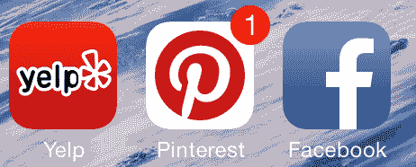
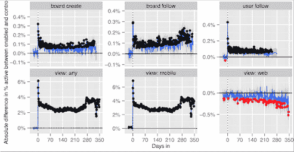
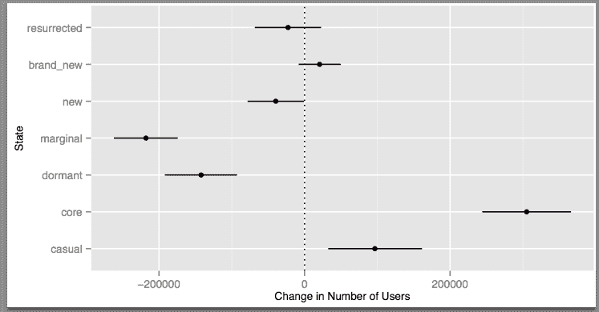

# 徽章的长期影响

> 原文：<http://jwegan.com/growth-hacking/long-term-impact-badging/?utm_source=wanqu.co&utm_campaign=Wanqu+Daily&utm_medium=website>

谈到增长，一个潜在的陷阱是为了短期利益而过度优化。成长团队的运作节奏非常快，我们的团队也不例外。我们总是在任何给定的时间进行几十个实验，一旦我们发现了有用的东西，我们就把它运出去，继续下一个实验。然而，有时后退一步，验证一个新的调整或功能是否真正带来了长期的可持续增长，而不仅仅是用户在长期接触后会厌倦的短期胜利，这是很重要的。在这篇文章中，我将讲述我们如何为长期可持续发展进行优化。

去年，我们开始在所有推送通知中包含一个徽章号。对于很多人来说，当一个应用程序上有一个徽章号码时，打开并清除它的冲动是不可抗拒的。

 *图 Pinterest iOS 应用上的徽章示例*

当我们推出徽章时，我们进行了 A/B 实验，正如我们对任何变化所做的那样，最初的结果非常棒。徽章显示，日活跃用户数(dau)上升了 7%，其他关键参与度指标也有显著提升，如大头针特写、列宾和大头针点击率。有了这么好的结果，我们很快就开始了实验。然而，我们有一个困扰的问题，关于徽章的长期有效性。徽章是长期有效的，还是用户疲劳最终开始并使用户对它免疫？

为了回答这个问题，我们创建了一个 1%的抵制小组。维持组是一个 A/B 实验，您将一个特性发布给 99%的 Pinners(用户),并让 1%的人看不到该特性，以衡量其长期影响。每当我们对特定特性的长期影响或有效性有疑问时，我们通常会运行一个抵制小组。

我们进行了一年多一点的抵制实验。我们发现，dau 中 7%的初始提升在几个月之后固定在 dau 中 2.5%的长期基线上(参见图 2 中的移动视图)。去年秋天，我们推出了一个新功能，Pinterest News，这是你所关注的 Pinners 最近活动的摘要。作为新闻的一部分，当有新的新闻条目时，我们也会标记 Pinners。结果，新闻帮助增加了徽章的长期提升从 2.5%到 4%。

 *图 2:在关键参与度指标上，徽章组超过抵制组*

我们还发现，徽章对于提高参与度非常有效。我们将 Pinners 分为[核心、临时、边缘等](http://www.slideshare.net/jwegan/data-driven-growth/12)。我们发现，在吸引那些原本会陷入边缘或休眠状态的人转而成为核心或临时用户方面，徽章有着统计上的显著影响。这一发现是引人注目的，因为它证明了徽章在提高长期记忆方面是有效的。

 *图 3:与抵制小组相比，徽章小组让更多的人进入了更高的参与度*

抵制小组是我们确保长期发展的有效方式。我们也有针对广告、用户教育等功能的推广小组。一般来说，只要对某个特性的长期影响有疑问，就应该使用维持组。在标记的情况下，它使我们能够了解 Pinners 在很长一段时间内是如何响应标记的，这将有助于为我们未来的通知策略提供信息。

*这篇文章也发表到了 [Pinterest 工程博客](https://engineering.pinterest.com/post/110916490389/how-holdout-groups-drive-sustainable-growth)*