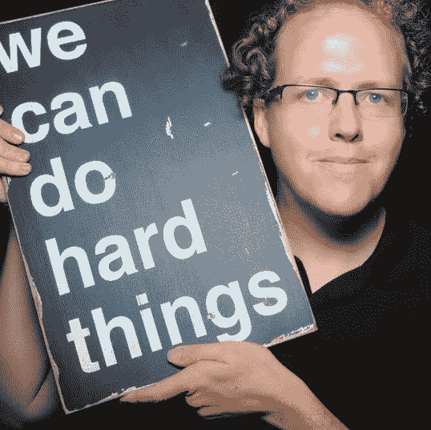

# 丹·麦金利:选择无聊的技术

> 原文：<http://mcfunley.com/choose-boring-technology?utm_source=wanqu.co&utm_campaign=Wanqu+Daily&utm_medium=website>

<main>

在我的职业生涯中，可能发生在我身上最棒的事情就是让凯兰负责我的工作。我逗留了足够长的时间，看到凯兰的技术决策开始开花结果。我从这个中学到了很多*，但作为这个*的结果*我也学到了很多。我现在就不能成为编写[数据驱动产品的工程师了！如果 Kellan 没有在技术选择上如此彻底地坚持着陆。](/data-driven-products-lean-startup-2014)*

Being inspirational as always.

离开 Etsy 后的一年里，我已经恢复了关注技术的能力。我的想法已经具体化到我可以连贯地写下来的程度。接下来是凯兰格式塔的精华，希望能让他稍微感到恐惧。

##### 拥抱无聊。

假设每家公司都有大约三个创新代币。你可以想怎么花就怎么花，但是供应量在很长一段时间内是固定的。在之后，你可能会得到更多的*你达到了[一定程度的稳定和成熟](http://rc3.org/2015/03/24/the-pleasure-of-building-big-things/)，但是总的趋势是高估了你钱包里的东西。显然这个模型是近似的，但我认为它是有帮助的。*

如果你选择在 NodeJS 中写你的网站，你只是花费了你的一个创新令牌。如果你选择使用 [MongoDB](/why-mongodb-never-worked-out-at-etsy) ，你只是花费了你的一个创新代币。如果你选择使用已经存在一年或不到一年的[服务发现技术](https://consul.io/)，你就花掉了你的一个创新代币。如果你选择写你自己的数据库，哦上帝，你有麻烦了。

如果你是一家 javascript 咨询公司或数据库公司，这些选择可能都是明智的。但你可能不是。你可能正在为一家公司工作，这家公司至少在表面上[在重新思考全球商务](https://www.etsy.com)或[在网上重新发明支付](https://stripe.com)或追求一些其他合适的史诗般的使命。在这种情况下，将有限的注意力放在创新 ssh 上是失败的绝佳方式。或者顶多延迟成功。

什么算无聊？这有点棘手。“无聊”不应该和“坏”混为一谈。有些技术既无聊又糟糕。你不应该用这些。但是有很多技术的选择是很无聊也很好，或者至少足够好。MySQL 很无聊。Postgres 很无聊。PHP 很无聊。Python 很无聊。Memcached 很无聊。鱿鱼很无聊。Cron 很无聊。

无聊(如此受约束)的好处是这些事情的能力很好理解。但更重要的是，它们的失效模式已经很好理解了。任何了解我的人都会明白，我现在只是带着一种压倒一切的不安感来召唤唐·拉姆斯菲尔德的幽灵，但我必须这么做。

To be clear, fuck this guy.

在选择技术的时候，你既有已知的未知，也有未知的未知。

*   已知的未知大概是:*我们不知道当这个数据库达到 100% CPU 时会发生什么。*
*   未知的未知是这样的:*天啊，我们甚至没有想到[写统计数据会导致 GC 暂停](http://www.evanjones.ca/jvm-mmap-pause.html)。*

这两个集合通常都不是空的，即使对于已经存在了几十年的技术来说也是如此。但是对于闪亮的新技术来说，未知的未知量要大得多，这一点很重要。

##### 全局优化。

我认为偏爱无聊的技术是一件好事，但这不是唯一需要考虑的因素。技术选择不是孤立发生的。它们的范围触及到你的整个团队、组织和从你的选择总和中浮现出来的系统。

为你的公司增加技术是有成本的。作为一个抽象的陈述，这是显而易见的:如果我们已经在使用 Ruby，那么将 Python 加入混合语言感觉并不明智，因为由此产生的复杂性将超过 Python 的边际效用。但不知何故，当我们谈论 Python 和 Scala 或 MySQL 和 Redis 时，人们[失去了理智](http://martinfowler.com/bliki/PolyglotPersistence.html)，抛弃了所有的约束，并开始狂热地谈论使用最好的工具来完成工作。

[简而言之](https://twitter.com/coda/status/580531932393504768)你的职能是将业务问题映射到一个涉及软件选择的解决方案空间。如果软件的选择真的没有包袱，你真的可以为你的各种问题挑选一大堆当地最好的工具。

<svg xmlns:xlink="http://www.w3.org/1999/xlink" xmlns:sketch="http://www.bohemiancoding.com/sketch/ns" viewBox="0 0 423 420" version="1.1"><title>Crazy</title> <desc>Created with Sketch.</desc> <g id="Page-1" stroke="none" stroke-width="1" fill="none" fill-rule="evenodd" sketch:type="MSPage"><g id="Crazy" sketch:type="MSLayerGroup" transform="translate(1.000000, -4.000000)"><text id="Problems" sketch:type="MSTextLayer" font-family="Lato" font-size="18" font-weight="normal" fill="#000000"><tspan x="43" y="18">Problems</tspan></text> <text id="Technical-Solutions" sketch:type="MSTextLayer" font-family="Lato" font-size="18" font-weight="normal" fill="#000000"><tspan x="262" y="18">Technical Solutions</tspan></text></g></g></svg>

The way you might choose technology in a world where choices are cheap: "pick the right tool for the job."

但是当然，包袱是存在的。我们称这个包袱为“操作”，在较小程度上称之为“认知开销”你必须监控这个东西。你必须搞清楚单元测试。你需要知道关于它的第一件事。你需要一个初始化脚本。我可以在这里呆上几天，所有这些加起来很快。

<svg xmlns:xlink="http://www.w3.org/1999/xlink" xmlns:sketch="http://www.bohemiancoding.com/sketch/ns" viewBox="0 0 423 420" version="1.1"><title>Sane</title> <desc>Created with Sketch.</desc> <g id="Page-1" stroke="none" stroke-width="1" fill="none" fill-rule="evenodd" sketch:type="MSPage"><g id="Sane" sketch:type="MSLayerGroup" transform="translate(1.000000, -4.000000)"><text id="Problems-3" sketch:type="MSTextLayer" font-family="Lato" font-size="18" font-weight="normal" fill="#000000"><tspan x="43" y="18">Problems</tspan></text> <text id="Technical-Solutions-2" sketch:type="MSTextLayer" font-family="Lato" font-size="18" font-weight="normal" fill="#000000"><tspan x="262" y="18">Technical Solutions</tspan></text></g></g></svg>

The way you choose technology in the world where operations are a serious concern (i.e., "reality").

“工作的最佳工具”思维的问题在于，它对“最佳”和“工作”这两个词的看法过于短视。你的工作是让公司继续运营，该死的。“最好的”工具是对尽可能多的问题占据“最不糟糕”位置的工具。

基本上总是这样，保持系统可靠运行的长期成本远远超过您在构建系统时遇到的任何不便。成熟且高效的开发人员明白这一点。

##### 有时候，选择新技术。

将这种推理简化为荒谬的话，就意味着选择 Java，然后尝试在不使用任何其他东西的情况下实现一个网站。那太疯狂了。你需要一些方法来添加东西到你的工具箱。

重要的第一步是承认这是一个过程，一次对话。新技术最终会对整个公司产生影响，因此增加技术是一个需要全公司可见性的决定。您的组织细节可能会强制进行对话，或者[它们可能会方便开发人员在不与任何人交谈的情况下添加新的数据库和队列](https://twitter.com/mcfunley/status/578603932949164032)。无论如何，你必须设定文化预期，即**这是我们都在谈论的事情**。

我在这里推荐的一个最有价值的练习是**考虑如何在不增加任何新东西的情况下解决眼前的问题**。首先，提出这个问题应该发现“问题”是某人真的想使用该技术的情况。如果是这种情况，您应该立即中止。

I just watched a webinar about this graph database, we should try it out.

一小组技术选择能走多远是令人惊讶的。在实践中，这个问题的答案几乎从来不是“我们做不到”，它通常只是“嗯，我们可以做到，但这太难了”。如果你认为你不能用你现在所拥有的来完成你的目标，你可能只是没有足够的创造力。

确切地写下当前堆栈是什么使解决问题变得极其昂贵和困难，这是很有帮助的。这与之前的练习有关，但又有微妙的不同。

新技术的选择可能完全是附加的(例如:“我们还没有缓存，所以让我们添加 memcached”)。但是它们也可能重叠或替换你已经在使用的东西。如果是这样的话，你应该**对将旧功能迁移到新系统设定明确的期望。**该策略通常应该是“我们致力于迁移”，并附有建议的时间表。这一步骤的目的是将破坏保持在可管理的水平，并避免扩散局部最优的解决方案。

这个过程并不令人畏惧，也不是什么大麻烦。这是一些需要作为家庭作业填写的问题，然后开会讨论。我认为，如果一项新技术(或在您的基础设施上创建的一项新服务)能够毫发无损地通过这个挑战，那么添加它是很好的。

##### 只是发货。

多语言编程的销售承诺是，让开发人员完全自由地选择他们自己的工具将使他们更有效地解决问题。这充其量是对问题的天真定义，往坏里说是动机推理。日复一日的工作压力会把你压垮。

谨慎选择技术给了工程头脑真正的自由:思考更大问题的自由。技术本身就是万金油。

2015 年 7 月 27 日更新:我根据这篇文章写了一篇演讲。你可以在这里看到它[。](http://boringtechnology.club)

* * *

</main>