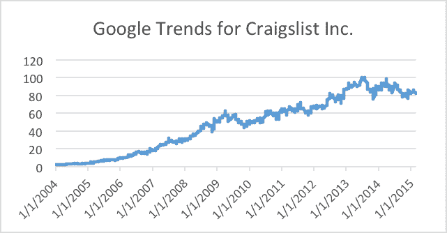
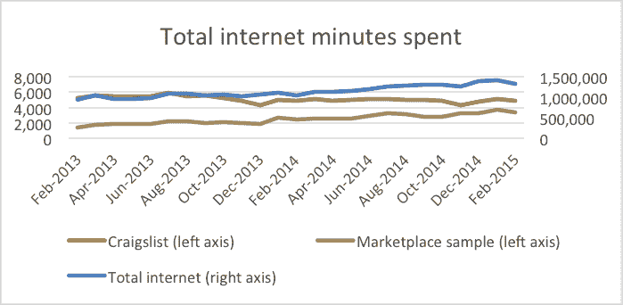
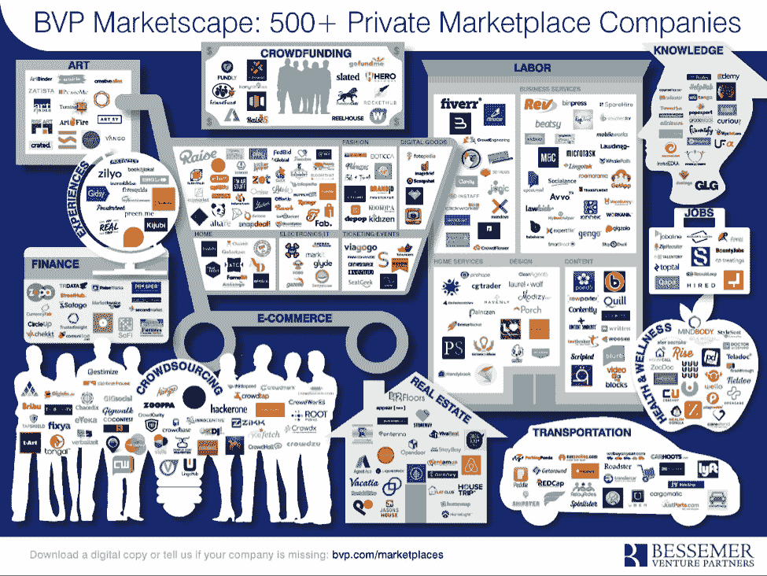

# 随着垂直市场的兴起，Craigslist 面临灭亡

> 原文：<http://techcrunch.com/2015/04/10/as-vertical-marketplaces-rise-craigslist-faces-its-demise/?utm_source=wanqu.co&utm_campaign=Wanqu+Daily&utm_medium=website>

杰里米·莱文撰稿人

[Jeremy Levine](https://www.bvp.com/team/jeremy-levine)

是贝塞麦风险投资公司的合伙人。他的投资包括 Yelp、Shopify、LinkedIn、Mindbody 和 Pinterest。

More posts by this contributor

**编者按:** *[杰里米·莱文](http://www.bvp.com/team/jeremy-levine)是[贝塞麦风险投资公司](http://www.bvp.com/)的合伙人，在 MindBody、Pinterest、Raise、Shopify、Wikia 和 Yelp 的董事会任职。拉菲·赛义德作为贝塞麦风险投资公司合伙人与杰里米·莱文密切合作，共同撰写了这篇文章。他现在是纽约初创公司 Maven 的首席运营官。*

Craigslist 是当今互联网上最大的市场之一，但在我们看来，这种情况不会持续太久。在过去的几年里，我们看到企业和消费者从 Craigslist 转向垂直市场。这种转变意味着大量令人兴奋的垂直市场投资机会。

为了了解 Craigslist 的现状和发展方向，我们查看了一份简单的谷歌趋势分析，显示该网站在截至 2013 年初的 10 年间急剧增长，此后明显变平。

ComScore 的下图显示了跨渠道(移动和桌面)计算 Craigslist 上的“上网时间”,并与整个互联网和垂直市场的样本进行了比较。

ComScore

虽然从 2013 年 2 月到 2015 年 2 月，在美国花在互联网上的总时间增加了 40%，但同期花在 Craigslist 上的时间却下降了 6%。

与相互竞争的垂直市场的增长相比，这种趋势更加明显。总体而言，从 2013 年到 2015 年，垂直市场(包括优步、Airbnb、Stubhub 等)的使用分钟数增加了 145%。不仅 Craigslist 在萎缩，而且花在颠覆性垂直市场上的时间比花在网上的平均时间增长得快得多。

我们认为，Craigslist 虽然仍然是一个规模庞大、流动性强的市场，但它既没有创新，也没有适应任何特定的类别或垂直市场，这在很大程度上解释了它的衰落。我们最近一直在谈论 Airbnb 和优步等垂直市场如何颠覆 Craigslist 和易贝等水平市场，以及 T2 新的端到端交易市场模式如何通过在市场基础上提供服务来大幅改善消费者体验。

为了概括这种转变的幅度，我们收集了 Bessemer 的“Marketscape ”,这是对大量(面向美国的)互联网市场的不完整描述。我们说“不完整”是因为每天都有新的市场公司出现，我们希望随着时间的推移增加插图(如果您公司的徽标丢失，我们深表歉意-请随时[让我们知道](mailto:marketplaces@bvp.com))。

[T2】](https://beta.techcrunch.com/wp-content/uploads/2015/04/bvp-martketscape-graph-3.png)

Craigslist 是一种迷人的动物。尽管其排名从 2013 年 11 月的第 27 位下滑至今天的第 41 位，但它仍是互联网商务的支柱。它也是一个重要的流动性来源，新的垂直市场可以从中“虹吸”供需双方，就像 Airbnb 在早期所做的那样。

我们预计，未来几年将会出现更多新的、创新的互联网市场，它们将共同继续侵蚀 Craigslist 的横向主导地位。