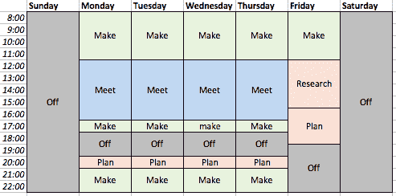

# 创始人的时间表|肖恩谈创业

> 原文：<https://seanonstartups.co/2015/04/08/the-founders-schedule/?utm_source=wanqu.co&utm_campaign=Wanqu+Daily&utm_medium=website>

关于如何在创建新公司时作为一名领导者有效管理自己的时间，已经有很多文章。保罗·格拉厄姆有一篇著名的文章，他通过[制造者的时间表和管理者的时间表](http://www.paulgraham.com/makersschedule.html)将工程师的需求和管理者的需求分开。最近，Mattermark [的 Danielle Morrill 写了一篇](https://medium.com/@DanielleMorrill/warming-up-to-the-manager-s-schedule-e3ec18c7408e)关于随着公司的发展，从制造者的时间表到管理者的时间表的转变。

我发现关于如何在创立公司的早期有效管理你的时间的文章很少。在早期，你不可能有一个制造者的时间表，因为你不能确定你到底应该做什么。然而，你不能有一个经理的时间表，因为你必须做一些事情，否则你永远不会开始。那么，理想的创始人作息时间是怎样的？

对我来说，理想的创始人的时间表既要留出制定计划的时间，也要留出开会的时间，因为缺一不可意味着你无法有效地缩小业务范围。与此同时，它需要确保你不会不断地从一个切换到另一个，因为你会冒上下文切换成本削减你所有生产力的风险。

现在我自己又成了一名创始人，我决定采用以下时间表，我认为这是一个创始人时间表的绝佳模板:

[T2】](https://seanonstartups.files.wordpress.com/2015/04/screen-shot-2015-04-06-at-9-19-39-am.png)

虽然看起来你所有的时间都被封锁了，但实际上你可以灵活地支配时间。你所有的时间都是按照目的划分的:

*   **制作**:这是你制作的时间。这并不意味着总是编码或构建，它可能意味着写作，头脑风暴或设计。
*   会见:这是你会见可能帮助你的人的时候。这包括潜在客户、投资者、顾问和朋友。
*   计划:这是你计划明天要做什么的时候。效率研究表明，如果你在头天晚上决定好要做什么，你会更有效率，所以我们把那段时间留在晚上。同样，我们会在周五留出一两个小时来决定下周的任务。
*   研究:这是你研究疯狂想法的时候。虽然这看起来像是浪费时间，但跳出框框思考并确保不陷入想法的窠臼是很重要的。打破这种状态最简单的方法就是做一些听起来很疯狂的事情。
*   **关**:这是你不工作的时候。你需要这段时间来避免精疲力尽并保持创造力。我向你保证，如果你在周末尽情享受，你整个星期都会更有效率。锻炼的话加分。

然后把这些目标在一天中分开，充分利用它们。

*   **凌晨制造**。研究表明，你最有效率的时间是在早上(通常是从上午 10 点到中午)，所以这几个小时你应该专注于最困难的脑力工作。理想情况下，在这段时间结束之前，你甚至不会检查你的电子邮件，以免你发现自己把宝贵的时间浪费在交流上。(参见[走完这段距离](https://seanonstartups.co/2014/08/14/going-the-distance/ "Going the Distance"))。
*   **下午见面**。在我们的文化中，午餐是一种与生俱来的社交体验，你应该利用午餐时间以及午餐后的时间，与他人见面并收集反馈。这将有助于你克服坐在(或站在)办公桌前试图制造的下午的平静。
*   **晚上做**。每个人都有了第二次生命，这是完成更多事情的好时机。希望你从你的一些会议中受到启发，或者能够通过离开来解决早上的问题，现在你可以充分利用这种创造性的推动。

我知道会有很多人谴责这是一个糟糕的时间表，因为它不符合创始人应该如何分配时间的典型模式。当你想象一个创始人建立一个新公司时，你可能会想象他们整天在一个黑暗的房间里对着电脑屏幕工作，或者把醒着的每一个小时都花在路上采访客户。乍一看，同时做这两件事似乎是最糟糕的。

然而，根据我的经验，我可以告诉你，这让我更有效率。我不再花时间制造顾客不想要的东西，因为我每天都要检查现实。与此同时，我从不花时间去等待一个想法，因为每天都有预留的时间。

如果你是一个新的创始人，正在努力让你的公司起步，我希望你能尝试一下。如果有，请告诉我进展如何。但只是在下午，早上我会做。

### 像这样:

像 装...

### *相关*