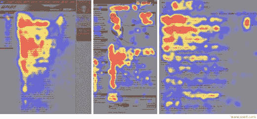
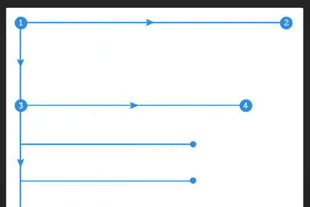
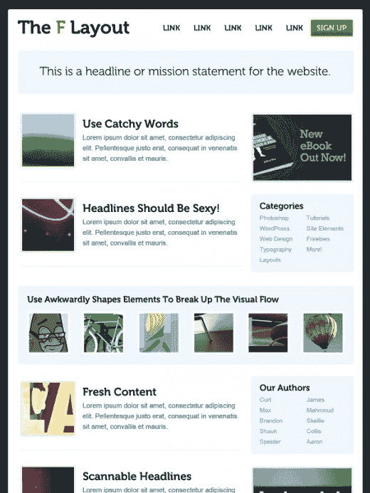
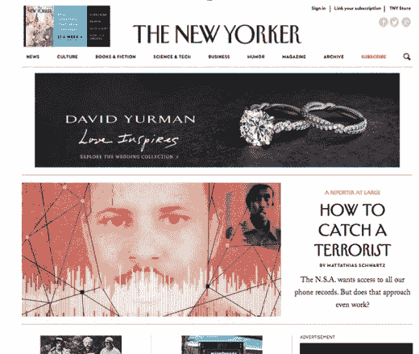
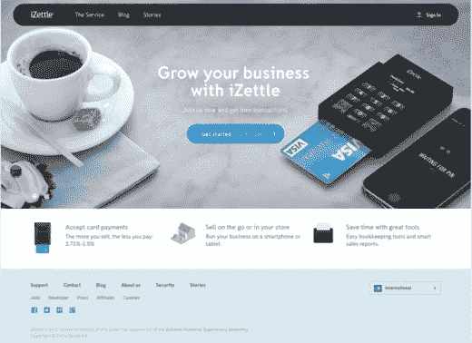
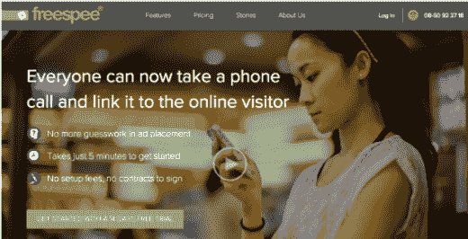
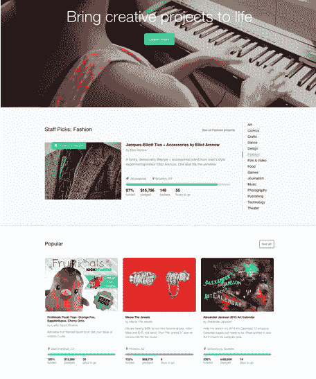

# 如何设计反映我们眼睛工作方式的网站

> 原文：<http://thenextweb.com/dd/2015/04/10/how-to-design-websites-that-mirror-how-our-eyes-work/?utm_source=wanqu.co&utm_campaign=Wanqu+Daily&utm_medium=website>

*Jerry Cao 是 UXPin —* [*线框和原型应用*](http://www.uxpin.com/) *的 UX 内容策略师。要了解更多关于内容优先设计的知识，请下载免费电子书* [*网页界面设计:内容模式&排版*](http://www.uxpin.com/visual-web-ui-design-content-typography.html) *。*

* * *

不要被愚弄:很有可能，你的用户浏览你的内容是为了寻找最好的部分。别往心里去，这不是针对你的内容(也没有破坏它的价值)，这只是[标准的用户行为](http://uxmyths.com/post/647473628/myth-people-read-on-the-web)。

****

**[

<noscript></noscript>](https://thenextweb.com/wp-content/blogs.dir/1/files/2015/04/f_reading_pattern_eyetracking.jpg)** 

*来源:* [*F 形图案用于阅读网页内容*](http://www.nngroup.com/articles/f-shaped-pattern-reading-web-content/)

F-pattern 是新闻网站、博客或深度登录页面等大量文本网站的首选布局。一旦我们解释了它的工作方式和原因，你就会开始注意到它在网络上的流行站点上的使用。

### 什么是 F 型？

当涉及到内容块时，F 模式描述了最常见的用户眼睛扫描模式。

*F* 指的是读者首先扫描屏幕顶部的水平线，这对于从左向右阅读的文化来说是可以理解的。接下来，用户扫描屏幕左侧的垂直线，在段落的开头句子或小节标题中寻找关键词或兴趣点。当读者找到他们喜欢的东西时，他们开始正常阅读，形成水平线。

最终结果是看起来像字母 *F* 或 *E* 的东西。如 [Web UI 模式 2014](http://uxpin.com/web-design-patterns.html?utm_source=Web%20UI%20Human%20Eye%201%20ebook&utm_medium=ebook&utm_campaign=Web%20UI%20Human%20Eye%201%20ebook) 、 **CNN** 和 **NYTimes** 都使用了 F 模式。

尼尔森诺曼集团(Nielsen Norman Group)的雅各布·尼尔森(Jakob Nielson)进行了一项可读性研究，该研究基于 232 名用户对数千个网站的扫描，[阐述了 F 型模式的实际意义](http://www.nngroup.com/articles/f-shaped-pattern-reading-web-content/):

*   用户很少会阅读你文本中的每一个字(事实上，平均只有 20%)
*   前两部分是最重要的，应该包含你的钩子
*   每段只涵盖一个想法，尽可能使用项目符号
*   用吸引人的关键词开始段落和新章节

这对你网站的界面设计有什么影响？看看下面。

### 如何使用 F 模式

下面的例子，来自[布兰登·琼斯关于主题](http://webdesign.tutsplus.com/articles/understanding-the-f-layout-in-web-design--webdesign-687)的作品，可视化了 F 模式。

****

**[

<noscript></noscript>](https://thenextweb.com/wp-content/blogs.dir/1/files/2015/04/f-wireframe.jpg)** 

*来源:* [*了解网页设计中的 F-Layout*](http://webdesign.tutsplus.com/articles/understanding-the-f-layout-in-web-design--webdesign-687)

显然，你会想把你最好的内容放在顶部，在左上角有一个稳固的锚( **Point 1** )，这是唯一一个几乎可以保证得到注意的地方。这就是为什么你通常会在这里看到一个公司的标志。

通常，设计者会将导航栏放在顶部的右上角( **Point 2** )。这使得用户可以方便地搜索某一部分的标题，例如“Help”设计师们对顶栏的粗细和吸引人的程度有所不同:细而细微的顶栏会立即鼓励进一步的浏览，而较大的顶栏会更多地利用其主导地位，以牺牲下面的内容为代价来提升上面的内容。

在第一行之后，用户将下拉到下一个显著的部分(**点 3** ，并重复该过程(**点 4** )。理论上，用户会继续浏览页面，直到他们找到感兴趣的东西，但实际上，他们可能会在几秒钟后离开**——**，除非你能抓住他们的注意力。

出于这个原因，[专家建议](http://webdesign.tutsplus.com/articles/understanding-the-f-layout-in-web-design--webdesign-687)在前两三排之后用一个“尴尬”的元素打破单调——任何打破常规的东西。这可以是前面行的任何变体，只是为了保持页面的视觉刺激。标准做法是折叠线下每 1000 个像素打破一次惯例。

下面的视觉帮助很好地提醒了我们 F 模式是如何工作的。

[

<noscript></noscript>](https://thenextweb.com/wp-content/blogs.dir/1/files/2015/04/f-pattern-4.jpg) 

*来源:* [*了解网页设计中的 F-Layout*](http://webdesign.tutsplus.com/articles/understanding-the-f-layout-in-web-design--webdesign-687)

值得注意的是每一行的末尾(在那里分 2 和 4 等。位于)，是广告和行动号召的最佳位置，因为在移动到下一行之前会有短暂的停顿。这就是为什么你看到“新的电子书出来了！”行动号召放在第一行内容的末尾。

F 模式非常适合这些动机，因为它们以一种引人注目的方式呈现这些选项，但不会分散对主要内容的注意力。只要记住内容永远是王道，侧边栏的存在只是为了让用户更深层次的参与进来。

对于 F 模式，右侧边栏有两个主要用途:

1.  **展示相关但不相关的内容—** 任何你想让你的用户看到的内容，但这些内容与主要内容并不协调。这些可以是广告、其他帖子的链接、社交媒体小工具等。
2.  **作为搜索工具—** 这个地方显然可以有一个搜索栏，但也可以有类别列表、标签云、一个“热门帖子”小工具等。

这是很难一下子理解的，所以我们会用下面的例子告诉你我们的意思。

[

<noscript></noscript>](https://thenextweb.com/wp-content/blogs.dir/1/files/2015/04/newyorker.jpg) 

《纽约客》显示，F-模式对于自然展示广告的网站特别有效。第一个大卫·雅曼广告引人注目，但由于在主照片中使用了红色，所以不会分散注意力。正如我们之前所描述的，这个广告再次显示在第二行内容的末尾，眼睛自然会在那里停留。

[

<noscript></noscript>](https://thenextweb.com/wp-content/blogs.dir/1/files/2015/04/izettle.jpg) 

您可以看到这种模式也适用于具有稀疏副本的站点。

在他们的主页上，iZettle 采用了一种不太传统的 F 模式。事实上，它的布局代表了 F 模式和 Z 模式的混合(我们将在后面讨论)。

他们通过将主文本(“用 iZettle 发展您的业务”)和行动号召叠加在大背景图片上，避免了模板化的外观。我们认为这是使这种阅读模式适应你的界面布局的最低要求——毫无疑问，还有视觉上更性感的例子，但这仍然能完成工作。

### 为什么这种模式有效？

设计师反复使用 F 模式，因为它模仿用户的自然视觉模式。大多数人一生都在从上到下、从左到右地阅读。

用 F 模式设计一个网站布局是顺流而下的，鼓励用户的视线自然跟随。相反，忽略 F 模式的内容丰富的网站通过迫使读者重新调整他们自然的眼球运动来制造不必要的冲突。

[

<noscript></noscript>](https://thenextweb.com/wp-content/blogs.dir/1/files/2015/04/Screen-Shot-2014-04-11-at-10.24.49.png) 

*来源:* [*如何优化你的网站，增加转化率*](http://blog.freespee.com/2014/04/11/how-to-optimise-your-website-and-increase-your-conversions/)

网站布局会影响转化率，所以了解你在屏幕上的不动产的价值很重要。以 [**Freespee**](http://blog.freespee.com/2014/04/11/how-to-optimise-your-website-and-increase-your-conversions/) 为例。在将他们的网站重新设计为上述版本后，随后的 A/B 测试显示，在相同的广告支出下，他们可以将电话交谈率提高 30 %,只需将他们的电话号码放在右上角更显眼的位置。

正如我们在 [Web UI 人眼设计](http://www.uxpin.com/visual-web-ui-design-content-typography.html)中所讨论的，上面的例子绝不是完美的设计。他们可以使项目符号文本更加突出，并用支持所描述的价值的视觉效果替换背景股票图像。但这也许更能说明布局的力量:即使你的排版和图形不是最好的，调整你的布局以适合人们阅读仍然可以提高网站的性能。

话虽如此，让我们剖析一下他们做对了什么:

*   左上角的标志在第一点吸引注意力，用户自然地浏览导航、执行搜索或任何其他顶级操作

*   右上角第二点显示的电话号码是第一个行动号召。由于它以绿色突出显示，这进一步吸引了正确的注意力。

*   在这一页的正文中，简洁的项目符号出现在第三点。这段文字的结构就像一个“迷你 F 模式”,这样人们的视线自然会向下移动到行动号召上

但是 F 模式并不是绝对正确的。这种布局的主要缺点是容易单调，很容易让你的用户对你的行中重复和相似的内容感到厌烦。这正是为什么建议时不时地抛出一个“尴尬”的行；这种变化有助于吸引用户的注意力。

[

<noscript></noscript>](https://thenextweb.com/wp-content/blogs.dir/1/files/2015/04/creativeprojects.jpg) 

*来源:* [*了解网页设计中的 F-Layout*](http://webdesign.tutsplus.com/articles/understanding-the-f-layout-in-web-design--webdesign-687)

正如你在上面看到的， **Kickstarter** 将其页面分成三个不同的行。第三行展示了“笨拙”的一行，它不同于预先建立的模式，垂直地布置了一些小部件(可以说，在 1000 像素左右)。

要知道，人们通常以 F 模式浏览大块内容，然后根据需要修改，以适应你网站的品牌和个性。当你修改图案时，确保你遵循了这些由**描述的[规则，以及](http://alistapart.com/article/content-out-layout)**关于比率和网格的。

### 外卖食品

F 模式不仅仅适用于文本。

任何时候你展示各种各样的内容，你都需要以某种方式组织它。F-模式简单地遵循人眼的共同趋势，以便您可以优化您的布局结构。你不需要严格遵循它——它是一个指南，而不是一个模板。即使你从这里得到的只是在顶部导航栏的角落里添加一个行动号召，这个小小的改动也能让一切变得不同。

*要了解更多关于内容优先设计的知识，请下载免费电子书* [*针对人眼的 Web UI 设计:内容模式&排版*](http://www.uxpin.com/visual-web-ui-design-content-typography.html) *。该电子书提供了关于视觉层次、可读性设计和通过排版创造视觉语言的实用建议。还分析了包括 Dropbox、AirBnB、Marketo、Hulu 和 Evernote 在内的 30 家公司的设计实例。*

**阅读下一篇:** [*如何在网页设计中用色彩营造正确的情绪*](https://thenextweb.com/news/how-to-create-the-right-emotions-with-color-in-web-design)