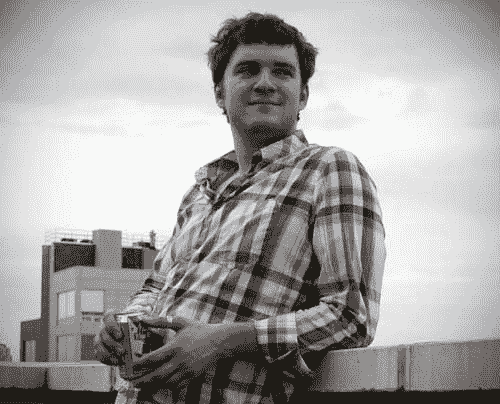

# 当你的公司在赚钱的时候，为什么要接受风险投资呢？观察家报

> 原文：<http://observer.com/2015/05/why-take-venture-cash-when-your-companys-making-money/?utm_source=wanqu.co&utm_campaign=Wanqu+Daily&utm_medium=website>

Anthony Volodkin, Hype Machine’s founder, and a PBR that’s not beholden to VC dollars.

自举——这是一个高风险的时期，有人在开发储蓄产品，但可能仍在关注投资者。也就是说，如果创始人的建筑看起来像它会工作。但是一个真正伟大的想法有一个有趣的地方:如果它能很快赚钱，这是一个很好的理由*而不是*去寻求风险投资。至少对一些创始人来说是这样。
风险投资的挑战在于，投资者会推动一家公司追求规模，而不是打造一个不那么咄咄逼人、只是一个可靠的利润来源的公司。“快速扩大规模”战略要么大获成功，要么毁掉一项冒险。这就是为什么一些能够支付自己薪水的创始人喜欢将股权留在公司内部，即使这意味着错过成为下一个优步的机会。

以下是一些到目前为止，慢慢走向成功而不是拼命追求规模的公司:

*   总部位于布鲁克林日落公园的公司收集不用的电子设备，翻新后以折扣价卖给其他需要技术的公司和组织。
*   音频沙拉(audio salad):一家音乐产业公司，它使得从粉丝到唱片公司再到乐队本身的所有参与者的数字发行和版权管理变得更加容易。
*   Sematext 在后台构建了一些实用程序，当你的网站性能出现异常时，这些实用程序会让你知道，在网站或服务器上进行搜索。它的创始人在科技领域有足够的人脉，以至于它一推出就有业务，而且自那以后一直稳步增长。
*   ControlShiftLabs :一家 Dumbo 公司，向社会变革组织提供贴有白色标签的网络工具，以建立基层领导力。
*   宣传机器:威廉斯堡的音乐探索公司不断尝试新方法，让你知道哪些新歌正在活跃博客世界。它的 iPhone 应用在 2011 年发布时迅速成为[付费音乐应用](http://observer.com/2011/05/for-hypmachine-iphone-is-cash-register-android-is-sandbox/)的榜首。
*   Piccolo :这是它的创始人的一个小项目，由 Greenpoint 发起。简而言之，它会打印出你发布到社交媒体上的最佳照片，然后邮寄给你，收取订阅费。
*   思想目录:在所有思想都是相关的哲学下，一家媒体尝试用每一种可能的长度来表达观点。

尽管没有 monied masters 的生活是美好的，但有很多公司保持了很长一段时间而没有受到感激，只是后来改变了方向，包括 [Imgur](http://observer.com/2014/07/inside-look-imgur-reveals-redesign-announces-plans-for-a-convention/) 、Atlas Obscura(我们在 10 月份采访了他们的[新主编](http://observer.com/2014/10/david-plotz-becomes-ceo-of-atlas-obscura/)和 [Cloth](http://clothapp.com) ，这是一个时尚自拍社交网络，已经发展了两年。去年，它进行了第一轮小天使投资，将它从这个名单中剔除。

