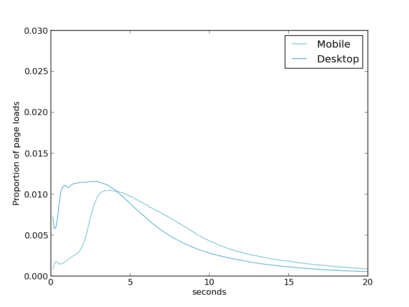
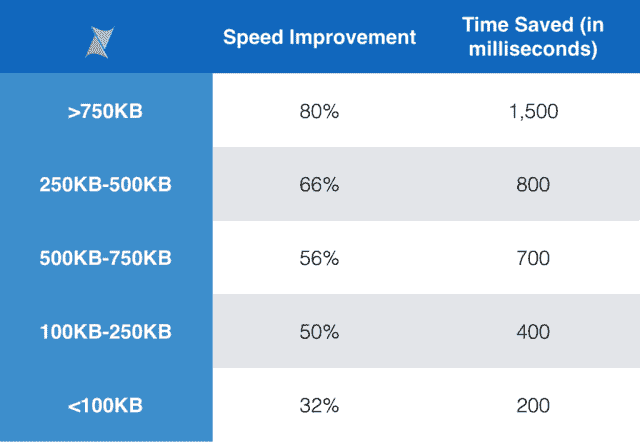

# 在手机上，速度慢会致命——在我的 Om 上

> 原文：<http://om.co/2015/05/14/on-the-mobile-web-slow-speeds-kill/?utm_source=wanqu.co&utm_campaign=Wanqu+Daily&utm_medium=website>

谷歌。亚马逊。沃尔玛。毫无疑问，加载速度更快的页面会提高服务的性能和使用率。有时，即使是感觉到的更快的性能(如 Instagram 的早期)也有助于提高使用率和参与度。因此，脸书用速度来吸引出版公司合作也就不足为奇了。移交内容和试图优化自己的产品以克服延迟和其他网络挑战是两回事。脸书使用了一个将这两个问题混为一谈的论点。

支持 Facebook 即时文章的最大理由是它们从脸书的移动应用程序加载的速度。在一份新闻稿中，脸书指出，许多新闻“加载故事平均需要 8 秒钟，是脸书最慢的单一内容类型”，“即时文章的阅读速度比标准移动网络文章快 10 倍”这是 0.8 秒，我不知道该公司是如何做到的——给我留下深刻印象。

脸书可以完全控制向读者展示的所有内容。如果没有即时文章，点击《纽约时报》的一篇文章可能会转到《T2 时报》的网络服务器(很可能由 Akamai 或类似的公司托管)，服务器会获取内容片段，并在用户的手机上组装起来。Instant Articles 一次性打包并发送给用户，完全不需要使用 *NYT* 的主机提供商。

此外，如果混合了图像、视频和文本(很有可能)，从不同来源加载这些内容的时间可能会变得很长，并且更难预取——这就是为什么脸书需要完全控制，这反过来会产生很大的性能。此外，脸书采用了所有最新的技术:它是谷歌 SPDY 的早期采用者，我希望它已经在 HTTP/2 上了。脸书正在使用 AsyncDisplayKit，这是一个为纸张开发的用户界面框架，它反过来利用 iPhone 的多核处理器来提升性能。([《连线》有一篇关于这个](http://www.wired.com/2015/05/instant-articles-facebook-shows-us-paper/)的俏皮文章。)

### 事实核查

为了核实脸书的说法，我联系了在 Chartbeat 的人们，因为他们与许多出版商合作，看看他们是否有任何关于页面加载时间的数据。是的，他们分享了桌面和移动页面加载时间的直方图。底层数据集是来自大约 70 个域的样本的一周的数据，这些域允许 Chartbeat 聚合数据——总共大约 5 亿次页面浏览量。它并不完美，但它是一个很好的样本量和方向性指标。特别是，57%的移动用户和 72%的桌面用户在头 8 秒内加载，分别有 12%和 8%的用户加载时间超过 20 秒。

<noscript>T3】</noscript>

脸书是对的:这些页面中的大部分都需要很长时间来加载。2004 年，谷歌指出，人们乐于在对页面负载感到沮丧之前等待大约两秒钟。手机有一定的自由度，但随着 LTE 的普及，人们对较慢的页面下载越来越没有耐心。

但是正如我在 Twitter 上指出的，“如果你需要脸书来解决页面负载问题，那么作为媒体实体，你需要被警告。”所有关于媒体公司将品牌和受众控制权拱手让给脸书的言论，都促使我参考了达尔文的观点。在某种程度上，令人震惊的是，出版公司没有花费更多的精力和时间来支撑他们的技术栈——这是网络先驱戴夫·维纳[多年来一直推荐的。](http://scripting.com/2015/05/13/facebooksInstantArticles.html)

### 网络体验

我不会争论巨头将控制权让给脸书的利弊——他们将不得不承受可怕的后果——但对我来说，这凸显了一个更大的问题。这些巨头似乎不明白底层网络性能和“内容”是两回事。而且不仅仅是大型出版商。设计不仅是一张漂亮的脸，也是整个体验，而这种体验高度依赖于网络、网络条件和人们对它的感觉。“在更多的地方有更多的酒吧”只不过是一句口号，在设计移动体验时，网络方面需要更多的考虑。

有很多选择。显然，当我提到总部位于加州雷德伍德城的初创公司 TwinPrime 时，我是有偏见的，这家公司由 True Ventures (我是董事会成员)提供支持，后者开发了一系列提高移动应用性能的技术。例如，使用他们的技术，*纽约时报* iPhone 应用程序，这是由许多对象组成的，可以看到性能的提高(见下表)。

无论你对 Facebook 的即时文章有什么看法，它们都重新将我们的注意力集中到了设计应用和网络性能和速度体验的重要性上——这是谷歌在 11 年前让我们意识到的。

附注:[查看 TwinPrime 的博客](http://www.twinprime.com/category/blog/)了解网络性能和对应用程序的影响。

<noscript>T3】</noscript>