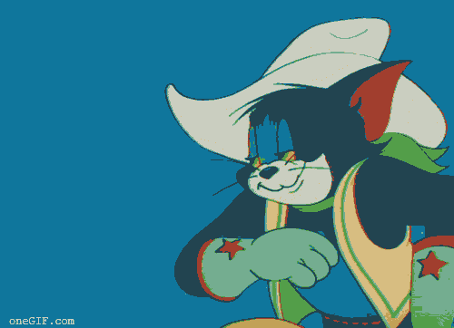

# 开发人员应用开发西部指南 TechCrunch

> 原文：<http://techcrunch.com/2015/05/20/a-developers-guide-to-the-wild-west-of-app-discovery/?utm_source=wanqu.co&utm_campaign=Wanqu+Daily&utm_medium=website>

拉斐尔·欧赞撰稿人

**编者按:** *Raphael Ouzan 是 [BillGuard](https://billguard.com/) 的创始人 CTO 兼产品负责人。*

如今很难推出一款消费者手机应用。设法制造出满足真实需求的一流产品？在 140 万个 App Store 列表中，超过 80%的 App Store 列表符合“僵尸”标准——在苹果的任何类别列表中都不可见——因此大多数 iPhone 用户每月不下载[甚至一个](http://fortune.com/2015/02/19/the-decline-of-the-app-millionaire/?xid=nl_termsheet)新应用也就不足为奇了。

因此，如果你是一家将未来寄托在用户增长上的消费者应用公司，你必须找到一种方法来正面应对这一挑战。当我们刚刚开始研究手机的时候，我向我的朋友寻求建议，我永远也忘不了他的回答:“哦，伙计，手机的发现就是狂野的西部。”欧里尔当然是对的，但就像昔日的美国边境一样，这并不是说*没有*规则，而是说当你第一次快步走进道奇城时，这些规则可能非常难以确定。

作为对 Ouriel 帮助的一种公共回报，这里是我们的开发者对应用发现的狂野西部的指南。

## 精益开发——甚至在 iOS 上

一旦你决定在 iOS 或 Android 上开始，在发布之前你必须做出两个重要的决定:如何组织你的构建和如何协调你的发布。

BillGuard 开始是一个 web 应用程序；我们在 2013 年初开始编写我们的第一个移动应用程序，这是在游戏的后期。在这一点上，很明显 iOS 是我们想要接触的人群的起点。

随着我们早期 iPhone 应用程序开发的进展，我们意识到我们陷入了困境。苹果的应用程序提交过程使得它很难以快速、迭代、响应的方式进行开发，密切听取早期用户的意见，并不断应用修复和改进。这是当今大多数像我们这样的软件团队喜欢使用的精益开发框架。试飞没有多大帮助:只有有限数量的测试人员通过了复杂的设置。

所以我们决定推出我们自己的 iOS 版精益开发——一款牛仔香烟。

我们在脸书为高级用户成立了一个测试组，并在公开发布日之前悄悄地向他们发布了不少于 11 个版本的应用。来自这个测试组的反馈被证明是成功发布的无价之宝。**T3】**

为了确保我们收到的新鲜观点不被我们的网络应用程序体验所玷污，我们还购买了一些精心定位的脸书应用程序安装广告，以吸引新用户，并开始了解哪些营销信息效果良好。

例如，在广告创意中，我们展示了一些不同的设计方案，以获得吸引消费者的信号。事实证明，这对于确定某些设计元素非常有帮助，比如我们的应用仪表板。

大约花了四个月的时间，我们的应用程序的质量才上升到足以正式发布的水平。那时，我们从应用商店撤下了这款应用，这样我们就可以在公开发布时引起轰动。

***牛仔提示#1:** 坚持你的开发者之枪——不要让应用商店的结构决定你的软件发布周期。*

## 新闻。更用力。

然后，我们转向我们的媒体联系人，向他们提供了一个我们必须设计的应用程序的预览。我们把我们的应用商店状态留在了“等待开发者发布”中，并给记者们塞了一个苹果提供的推广代码。幸运的是，作者喜欢这个应用程序。

在发布日，我们在电视上直播，收到了一堆我们已经禁止的其他重要新闻，甚至收到了苹果公司的特别报道。

***牛仔小贴士 2:** 认真对待公关。记住 App Store 每周四更新。相应地安排发射时间。*

## 移植还是重建？

在我们就我们的应用联系谷歌之前，我们已经开始设计和编码了。许多开发人员根据与原始应用完全相同的用户界面和设计原则构建他们的第二平台应用——移植过来——但我们选择不这样做。我们认为两个平台上用户体验的一致性并不重要。所以我们为 Android 设计了 BillGuard，从我们的 iPhone 应用程序中对 UI 做了一些大的改变。

这种方法的缺点是，当你在新应用上了解到一些用户行为时，你不知道这是由于平台转换还是由于特定的功能。这是一个巨大的缺点——足以让它成为大多数应用程序的错误决定——但在我们的特殊情况下，我不后悔。

***牛仔小贴士 3:** 了解每个移动平台的优势，以及如何根据一个平台上的经验来改进另一个平台上的应用。*

## 用平板电脑**砸脑袋**

我们在谷歌建立了强大的联系，他在 Android 发布过程中帮助了我们——纽约的一位商业开发主管和他的 Google Play 团队，我们在 SXSW 见过他们。

我们每个月都会亲自与我们的纽约联系人会面，随着我们应用程序的进展，Google Play 编辑团队给了我们大量详细的反馈，其中大部分我们都实施了。

然而，有些反馈在我们看来是错误的，我们拒绝了。在某些情况下，谷歌的团队实际上接受了我们的立场，这表明这是一种真正的对等关系——与我们在苹果的经历相去甚远。后来，谷歌编辑团队甚至建议我们何时以及如何发布。

> 这就像是在一家新的跑车制造商即将上市之前告诉它，只有同时发布一辆皮卡，它才能开设一个展厅。

一切似乎都很顺利，直到有一天，在我们开发过程的后期，我们的谷歌联系人通知我们，如果我们想被考虑加入 Play Store 特色插槽，我们不仅要发布一个手机应用程序，还要发布一个平板电脑应用程序。谷歌希望提升其平板电脑应用的整体质量，所以它只推出了在手机和平板电脑屏幕上推出的新应用。

我们的整个产品开发都集中在手机屏幕上，现在如果我们想突出特色，避免 Android 晦涩难懂，我们还必须为平板电脑打造非常不同的用户体验。这就像是在一家新的跑车制造商即将上市之前告诉它，只有同时发布一辆皮卡，它才能开设一个展厅。这感觉很荒谬，不符合我们已经开始欣赏的 Google dev 关系的特点。但是它表明了商业考虑是如何迫使即使是对发展最友好的谷歌人采取行动的。

尽管需要额外的时间，我们还是决定照办。最后，在我们联系人的大力帮助下，谷歌在发布日展示了我们的应用。和苹果一样，提前安排媒体报道，并让谷歌知道这一点，肯定有助于在 Play Store 上出现。

我们发现参加 Google I/O 对拓展我们与 Google 的关系非常重要。在那里，我们参加了一些令人耳目一新的“反向面板”,谷歌的人在那里询问我们关于为 Android 开发的体验。

***牛仔小贴士 4:** 理解并与谷歌和苹果的战略目标保持一致——即使你不认同它们。*

## 这是家规

我们的应用程序现在已经在 App Store 和 Play Store 上站稳了脚跟，我们的发布是其中的关键。但回想起来，我们觉得我们发布的成功与识别和谈判技术障碍有太多的关系:苹果和谷歌的框架、指导方针和次要的商业利益。

希望应用程序发现改进的那一天很快就会到来，这样服务的质量就能决定可见性。也许[产品搜索](http://www.producthunt.com/)将跨越鸿沟，成为这样一种工具，或者也许苹果新的[应用分析](https://analytics.itunes.apple.com/)标志着苹果承诺为开发者和用户提高透明度。