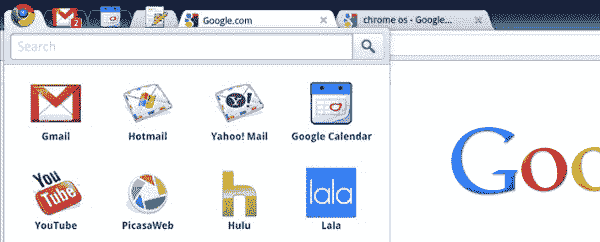
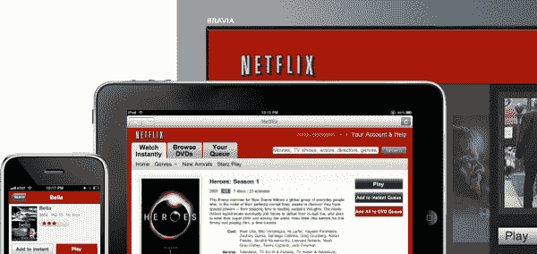
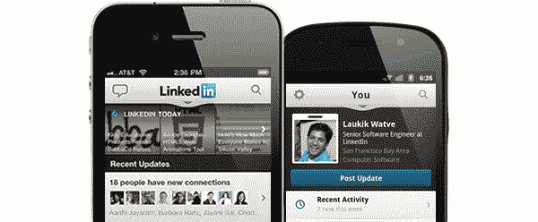

# 网络操作系统已经在这里了…

> 原文：<http://www.lukew.com/ff/entry.asp?1441>

网络操作系统已经在这里了… **它只是不像你想象的那样**。Web 技术目前正在支持跨多种设备的内容和交互，有效地将最流行的本地应用程序转变为 Web 浏览器。最终的结果是一个广泛分布和使用的基于网络的操作系统。只是不是你想象的那样。

## 网络操作系统的愿景

谷歌的 [Chrome OS](//www.youtube.com/watch?v=0QRO3gKj3qw) 和它在 [Chrome Books](http://www.google.com/chromebook/) 中的表现代表了大多数技术专家认为的网络驱动操作系统的样子。在网络浏览器中运行的强大应用程序，允许您在本机应用程序中完成一切可能的事情:电子邮件、文字处理、电子表格、图形编辑、照片管理，应有尽有。

Chrome OS 实际上做到了这一切。翻开 Chrome Book，你唯一看到的是一个带有标签的网络浏览器，可以管理多个基于网络的应用程序，包括上面提到的所有“杀手级”应用程序的伟大版本。网络浏览器是操作系统，用 HTML、CSS 和 Javascript 构建的网站是应用程序。就像你想象的网络操作系统一样，对吗？嗯，这的确很像我六年前画的 **。**

但是谷歌的努力并没有流行起来。事实上，我猜他们很难让人们接受它。然而，一个非常不同的网络操作系统不仅在成长，而且变得越来越普遍。

## 网络浏览器赢了

网络浏览器已经成为几乎所有操作系统上的“杀手级应用”。甚至与移动平台上的大量原生应用程序对抗——许多人谴责网络的地方已经死了！

42.9%的美国移动用户使用网络浏览器。42.5%的人使用本地应用程序(在截至 2011 年 9 月的 [3 个月内](http://techcrunch.com/2011/11/04/comscore-as-smartphone-usage-increases-android-continues-to-gain-u-s-market-share))。随着移动互联网使用的增长，浏览器的使用保持不变。[去年](http://www.comscoredatamine.com/2011/02/top-mobile-activities-in-us/)，36.4%的人使用手机浏览器，34.4%的人使用他们下载的应用程序。这是一个应用程序(浏览器),可以抵御任何数量的下载应用程序。

脸书的数据[讲述了一个类似的故事](http://www.guardian.co.uk/technology/appsblog/2011/oct/19/facebook-bret-taylor-apps-mobile)。该社交网络的 3.5 亿移动用户在移动网络和原生应用之间各占一半。

平板电脑上的情况也没什么不同。最受欢迎的日常平板电脑活动是浏览网页(67%)、电子邮件(54%)、社交网络(39%)、游戏(30%)和阅读书籍(17%)。40%的平板电脑用户表示，他们主要通过网络浏览器获取新闻，而 31%的用户同时使用新闻应用和浏览器。

所以网络浏览器经常被使用。但它只是一个应用程序。如果是每个 app 呢？

## 应用是浏览器

当今最流行的媒体应用程序是使用 Web 浏览器渲染引擎构建的。这允许他们使用标准的网络技术跨多个平台显示内容和交互。

苹果的 iTunes 是世界上排名第一的音乐商店，有 160 亿首歌曲被下载，2000 万首歌曲可供下载。同样是[使用 WebKit](http://www.satine.org/archives/2009/09/09/does-itunes-9-use-webkit) 不仅呈现 iTunes 商店，还呈现 iTunes LP 富媒体格式。

网飞视频流是北美互联网流量的最大来源。他们的流媒体服务也是基于 WebKit 的[，使用 JavaScript、HTML5 和 CSS3“构建](http://techblog.netflix.com/2011/09/netflix-webkit-based-ui-for-tv-devices.html)[用户界面](http://techblog.netflix.com/2010/12/why-we-choose-html5-for-user.html)，通过游戏控制台、蓝光播放器和联网电视交付给数百万网飞用户”。

Amazon.com 是世界上最大的书商。在推出 Kindle 电子书格式不到四年后，亚马逊的顾客现在购买的 Kindle 书比纸质书还要多——精装和平装书的总和。亚马逊[最近宣布](http://www.amazon.com/gp/feature.html?docId=1000729511)他们正在用基于 HTML5 和 CSS3 的格式替换现有的 Kindle 格式。

正如这些例子所表明的，最大的数字音乐、电影和图书服务正在通过呈现 Web 标记、样式和脚本向数百万人提供内容——实际上是通过 Web 浏览器。

## 应用程序中有浏览器

默认情况下，今天的许多本机应用程序都包含 Web 浏览器。也就是说，他们能够在应用程序本身的集成“Web 视图”中显示和运行网页和脚本。而且，在移动操作系统上，大多数本机应用程序都可以:

*   脸书的 iPhone 应用是最受欢迎的本地移动应用。它通过“在应用程序内放置一个[实际浏览器”来广泛使用网络技术](http://www.readwriteweb.com/mobile/2011/09/how-facebook-mobile-was-designp2.php)
*   微软的 Bing 应用程序是用 HTML5 编写的，在所有本地客户端和网络上本质上都是一样的。
*   谷歌在 iOS 上的原生 Gmail 应用程序“只是 UIWebView 的一个包装”。
*   LinkedIn 的[原生移动应用](http://venturebeat.com/2011/08/16/linkedin-node/)由“大部分时间都在原生框架内的网络内容”组成。

因此，不仅世界上最流行的本地应用程序有能力呈现 Web 内容，而且它们正在广泛地这样做。

## 实际的网络操作系统

为了理解为什么 Web 浏览器与世界上最流行的本地应用程序的集成证明 Web 操作系统已经存在，我们必须颠倒我们对操作系统的理解。

我们不应该将操作系统视为应用程序赖以生存和运行的外壳或容器，而是应该将其视为所有应用程序共享的内部结缔组织——在每个应用程序的内部工作，而不是从外部工作。

让我简单地重申一下。**网络(浏览器)在每个应用程序内部，而不是每个应用程序都在网络(浏览器)内部**。

后者是 Chrome OS 机型。前者就是现在正在发生的事情。这为 Web 内容和交互(HTML、CSS、Javascript)创造了巨大的机会，不仅可以在 Web 浏览器中访问(正如我们所看到的，几乎所有平台上都有 Web 浏览器，并且使用得很多)，还可以在每个本地应用程序中访问。

欢迎来到 Web OS(不好意思[惠普](http://webos.org/))。

