# 使用 Xcode & WatchKit - Telerik 博客开发 Apple Watch 的技巧

> 原文：<http://developer.telerik.com/featured/tips-for-apple-watch-development-with-xcode-watchkit/?utm_source=wanqu.co&utm_campaign=Wanqu+Daily&utm_medium=website>

文章合著者:[迈克尔·克伦普](https://www.telerik.com/blogs/author/michael-crump)

苹果手表的到来让一些开发者争相更新 Xcode，要么创建一个新的、对手表友好的应用程序，以便在这个新的生态系统中发布，要么添加一个手表应用程序作为现有 iOS 应用程序的扩展，以增强之前开发的项目。

在我们的案例中，我们希望利用苹果新推出的用于创建可在 Apple Watch 上使用的应用的软件开发套件 [WatchKit](https://developer.apple.com/watchkit/) 来了解更多关于 Swift 的信息，并成为应用商店这一新领域的早期参与者。在本文中，我们将介绍一些技巧和诀窍，帮助你编写自己的 Apple Watch 应用程序，并避免我们在这个过程中遇到的一些陷阱！

## 为腕表设计

当你开始开发 WatchKit 应用程序时，你首先会意识到它不是一个独立的应用程序。WatchKit 应用程序只不过是你可能已经开发的标准 iOS 应用程序的扩展。如果您已经有了一个原生 iOS 应用程序，并且您想要为它创建一个 WatchKit 附加程序，那么您只需要打开 Xcode，点按“编辑器”>“添加目标”,然后添加一个 WatchKit 扩展程序，它可以包括 WatchKit 应用程序本身，以及浏览和可操作的通知:

[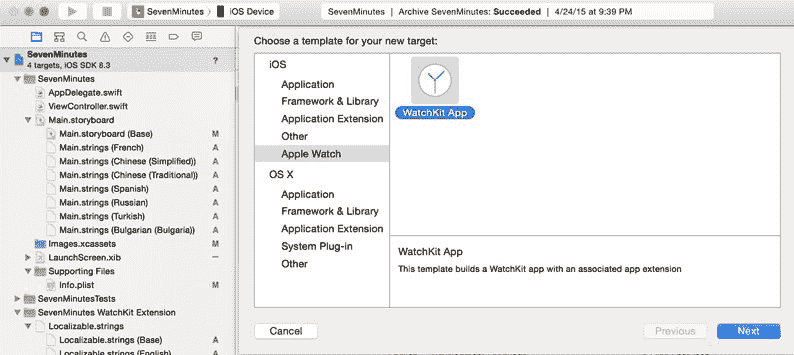T2】](https://d585tldpucybw.cloudfront.net/sfimages/default-source/blogs/older-content/tdn/1.jpg?sfvrsn=5ba88b3d_1)

如果您想要创建一个全新的项目，可以像在 Xcode 中一样创建它，然后向其中添加 WatchKit 扩展。虽然你不必建立一个完整的应用生态系统——完整的原生 iOS 应用加上 WatchKit 应用——但 app store 不会提供一个除了 WatchKit 扩展应用之外什么都不是的应用，而且你的新应用可能很难被发现。

这种“附加”架构也影响了你为腕表设计的方式。请注意，手表主要是一种通知设备。当你需要快速做一些事情时，比如浏览一条信息，远程控制你的 iPhone 播放一首歌或快速拍照，它最适用。你为手表开发的应用程序类型受到我们目前在这个小屏幕上可以做的事情数量的严重限制。也许不值得为你的 iOS 应用创建手表扩展。例如，如果你的应用主要是基于视频的，答案是“可能不是”。

手表的电池寿命短，这也决定了它会非常频繁地“休眠”,而且毫无察觉！这给包含定时锻炼间隔的健身应用程序带来了一个问题，因为手表睡眠时计时器会停止。由于目前没有像科尔多瓦应用程序那样的“失眠”插件，一些应用程序正在尝试变通办法，比如基本上在 iPhone 上运行，当手机醒来时，手表计时器会“赶上”手机计时器。随着手表的发展，观察健身应用如何发展以适应这种“瞌睡”倾向将是一件有趣的事情。

下面是一些有用的提示和代码片段，它们在开发中引起了麻烦，但是这里有现成的供您尝试！

## Jen 的有用技巧#1:主从表

学习 WatchKit 开发最有用的网站之一是机器人 Natasha 的伟大网站，里面有很多技巧和教程。我知道我需要创建一个动态生成的主详细信息屏幕，其中列出了锻炼时间间隔，并且能够点击特定的时间间隔并只执行该部分锻炼。跟随[这个教程](http://natashatherobot.com/watchkit-create-table/)将帮助你建立初始表格，但是点击表格行应该只显示间隔以及完成间隔的计时器。

### 构建表格的视觉元素

要创建一个主从屏幕系列，您需要首先在故事板中构建一个表格。在表格单元格中添加图像和标签等元素:

[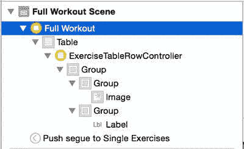T2】](https://d585tldpucybw.cloudfront.net/sfimages/default-source/blogs/older-content/tdn/4.jpg?sfvrsn=84ba0e35_1)

### 填充表格

现在，通过引用一个元素数组来动态填充该表:

```
@IBOutlet weak var exerciseTable: WKInterfaceTable!

let exercises = ["Jumping_Jacks","Crunches","Wall_Sit","Lunges","Squats","Triceps_Dips","Plank","High_Knees","Pushups","Pushup_Rotation","Chair_Step","Side_Plank"]

override func awakeWithContext(context: AnyObject?) {
    super.awakeWithContext(context)
    // Configure interface objects here.
    loadTableData()
}

private func loadTableData() {

exerciseTable.setNumberOfRows(exercises.count, withRowType: "ExerciseTableRowController")

    for (index, exerciseName) in enumerate(exercises) {
        let row = exerciseTable.rowControllerAtIndex(index) as! ExerciseTableRowController

        row.interfaceLabel.setText(NSLocalizedString(exerciseName, comment:"translated exercise name"))
        row.interfaceImage.setImage( UIImage(named:exerciseName))
    }
}
```

这里，我们构建了一个表，它通过引用与练习数组中的练习同名的图像，并通过类似地显示该练习名称的本地化版本的标签(下面将详细介绍本地化)来创建行。

### 添加图像

WatchKit 要求我们向手表应用程序添加三个版本的图像，因此我们为每个锻炼图像创建了三个版本，大小适合标准、@2x 和@3x 图像，并将它们拖到 images.xcassets 文件夹中。确保它们的名称与上面数组的元素相匹配，这样它们就可以放入表中。

[T2】](https://d585tldpucybw.cloudfront.net/sfimages/default-source/blogs/older-content/tdn/5.jpg?sfvrsn=4327b558_1)

### 添加 segue

确保主场景有一个从主场景到细节场景的“推进序列”。通过右键单击主场景的表格并按住 control 键单击，然后将推动作拖到细节屏幕中的后续出口，来创建一个片段。

[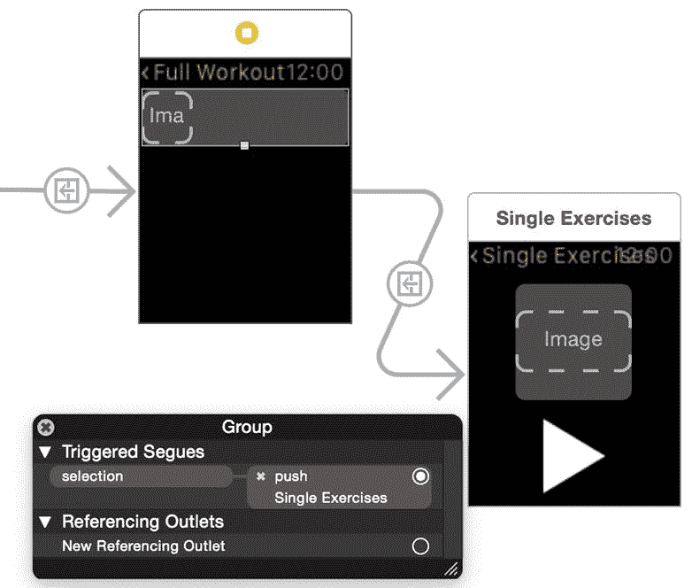T2】](https://d585tldpucybw.cloudfront.net/sfimages/default-source/blogs/older-content/tdn/3.jpg?sfvrsn=e0a648a6_1)

### 创建详细信息屏幕

在 Storyboard 中构建了细节屏幕后，我们需要确保当我们点击主场景上的一行时，细节屏幕会打开并显示正确的信息。为了显示我们点击的表格行的细节，我们只需覆盖`awakeWithContext`函数来获取我们刚刚点击的行的上下文，并显示被引用的图像:

```
override func awakeWithContext(context: AnyObject?) {
    super.awakeWithContext(context)

    if let exerciseName = context as? String {
        exerciseLabel.setText(NSLocalizedString(exerciseName, comment:"translated exercise name"))
        exerciseImage.setImage(UIImage(named:exerciseName))
    }

}
```

## Jen 的有用技巧#2:本地化

以我的经验来看，下载的最大驱动力是本地化或翻译应用程序中的文本。幸运的是，我已经准备了一个电子表格，里面有这个锻炼应用程序中动作的翻译，所以我只需要插入它们...但是怎么做呢？

要本地化您的手表应用程序，请在 Xcode 中点击应用程序项目，然后点击项目名称，进入构建设置。单击底部的“+”号添加翻译。您可能只需要翻译 WatchKit 扩展区域中的元素，因此您可以选择只向该区域添加可本地化的文件。

[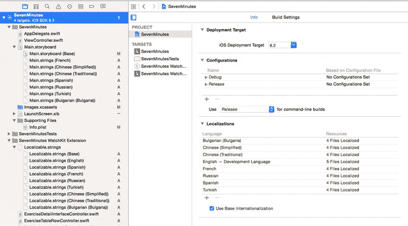T2】](https://d585tldpucybw.cloudfront.net/sfimages/default-source/blogs/older-content/tdn/7.jpg?sfvrsn=b1e7e601_1)

如果不存在，请选择“文件”>“新建”>“文件”,然后选择“资源”>“字符串”,将名为 Localizable.strings 的文件添加到 WatchKit 扩展中。该文件的名称很重要——确保它名为“Localizable.strings”。

[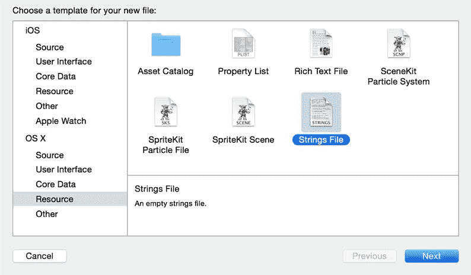T2】](https://d585tldpucybw.cloudfront.net/sfimages/default-source/blogs/older-content/tdn/9.jpg?sfvrsn=df4fc61d_1)

随着您添加语言，您的可本地化字符串文件将逐渐添加到您的应用程序中，并且看起来像名称/值对:

```
Take_10 = "Pause 10 Secondes";
Get_Ready = "Préparez-vous!";
App_Name = "Sept Minutes";
Pushups = "Pompes";
Wall_Sit = "Chaise";
Side_Plank = "Planche Costale";
Jumping_Jacks = "Jumping Jacks";
Crunches = "Abdominaux";
Chair_Step = "Step sur Chaise";
Squats = "Squats";
Triceps_Dips = "Dips Triceps";
Plank = "Gainage";
High_Knees = "Montée de Genoux";
Lunges = "Fente Avant";
Pushup_Rotation = "Pompes Alternées";
Bravo = "Bravo!"; 
```

最后，您需要确保您的应用程序能够动态加载各种翻译。你不用硬编码你的标签，而是使用`NSLocalizedString`:

```
timerLabel.setText(NSLocalizedString("Get_Ready",comment:"get ready"))
```

通过切换语言和重新加载手表模拟器来测试您的本地化。有些语言非常冗长，可能需要启用标签换行。

[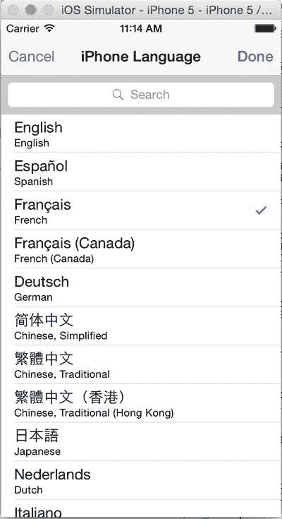T2】](https://d585tldpucybw.cloudfront.net/sfimages/default-source/blogs/older-content/tdn/10.jpg?sfvrsn=e70d2ec7_1)

在模拟器中查看您的本地化 WatchKit 应用程序:

[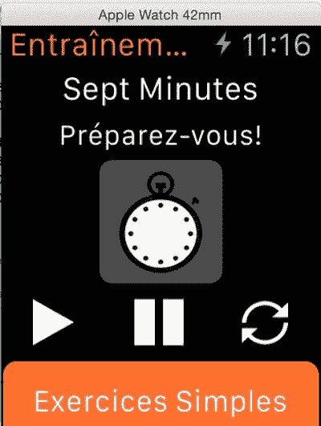T2】](https://d585tldpucybw.cloudfront.net/sfimages/default-source/blogs/older-content/tdn/11.jpg?sfvrsn=f0316f01_1)

### 迈克尔的有用提示#3:苹果手表应用图标

您刚刚创建了一个包含 WatchKit 的精彩应用程序。您的测试通过了，它在模拟器和您的设备上看起来和感觉都很棒。是时候出货了！但是等等，你忘了应用图标。导航到 WatchKit 应用程序并打开 Images.xcassets 后，您会看到以下屏幕:

[T2】](https://d585tldpucybw.cloudfront.net/sfimages/default-source/blogs/older-content/tdn/appiconbefore.jpg?sfvrsn=69822ad0_1)

快速浏览一下，你需要创建八个不同的图标。好消息是，如果你有一个 1024x1024 的 png、psd 或 jpg，那么你可以使用[makeappicon.com](http://makeappicon.com/)。

只需将您的 png、jpg 或 psd 文件拖放到“烤面包机”中，它不仅为您的 AppleWatch 应用程序，还为 Android 和 iOS 应用程序提供了一组漂亮的图标！

[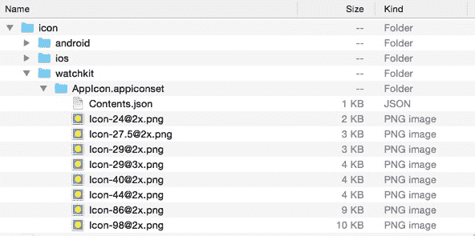T2】](https://d585tldpucybw.cloudfront.net/sfimages/default-source/blogs/older-content/tdn/iconsaftermakeappicon.jpg?sfvrsn=7d2cce14_1)

现在，你所要做的只是简单地将它们拖放到你的项目中，无论你的用户使用什么尺寸的 Apple Watch，它们都将工作。下面是我的应用程序使用生成的图标的最终结果:

[T2】](https://d585tldpucybw.cloudfront.net/sfimages/default-source/blogs/older-content/tdn/appiconafter.jpg?sfvrsn=7a38d083_1)

一旦 WatchKit 应用程序部署到你的手表上，你的用户就会看到一个漂亮的圆形图标。

[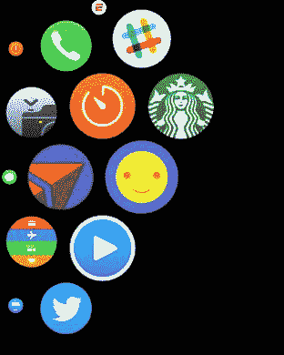T2】](https://d585tldpucybw.cloudfront.net/sfimages/default-source/blogs/older-content/tdn/icononmywatch.jpg?sfvrsn=f8f98a94_1)

### Michael 的有用技巧#4:部署

您准备将应用程序部署到 App Store 的时刻已经到来。首先选择您的 iOS 应用程序，并将设备更改为 iOS 设备。现在选择产品->存档，如下所示:

[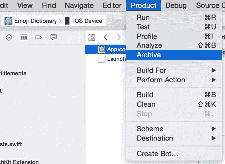T2】](https://d585tldpucybw.cloudfront.net/sfimages/default-source/blogs/older-content/tdn/xcodearchive.jpg?sfvrsn=41ef1b21_1)

这将把您带到一个屏幕，允许您验证您的应用程序并将其提交到 App Store。

[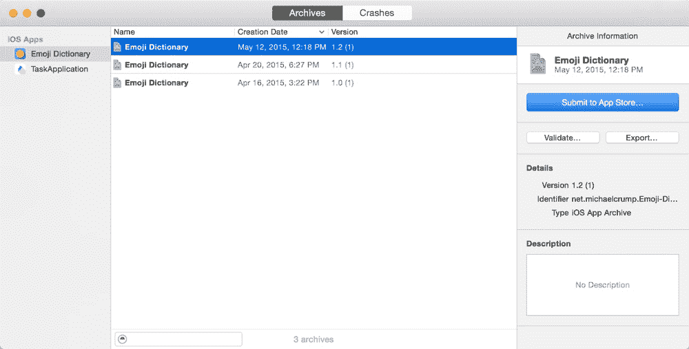T2】](https://d585tldpucybw.cloudfront.net/sfimages/default-source/blogs/older-content/tdn/archiveviewer.jpg?sfvrsn=d6afa67d_1)

我通常先点击“验证”按钮，如果 Xcode 检测到错误，它会立即显示“访问会员中心”等选项。

[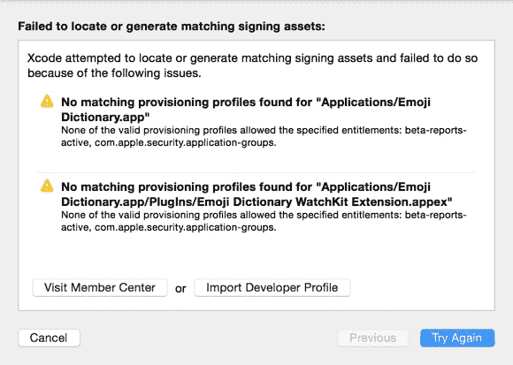T2】](https://d585tldpucybw.cloudfront.net/sfimages/default-source/blogs/older-content/tdn/errormessage.jpg?sfvrsn=4f97bacb_1)

在提交我的第一个 Apple Watch 应用程序的情况下，我必须进入会员中心，为我的 iOS 应用程序和 WatchKit 应用程序创建两个预置描述文件，如下所示。

[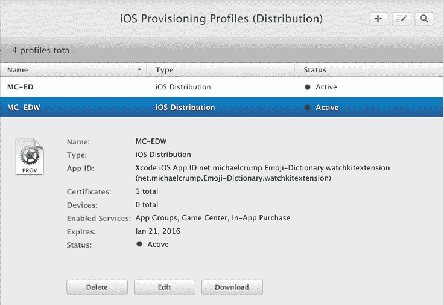T2】](https://d585tldpucybw.cloudfront.net/sfimages/default-source/blogs/older-content/tdn/iosprovisioningprofiles.jpg?sfvrsn=27d809eb_1)

一旦完成，我就可以向商店提交我的申请了。

[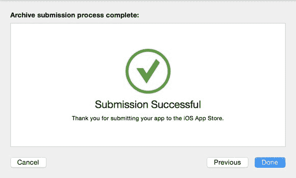T2】](https://d585tldpucybw.cloudfront.net/sfimages/default-source/blogs/older-content/tdn/successfulsubmission.jpg?sfvrsn=a7cacf41_1)

将您的应用程序上传到商店后，您现在需要做的就是导航到您的 iOS 应用程序，它会自动检测到该应用程序支持 WatchKit，并要求您填写图标并上传最多 5 张本地化截图，如下所示:

[T2】](https://d585tldpucybw.cloudfront.net/sfimages/default-source/blogs/older-content/tdn/appsubmission.jpg?sfvrsn=c8e555d4_1)

您已经有一个图标，所以只需将图标拖放到占位符中。就截图而言，你可以在模拟器上使用 CMD-S，或者按住 Apple Watch 上的侧边按钮，然后立即同时按住并释放数字表冠。在你截屏之后，你可以在你的 iPhone 上的照片应用中找到它。

## 亲爱的苹果...

我们想以一些我们想添加到 Apple Watch 愿望清单中的项目来结束这篇文章。首先，最好能有一种方法让手表保持清醒——例如，设置中的一些东西，可以让设备不那么“困”。其次，我们目前无法从应用程序的代码中控制声音或触觉反馈。对于一个健身应用程序来说，能够用嗡嗡声或 ping 来标记间隔是理想的。第三，强迫开发者使用故事板来定义他们的应用程序的内容和流程，使得与分布式团队分享你的 UI 想法和进展变得非常困难。最后，我们正在寻找更多的 UI 控件用于我们的应用程序。手表开发者们，随着这个新生态系统的成熟和发展，你们还希望看到什么？在下面添加您的评论。