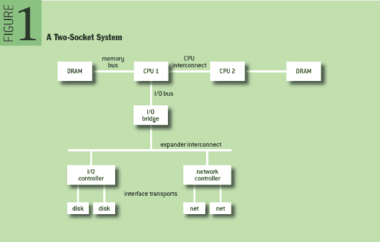
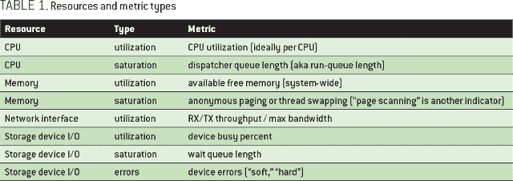
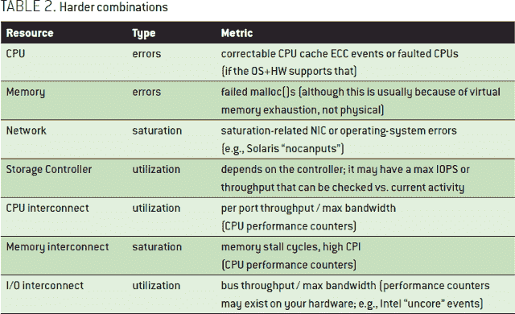
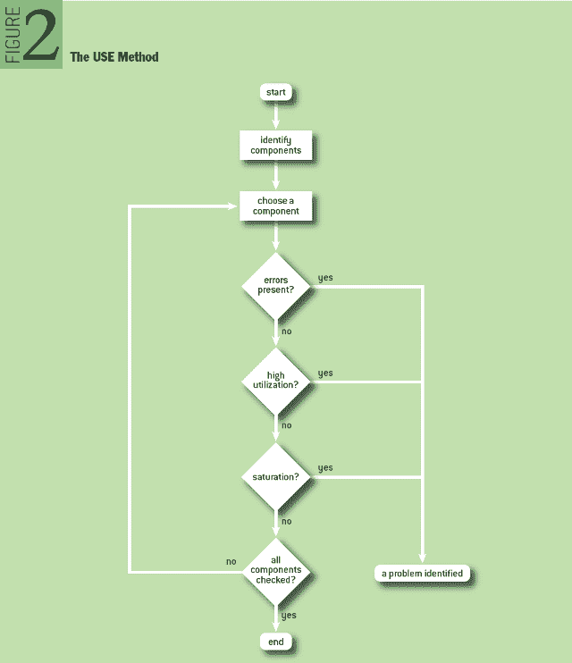

# 关于性能的系统思考——ACM 队列

> 原文：<http://queue.acm.org/detail.cfm?id=2413037&utm_source=wanqu.co&utm_campaign=Wanqu+Daily&utm_medium=website>

<label>December 11, 2012
**[Volume 10, issue 12](issuedetail.cfm?issue=2405116)**</label>

# 系统地思考绩效

## USE 方法解决了其他常用方法中的缺点。

### Brendan Gregg，Joyent

性能问题可能是复杂而神秘的，很少或根本没有提供其根源的线索。在没有起点或者提供起点的方法的情况下，性能问题经常被随机分析:猜测问题可能在哪里，然后改变事情直到它消失。虽然这可以产生结果(如果你猜得没错的话),但它也很耗时，会造成干扰，最终可能会忽略某些问题。本文描述了系统性能问题和目前用于分析这些问题的方法，并提出了一种处理和解决一类问题的新方法。

系统性能分析是复杂的，因为在一个典型的系统中有许多组件以及它们之间的相互作用。环境可能由数据库、Web 服务器、负载平衡器和自定义应用程序组成，所有这些都运行在操作系统上—裸机或虚拟。这还只是软件。硬件和固件，包括外部存储系统和网络基础架构，给环境增加了更多组件，其中任何一个都是问题的潜在来源。这些组件中的每一个都可能需要其自己的专业领域，并且公司可能没有对其环境中的所有组件都了如指掌的员工。

性能问题也可能是由独立工作的组件之间的复杂交互引起的。解决这类问题可能需要多个专业领域的合作。

作为环境中这种复杂性的一个例子，考虑我们在 Joyent 为一个云计算客户遇到的一个神秘的性能问题:问题似乎是内存泄漏，但是来自一个未知的位置。这在元件隔离的实验室环境中是不可重现的。生产环境包括操作系统和系统库、客户自己用 node.js 编写的应用程序代码，以及运行在 Erlang VM(虚拟机)上的 Riak 数据库。找到根本原因需要了解客户的代码、node.js、Riak、Erlang 和操作系统，其中每一项都是由一个或多个不同的工程师提供的。问题出在系统库中，由具有操作系统专业知识的工程师发现。

另一个复杂的因素是“好”或“坏”的性能可能是主观的:对于一个用户来说不可接受的延迟对于另一个用户来说可能是可以接受的。如果没有明确识别问题的方法，不仅很难知道问题是否存在，而且很难知道问题何时得到解决。测量性能问题的能力——例如，在响应时间方面——允许对它们进行量化，并按照重要性对不同的问题进行排序。

性能分析方法可以提供一种有效的手段来分析系统或组件，并确定问题的根本原因，而不需要深厚的专业知识。方法还可以提供识别和量化问题的方式，让问题为人所知并进行排序。

性能文本为各种活动提供了方法，例如能力规划、 1、16 基准测试、 18 和建模系统。 7，8，10 然而，寻找性能问题根本原因的方法并不常见。一个例子是 *Solaris 性能和工具*、 13 中介绍的深入分析方法，该方法描述了从高级症状向下分析原因的三阶段过程。性能文本通常通过使用最近的技巧和调优的特别清单，以及通过教授操作系统内部机制和工具来涵盖分析。 2，11，12，15 这允许性能分析师开发他们自己的方法，尽管这可能需要相当长的时间来完成。

特别的绩效清单一直是一个受欢迎的资源。例如，*Sun Performance and Tuning*2包括“常见调优技巧快速参考”，其中列出了 11 个技巧，旨在发现磁盘瓶颈、NFS(网络文件系统)、内存和 CPU 问题，并且易于遵循和说明。支持人员组经常使用这些列表，因为它们提供了对所有项目的一致检查，包括最严重的问题。然而，这种方法带来了一些问题。可观察性仅限于列表中的特定项目，它们通常是过时的、需要更新的时间点建议。这些核对表还关注那些已知的可以很容易地记录下来的修复问题，例如可调参数的设置，但不是对源代码或环境的定制修复。

接下来的章节总结了其他几种系统性能分析的方法，包括详细解释的 USE 方法。让我们首先描述两种常用的反方法——责备他人反方法和街灯反方法——作为与后来方法的比较。

### 反方法论

第一种反方法论，责备他人，遵循以下简单步骤:

1.找到一个您不负责的系统或环境组件。

2.假设问题出在该组件上。

3.将问题重定向至负责团队。

4.当证明是错误的，回到第一步。

比如“可能是网络吧。你能不能和网络团队核实一下，看看他们有没有掉包什么的？”

这种方法不是调查性能问题，而是让它们成为其他人的问题，这可能会浪费其他团队的资源。缺乏数据分析——甚至一开始就缺乏数据——导致了这一假设。要求屏幕截图显示哪些工具正在运行，以及它们的输出是如何解释的。这些可以拿给其他人听听第二意见。

虽然运行工具和收集数据比胡乱假设要好，但这不足以进行有效的性能分析，正如 streetlight 反方法所示。这是缺乏任何深思熟虑的方法。用户通过选择熟悉的、在互联网上找到的或随机找到的可观察性工具来分析性能，然后查看是否有任何明显的东西出现。这种漫无目的的方法可能会忽略许多类型的问题。

找到合适的工具可能需要一段时间。首先运行最熟悉的工具，即使它们不是最有意义的。这与一种被称为*路灯效应*、 17 的观察偏差有关，它是以一个寓言命名的:

> 一个警察看见一个醉汉在路灯下找东西，就问他在找什么。那个醉汉说他丢了钥匙。警察也找不到，就问是不是在路灯下丢的。醉汉回答道:“不，但这里光线最好。”

性能等同于查看 top(1)，不是因为它有意义，而是因为用户不知道如何阅读其他工具。

学习更多的工具会有所帮助，但仍然是一种有限的方法。由于缺乏可观察性工具或度量标准，某些系统组件或资源可能会被忽略。此外，用户没有意识到视图是不完整的，没有办法识别“未知的未知”

### 现有的性能分析方法

更好的性能分析方法可以在您运行任何工具之前解决问题。其中包括问题陈述方法、工作负载特征和深入分析。

#### 问题陈述法

支持人员通常用于收集问题信息的问题陈述方法已经被用于性能分析。 9 这可能是针对性能问题尝试的第一种方法。

目的是收集问题的详细描述—问题陈述—以指导更深入的分析。描述本身甚至可以解决这个问题。这通常通过询问以下问题输入到票务系统中:

是什么让你认为存在性能问题？

该系统曾经运行良好吗？

最近发生了什么变化？(软件？硬件？加载？)

性能下降可以用延迟或运行时间来表示吗？

该问题是否会影响其他人或应用程序(或者只是您自己)？

什么是环境？用的是什么软硬件？版本？配置？

这些问题可以根据环境定制。虽然问题可能看起来很明显，但答案通常可以解决一类问题，不需要更深入的方法。如果不是这样，可以调用其他方法，包括工作负载特征和深入分析。

#### 工作负载表征方法

工作负载可以通过回答以下问题来描述:

谁造成了负载？进程 ID，用户 ID，远程 IP 地址？

为什么要调用负载？代码路径？

负载的其他特征是什么？IOPS，吞吐量，类型？

负载如何随时间变化？

这有助于通过识别负载的*问题和架构*的*问题来区分前者。*

最佳绩效往往来自于消除不必要的工作。有时，这些瓶颈是由应用程序故障(例如，线程陷入循环)或不良配置(白天运行系统范围的备份)造成的。通过维护或重新配置，可以消除这种不必要的工作。表征负载可以识别这类问题。

#### 深入分析方法

向下钻取分析涉及剥离软件和硬件层，以找到问题的核心——从高级视图移动到更深的细节。这些更深入的细节可能包括检查内核内部——例如，通过使用概要分析来采样内核堆栈跟踪，或者使用动态跟踪来检查内核函数的执行。

*Solaris 性能和工具* 13 提供了一种深入分析系统性能的方法。它遵循三个阶段:

**监控。**这将持续记录许多系统随时间推移的高级统计数据，发现问题或发出警报。

**识别。**给定一个有可疑问题的系统，使用系统工具并识别可能的瓶颈，将调查范围缩小到特定的资源或感兴趣的领域。

**分析。**此阶段提供对特定系统区域的进一步检查，确定根本原因并量化问题。

分析阶段可能遵循其自己的向下钻取方法，从软件堆栈顶部的应用程序开始，向下钻取系统库、系统调用、内核内部、设备驱动程序和硬件。

虽然向下钻取分析通常可以查明问题的根本原因，但这可能非常耗时，并且当钻取方向错误时，可能会浪费大量时间。

### 对新方法的需求

我最近分析了 Joyent 公共云上的一个数据库性能问题，这个问题始于一张包含问题陈述的票据，如前一节所述。声明指出，有一个真正的问题需要更深入的分析。

这个问题是间歇性的，一些数据库查询需要几秒钟才能完成。客户归咎于网络，假设查询延迟是由丢失的网络数据包引起的。这不是一个疯狂的假设，因为标签包括来自`ping(1)`的输出，显示偶尔的高延迟；`ping(1)`是一个常见和熟悉的工具，但是，在没有其他支持证据的情况下，这似乎是路灯反方法的一个例子。

支持团队运行工具来更详细地调查网络，包括检查 TCP/IP 堆栈网络计数器，但没有发现任何问题。这种分析需要时间，因为有几十个这样的统计数据，其中一些很难解释，必须随着时间的推移进行检查，以寻找相关性。在登录系统时，该团队还按照他们自己的常见问题特别清单，对照云强加的限制检查 CPU 使用情况。他们的结论是，在他们观察时没有问题:网络和 CPU 都很好。

此时，许多系统组件和数以万计的系统统计数据尚未检查，因为它们被认为与问题无关。如果没有方向可循，检查客户云环境中所有系统的一切可能需要几天时间。迄今为止的分析还没有发现任何真正问题的证据，这令人沮丧。

下一步是尝试动态跟踪最初报告的问题(网络数据包丢失)，希望找到标准网络计数器遗漏的东西。我已经多次使用 DTrace 工具对 TCP/IP 堆栈进行深入分析。这可以提供标准网络可观察性工具集之外的许多细节，包括检查内核丢弃的数据包和内部 TCP 状态。然而，捕捉间歇性问题仍然需要几个小时。我尝试从数据库查询延迟开始深入分析，以防问题与网络无关，或者开始描述随着时间推移数据库工作负载的特征，以防问题是由负载激增引起的，但是这些方法也很耗时。

在开始更深入的分析之前，我想对所有系统组件进行快速检查，而不仅仅是网络和 CPU，以寻找瓶颈或错误。为了快速实现这一点，只需要检查每个系统有限数量的统计数据，而不是成千上万的可用统计数据。为了完成这一点，它需要检查所有的组件，包括那些因为默认情况下没有可观察性工具或统计数据而可能遗漏的组件。

USE 方法提供了这样做的一种方式。很快就发现数据库系统内存不足，正在分页，磁盘偶尔会饱和运行。早期将故障排除工作集中在网络上意味着团队的分析忽略了这些方面。真正的问题出在系统内存和磁盘上，它们的读取和解释速度要快得多。

我在讲授操作系统性能课程时开发了 USE 方法。目标是帮助我的学生找到共同的问题，并确保他们没有忽略重要的领域。我已经在企业和云计算环境中成功地使用了它很多次，但是它并不能解决所有类型的问题，应该被视为工具箱中的一种方法。

### 使用方法

USE(针对利用率、饱和度和错误)方法旨在问题陈述方法之后，在性能调查的早期使用，以快速识别系统瓶颈。它可以概括为:

对于每个资源，检查利用率、饱和度和错误。

*这里的资源*是指所有物理服务器功能组件(CPU、磁盘、总线等。)逐个检查。如果度量标准有意义，一些软件资源可以使用相同的方法来检查。

*利用率*是特定时间间隔内资源忙于服务工作的时间百分比。忙碌时，资源可能仍然能够接受更多的工作；它不能这样做的程度由*饱和度*确定。这些额外的工作经常排队等候。

对于某些资源类型，包括主内存，利用率是所使用资源的*容量*。这不同于基于时间的定义。一旦容量资源达到 100%的利用率，就不能再接受更多的工作，它要么将工作排队(饱和)，要么返回错误，这两种情况都由 USE 方法确定。

*错误*就使用方法而言是指错误事件的计数。应该调查错误，因为它们会降低性能，并且当故障模式可恢复时，它们可能不会立即被注意到。这包括失败并重试的操作，以及冗余设备池中失败的设备。

与街灯反方法相比，USE 方法迭代系统资源，而不是从工具开始。这将创建一个完整的问题列表，然后搜索工具来回答这些问题。即使找不到工具来回答这些问题，这些问题没有答案的知识对性能分析师来说也是非常有用的:它们现在是“已知的未知”

USE 方法还将分析指向有限数量的关键指标，以便尽可能快地检查所有系统资源。在此之后，如果没有发现问题，您可以转向其他方法。

#### 表达度量

使用方法的关键指标通常表示如下:

一段时间间隔内的利用率百分比(例如，一个 CPU 的利用率为 90%)。

等待队列长度饱和(例如，CPU 的平均运行队列长度为 4)。

报告的错误数量(例如，网络接口有 50 个最新冲突)。

表达测量的时间间隔也很重要。虽然这看起来可能违反直觉，但短暂的高利用率爆发会导致饱和和性能问题，即使整体利用率在很长一段时间内都很低。一些监控工具将利用率报告为五分钟平均值。例如，CPU 利用率每秒钟都有很大变化，五分钟的平均值可能会掩盖短时间内 100%的利用率，从而掩盖饱和状态。

#### 资源列表

USE 方法的第一步是创建一个资源列表。尽量做到完整。以下是服务器硬件资源的一般列表，并附有具体示例:

**CPU**—插槽、内核、硬件线程(虚拟 CPU)。

**主存储器** —DRAM。

**网络接口**—以太网端口。

**存储设备**—磁盘。

**控制器**—存储、网络。

**互连** —CPU、内存、I/O。

每个组件通常充当一种资源类型。例如，主内存是一种*容量*资源，网络接口是一种 *I/O* 资源，可以用 IOPS(每秒 I/O 操作数)或吞吐量来衡量。一些组件可以表现为多种资源类型，例如，存储设备既是 I/O 资源又是容量资源。考虑所有可能导致性能瓶颈的类型。还要注意，I/O 资源可以进一步研究为*排队系统*，它对这些请求进行排队然后服务。

一些物理组件可以从您的清单中删除，例如硬件缓存(例如，MMU TLB/TSB，CPU 级别-1/2/3)。USE 方法对于在高利用率或饱和状态下遭受性能下降，导致瓶颈的资源最有效；缓存*在高利用率下提高*性能。

在应用 USE 方法之后，也就是说，在排除了系统瓶颈之后，可以检查缓存命中率和其他性能属性。如果您不确定是否要包含一个资源，那么就继续包含它，然后看看这些指标在实践中的表现如何。

#### 功能框图

另一种迭代资源的方法是为系统寻找或绘制一个功能框图 3 。这种类型的图表还显示关系，这在查找数据流中的瓶颈时非常有用。图 1 是显示双插槽系统的一般示意图。

在确定各种总线的利用率时，在功能图上标注每条总线的最大带宽。生成的图表可以在进行单个测量之前查明系统瓶颈。(在硬件产品设计期间，这也是一个有用的练习，同时您还有时间更改物理组件。)

CPU、内存和 I/O 互连经常被忽略。幸运的是，它们通常不是系统瓶颈的原因。不幸的是，当它们存在时，问题可能很难解决(也许您可以升级主板或减少负载(例如，“零拷贝”项目减轻内存总线负载)。至少使用方法考虑了互连性能。(参见*分析超传输* 4 以这种方式识别互连问题的示例。)

#### 韵律学

一旦有了资源列表，就要考虑每个资源需要的度量类型(利用率、饱和度和错误)。表 1 列出了一些示例资源和指标类型，以及可能的指标(来自通用 Unix/Linux)。这些指标可以表示为每个间隔的平均值或计数。

对所有组合重复上述步骤，并包括获取每个指标的说明。记下当前不可用的度量:这些是“已知的未知”您将最终得到一个大约 30 个指标的列表，其中一些很难度量，一些根本无法度量。已经为基于 Linux 和 Solaris 的系统构建了示例清单。 5，6

幸运的是，最常见的问题通常是在较简单的指标中发现的(例如，CPU 饱和、内存容量饱和、网络接口利用率、磁盘利用率)，因此可以首先检查这些问题。

#### 更难的指标

表 2 列出了一些硬组合的例子。标准操作系统工具可能无法提供其中一些指标。我经常不得不使用静态或动态跟踪(DTrace)或 CPU 性能计数器工具为这样的指标编写自己的软件。

#### 软件资源

一些软件资源可以被类似地检查。这通常适用于较小的软件组件，而不是整个应用程序。例如:

**互斥锁。**利用率可以定义为持有锁的时间、排队等待锁的线程的饱和。

**线程池。**利用率可以定义为线程忙于处理工作的时间，由等待线程池服务的请求数量饱和。

**进程/线程能力。**系统可能具有有限数量的进程或线程，其当前使用可被定义为利用率；等待分配可能表示饱和；并且当分配失败时发生错误(例如，“不能分叉”)。

**文件描述符容量。**这和上面的类似，但是针对文件描述符。

如果度量标准运行良好，那么就使用它们；否则，软件故障排除可以留给其他方法。

#### 建议的解释

使用方法有助于确定使用哪些指标。在您学会如何从操作系统中读取它们之后，您的下一个任务是解释它们的当前值。对于一些度量标准，解释可能是显而易见的(并且有很好的文档记录)。其他的不太明显，可能取决于工作量要求或预期。以下是解释度量类型的一些一般性建议:

**利用率。**100%的利用率通常是瓶颈的标志(检查饱和度及其影响以确认)。由于多种原因，高利用率(例如，超过 60%)可能会成为一个问题。首先，当在相对长的时间段(几秒或几分钟)内测量利用率时，比如说 60%的总利用率可能会掩盖 100%利用率的短时间爆发。其次，一些系统资源，如硬盘，通常不能在操作过程中被中断，即使对于更高优先级的工作也是如此。相比之下，CPU 几乎随时都可能被中断(“抢占”)。一旦磁盘利用率超过 60 %,随着队列的尾部变得更长，排队延迟会变得更加频繁和明显。这可以使用排队论来量化，以模拟响应时间与利用率(例如，将磁盘模拟为 M/M/1)。

**饱和度。**任何饱和度都可能是问题(非零)。这可以通过等待队列的长度或在队列中等待的时间来衡量。

**错误。**非零错误计数器值得研究，特别是当性能很差时，如果它们仍在增加。

很容易解释消极的情况:低利用率，不饱和，没有错误。这比听起来更有用。缩小调查范围有助于您快速关注问题所在。

#### 云计算

在云计算环境中，软件资源控制可能会限制或抑制共享一个系统的租户。在 Joyent，我们主要使用操作系统虚拟化(基于 SmartOS 的 SmartMachine)，它会对内存和 CPU 进行限制，并对存储 I/O 进行节流。这些资源限制中的每一个都可以使用 USE 方法进行检查，类似于检查物理资源。

例如，在我们的环境中*内存容量利用率*可以是租户的内存使用量与其内存上限。*匿名分页活动可以看到内存容量饱和*，即使传统的 Unix 页面扫描器可能处于空闲状态。

#### 战略

使用方法如图 2 中的流程图所示。错误排在第一位，因为它们通常比利用率和饱和度更容易、更快地被解释。

使用方法识别可能成为系统瓶颈的问题。不幸的是，一个系统可能遇到不止一个性能问题，所以您发现的第一个问题可能是一个问题，但不是*问题。您可以使用进一步的方法研究每个发现，然后根据需要返回到 USE 方法来迭代更多的资源。或者你会发现先完成使用方法清单，列出所有发现的问题，然后根据其可能的优先级调查每个问题会更有效。*

进一步分析的方法包括前面总结的工作负载特征和深入分析方法。完成这些之后(如果需要)，您应该有证据来确定所需的纠正措施是调整应用的负载还是调整资源本身。

### 其他方法

虽然以前的方法可能解决大多数服务器问题，但基于延迟的方法(例如，方法 R 14 )可能会找到所有问题的 100%。但是，如果您不熟悉软件的内部结构，这些方法可能会花费更多的时间，而且它们可能更适合已经熟悉软件的数据库管理员或应用程序开发人员。

### 结论

系统性能分析可能很复杂，任何组件都可能出现问题，包括它们之间的交互。今天普遍使用的方法有时类似于猜测:尝试熟悉的工具或提出没有确凿证据的假设。

USE 方法是为了解决其他常用方法中的缺点而开发的，是执行系统健康状况完整检查的简单策略。它考虑所有的资源，以避免忽略问题，并且它使用有限的度量标准，以便可以快速跟踪。这对于分布式环境尤其重要，包括云计算，其中可能需要检查许多系统。然而，这种方法只能发现某些类型的问题——瓶颈和错误——并且应该被视为一个更大的方法工具箱中的一个工具。

#### 参考

1.奥尔斯帕，J. 2008。*能力规划的艺术*。奥赖利。

2.科克罗夫特，1995 年。*孙性能与调优*。普伦蒂斯霍尔。

3.功能框图；[http://en.wikipedia.org/wiki/Function_block_diagram](https://en.wikipedia.org/wiki/Function_block_diagram)。

4.格雷格，B. 2009。7410 硬件更新，并分析超传输；[dtrace . org/blogs/Brendan/2009/09/22/7410-hardware-update-and-analyzing-the hypertransport/](http://dtrace.org/blogs/brendan/2009/09/22/7410-hardware-update-and-analyzing-thehypertransport/)。

5.格雷格，B. 2012。使用方法:Linux 性能检查表；[http://dtrace . org/blogs/Brendan/2012/03/07/the-use-method-Linux-performance-check list/](http://dtrace.org/blogs/brendan/2012/03/07/the-use-method-linux-performance-checklist/)。

6.格雷格，B. 2012。使用方法:Solaris 性能检查表；[http://dtrace . org/blogs/Brendan/2012/03/01/the-use-method-Solaris-performance-check list/](http://dtrace.org/blogs/brendan/2012/03/01/the-use-method-solaris-performance-checklist/)。

7.甘瑟，N. 2007。*游击能力规划*。斯普林格。

8.冈瑟，N. 1997。*实战性能分析师*。麦格劳·希尔。

9.哈格里夫斯，2011 年。我有一个性能问题；[http://Alan Hargreaves . WordPress . com/2011/06/27/I-have-a-performance-problem/](https://alanhargreaves.wordpress.com/2011/06/27/i-have-a-performance-problem/)。

10.贾恩，R. 1991 年。*计算机系统性能分析的艺术*。威利。

11.Loukidas，M. 1990。*系统性能调优*。奥赖利。

12.麦克杜格尔，r。毛罗，j。2006。 *Solaris 内部——Solaris 10 和 OpenSolaris 内核架构。*徒弟堂。

13.麦克杜格尔，r。毛罗，j。格雷格，b。2006。 *Solaris 性能和工具:适用于 Solaris 10 和 OpenSolaris 的 DTrace 和 MDB 技术*。普伦蒂斯霍尔。

14.米尔萨普，c .，霍尔特，J. 2003。*优化 Oracle 性能*。奥赖利。

15.2002 年获硕士学位。*系统性能调优*，第二版。奥赖利

16.Schlossnagle，2006 年。*可扩展的互联网架构*。萨姆斯出版社。

17.路灯效果；[http://en.wikipedia.org/wiki/Streetlight_effect](https://en.wikipedia.org/wiki/Streetlight_effect)。

18.黄，学士，1997。【Solaris 服务器的配置和容量规划。普伦蒂斯霍尔。

#### 承认

Carry Millsap 的方法论研究，包括方法 R，给了我灵感，也是我记录系统方法论的动力。感谢 Bryan Cantrill 对本文的帮助以及对 DTrace 的开发 DTrace 使系统方法学得以开发并在实践中使用，远远超出了传统的可观察性。感谢 Deirdré Straughan 的编辑和反馈。

爱它，恨它？让我们知道

[【邮件保护】](/cdn-cgi/l/email-protection#c9afacacadaba8aaa289b8bcacbcace7a8aaa4e7a6bbae)

**Brendan Gregg** 是 Joyent 的首席性能工程师，在那里他分析软件栈的任何级别的性能和可伸缩性。他是 *DTrace* (Prentice Hall，2011)的第一作者，也是*Solaris Performance and Tools*(Prentice Hall，2006)的合著者，以及许多关于系统性能的文章。他之前是 Sun Microsystems 的性能主管和内核工程师，在那里他开发了 ZFS L2ARC。他还开发了许多性能分析工具，包括 Mac OS X 和 Oracle Solaris 11 中默认提供的一些工具。他最近的工作包括 illumos 和 Linux 内核分析的性能可视化。

2012 年 ACM 1542-7730/11/1200 10.00 美元

*原载于《队列》第 10 卷第 12 期*——
见本条目于 [ACM 数字图书馆](https://portal.acm.org/citation.cfm?id=2413037)

* * *

更多相关文章:

Noor Mubeen - [**工作负载频率缩放法则-推导和验证**](detail.cfm?id=3229201)
本文给出了与每个 DVFS 子系统级别的工作负载利用率缩放相关的等式。建立频率、利用率和比例因子(其本身随频率变化)之间的关系。对这些等式的验证变得很棘手，因为对于工作负载来说，利用率在治理样本的粒度上似乎以一种不确定的方式变化。因此，应用了一种称为直方图脊迹的新方法。将 DVFS 视为构造块时，量化扩展影响至关重要。典型应用包括 DVFS 调控器和/或影响系统利用率、功率和性能的其他层。

在一个 DevOps 的世界里
的监控看起来会让人不知所措。最重要的是要记住，完美永远不应该是更好的敌人。DevOps 支持组织内部的高度迭代改进。如果你没有监控，拿点东西；得到任何东西。有总比没有好，如果你已经接受了 DevOps，你已经同意随着时间的推移让它变得更好。

乌兰·德根巴耶夫，约亨·艾辛格，曼弗雷德·恩斯特，罗斯·麦克洛伊，汉尼斯·帕耶 - [**空闲时间垃圾收集调度**](detail.cfm?id=2977741)
谷歌的 Chrome 网络浏览器努力提供流畅的用户体验。一个动画将以 60 FPS(每秒帧数)的速度更新屏幕，给 Chrome 大约 16.6 毫秒的时间来执行更新。在这 16.6 毫秒内，必须处理所有输入事件，执行所有动画，最后渲染帧。错过截止日期将导致丢帧。这些对用户来说是可见的，并且降低了用户体验。这种零星的动画工件在这里被称为 jank。本文描述了一种在 JavaScript 引擎 V8 中实现的方法，Chrome 使用这种方法在 Chrome 空闲时安排垃圾收集暂停。

Neil Gunther，Paul Puglia，Kristofer Tomasette-[**Hadoop 超线性可伸缩性**](detail.cfm?id=2789974)
我们经常看到超过 100%的加速效率！有人天真地提醒说，你不可能拥有任何东西的 100%以上。但这只是软件工程师在一次关于如何根据加速度量来量化计算机系统可伸缩性的演讲中的第一枪。在不同的场合，在随后的场合，这种反驳似乎变成了名副其实的合唱，不仅超线性加速普遍被观察到，而且过去 20 年用于量化可扩展性的模型在应用于超线性加速数据时也失败了。

* * *

* * *

 
ACM 公司版权所有。