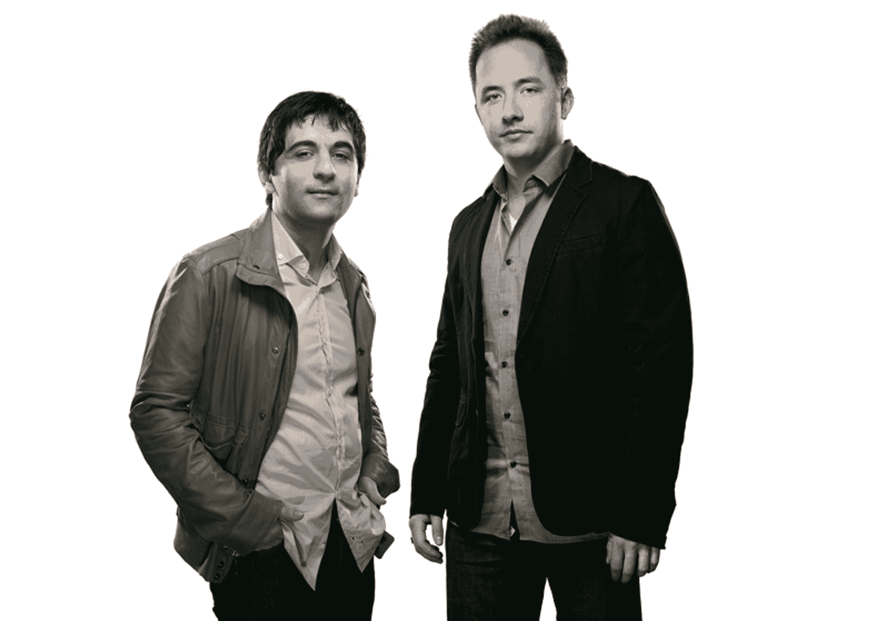

# 如何赢得作为第一次创始人，一个德鲁休斯顿宣言|第一轮审查

> 原文：<http://firstround.com/review/How-to-Win-as-a-First-Time-Founder-a-Drew-Houston-Manifesto/?utm_source=wanqu.co&utm_campaign=Wanqu+Daily&utm_medium=website>

2007 年， **[德鲁·休斯顿](https://www.crunchbase.com/person/drew-houston "null")** 飞到三藩市决心为 **[Dropbox](https://www.dropbox.com/home "null")** 找一个联合创始人。当时，只有他一个人。没有支持者。没有团队。在一个朋友的建议下，他主动走进 Y Combinator 的办公室，与保罗·格拉厄姆谈论寻找合适的人选。不太顺利。

“这不是一次很好的经历，不请自来，”休斯顿最近在麻省理工学院宿舍基金 的独家采访中告诉学生。“进入 Y Combinator 就像进入一所很棒的学校。所以想象一下，你和招生办主任在一起的两分钟，他们离开时会认为你是个混蛋。那次返程是最糟糕的。没有联合创始人。进入 YC 的机会更小。我慌了。”

好消息是，早期创始人可以扭转局面。在他以为一切都结束后不久，休斯顿与麻省理工学院校友阿拉什·菲尔多西合作，成功进入了 YC。如今，他带领 Dropbox 拥有近 2 亿用户，而且公司的发展速度比以往任何时候都快。这并不是小菜一碟，但休斯顿的艰难起步确实教会了他勇往直前，摒弃那些让许多潜在创业者望而却步的假设。**回顾过去，他推荐了六个策略，帮助他消除恐惧，淹没噪音，实现梦想。**

# 1)从一个有价值的问题开始。

未来的企业家会发现问题。当他还在上大学的时候，休斯顿注册了一个在线游戏的 beta 测试。当他没有事情可做时，他开始在引擎盖下四处打探，他发现了一堆安全漏洞。

“所以我开始在游戏上到处乱砍，最后告诉开发者，‘嘿，伙计们，你们必须做这个和这个……’他们回答，‘好的，太好了，想为我们做这些吗？’“休斯顿就是这样得到了他的第一份工程工作。Dropbox 诞生于类似的时刻，当时他只是厌倦了缺乏无缝存储文件的解决方案。

但并不是每个想法都一定是好的，或者值得你花时间。在找到一群有抱负的创始人(有些成功，有些失败)并观察了他们的不同命运后，休斯顿设计了一份清单，以帮助新进入者明智地选择他们的项目:

**它只是拉你**。这是他的建议中最不科学的一个，但是不应该忽视这种直觉，即问题是关键的，需要一个答案。“有时候你就是会有这种感觉——这是一种强迫或痴迷。你不能停止想它。你只需要在这件事上努力，”他说。“无论如何，你都需要那种渴望，因为蜜月期最终会过去。在打印印有“创始人”字样的名片和你必须做的其他事情之间，你意识到，“哦，实际上这是一大堆工作。”"

**你觉得它能走多远**。“有了像 Dropbox 这样的东西，人们马上就会想，‘哇，这简直是任何有互联网连接的人都可以使用的东西。’每个人都需要这样的东西，只是他们还没有意识到。“现在，随着该应用程序接近 2 亿用户，休斯顿已经瞄准了 10 亿用户。”我们生活在一个追求这种东西完全合理的世界，这太疯狂了。但是我看到了我们能做的所有事情，摆在我们面前的机会是如此的巨大。"

它为学习而优化。去你有能力学到最多东西的地方总是明智的。去那些人们聪明而凶猛的地方，因为无论你去哪里，你一定会在潜移默化中学习。“如果你加入一家公司，与世界级的人一起工作，因为这是学习如何做事的最快方法。如果你开始自己的事情，你可以从做错事中学到很多东西。问问你自己，“我在哪里可以找到一个让我真正努力工作并学到最多东西的环境？”"

# 2)承认自己是初学者。

在他的书 *[离群者](http://gladwell.com/outliers/ "null")* 中，马尔科姆·格拉德威尔建议，在你真正成为任何事情的专家之前，需要花费 10000 个小时。鉴于创办一家公司的巨大挑战，有人可能会认为创始人需要有丰富的经验。但是休斯顿不同意。他也有一些有力的证据:谷歌、苹果、戴尔和脸书——[都是独角兽](http://techcrunch.com/2013/11/02/welcome-to-the-unicorn-club/ "null")，都是由第一次尝试或第一次尝试失败的人创立的。

“很多时候，不了解所有事情是一种财富，”休斯顿说。“随着你职业生涯的推进，你会觉得自己对这个世界和可能发生的事情了如指掌。然后你就有了这个关于事物如何运作的心智模型，它变得越来越不灵活。可以卡住。”

他最喜欢的例子出现在关于他的公司的第一篇文章的早期。他准确地记得一句话:

幸运的是，Dropbox 的创始人太笨了，不知道每个人都已经试过了。

“当人们不知道这是不可能的时候，许多真正伟大、创新的事情已经发生了，”休斯顿说。

重要的是不要低估你的即时学习能力。“在你开始之前，一切看起来都很神秘，”他说。“但当你在幕后看这些大公司是如何建立起来的，这并没有太多的魔力。人们反复尝试做出合理的决策，并尽可能让最聪明的人围绕在自己身边。”

# 3)什么都不假设&先动者的劣势

当休斯顿想到 Dropbox 时，人们认为问题已经解决了。他们有电子邮件附件和拇指驱动器——对于高级用户，还有外置硬盘。他们还需要什么？即使是有远见的思想家也会猜测解决方案会来自谷歌或微软。

“人们根据他们现在所拥有的做出基本的假设。但你必须问问自己，这真的是人们在五年后要做的事情吗？”他说。“很少有人会问自己，如果他们可以挥舞魔杖，他们实际上想要的是什么。如果有这样一个神奇的文件夹，你可以从任何地方访问，而且永远不需要备份，那会怎么样？”

许多企业家认为，要想在某个类别中胜出，他们必须首先进入市场。但是，当你看到突破性的成功案例时，这几乎是不可能的。谷歌之前有雅虎、Alta Vista、Ask Jeeves 和其他 100 家小型搜索引擎。脸书从左边进入舞台，横扫 MySpace 和 Friendster。

“事实是，第一名有一个问题，”休斯顿说。“当你这样做的时候，你就创造了一个市场，如果你做得太早，你实际上是在为别人做得更好敞开大门。我实际上认为，只要你达到临界质量，早或晚都没关系。”

当 Dropbox 在 2007 年起步时，有数百家小型存储公司。他说，这几乎是老生常谈，就像现在许多人认为手机照片分享是老生常谈一样。“重要的是，我会不停地问人们是否使用了这一百个选项中的任何一个，他们都说没有。这些是我最喜欢解决的问题。你不能只关注其他人在做什么，而必须关注真正出了什么问题，以及你能做些什么来修复它。”

即使在今天，休斯顿也一直提醒自己，他有 400 人，而谷歌只有 4 万人。这令人生畏，但他不得不耸耸肩。归根结底，技术就是颠覆，有大量证据表明，用户、员工或资金的数量并不总是起作用。

小团队因为专注和速度，可以挑战更大的公司。这也是它有趣的地方。

这种挑战对于许多原本可能创办公司的人来说，似乎是一场太大的赌博。巨人的胜算如此之大，成功的机会似乎很小，但休斯顿尽最大努力为有抱负的企业家降低风险。

他说:“人们认为——也误解了——加入创业公司或创办自己的公司是有风险的，但你必须知道这是荒谬的。“即使没有成功，这种经历对许多雇主来说都是如此宝贵，以至于你最糟糕的情况是，‘好吧，这是个失败，我会在任何一家公司得到一份六位数的工作。’风险是一种过时的观念——你的父母可能不理解这一点，但是冒这种风险没有坏处。"

# 4)搭建知识机器。

对休斯顿来说，学习新东西成了一种嗜好——他实际上把这种嗜好系统化了。

“我当时住在波士顿，暑期为一家初创公司工作，住在我的兄弟会宿舍里。但是每个周末，我都会把这把折叠椅带到屋顶，上面放着我在亚马逊上买的书。我会坐在那里读完所有的书。我整个周末都在阅读、阅读、阅读。”

他的过程并不复杂，但他确实在脑子里保留了一个目标主题列表。“我会说，好吧，我对销售一窍不通。所以我会在亚马逊上搜索销量，找到三本排名最高的书，然后开始阅读。我为营销、财务、产品和工程部门做过。如果有一件事对我来说真的很重要，那就是它。”

休斯顿说，如果你从未创办过公司，或者在小公司工作过，你会遇到一个垂直学习曲线。没有办法从一开始就知道你需要的所有东西，所以你需要 a)尽可能快地获取尽可能多的知识，b)提前计划好几个月后你需要什么。你必须为永无止境的挑战做好准备。

“你必须采取这样的心态，‘好吧，三个月后，我需要知道所有这些东西，然后在六个月后，将会有一整套其他的东西要知道——再一年后，五年后。’工具会变，知识会变，烦恼会变。"

你必须善于让自己做好准备，以了解即将发生的事情。

这一点对于你无法在一夜之间内化的技能和习惯尤为重要。[“你不会在一夜之间成为一名伟大的经理](http://firstround.com/article/Fight-Like-Youre-Right-Listen-Like-Youre-Wrong-and-Other-Keys-to-Great-Management "null")。他说:“你不会成为一名出色的公众演说家，也不会知道如何筹集资金。"这些是你想尽早开始计时的事情."

作为一名创始人，这对你和你的员工都适用。在招聘最优秀的人才时，这也是一个巨大的优势。一个年轻的工程师想到了休斯顿，他被马上被扔进深水区的机会所动摇。

“我们有一个庞大的基础设施项目，我们花了数百万美元，他负责这个项目，当时他大概 20 岁。他说:“如果他是谷歌或其他公司的 2 万名员工，就不会有这样的机会。“这位工程师甚至在某个时候对他说，Dropbox 让我做了我没有准备好的事情。’"

这种在一家为数百万人服务的公司从事实际工作、推动变革的机会是难得的，也是极其宝贵的。“我看了看 Dropbox 的实习生，他们每天都在运送真实的东西，”休斯顿说。“相比之下，我有一个朋友在微软工作了一个夏天，他花了所有的时间在 Internet Explorer 的后退按钮上。”

结论是:让学习成为公司文化的核心会带来丰厚的回报。

# 5)足智多谋。很快。

休斯顿可能在 Y Combinator 上出师不利，但他能用有限的工具迅速扭转局面。

“这是离截止日期还有几周的事情之一，我刚刚意识到我别无选择。我不得不写这份申请，”他说。“我已经处于劣势，因为我是单身创始人，而 YC 非常需要联合创始人。但我说让它见鬼去吧，反正我就是要做。所以我做了一个视频。”

这个演示视频现在是 Dropbox 神话的一部分。它不仅在[黑客新闻](https://news.ycombinator.com/ "null")和 [Reddit](http://firstround.com/article/reddit.com "null") 上火了起来，还说服了 YC 合伙人[特雷弗·布莱克威尔](https://www.crunchbase.com/person/trevor-blackwell "null")。关键是休斯顿了解他的观众。“我是观众中的一员，所以我制作了这个视频，让我对 Dropbox 感到兴奋。产值不是很大。只有我凌晨 3 点坐在卧室里，但我知道该说什么。”这很有效——他收到了一封来自保罗·格拉厄姆的电子邮件，称有人对此感兴趣，但要想更进一步，他需要找到一位联合创始人。

他对待这项任务的态度和他在 YC 的申请一样。他知道他需要什么。他去追它，而且他的动作比他感觉舒服的要快。他说，当你参与一家初创公司时，你必须习惯这种节奏。按照这个时间表寻找联合创始人可能是一个企业家能做的最令人生畏的事情之一。

Drew Houston with Dropbox Co-Founder Arash Ferdowsi.

这有点像他们告诉我，我需要在两周内找到结婚对象。

幸运的是，视频在这里也派上了用场。当他见到阿拉什·菲尔多西(他是麻省理工学院一个朋友的朋友)时，他未来的首席技术官已经看到了演示并感兴趣。

“我们去了学生中心的咖啡厅，因为那是我们唯一能做的事，”休斯顿回忆道。“当时，我就想，这孩子看起来挺聪明的。我不能说这是一个小心翼翼的过程，在这个过程中，我得到了我想要的 19 样东西，但他看起来很聪明，很酷，我们一起聊了两个小时。最后，他说‘好吧，是的，我下周就退学。’"

现在他有时间反思了，他意识到和菲尔多西在一起是多么幸运，他对寻找另一半的年轻企业家有一些建议。“最重要的是你是否尊重这个人，你是否信任他们。他们是那种你可以看到自己长期与之并肩作战的人吗，因为你会比你的配偶或你的另一半更经常看到他们。”

# 6)不要失去你的北极星。

不可避免的是，公司随着成长而发展，但休斯顿知道保持更高目标的重要性。这对 Dropbox 来说尤其重要，因为它增加了数百名新员工，并越来越多地扩展到企业软件领域。

许多即使是最成功的科技初创公司也会说，他们的文化是有机进化的——他们只是现在才开始在 100 到 300 名员工中有意这么做。Dropbox 就属于这一类。但是休斯顿主张更早的攻击。

“当你在学习并获得工程学位时，使命或价值观之类的东西听起来完全没有必要，”他说。“但事实证明，你必须从构建代码系统进化到构建人的系统。就像更新你的操作系统一样。你必须很快适应。”

为了保持这一点，你必须让公司的使命不仅仅是金钱或制造伟大的产品。它必须是为用户创造的价值。

“所有的企业，无论大小，现在都依靠 Dropbox 生存，”他说。“这是真正有价值的东西——我们正在帮助员工提高工作效率，即使是在大公司。IT 部门和管理员已经成为我们的重要受众，但与此同时，我们必须记住我们为什么要这样做:**我们这样做是为了让人们开心**。”

我们不仅仅是给软件添加功能。我们正在建造有史以来最大的人类记忆集合。

“我们从那些让我们大吃一惊的人那里收到这些电子邮件，”休斯顿说。“他们会说‘我刚刚用 Dropbox 创办了一个音乐节’或者‘我拍了一部电影’或者‘我创办了一家我梦想了一辈子的公司’。人们告诉我们，Dropbox 完全改变了他们的工作方式。我认为这才是真正令人兴奋的——能够重新定义人们的协作方式。这不仅仅是我们为什么要这么做，这也是一个巨大的市场。