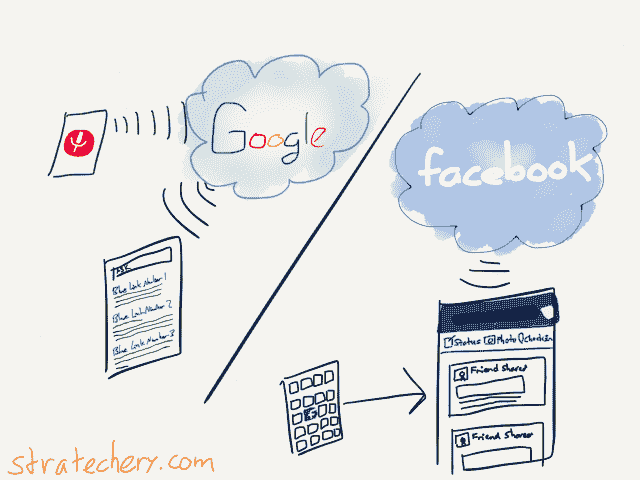
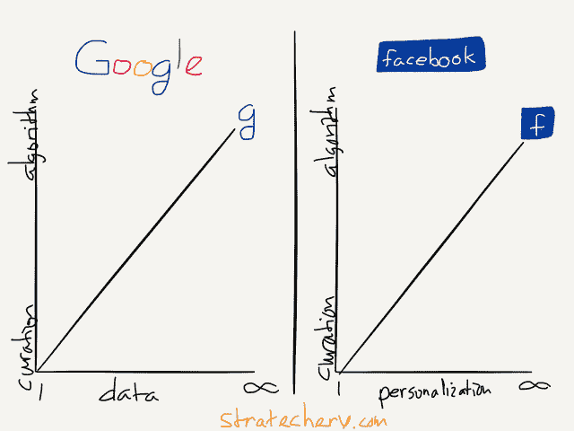
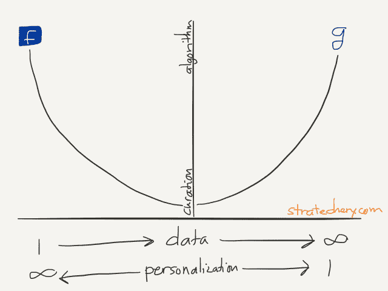
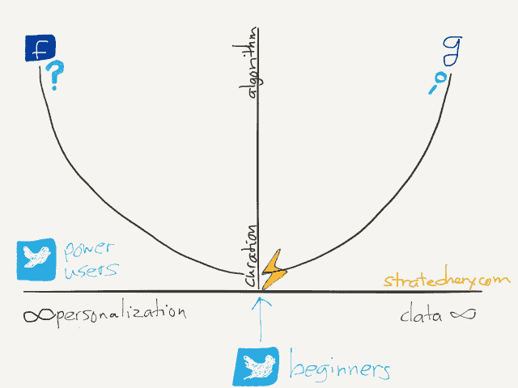

# 策展和算法——本·汤普森的策略

> 原文：<https://stratechery.com/2015/curation-and-algorithms/?utm_source=wanqu.co&utm_campaign=Wanqu+Daily&utm_medium=website>

在苹果音乐发布会上，当谈到他对算法的看法时，吉米·艾奥文毫不讳言:

> 唯一一首和你现在听的这首歌一样重要的歌就是紧接着这首歌的那首。想象一下:你正处于一个特殊的时刻…下一首歌开始了…BZZZZZ Buzzkill！它的发生很可能是因为它是由一个算法单独编程的。单靠算法无法完成那项情感任务。你需要一点人情味。这就是为什么在 Apple Music 上，我们会在合适的时间为您提供合适的歌曲和合适的播放列表。

关于新的苹果音乐电台 Beats 1，Iovine 补充道:

> [它]演奏的音乐不是基于研究，不是基于流派，不是基于鼓点，只演奏很棒而且感觉很棒的音乐。一个只有一个主人的电台:音乐本身。

根据苹果音乐网站“赞·洛和他精心挑选的著名 DJ 团队创造了一个最新和最好的音乐混合”；不过，如果你继续滚动页面，你会发现 Beats 1 不仅仅是策划音乐:

> 建立自己的电视台再简单不过了。只要选择任何歌曲，专辑，或艺术家，它几乎会建立自己。调整混音，听更多你知道的歌，或者发现不熟悉的宝石。喜欢一首曲目？我们会玩得更像。你越是微调电台，它就变得越个性化。

这听起来有点像算法。那么哪个更重要，为什么？

#### 策展的兴起

过去几周新闻里都在报道策展。在同一个主题演讲中，苹果公司介绍了苹果新闻，虽然演讲让它听起来有点像那些用户生成的广播电台——克雷格·费德里吉将其介绍为“来自世界上最伟大的来源的为你个性化的美丽内容”——但事实证明，苹果公司正在雇用编辑，用苹果公司招聘启事的话说，“确保重要的突发新闻故事迅速浮出水面，企业新闻获得高能见度。”

苹果新闻并不是这个领域唯一的努力:一个月前《纽约时报》发布了 NYT Now 应用程序的第二版；大标题是该应用程序现在是免费的，但同样有趣的是决定减少《纽约时报》本身的文章数量，并用其他出版物的几乎相等数量的文章点缀它们，旨在提供一站式策划的新闻体验。BuzzFeed 刚刚发布了他们自己对 BuzzFeed 新闻应用的概念，该应用将推文添加到 BuzzFeed 内容和来自网络的内容中，所有内容都以易于理解的要点进行了有益的总结。

Twitter 自己也宣布计划通过即将推出的 Project Lightning 加入这场游戏，据 BuzzFeed 报道，该工具[“将把基于事件的策划内容引入 Twitter 平台。”文章指出:](http://www.buzzfeed.com/mathonan/twitters-top-secret-project-lightning-revealed#.lnenXJ2Wpp)

> 启动其中一个活动，你会看到一个视觉驱动的、精选的推文集合。凯蒂·雅各布斯·斯坦顿(Katie Jacobs Stanton)负责 Twitter 的全球媒体业务，他领导下的一个编辑团队将选择它认为最好和最相关的推文，并将它们打包成一个集合……他们将使用数据工具梳理事件，了解新兴趋势，并从 Twitter 服务器上流动的大量更新中挑选出最佳内容。但人类将决定包括哪些推文。

Lightning 还没有推出，但 Snapchat 的直播故事已经吸引了大量的观众；他们也是由策展推动的: [Recode 报道](http://recode.net/2015/06/17/snapchats-making-some-pretty-serious-money-from-live-stories/)自一月份以来，“该公司的现场故事策展团队已经从不到 10 人发展到 40 多人”，现在每天都在制作多个活动。甚至 Instagram 也在[的新探索页面中加入了策展](http://www.wired.com/2015/06/instagram-debuts-new-search-discovery-rival-twitter/)。

#### 当创造有意义时

固化有两个重要的优势:

*   首先，在上下文对于立即确定某件事情有多重要至关重要的情况下——就像新闻一样——人类策展人至少在目前比算法更胜一筹。人类也能够很快识别出这四十个故事是关于同一个事件的，并有能力决定哪一个是呈现的最佳选择
*   当谈到苹果音乐和其他类似的努力时，品味显得更加突出。例如，以 DJ 为中心的 Beats 1“广播”电台显然是为了让某些歌曲流行起来，而不是简单地在已经达到流行程度后确定它的流行程度。这特别适合苹果，也是我对苹果音乐最感兴趣的地方:苹果最乐于引领潮流，而不是跟风(核心流媒体服务就是如此)

有一天，算法可能会在这两个功能上超越人类，但我对此表示怀疑:对背景的批判性识别和创造力是计算机一直不如人类的两个领域。

#### 算法巨人

也就是说，尽管监管有优势，但最大的两个内容提供商——谷歌和脸书——是纯粹的算法游戏。谷歌新闻一直是由算法驱动的，但更重要的内容工具是谷歌搜索本身，它使用世界上最有价值的算法，不仅可以找到内容，还可以对内容进行排名。与此同时，脸书在某些方面与谷歌完全相反:脸书不是对输入做出反应，而是主动选择你打开应用时看到的内容；不过，这种选择也是 100%由算法驱动的。

Both search results and the news feed are algorithmically driven

当考虑算法和监管哪个更好的问题时，我认为脸书和谷歌的核心算法实际上是在解决两个非常不同的问题这一观察是有用的。谷歌正在从实际上无限数量的数据点(即互联网)中寻找直接查询的单一最佳答案；虽然它给出的答案在一定程度上受到谷歌建立的关于你的个人资料或围绕你的搜索的各种上下文线索的影响，但对于大多数查询，谷歌会向任何搜索相关术语的人返回一个正确的答案。简而言之，数据集是无限的(这意味着没有人有能力做这项工作)，但目标是有限的。

另一方面，脸书为其 14.4 亿用户创建了一个独特的新闻源:虽然脸书拥有大量数据，但任何一个用户感兴趣的信息量是有限的；目标的数量是无限的(这意味着脸书永远不可能雇佣足够多的*人来完成这项工作)。换句话说，无论是谷歌还是脸书都无法依赖监管，即使他们想这样做，但谷歌和脸书依赖算法的原因是不同的:*

Google searches an (effectively) infinite amount of data, while Facebook needs an (effectively) infinite amount of personalization, which is why both are algorithmically driven

然而，正如我刚才提到的，这两个原因是相反的:谷歌确实有点个性化，但它主要关心一个正确的答案，而任何一个脸书用户都不会关心也永远不会关心脸书的绝大多数数据。假设这种关系成立，你实际上可以把上面两张图放在一起:

Curation makes sense in the middle of Google and Facebook: some personalization, and a finite set of data to curate

这条曲线是思考上述策展计划的一种有用的方式:当有大量数据时，策展效果最好，但不要太多，目标是相当程度的个性化，但不是基于个人。

#### 管理新闻

监管-算法曲线清楚地表明了为什么新闻是一个明显的监管候选对象:虽然很多新闻随时随地都在发生，但它仍然比互联网上的信息总和少得多。此外，大多数人关心的新闻往往相对广泛适用，这意味着个性化是有用的，但只是在一定程度上。换句话说，新闻大多位于这条曲线的底部。

报纸很久以前就明白了这一点:编辑是策展人，决定什么上头版，什么上 13 版，什么完全被埋没。这种方法基本上奏效了，尽管许多编辑可能变得过于迷恋像《世界新闻》这样的“有声望”的故事，而不是真正理解读者想要什么。此外，一旦互联网摧毁了地理垄断，很快就变得很明显，大多数报纸在他们报道的特定故事上没有最好的内容；读者逃到他们碰巧找到的更好的选择，策展让位于 Twitter 和脸书这样的社交服务。

这就是 NYT Now 和 BuzzFeed 新闻应用如此有趣的原因:它们都接受这样一个观点，即它们各自的出版物并不垄断最好的内容，尽管它们都基于监管仍然有价值的观点。苹果新闻通过完全的出版物不可知论进一步发展了这个概念。

#### 推特上的问题

当前的 Twitter 产品，基于自我管理的时间线，并不真正适合管理算法曲线。超级用户通过漫长而艰难的跟踪和取消跟踪大量用户的过程，最终可以获得与他们的兴趣相关的高度个性化的提要。然而，初学者会看到一个提要，这个提要名义上是关于他们的兴趣，由痛苦的第一次运行经验决定，但实际上是一连串的胡言乱语。

Twitter struggles in part because it doesn’t have any products on the Curation-Algorithm curve

Project Lightning 显然专注于用基于事件的“通道”来达到算法的最佳点:这是一个很明显的举动，几年前[就应该完成](https://stratechery.com/2014/twitter-market/)。然而，或许更有趣的是，Twitter 是否应该追求算法反馈:我认为答案是肯定的。虽然 Twitter 的价值在于它的兴趣图，但迄今为止它的组织原则一直是人；算法反馈将帮助 Twitter 更有效地弥合这一鸿沟。T33

#### 策展伦理

科技公司之前不重视监管还有一个更大的原因，这是苹果在音乐方面所做努力的另一面:如果你可以将责任归咎于算法，那么逃避对你所展示内容的责任会容易得多。另一方面，人类策展清楚地表明谁对策展公司的用户看到的内容负责。

潜在的困惑很容易想象:苹果的新闻应用会突出报道中国工人的状况吗？Snapchat 对 2016 年大选的计划报道会偏向某一位候选人吗？Twitter 会围绕其首席执行官的离职制造一个“事件”吗？

另一方面，躲在算法后面也越来越站不住脚。首先，算法是由人类创造的*；选择哪个故事出现在你的脸书供稿中是脸书的责任，不管他们是通过算法明确选择还是隐含选择。就谷歌而言，[成功地辩称](http://arstechnica.com/tech-policy/2014/11/court-agrees-that-googles-search-results-qualify-as-free-speech/)其算法受到言论自由的保护，这是对终极责任的承认，其意义甚至比该公司为调整排名而明确设计的定期算法更新更深远。*

谷歌尤其负有特殊责任。我在《富足时代的经济力量》中写道:

> 互联网是一个丰富的世界，有一种新的力量很重要:理解这种丰富的能力，将其编入索引，在众所周知的大海捞针。这种权力掌握在谷歌手中。因此，尽管广告商渴望的受众如今无可救药地分散在数量实际上无限的出版商中，但他们寻求接触的读者必然从同一个地方开始——谷歌——因此，这就是广告资金的去向。

谷歌作为互联网阻塞点的地位异常有利可图，但伴随着巨大的权力而来的是巨大的责任:一个受欢迎的发展是谷歌正在慢慢接受所说的责任，并应要求将复仇色情网站除名。从道德和实际原因来看，这都是正确的举措——道德是因为谷歌有独特的定位来防止人们的生活被破坏，而实际是因为如果谷歌最终不采取行动，政府将迫使他们采取行动。事实上，这种情况已经在欧洲的“被遗忘权”中发生了，尽管这是否是一项好政策肯定会有一场辩论，但谷歌是一个倒霉的旁观者的观点不再可行。

* * *

最终，我认为接受监管是科技行业成熟的标志。今天的科技公司对世界各地的人们所看到和消费的东西有着巨大的影响力，尽管在透明性方面还有很长的路要走，但至少每个人现在都诚实地承认自己首先拥有这种权力。

此外，我对平衡算法和监管能够给用户带来的真正好处感到兴奋:虽然脸书和谷歌只关注算法是正确的，但大多数内容最好通过混合来交付；获得正确的混合可能会被证明是非常受欢迎和非常有价值的。

* * *

在[战略论坛](https://forum.stratechery.com/t/curation-and-algorithms/128) ( *会员专用*)上讨论这篇文章

### *相关*