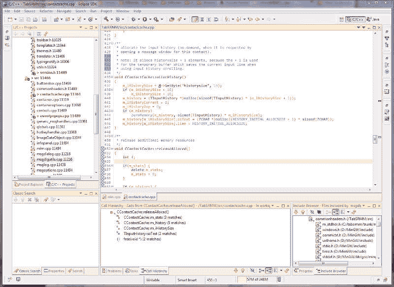
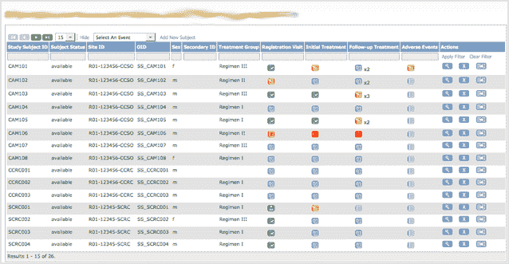
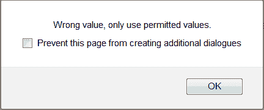

# 一眼就看出用户界面不好——各种(不)信息

> 原文：<http://www.hadermann.be/blog/134/recognising-a-bad-user-interface-at-first-glance/?utm_source=wanqu.co&utm_campaign=Wanqu+Daily&utm_medium=website>

这篇文章倾向于 Y Combinator 的黑客新闻[，在那里引发了一场精心的讨论](https://news.ycombinator.com/item?id=9822360)。
它还在 CodeProject 上被选为 2015 年 7 月的[最佳“其他一切”文章。
和](http://www.codeproject.com/Articles/1007942/Recognising-a-Bad-User-Interface-at-First-Glance)[翻译成日语](http://postd.cc/recognising-a-bad-user-interface-at-first-glance/)(经我同意)。

* * *

当我写我的前一篇博客文章时，我突然意识到一只训练有素的眼睛可以在一英里外发现不友好的软件。

这就像当你认识一个新的人时，形成并留下第一印象一样。显然，[这大约需要十分之一秒](http://psych.princeton.edu/psychology/research/todorov/pdf/Willis&Todorov-PsychScience.pdf)。

不像评判一个人，评判一个用户界面还不是我们本能的一部分。但是在短短几分钟内，而且通常更快，就有可能得到一个很好的印象，即用户界面是经过考虑的，还是只是事后的想法。

由于我不确定这是如何发生的，也不知道哪些警告信号实际上正在发出，我开始注意并做笔记。

以下是我的发现…

### 术语/标签的使用过于笼统或不一致

这些不是用户的话，而是程序员想出来的。

前几天我试用了活动组织软件。访问者/与会者有时被称为“用户”，这让我很困惑(你也可以添加其他不是访问者的用户/登录)。

在我工作的公司，我们曾经设计了一个新的向导式流程的原型。它由几个屏幕组成，使用 3 个不同的词来描述同一个人:**卡车司机、持卡人和启动者**(不用说，这在投入生产之前已经得到了纠正…为什么这让我想起了好、坏和丑？).

当你知道这个过程是如何运作的，你就不会真正注意到这一点。但是当你第一次面对这个软件的时候，你可能想知道他们是在谈论同一个人，还是扮演不同角色的不同的人，或者…谁知道呢？

你不想让你的用户感到困惑。走廊测试对此有所帮助。

### 类似 Excel/开发 IDE 的用户界面

如果你让一个没有经验的非技术人员来设计一个用户界面，它通常看起来像是在 Excel 中设计的。Excel 是大多数人所知道的最不受约束的应用程序，许多软件在成长为“真正的”软件之前都是以 Excel 表格的形式开始的。

另一方面，开发人员有一种习惯，把一切都看作他们最熟悉的用户界面:他们的开发 IDE。

[T2】](https://hadermann.be/wp-content/uploads/2015/07/eclipse-ide_sm.jpg)

### 使用没有特殊意义的纯图像图标/按钮

当你已经知道它们代表什么的时候，股票图标图像似乎是合适的，但是当你第一次看到它们的时候，你通常没有一点头绪。

除非绝对必要，否则用文字代替图标…即使图标更好看。

[T2】](https://hadermann.be/wp-content/uploads/2015/07/mmore22.png)

### 不清楚/令人困惑的错误信息

(程序员写的)。

[T2】](https://hadermann.be/wp-content/uploads/2015/07/pointlesserror.png)

通过在字段中输入不正确的值或将必填字段留空来测试这一点。

您是否立即知道错误在哪里(即使没有阅读错误文本)，或者您是否得到一般的“填写所有必填字段”或“这不是正确的值”错误？

更糟糕的是一些数据库错误文本。或者根本没有错误，导致记录在您不知道的情况下没有保存。

### 文本/说明太多

如果你是 X，那么你必须填写 Y 和 Z。如果你不是 X，请只填写 Z，除非 Z=1，那么你也应该填写 Y。

我不知道其他国家的情况如何，但在比利时，感觉就像你在申报所得税。

这是典型的程序员通过避免一些额外的步骤/代码而变得“聪明”的表现…不应该通过 QA。诸如此类的事情不仅会让你失去客户，还会导致许多不必要的服务台请求。

很久以前(实际上是上个世纪),我开发了 EDI 软件，基于“消息实现指南”(MIG ),其中包含了类似这样的结构。我们没有考虑让这变得更加透明，我们只是给了用户一些字段，以及 MIG 关于在什么情况下应该填写哪些字段的指示。事情就是这样做的，当时我们没有多想。感谢上帝赐予我们从错误中学习的能力。

摘自 EDI 报文实施指南

当有人认为在一组表单中“实现”两种不同的有一些相似之处的消息(数据结构)是聪明的时候，我甚至看到了这种荒谬的做法。

开发人员节省的时间永远比不上用户的困惑和呼叫支持。

### 奇怪、不相关和复杂的日期/时间格式

例如:' **2015-06-29 15:44:21 EST** '，这可能是该软件编程时使用的任何语言/框架的默认无格式输出。

15:44 可能就足够了，或者 Jun-29 15:44(这对欧洲和美国用户有意义)。

在某些情况下，使用更人性化的相对符号会更好，例如“最近一小时内”、“昨天”、“下周”…

### 过于依赖鼠标

没有逻辑标签排序，没有键盘快捷键:需要用鼠标做所有的事情。

自从鼠标发明以来，这一直困扰着用户。

### 太多无意义的消息框

'您确定要打印该文档吗？'

然后显示打印对话框，您仍然可以取消打印过程。

不经意地印刷一些东西，首先需要你的许可，这有多糟糕？

### 不一致的警告对话框

不久前，我看到一个类似 CRM 的应用程序。

当退出未保存的联系人表单时，显示
**‘您确定要退出而不保存吗？’**

当退出未保存的公司表单时，显示
**‘退出前保存更改吗？’**

单击“是”显然会给出两种不同的结果。

### 开始时，用户界面完全是空的

当看到一个“干净”的安装或帐户时，没有让你开始的指示。

你应该引导你的用户在这里迈出第一步。

“您还没有任何联系人。单击“添加联系人”添加您的第一个联系人。“我们知道你是新来的。如果你想要一个简短的教程，点击这里

你明白了。

### 视觉混乱

不需要使用分隔线、分组框，..这些越少=眼睛越舒服。把东西按位置放在一起比放在同一个盒子里要好得多。

你知道更直接的线索表明你正在处理一个糟糕的用户界面吗？
在评论里告诉我们！

# 软件之外的用户友好

我曾经工作过的一家公司有如此长的电子邮件，以至于用户经常打电话来问，“你刚刚给我发了一封电子邮件……你能解释一下里面有什么吗？”

同样常见的是，当有人打电话询问电子邮件中没有的问题时，电子邮件模板被更改以包含答案。这似乎是正确的，合乎逻辑的事情，不是吗？

除非邮件变得太长，以至于没人会再去读它们。

此外，当客户打电话时，支持团队用他们在内部软件中看到的术语解释事情——“对不起，先生，您的验证仍然是‘未验证’。”不幸的是，在大多数情况下，这对客户来说毫无意义，他们不知道他们的“验证”是什么，为什么是“未验证”。你可以看到支持人员变得很恼火，因为他们不得不向“愚蠢的用户”一遍又一遍地解释同样的事情。

让你的用户界面更友好是一个迭代的过程。应定期检查支持请求中是否存在重复出现的问题，以便解决/澄清这些问题。

**同意还是不同意？你知道坏用户界面的更多直接迹象吗？
在评论里告诉我们！**

在此注册[获得更多有趣的、有见地的和(不)信息丰富的帖子！](http://bit.ly/1HfXxFG)

标题[图片](https://www.flickr.com/photos/rdolishny/2760207306)由 [rdolishny](https://www.flickr.com/photos/rdolishny/) 制作，在 CC BY-NC 2.0 下使用