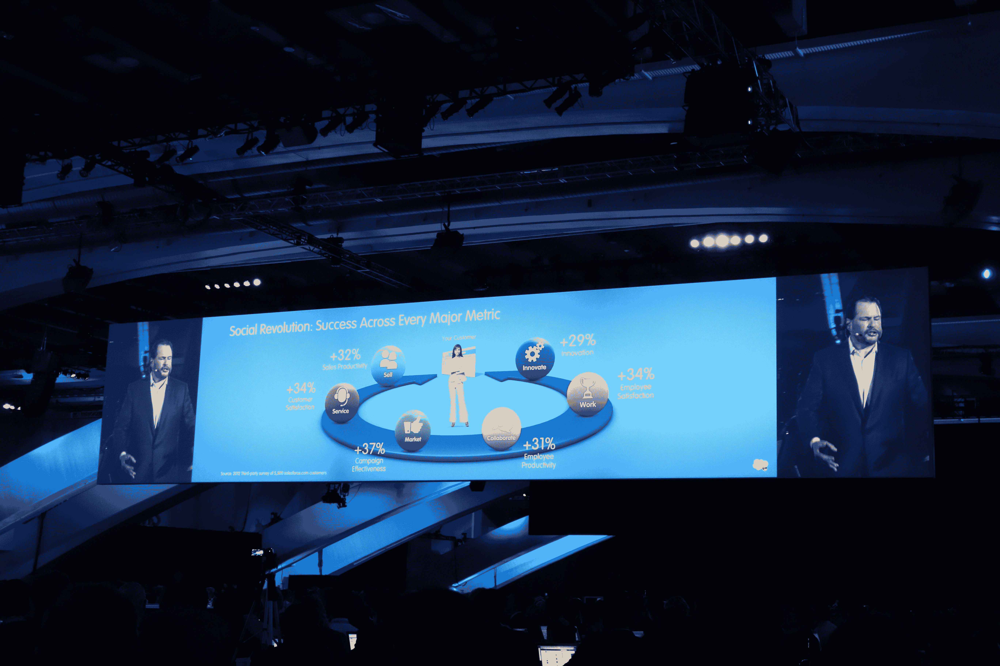
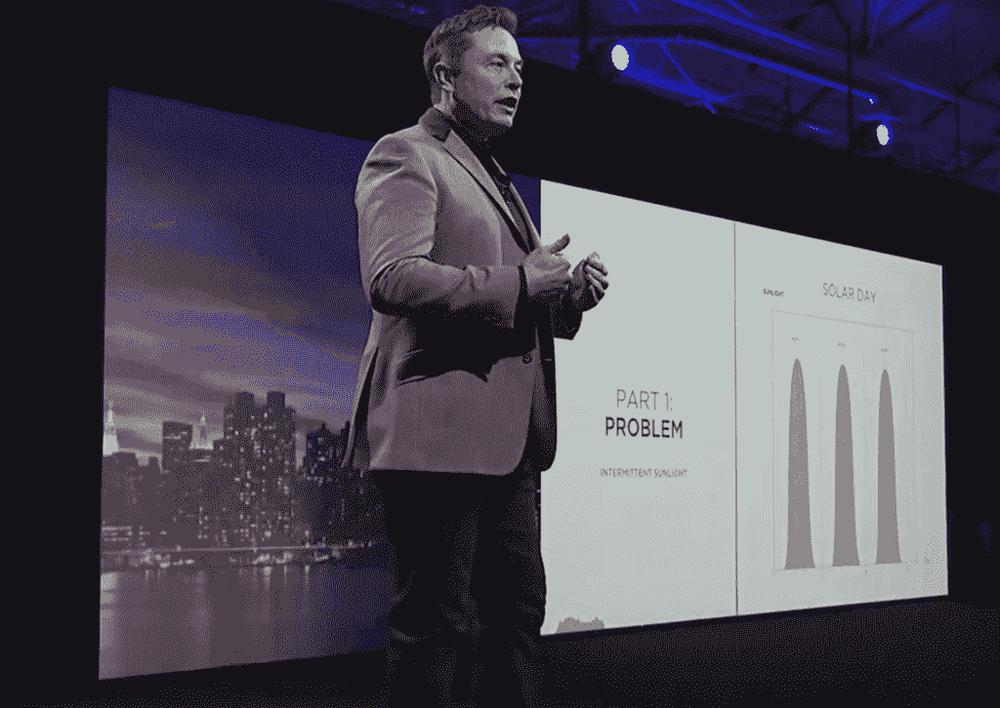
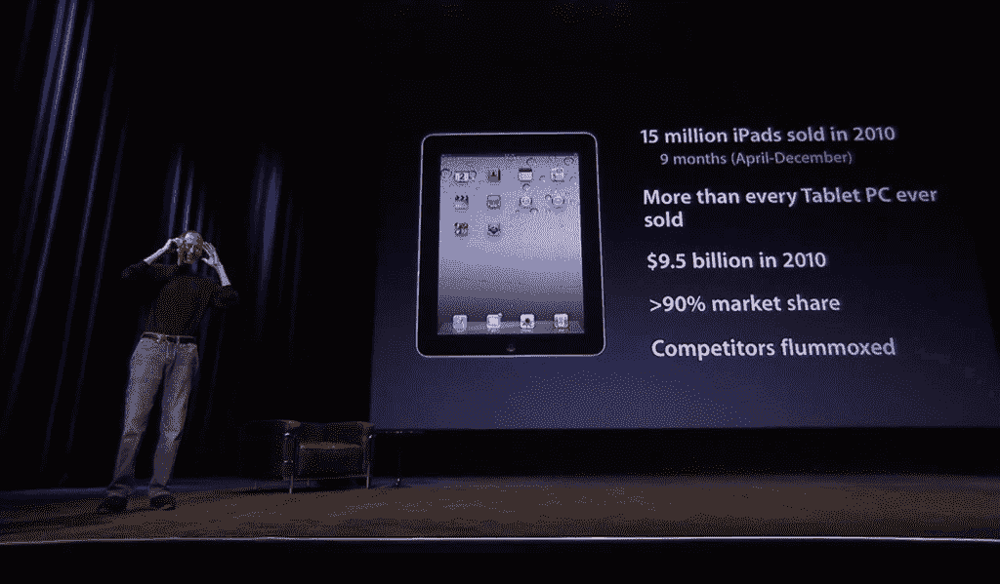

# 为甲板辩护-在拥挤的人群之上|比尔·格利

> 原文：<http://abovethecrowd.com/2015/07/07/in-defense-of-the-deck/?utm_source=wanqu.co&utm_campaign=Wanqu+Daily&utm_medium=website>

July 7, 2015:

过去几年，我和我的合伙人注意到了一个有趣的趋势:越来越多的企业家更喜欢在不使用演示文稿的情况下向我们推销。一方面，这是完全可以理解的。许多人认为，幻灯片是呆伯特漫画中贬损的官僚作风的象征。其他人希望表现得“随意”和“随意”，认为演示过于正式。但是，去无甲板可能是一个冒险的举动，这里是为什么。投资者不仅仅是在评估你公司的故事。他们也在评估你传达这个故事的能力。高效地传达您的战略、业务模式和竞争优势是您作为一家公司将要做的许多重要事情所必需的。[T3

<noscript>T5</noscript>

T7】](https://i0.wp.com/abovethecrowd.com/wp-content/uploads/2015/07/bezos-2.jpg?ssl=1)

没有标准的幻灯片演示，你能筹集到资金吗？当然可以。你能开一个纯粹谈话式的投资者会议吗？绝对的。但重要的是要把可能和最佳分开。如果你是下一个谷歌，所有人都知道你在驾驶座上，你当然应该随心所欲。但如果你是成千上万只希望有一个最佳融资过程的创业公司之一，我强烈建议你开发一个杀手级演示。

[

<noscript></noscript>](https://i0.wp.com/abovethecrowd.com/wp-content/uploads/2015/07/benioff.jpg?ssl=1) 以下是好的演示文稿具有影响力的六个原因:

1.  **叙事的重要性**——去年我喜欢上了一本由[乔纳森·戈特沙尔](http://www.amazon.com/Jonathan-Gottschall/e/B001J3MQPY/ref=dp_byline_cont_book_1)写的书，书名为 *[讲故事的动物](http://www.amazon.com/The-Storytelling-Animal-Stories-Human/dp/0544002342)* 。Gottschall 解释了讲故事是如何在每个人的生活中发挥重要作用的。演示文稿的目的是让企业家能够有效地讲述他们的业务故事。在许多方面，这就像一个结构化的科学证明。你想让听众了解为什么这将是一个令人惊奇的行业。目标是把投资者带到相当于 [Q.E.D](https://en.wikipedia.org/wiki/Q.E.D.) 的风投那里。一张组织良好的卡片会逐渐把听众带到想要的结论——“这将是一项伟大的投资。”一场漫无边际的言论自由的谈话不太可能实现这个目标。
2.  **控制节奏**——当你和投资者只有一个小时的时间时，你希望明智地使用时间，并确保你传达了所有的要点。有组织的会议有助于你控制节奏，并保证你在规定的时间内按顺序提出你的所有论点。这就像是一个结构化的证明。你希望你的论点以一种系统的方式向一个结论发展。出于同样的原因，你也应该避免在甲板上跳来跳去(另一种常见的情况，尤其是那些甲板太大的企业家)。跳到另一张幻灯片给投资者一个直接的答案似乎是有意义的，但是这让你偏离了你的游戏和你想要的流程。如果这个问题稍后才回答，告诉听众你稍后会讨论这个问题，推迟回答这个问题。
3.  ——你找不到一个不包含“商业”一词的“企业家”定义创业公司是企业，企业靠数字运行。即使你刚刚开始你的公司，有数字分析也是有用的。它可能只是一个费用分析，或详细的定价模型，或 TAM(总可用市场)分析。如果你是上市后，它可能涉及病毒系数讨论或队列分析。如果你是后收入，它应该毫无疑问地包括财务报表和前瞻性预测。你的演讲不应该有无数的东西。只用文字来表达复杂的数字论证几乎是不可能的。在这项任务中，图表、图形和表格的效率要高得多。我合作过的最好的企业家都非常关注数字。
4.  **讲故事永无止境**——作为首席执行官，你是公司的头号销售人员和讲故事者。你会花很大一部分时间去招聘。在以后的阶段你会筹集到更多的钱。你将参加商业发展会议。你将会见大客户和潜在客户。你需要激励你的员工，你将(有希望)被邀请在重要的行业会议上发言。如果没有结构化的演示文稿，你很难做到所有这些。一次性演讲的效率和影响会更小。作为你公司的“讲故事主管”，精通这种技巧对你来说很重要。这是一项实践真正影响表现的技能。所以你应该尽快开始练习。风投们认为，更好的故事讲述者会造就更好的企业家。
5.  **过程本身是有用的**——第一次构思你公司的故事的过程可以是一次宣泄的经历。当你和你的联合创始人开始规划定位、商业模式和定价假设、市场焦点以及招聘重点时，你可能会发现并非所有人都达成了共识。开发一个演示平台会给你一个很好的论坛来确定这些事情，并确保每个人都有一个共同的目标。你还会发现，有些人比其他人更有创造力，能够将演示文稿的关键部分塞进 20-25 张幻灯片(不要超过 25 张)，并为你的公司讲述一个非常有说服力的结构化故事。第一版不会很棒。给你的内部团队看，给几个外人看，获得反馈，迭代。这是一个过程。如果你的团队是新手，我推荐阅读杰瑞·韦斯曼的《赢在当下:讲述你的故事的艺术》。
6.  **像史蒂夫**——去 YouTube 上搜索一下最优秀的企业家 CEO。搜索'[杰夫·贝索斯演讲](https://www.google.com/webhp?sourceid=chrome-instant&ion=1&espv=2&es_th=1&ie=UTF-8#q=jeff+bezos+presentation&tbm=vid)、'或'[马克贝尼奥夫演讲](https://www.google.com/webhp?hl=en#hl=en&tbm=vid&q=marc+benioff+presentation)、'或'[埃隆马斯克演讲](https://www.google.com/webhp?sourceid=chrome-instant&ion=1&espv=2&es_th=1&ie=UTF-8#tbm=vid&q=elon+musk+presentation)或'[史蒂夫乔布斯演讲](https://www.google.com/webhp?sourceid=chrome-instant&ion=1&espv=2&es_th=1&ie=UTF-8#q=steve+jobs+presentation&tbm=vid)，'你会发现他们普遍使用某种形式的演示文稿来指导他们的演讲。我也见过像布莱恩·切斯基和特拉维斯·卡兰尼克这样的现代企业家领袖在投资者会议上发言，自信地利用一副牌的力量。如果你选择在没有套牌的情况下自由泳，而许多大师都把它当成了一种正常的做法，你可能会给人留下这样的印象:( a)你没有制作杀手级演示的技能，或者(b)你根本不知道为什么它很重要。这两者都不会给投资者留下好印象。

[

<noscript></noscript>](https://i0.wp.com/abovethecrowd.com/wp-content/uploads/2015/07/musk.png?ssl=1) 

有一种情况下，没有演示文稿的会议是合理的。如果你从未见过潜在投资者，并且不确定你是否想与这个人分享你的数据，那么你有一个非常充分的理由不去做详细的介绍。在这种情况下，我建议你一开始就明确表示，你认为这是一次“了解你”的会议，此时你不会深入业务。这将避免不匹配的期望。
[

<noscript></noscript>](https://i0.wp.com/abovethecrowd.com/wp-content/uploads/2015/07/iPad-2-Keynote-by-Steve-Jobs.png?ssl=1) 如果你足够幸运地将你的公司从 A 轮发展到 B 轮再到 C 轮，并获得数亿美元的收入和成功的 IPO，你将需要一遍又一遍地在高风险的情况下讲述你公司的故事。正因为如此，风险投资家对你在这方面的能力给予了极大的肯定。伟大的故事讲述者拥有不公平的竞争优势。他们将更好地招聘人才，他们将成为媒体的宠儿，他们将更容易以更高的价格筹集资金，他们将密切令人惊叹的商业开发商合作伙伴关系，他们将拥有强大而有凝聚力的企业文化。或许更重要的是，它们更有可能带来正投资回报。

### *相关*