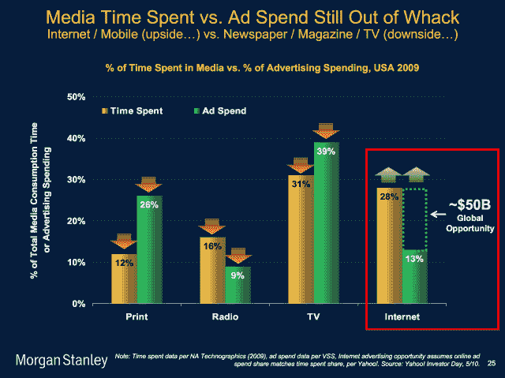
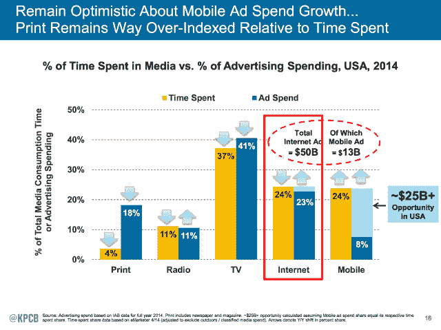

# 为什么网页很烂——本·汤普森的策略

> 原文：<https://stratechery.com/2015/why-web-pages-suck/?utm_source=wanqu.co&utm_campaign=Wanqu+Daily&utm_medium=website>

约翰·格鲁伯[对苹果新闻网站](http://daringfireball.net/2015/07/safari_content_blocker_imore)[伊莫尔](http://daringfireball.net/2015/07/safari_content_blocker_imore):T5】1T7】言辞激烈

> 我爱我更多。我认为他们是今天报道苹果的最好的员工，他们的内容很棒。但是把我和尼克·赫尔一起算进去——他们的网站烂透了。雷内·里奇的回应承认了这个问题，但是像这样的网页——雷内的 537 字全文回应——不应该有[14mb 重。](http://d.pr/i/19HMF)
> 
> 不仅仅是下载大小，漫长的初始页面加载时间，以及作为固定元素覆盖宝贵屏幕空间的广告。事实上，这些 JavaScript 追踪器在页面加载完成后攻击网络整整一分钟，这是彻头彻尾的犯罪。广告对页面加载时间和设备电池寿命的影响应该最小。广告应该尊重用户的时间、注意力和电池寿命。该行业已经贪婪地走上了另一条路。我不例外——它们是常态。10 MB 以上的页面大小、长达一分钟的网络访问、第三方网络在不相关的网站上跟踪你——这些在今天都是司空见惯的事情，甚至在向移动设备提供页面时也是如此。即使在 iMore 这样的网站上，员工都是真正尊重读者的好人。

这是最后一行，应该让 Gruber 或任何抱怨蹩脚网站的人停下来。毕竟，如果我更尊重他们的读者，唯一的替代解释就是他们的开发团队不称职。当然，除非 iMore 和网络上绝大多数广告支持的网站在这件事上基本上别无选择。

#### 广告商和早期网络

格鲁伯谈到了出版商和读者，但如果你以网页需要免费为前提，那么如果不包括广告商，大多数网站的利益相关者名单是不完整的。毕竟，他们才是买单的人。

当网络第一次成为一个重要的媒介时，它实际上对广告商来说并不是特别好。在互联网出现之前的日子里，广告客户可以在当地报纸上购买广告，也许是一两个电视广告，贴上广告牌，然后收工，自信地认为他们已经尽可能地达到了他们的整个目标市场。另一方面，对网络广告做同样的事情，需要知道你的目标客户在访问什么网站，这些网站可能有数百或数千个，然后在这些网站上购买广告，祈祷你的客户确实看到了你的广告(尽管你永远不会知道他们是否看到)。真是一团糟。

这是一个规模问题，而且是两个方面的问题:

*   有比以前更多的地方可以做广告，这在理论上听起来很棒，但实际上很糟糕，因为谁有时间和资源去应付成百上千个不同的广告销售团队呢？
*   任何一个网站都只知道它的访问者在那个特定的网站上对什么感兴趣，这意味着一个网站可以卖给广告商的定位能力并不比一家实体报纸卖给一家健身房的体育版好多少

结果是，直到 2010 年，当玛丽·米克尔第一次在她的[年度互联网趋势报告](http://www.kpcb.com/internet-trends)中使用下面的幻灯片时，互联网的广告份额明显低于其关注份额:

[T2】](http://www.kpcb.com/blog/june-2010-internet-trends)

然而，广告网络和程序化广告改变了一切。

#### 广告网络的兴起

广告网络解决了两个规模问题:

*   广告客户可以通过一个广告网络集中购买广告，而不是在过多的(相对而言)小网站上购买广告，该广告网络承诺在这些过多的网站上投放广告。
*   凭借在上述众多网站上投放广告及其相关追踪器的优势，网络可以获得更丰富的个人访客信息，让广告商能够更好地瞄准他们的广告。

其实际运作方式有点复杂:与印刷广告不同，印刷广告提前几天交付，并在付印前与编辑文本一起插入，今天的广告是“以编程方式”交付的。这个过程实际上有点令人惊讶，由几个不同的部分组成(我对“广告网络”的引用有点简单):

*   当用户请求 URL 时，发布者检查他们是否有任何可用的直接销售广告(由于上面提到的规模问题，越来越少的发布者有越来越少的直接销售广告；广告商就是不感兴趣)
*   如果没有，出版商会向广告交易所索要广告
*   广告交换已经在使用广告交换的所有不同网站上建立了用户简档，将(匿名化的)用户简档和网站描述发送到各种需求方平台(DSP)(实际销售广告)
*   DSP 检查用户档案和网站描述以及许多其他因素，并提供他们愿意支付的价格来为用户提供广告
*   广告交易选择最高价格，检索广告，并将其发送给发布者进行显示

所有这一切都是在及时的基础上发生的，你可以看到广告商为什么喜欢它:他们比以往任何时候都更能以尽可能最有效的价格准确地接触到他们想要接触的人。结果是互联网上的广告大幅增加；看看 2015 年 Meeker 的等效幻灯片[:](http://www.kpcb.com/blog/2015-internet-trends)

[T2】](http://www.kpcb.com/blog/2015-internet-trends)

广告商对程序化广告的强烈偏好是为什么当谈到广告支持的网页的状态时，只讨论出版商和用户是如此有问题:如果广告商只在程序化广告上花钱——而且是很多钱，那么可以得出结论，出版商赚钱的唯一方式就是使用程序化广告。

#### 出版的模块化

从出版商的角度来看，印刷机的固定成本不仅为竞争提供了一条护城河，还意味着出版商可以根据自己的条件展示广告。用我上周讨论过的[诱人利润守恒模型](https://stratechery.com/2015/netflix-and-the-conservation-of-attractive-profits/)来说，出版商通过以这种方式整合内容和广告获得了额外的利润:

[T2】](https://i0.wp.com/stratechery.com/wp-content/uploads/2015/07/print.png?ssl=1)

然而，正如对程序化广告的描述所表明的那样，这种情况已经不复存在了。从发布者的角度来看，广告位实际上是一个黑匣子，从广告网络的角度来看，它将窗口导向用户。这既模块化了内容，也让广告网络更加贴近用户:

[T2】](https://i0.wp.com/stratechery.com/wp-content/uploads/2015/07/internet.png?ssl=1)

这是一个简单的事实:如果你在一个模块化的市场中竞争，就像今天的出版商一样，利润充其量是微薄的，从收入的角度来看，你通常会得到你能得到的。换句话说，今天的出版商和优步司机一样有讨价还价的能力，我们已经看到了这种情况。

#### 那现在怎么办？

至此，我已经从广告商的角度讨论了广告网络；不过，格鲁伯的批评是从用户的角度出发的:他绝对正确地认为，广告客户效率的代价是读者的用户体验。然而，出版商面临的问题是，来自广告商的金钱和美分远比页面浏览量更为稀缺，这让出版商面临二选一的选择:提供出色的用户体验并倒闭，或者带着依赖广告网络所带来的所有包袱混日子。 [3](#fn3-1755 "Advertisers and ad networks, unfortunately, don’t really have an incentive to improve the user experience; there is an effectively unlimited amount of inventory on the web")

同样，解决方案并不是出版商应该更加努力地做更好的广告。《纽约时报》可以说是品牌和质量印象的黄金标准，[在其年度报告](http://investors.nytco.com/files/doc_financials/annual/2014/2014-Annual-Report-(FINAL).pdf)中指出:

> 数字广告网络和交易所、实时竞价和其他程序化购买渠道使广告商能够大规模购买受众，这些渠道也在广告市场上发挥着更重要的作用，并造成价格下降的压力。

如果《纽约时报》无法抵制程序化广告，那么 iMore 或绝大多数在线出版物还有什么机会？如果有什么不同的话，这让脸书的即时文章计划更加积极:这个社交网络不仅通过即时显示文章来改善用户体验——这主要归功于没有程序化的广告收入——而且还通过出售广告和分享 70%的内容来帮助货币化所述内容，这是由远优于广告网络的个人资料数据支持的。

事实上，可以说最大的收获应该是，反对脸书提议的主要理由——出版商正在放弃他们的独立性——是转移视线。出版商已经是广告网络的奴隶，他们在这一点上的主要决定是广告网络和脸书哪个主人更好？

这也为苹果的新新闻应用提供了额外的背景，这看起来非常像脸书的提议:出版商将他们的文章放在一个公共的存储库中，通过 iAd 集体货币化，从而实现广告规模(应该注意的是，[比](https://developer.apple.com/library/prerelease/ios/documentation/General/Conceptual/News_Publishing_Guide/MonetizingonNews.html#//apple_ref/doc/uid/TP40015407-CH18-SW1)[苹果的言辞](https://stratechery.com/2015/tim-cooks-unfair-and-unrealistic-privacy-speech-strategy-credits-the-privacy-priority-problem/)所暗示的更多的用户数据)。当然，苹果公司——这也是引发整个讨论的原因——提供的不仅仅是胡萝卜，而是大棒。Gruber 总结道:

> 有了 Safari 内容屏蔽器，苹果准备让用户反击。苹果已经瞄准了我们所需要的:不是一种屏蔽广告本身的方法，而是一种屏蔽讨厌的 JavaScript 代码的方法。清算即将到来。

这绝对是，正如我在脸书即时文章推出时指出的。对于大多数出版商来说，未来可能只是纯粹的内容制作，除了少数几个像 Gruber 这样的[——他们是能够在流媒体上销售原生广告的目的地网站(或者销售订阅，像这个网站](http://daringfireball.net/feeds/sponsors/)[)。最大的问题是，当用户最终得到他们声称想要的东西时，他们会有什么样的感受。](https://stratechery.com/membership/)

### *相关*