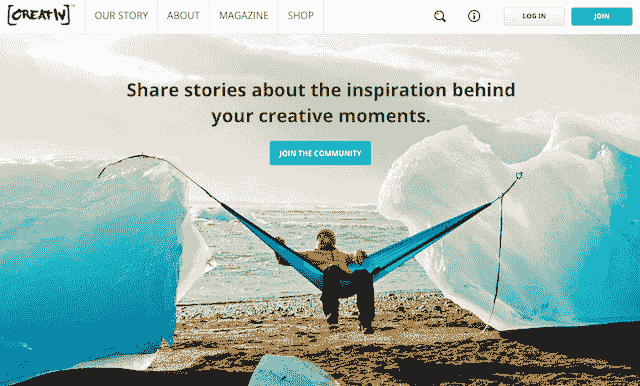

# 媒体商业模式:纸质和电子？那是创造性的

> 原文：<http://www.siliconvalleywatcher.com/mt/archives/2015/07/media_business_models.php?utm_source=wanqu.co&utm_campaign=Wanqu+Daily&utm_medium=website>

我最近收到了 VSC 咨询公司的凯特琳·加西亚写的这篇精彩的文章:

> 印刷品已经死了。杂志正在消亡。
> 
> 不是这样的，认为[创造](http://www.creativ.com/)。
> 
> 这本杂志做了一些独特的事情。他们首先在移动设备上推出，这要归功于一家大型但相对低调的初创公司，名为 [issuu](http://issuu.com/) ，这是一个帮助内容创作者建立长格式内容的平台，而不是我们在 Flipboard 等应用程序上习惯的短格式内容。

> 通过 issuu first，独立艺术和文化杂志 Creativ 的移动读者从 2 万增长到 50 万。手机内容的疯狂流行给了 Creativ 扩展到印刷品的能力。
> 
> 结果是:Creativ 在全国有 1700 个零售点。
> 
> 为什么这很重要:出版商感受到了和音乐人一样的痛苦——害怕失去数字消费者的收入来源。像 Flipboard、脸书和 Twitter 这样的平台并不太关心出版商，那么谁会关心呢？
> 
> 进入 issuu:该公司以出版商为中心，没有为自己的品牌进行真正的营销，并希望每个出版商都能向观众推销自己的内容，并在 issuu 应用程序中找到这些内容。issuu 应用程序已成为移动设备上最大的数字报刊亭，比苹果的报刊亭还大。
> 
> 我们认为这里有一个有趣的故事，关于像 Creativ 这样的企业家，以及他们如何计划让移动技术为他们服务，而不是放弃他们的长篇内容并挥舞白旗，这些内容仍然受到世界各地人们的喜爱。

Foremski 的观点:我一直很困惑，为什么有些人对纸质媒体和电子媒体有一种仇恨。肯定是关于内容的质量？纸质或电子，如果有商业模式的话，内容如何传递就不重要了，Creativ 是媒体公司利用这两种形式的一个很好的例子。

纸张还有额外的好处。报纸等纸质媒体公司在向数字商业模式转型的过程中举步维艰。但与从桌面版本向移动新闻媒体的过渡相比，这种过渡相对缓慢。

这种转变已经持续了至少十年，而且很可能还会持续十年。对于从桌面到移动媒体格式的转变来说，情况并非如此，这种转变的速度令人眩晕。

更小的屏幕空间和更少的移动广告收入让数字优先的媒体机构日子很不好过。

那些拥有传统纸质业务集团的媒体公司，如《纽约时报》，对其新生的数字业务采取了一些保护措施。数字广告的收入比新闻纸广告下降得更快。

纸质还是电子？两者兼得真好。