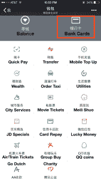
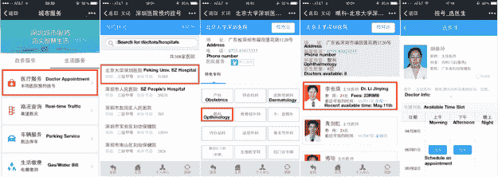
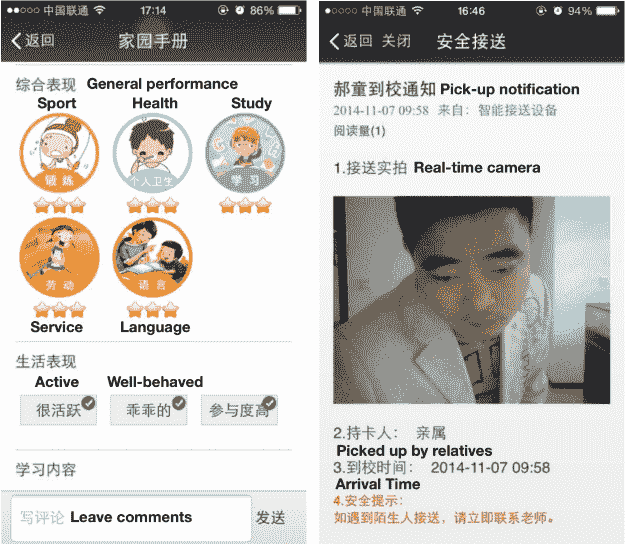

# 当一个应用程序统治所有应用程序:微信和手机在中国的案例

> 原文：<https://a16z.com/2015/08/06/wechat-china-mobile-first/?utm_source=wanqu.co&utm_campaign=Wanqu+Daily&utm_medium=website>

***听听本文音频版:***

这个帖子讲的都是微信，但也不仅仅是微信。虽然看起来只是一个消息应用程序，但微信实际上更像是一个门户网站、一个平台，甚至是一个移动操作系统，这取决于你如何看待它。

在即时通讯应用趋势的背景下，已经有很多关于微信的文章，但在中国以外，很少有人真正了解它是如何工作的，以及它如何实现对许多公司(和国家)来说仍然是一个遥远的愿景，即完全通过我们的智能手机管理的世界。微信的许多最有趣的功能——比如进入[城市服务](http://techcrunch.com/2015/04/24/why-wechat-city-services-is-a-game-changing-move-for-smartphone-adoption/)——甚至对中国以外的用户不可见。那么为什么中国以外的人还要关心微信呢？第一个也是最显而易见的原因是，[指出了](http://recode.net/2015/05/19/western-messaging-apps-are-looking-to-chinas-wechat-for-inspiration/)脸书和其他消息应用[的发展方向](https://pando.com/2012/07/13/asia-may-once-again-pave-the-way-for-the-future-of-social-networks/)。第二，微信[表明](http://recode.net/2015/06/18/messaging-apps-and-platforms-of-convenience/)移动[商务](http://techcrunch.com/2015/06/10/never-leave/)的未来可能在哪里。第三，微信展示了既是一个平台又是一个移动门户的感觉。

然而，最终，微信应该对我们所有人都很重要，因为它展示了当整个国家——目前智能手机普及率为 62% (几乎是其人口的 1/3)——直接从 PC 时代“跃进”到移动时代的可能性。微信并不是一个以网站起家，然后被改编成手机的产品，它是(套用某部[电影](https://youtu.be/F157geaXp_w) ) *生于其中，塑于其中*。

然而，对科技行业的任何人来说，最值得注意的是微信的每用户平均收入或 ARPU，据估计至少为[7 美元](http://qz.com/179007/wechat-is-nothing-like-whatsapp-and-that-makes-it-even-more-valuable/)——这是世界上最大的[消息平台 WhatsApp 的*7 倍*的 ARPU。微信是怎么做到的？](http://blogs.wsj.com/digits/2015/04/17/whatsapp-hits-800000-users-1-billion-by-year-end/)

## **不过先来点背景:微信是什么？**

中文称为微信(微信)——“微信”——[微信](https://vimeo.com/123624442)首先是一个向朋友和家人发送文本、语音和照片的消息应用程序。它是 4 年前由中国投资控股公司腾讯发起的，腾讯是世界上最大的互联网公司之一。截至今年早些时候，微信在超过 10 亿注册用户中拥有[5 . 49 亿](https://www.techinasia.com/wechat-549-million-active-users-q1-2015/)月活跃用户(MAUs)，几乎全部在亚洲。具体来说:这仅比[的 Facebook Messenger](https://pando.com/2015/07/31/facebook-messenger-cheapest-quickest-way-zuckerberg-has-ever-acquired-700-million-users/) 少 1.5 亿 mau，几乎是日本 [Line](https://www.techinasia.com/line-reports-2014-revenues-of-656m-reaches-181m-monthly-active-users/) 的 3 倍，是韩国 [Kakao](http://www.wsj.com/articles/mobile-chat-service-kakaotalk-faces-growing-pains-1424885119) 的 10 倍(腾讯也是韩国 Kakao 的投资者之一)。[腾讯也是一些美国初创公司的战略投资者，包括我们的一些公司。]

下载应用程序是免费的，而微信才刚刚开始尝试[广告](https://www.techinasia.com/wechat-moments-adverts-test/)收入，那么它的 ARPU 魔力在哪里呢？(尤其是当人们想起将电子邮件等其他普遍的、功利的服务货币化的困难时。简单的回答是它提供了更多的 T2 功能。除了基本的通信功能，中国的微信用户还可以访问各种服务，包括叫出租车、订餐、买电影票、玩休闲游戏、办理航班登机手续、给朋友汇款、访问健身追踪器数据、预约医生、获取银行对账单、支付水费、查找地理定位优惠券、识别音乐、在当地图书馆搜索书籍、结识周围的陌生人、关注名人新闻、阅读杂志文章，甚至向慈善机构捐款……所有这些都在一个集成的应用程序中完成。

在微信的例子中，聊天——而不是其他内容流或搜索框——是“通用的”用户界面。(虽然这篇文章的重点不是设计，但值得注意的是，中国的应用程序倾向于将尽可能多的功能结合到一个应用程序中。这与西方应用形成鲜明对比，西方应用倾向于“[应用星座](http://avc.com/2014/05/app-constellations/)”。)

## **微信如何工作#1:应用中的应用模式——改变了我们对“网络与移动”的所有认识**

从哲学上讲，虽然脸书和 WhatsApp 通过其网络上的每日和每月活跃用户数量来衡量增长，但微信更关心微信在解决用户日常甚至每小时需求方面的相关性和核心作用。微信没有专注于建立世界上最大的社交网络，而是专注于建立一种移动生活方式——它的目标是解决用户生活的方方面面，包括非社交生活。

它实现这一目标的方式是通过微信最不为人知的一个方面:首创的“应用中的应用”模式。数百万(注意，不仅仅是数千)轻量级应用程序存在于微信中，就像互联网上的网页一样。

这使得微信更像是一个移动网站的浏览器，或者可以说是一个移动操作系统——拥有自己专有的应用商店。这不是我们对消息应用的期望。

微信上的轻量级 app 被称为“官方账号”。经过简短的申请程序后，微信批准了超过 1000 万个官方账户，包括名人、银行、媒体、时尚品牌、医院、药店、汽车制造商、互联网创业公司、个人博客等等。需要强调的是，这些官方账户与美国社交网络上的验证账户完全不同，在美国社交网络上，“官方”主要是真实性或身份验证的标志。在微信上，官方账户被批准访问支付、位置、直接消息、语音消息、用户 id 等专属 API。(并非每个官方账户都使用这些 API，但仍有数百万个确实类似于应用的 API。)

对于最终用户来说，添加官方帐户就像添加朋友一样简单。此外，由于用户必须选择进入官方账户，他们基本上总是“登录”到官方账户。这对于频率较低但重要的服务特别有效，如管理信用卡账单或公用事业账单。这样的应用程序非常适合轻量级应用程序模型，因为用户可以省去下载单独的原生全功能应用程序的麻烦(但如果应用程序的预览看起来足够引人注目，用户仍然可以选择这样做)。无论如何都是双赢的。

开发官方微信账号在中国变得如此流行，以至于新的创业公司有时会在微信平台上测试他们的 1.0 版本产品，然后再投入资源开发和营销独立的原生应用。开发者的另一个好处是获得核心应用功能，而不必支持多个移动操作系统。开发者也不会被迫停留在微信客户端的外观和感觉中，也就是说，他们不会局限于 HTML5 的某个子集。因此，当用户与官方账户互动时，用户无需离开微信就可以点击获得完整的网络应用体验。这使得开发人员能够提供独特的、定制的类似应用程序的体验，而微信则强制执行规则(消息发送频率、传感器许可等)。)来保护用户。

这些支持网络、应用内置应用的官方账户是消息传递领域的一个突破，也是微信成为任何希望在中国拥有移动业务的公司或有影响力的人的蓬勃发展的平台的众多原因之一。

## **微信如何工作#2:支付作为一个勇敢的新移动世界的入口**

 上面描述的应用内应用模式都是关于官方账号*平台的。*但这种模式的基石是支付，支付通过一个*门户*进行管理，门户位于应用程序中与官方账户完全分离的部分(但仍可随时访问)。这个门户网站采用微信“钱包”的形式，这不是一个传统的钱包，而是一个精心策划、预先选择的服务提供商菜单，用户可以在输入支付凭证后与之交易。

我再怎么强调这个钱包的重要性也不为过。这是一个特洛伊木马，它允许微信快速装载用户支付凭证，然后为整个生态系统开启新的赚钱机会。(这就是为什么脸书[聘请贝宝前首席执行官](http://www.wired.com/2014/11/on-david-marcus-and-facebook/)来领导自己的消息平台的努力很有启发性。)

为了了解这种方法有多普遍和成功:至少五分之一的活跃微信用户被设置为微信“支付”，这是一个从钱包菜单开始的过程，将银行或信用卡与用户账户关联。设置微信支付意味着可以在微信钱包服务、所有销售产品或服务的官方账户以及任何相关的促销或活动上进行即时、无摩擦的交易。

为了在美国了解这一点:想象一下，如果更多的用户将他们的信用卡与 [Messenger](http://www.nytimes.com/2015/03/18/technology/facebook-announces-a-payments-feature-for-its-messenger-app.html) 联系起来，脸书的平台上会增加多少交易，Pinterest 的[购买按钮](https://about.pinterest.com/en/buy-it)会加快多少速度，Snapchat 用户从[发送现金](http://blogs.wsj.com/digits/2014/11/17/snapchat-debuts-way-to-send-cash-to-friends-in-a-snap/)到购买商品会加快多少速度，还有多少 Twitter 用户会寻求[选项来购买](https://blog.twitter.com/2015/testing-new-ways-to-make-it-easier-to-discover-products-and-places)产品。从这个意义上说，如果微信也能成功说服用户接受他们平台上的支付，那么它就为我们提供了一个观察西方社交网络和购买行为潜在演变的窗口。

与此同时，在中国，微信支付平台的使用增长如此之快，以至于微信正在实体商店、现场活动、自动售货机、餐馆和酒店尝试通过二维码进行线下支付。网络效应是显而易见的，也是巨大的:越多的地方接受这些支付，越多的用户会加入(这是双向的，线下和线上)…让所有人都受益。

那么是什么让钱包模型起作用的呢？微信钱包菜单有几个类似门户的特征:如前所述，它有 1)内置的信任，因为指定的合作伙伴已经由腾讯审查和选择，以及 2)身份和支付的自动认证，以及 3)提供与第三方无缝体验的能力，同时从不要求用户离开微信应用程序。例如，我经常听到人们说他们使用“微信叫出租车”，而事实上拼车服务滴滴出行实际上提供了这种交通服务。同样，这里有一个使用微信预约医生的例子，尽管它是由第三方预约服务提供的，但它似乎无缝集成在应用程序中:

*These 5 screenshots, viewed left to right, show the flow of booking a doctor appointment via WeChat Wallet*

请注意，要实现这种直接预约医生的功能，微信不必向医院出售一些企业解决方案，否则这将是一个漫长的过程(“[就像国会通过一项法案](http://a16z.com/2014/05/30/selling-saas-products-dont-sell-themselves/)”)。相反，微信只需将用户从钱包菜单链接到应用程序内的网页，就可以专注于维护管道——监督此类预先存在的服务与其门户的整合。这是微信成为移动(和网络)世界集成浏览器的另一种方式。

## 微信如何运作#3:商业(不仅仅是内容！)为王

微信支付的广泛采用不是一夜之间发生的；它是通过大量的主动推广播下的种子。例如，今年早些时候，腾讯发起了春节活动，第三方广告商在一天之内向微信支付用户发放 5 亿元人民币(约 8100 万美元)的红包。在此之前，微信和拼车服务滴滴打车鼓励用户注册付款，由[提供](https://www.techinasia.com/wechat-didi-dache-100000-taxi-rides-chinese-passengers/)免费乘车赠品和通过微信打车的折扣。

微信也一直在忙着创建工具，以便官方账户可以开设接受微信支付的电子商务商店——基本上使每一笔业务，包括没有先进技术或电子商务资源的夫妻店，成为即时移动商店。

除了这些推广和资源，腾讯*构建了*，在某些情况下，*在微信早期补贴了*支付系统。由此产生的用户采用率和门户网站模式让腾讯在中国应用程序(以及相关的中国互联网初创公司)方面拥有了一种“造王能力”，因为被选中成为微信钱包门户网站一部分的合作伙伴公司可以即时接触到数亿用户。

尽管存在平台风险，但任何合作公司都很难拒绝这种发行方式。但这正是一致的财务利益有助于保护一些创业公司免受微信平台依赖的负面影响的地方:微信钱包门户网站中突出显示的大多数公司都从腾讯获得了投资美元，或者由腾讯推出。这可能解释了为什么其他拥有类似分销能力的中国互联网巨头(阿里巴巴、百度、奇虎 360 和小米)都在早期投资上加倍努力，并与中国顶级风投公司正面交锋。想象一下，如果这种趋势转移到美国，如果脸书或 Snapchat 决定通过早期投资达成有利的交易，会发生什么。

## 微信如何工作#4:当手机不只是导航，而是将*带入*现实世界

当人们谈论移动时，他们经常会抛出“环境感知”、“传感器使能”、“个性化”、“交互式”等概念。但在美国，这些概念要么是流行语，要么是个别应用的独有功能。我们只是没有看到在中国等地通过微信看到的整合程度和无摩擦的移动优先体验。

直截了当地说:这就像杀了一头水牛，只利用它的皮做皮革，而不是同时利用它的肉、奶等等。同样，美国的大多数移动体验仍停留在肤浅的层面上……没有真正利用手机的所有部分，从 GPS 定位到传感器，从语音到摄像头。

因此，当大多数美国应用程序将智能手机摄像头局限于拍摄人物和地点时，微信让摄像头扫描英文文本并将其翻译成中文，或者直接为交易付款。微信还更好地利用了所有其他智能手机传感器作为数据输入来源:当用户搜索附近的企业时，它使用 GPS。它调用麦克风来识别广播中的电视节目或歌曲。当用户摇动设备时，它使用加速度计来寻找附近的陌生人聊天。当用户在附近添加好友时，它会使用蓝牙。

把所有这些放在一起，你可以得到一些非常有创意的结果。以中国玩具公司丹丹曼为例，它创造了 [Mon-Mon](http://v.qq.com/page/s/r/i/s0153j3wwri.html) (用户 ID: idandanman)，这是一款具有蓝牙功能的填充动物玩具，将微信与线下世界相结合。父母可以在工作或旅行时，使用微信中的 Mon-Mon 官方帐户向玩具发送个人语音消息和预先录制的英语课程或睡前故事。孩子们会立即收到这些故事或消息，甚至可以按下妈妈的肚子，以语音邮件的形式回复父母的微信账户。

 虽然这只是一个玩具，但有趣的是，这个角色是从微信上一个流行的数字贴纸开始的！—它显示了当*所有*水牛，呃，智能手机的部件都被利用时，将消息平台整合到现实世界的潜力。

当然，还有许多其他更有用的在线-离线整合的例子。以 7-Eleven 官方账户(用户 ID: GD7-11)为例，用户可以在 7-Eleven 和 Family Mart 实体店通过轻松便捷的支付流程进行支付，其中收银员使用标准手持条形码扫描仪在销售点获取客户的快速支付条形码。然后，7-11 还可以以最佳频率向用户提供定制促销，而不会向他们灌输不必要的营销。与此同时，美味步永登官方账户(用户 ID: mwbyd-now)允许用户搜索附近的餐厅目录，查看目前有多少人在这些餐厅排队等候，甚至可以在不亲自出现在餐厅的情况下抓取一个号码来排队等候。

最后，值得注意的是，根据蒂姆·库克在苹果最近的收益电话会议上的说法，[微信是苹果手表上使用最多的第三方应用之一。通过可穿戴设备实现线上线下融合的可能性还没有真正开始探索。](http://9to5mac.com/2015/07/21/fy15-q3-earnings-call/)

## 微信如何工作#5:社交只是一个功能，而不是焦点——以新的方式解放品牌和名人

当微信最初创建时(2011 年)，一个类似 Twitter 的 140 个字符的新浪微博服务已经存在，并拥有数亿用户。名人、有影响力的人、品牌和公司都有官方微博账户，并利用它们向数百万粉丝传播公共信息。为了让微信的官方账户平台发挥作用，它必须超越社交网络的框架和限制——内容为王——转向一个将实用性和功能性放在首位的系统。

这种对功能而非社交的关注对品牌有着重大影响。在美国社交网络中，品牌必须依赖静态的、一刀切的所有爆炸——用户仅限于喜欢、喜爱、评论或分享帖子——微信向我们展示了当品牌在与用户互动方面获得更多选择时的可能性。例如，星巴克可以在微信上的脸书页面上为所有用户发布优惠，理论上也可以让用户查询礼品卡余额，订购最喜欢的饮料，找到最近的商店，而不必说明意图，或者根据该城市的天气接受根据饮料偏好定制的促销。像泰勒·斯威夫特(Taylor Swift)这样的名人可以在 Twitter 和微信上分享 140 个关于她即将举行的演唱会的字符，她可以向购买她的专辑的用户发送演唱会折扣码，或向用户收取少量费用，用于每天预先录制的早上问候(一些亚洲名人实际上已经这样做了！).

这些功能本身并不令人惊讶；我们已经在独立的星巴克或泰勒斯威夫特应用程序中期待这种事情。这里的要点是，品牌能够通过官方账户，从微信中的*开始进行这种个性化和互动。由于微信官方账户不局限于社交网络的内容约束结构，它们可以提供更加个性化、互动性更强的体验，并最终有更高的机会转化为交易。*

微信还让官方账户开发者能够精确定位和细分用户，以便他们能够在正确的时间和地点向正确的用户发送正确的信息。重要的是，这些 CRM 和营销自动化工具是完全免费的。虽然其他社交网络也可能提供精细的用户定位，但这些定位功能仅适用于购买广告。在微信的案例中，品牌可以随心所欲地在与用户的所有互动中自由使用这些工具。

有趣的是，由于官方账户平台也允许用户“白名单”，微信官方账户使大公司*和中小企业*都能创建易于开发的企业级解决方案。通过对访问和权限进行分层，确保所有微信用户都无法访问这些官方帐户，开发人员可以创建参考培训材料、文档共享工具、业务请求审批工作流程、内容管理系统、一线销售界面等。甚至幼儿园也变得精通使用这些工具的技术:

*These screenshots of Chengdu 21st Kindergarten’s official account show how parents (whose WeChat IDs are whitelisted) can see real-time updates about their child while in school [left] or a photo of who picked up the child from school that day [right]*

这样微信可以比竞争对手或者之前的社交网络更快的渗透到企业中。(与 Slack 不同，Slack 在某些方面就像一个“白名单”聊天室，已经成为许多其他企业应用程序的门户。)

* * *

当我们对平台、门户、社交网络和品牌采取移动优先的方法时，微信揭示了什么是可能的。问题不在于如何在其他地方复制同样的模式，也不在于为什么它在美国行不通。我认为，我们应该问的问题是，每个企业如何从根本上重新思考自己的模式，从而领先而不是落后于移动设备？

值得分享的是，在微信于 2011 年推出之前，中国最受欢迎的消息应用程序叫做 QQ——也是由腾讯开发的。QQ 始于台式机，2003 年发展到功能手机，2008 年发展到智能手机。但当腾讯意识到智能手机真正改变了游戏规则时，他们决定从头开始解决这个问题，而不是让 QQ 团队尝试创建一个更好的智能手机应用程序。因此，微信是由一群全新的腾讯员工创建的，他们面临的挑战是设计一种没有 PC 传统的移动通讯服务。结果就是我在这里概述的，它仍然只是触及了表面。谁知道接下来会发生什么？

*编辑:Sonal Chokshi @smc90*