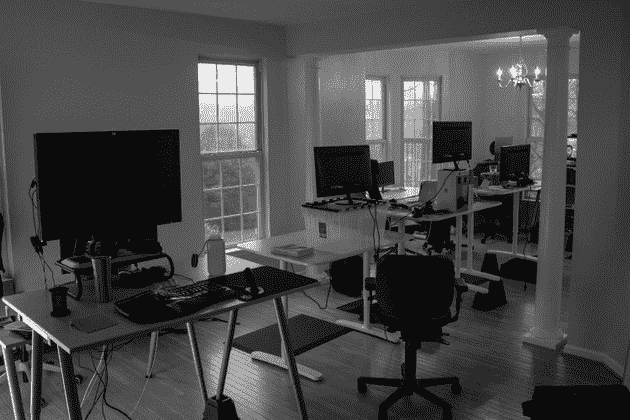

# 拯救美国最差网站《大西洋》的秘密创业公司

> 原文：<https://www.theatlantic.com/technology/archive/2015/07/the-secret-startup-saved-healthcare-gov-the-worst-website-in-america/397784/?utm_source=wanqu.co&utm_campaign=Wanqu+Daily&utm_medium=website>

Loren Yu 周末在洛杉矶旅行时，收到了一封来自朋友的紧急电子邮件。这位名叫卡尔文·王的朋友提出了一个建议。

“如果你的回答不是‘不行’，那么我们应该尽快谈谈，比如明天，”王写道。

当时，于在纽约一家名为 SkillShare 的教育创业公司工作。SkillShare 有两名技术员工。余就是其中之一。王的提议将使他离开这家年轻的公司，但毫无疑问，俞敏洪会做出怎样的选择。一周后，他坐上了去巴尔的摩的火车。

俞决定加入王的设计和开发小组，努力拯救。

* * *

关于这个网站的其他故事已经被讲述得如此糟糕，以至于它几乎让患者保护与平价医疗法案破产。2013 年，奥巴马 2008 年竞选团队的健康顾问大卫·卡特勒[告诉](http://www.washingtonpost.com/politics/challenges-have-dogged-obamas-health-plan-since-2010/2013/11/02/453fba42-426b-11e3-a624-41d661b0bb78_story.html) *[《华盛顿邮报》](http://www.washingtonpost.com/politics/challenges-have-dogged-obamas-health-plan-since-2010/2013/11/02/453fba42-426b-11e3-a624-41d661b0bb78_story.html)* [，奥巴马政府“经营着世界上最大的初创企业，他们没有任何人经营过初创企业，甚至没有经营过企业”。很难想象有哪种情况是最擅长让立法通过的人也最擅长实施立法。它们是一套不同的技能。”](http://www.washingtonpost.com/politics/challenges-have-dogged-obamas-health-plan-since-2010/2013/11/02/453fba42-426b-11e3-a624-41d661b0bb78_story.html)

然而，很难夸大这个网站有多糟糕。该网站的登录系统——接受用户名和密码的软件，被每个健康保险申请人使用——有 91%的正常运行率。想象一下，如果 Google.com 每天随机停止回复搜索请求两个小时，你会想象出一个比奥巴马政府推出的网站更可靠的网站。在 Healthcare.gov 的第一天，[有六个人](http://www.nbcnews.com/news/other/only-6-able-sign-healthcare-govs-first-day-documents-show-f8C11509571)成功地用它注册了健康保险。

Healthcare.gov 在推出时的惊人失败导致了后来被称为 Tech Surge 的创立，这是一群硅谷开发者将网站从无组织的承包商和官僚管理不善中拯救出来。该组织催生了美国数字服务公司(T1)和在较小程度上的 T2 公司(18F T3)，这两个政府机构目前正致力于改善联邦技术状况。

但是一个名为 Marketplace Lite team 的团队的故事还没有被讲述。这些是设计师和开发人员，他们大多比科技浪潮中的人年轻，在其他人离开后留下来。他们的经历暗示了奥巴马政府对建立一个像 Healthcare.gov 这样复杂的网站知之甚少——但也暗示了自那以后政府改进了多少。

<picture class="ArticleInlineImageFigure_picture__HoflP"></picture>

Loren Yu works on Healthcare.gov at the home that served as MPL headquarters. (Robinson Meyer / The Atlantic)

这里是 TL；他们的故事的 dr 版本:Marketplace Lite，或后来被称为“MPL ”,花了几个月的时间全面重写 Healthcare.gov 的功能，在政府内部作为一家初创公司工作，用价格只有五十分之一的应用程序取代承包商制作的应用程序。当 Healthcare.gov 首次推出近一年后，该网站的第二次开放注册被证明比第一次健康得多时，庆祝的是 MPL 团队。

在长达 16 个月的时间里，MPL 团队取得了三项伟大的技术成就。首先，它作为一个精英团队，了解网站的基础设施，能够解决出现的小问题。其次，它开发了一款名为 App2 的保险应用，新用户注册时间不到原应用的一半。最后，它用自己设计的功能性(而且便宜得多)的登录系统取代了网站的 crashy 登录系统。

这大部分是在他们一起住在马里兰州郊区一栋不起眼的豪宅里时完成的。

因此，这个团队一开始是对大量杂乱无章、苦苦挣扎的代码进行错误修复，最后却为政府编写了关键、高效的基础设施。然而，MPL 团队在哲学上的成就可能更重要:它帮助教会了政府官员如何在 2015 年考虑建设网站。

* * *

在加入 MPL 并在工作之前，28 岁的于(音译)曾问自己，他应该如何平衡工作与生活。“没有生活，只有工作，”他记得有人告诉他。“基本上是一周七天，每天 10 小时。”

事情就是这样:在与 Kalvin Wang 就这份工作进行了第一次交流后没几天，于就向 Skillshare 请了假，登上了飞往巴尔的摩。王在火车站接了余，匆匆停下来吃了一份披萨，然后带他去了附近的逸林酒店。那天晚上，余开始安装软件。

团队成员在地板上、桌子上和双树酒店的小大厅里，有无尽的编码日。(他们住在双树酒店，因为他们无处可去——没有真正的办公室——还因为 Healthcare.gov 的控制中心在马里兰州附近一栋不起眼的大楼里。)当时，政府对 MPL 团队的目标是巨大的:取代网站上消费者可以比较医疗保险计划的整个部分。

余说，在队里的头三天，“我觉得几个星期过去了”。

名为 Marketplace Lite 的团队从未真正构建过 Marketplace 的工作版或精简版。这项任务太复杂，影响太深远。但由于未能完成，他们推动政府更好地理解技术。在此期间，他们开始从自己的联邦分支机构寻求许可，以使用一项对程序员来说似乎很基本但 Healthcare.gov 以前从未以任何方式使用过的技术:亚马逊网络服务。

与智能手机一样，亚马逊网络服务(AWS)是当前科技繁荣的两个最重要的基础设施之一。AWS 是位于弗吉尼亚州和华盛顿州的超级计算机数据中心，公司可以从这里租赁存储或计算能力。一款 AWS 产品让用户以极其低廉的价格购买云存储；另一个处理域名路由；还有一个使管理大型数据库变得更容易。AWS 和 it 之类的云服务是科技公司能够快速扩张的原因。对于某种类型的开发人员来说，AWS 或其同类产品的可用性是假定的和附属的。

但是 Healthcare.gov 团队不能使用它们。根据医疗保险和医疗补助服务中心(Healthcare.gov 工作的所在地)的规定，AWS 需要通过特别的安全审查，才能在 Healthcare.gov 的部分地区进行建设。

<aside class="ArticlePullquote_root__YtnHv">“You could see left and right people were burning out.”</aside>

尽管寻求批准的过程始于 2014 年初，但它拖了几个月，阻碍了团队做任何事情的能力。“1 月份，他们认为它会在 3 月份推出。三月份，他们认为它会在五月份发布。MPL 前成员 Rohan Bhobe 说。

在将近六个月的时间里，卫生和人类服务部没有授权 MPL 使用 AWS。

但是当他们等待的时候，他们没有坐在他们的臀部。他们继续工作，工作时间越来越长。“你可以看到左右两边的人都筋疲力尽了，”于说。

因此，在最初的几个月里，MPL 与技术浪潮并肩工作，开始随机应变。他们发现，他们可以使用 Akamai，一家已经得到政府支持的云提供商，来推出静态网站，在用户的浏览器中处理复杂的功能，而不是在外部服务器上。该团队成功地创建了一个页面，让用户在 Healthcare.gov 上创建新账户，取代了该网站最容易出错的部分之一。

然后，在 2014 年 3 月 31 日，科技热潮结束了。人们的合同到期了，MPL 团队不得不决定是否继续作为一个独立的实体存在。

* * *

它的成功，甚至是临时的成功，都证明了 MPL 确实在解决问题——不管有没有他们向联邦政府请求的支持——而且他们也鼓舞了士气，足以说服团队的一些成员留下来。团队成员都休了几周的假，回来时已经是一个完全独立的团队，独立于技术浪潮之外。许多人辞去了之前只休过假的工作——至少有一个人离开了谷歌；Yu，Skillshare——新的团队成员被聘用。Bhobe 就是其中之一:他从一个社交网络“体验项目”加入了这个团队。

在 2014 年 4 月重新召集后不久，这个团队得到了一次款待:他们陪同科技浪潮的其他成员参加了一个白宫派对，在那里他们受到了总统的亲自祝贺和感谢。这些比他们以前住的地方要好。随着技术热潮的结束，团队成员从逸林搬到了 CMS 办公室——但他们在那里没有办公室。相反，他们蹲在 CMS 的办公室里，而不同的员工在开会。他们挤在椅子和文件柜上。当有人回到他们的办公室，他们发现另一个空的。

也就是说，政府越来越擅长与小型开发团队合作。大约在 2014 年年中，MPL 团队与包括测试团队在内的关键联邦政府联系，使用 Hipchat，这是一个类似于 Slack 的群组聊天室。

俞说，改用聊天客户端是对“这些庞大的电子邮件链和所有这些附件”的巨大改进。它还允许 CMS 内部的小办公室，如 Healthcare.gov 测试团队，快速向 MPL 团队提出问题和澄清。

以前政府使用群聊的尝试失败了，但是 MPL 取得了更多的成功。为什么？他们的努力从底层开始，规模很小。起初它只在内部使用，然后扩展到政府内部的几个感兴趣的团体，最后它发展到包括 CMS 中的许多团体。虽然它是有机发生的，但这恰恰反映了 Slack 建议公司采用其产品的方式:首先在小团队中采用，然后逐步推广。

“也许 CMS 会相信我们，他们会要求每个人都使用 Hipchat，但这样做，没有人会看到它的实际价值，现在它只是人们必须遵守的另一条规则，”Bhobe 说。

这也揭示了 MPL 团队对机构权力的狡猾利用。在采访中，他们中的许多人重复了同一个想法:在技术上以身作则，会让人们更有可能尝试新方法，而不是简单地说，“嘿，我们都应该这样做。”

* * *

<picture class="ArticleInlineImageFigure_picture__HoflP"></picture>

The team’s headquarters and home in Ellicott City, Maryland (Robinson Meyer / The Atlantic)

随着夏季的开始，MPL 团队开始寻找一个更稳定的办公室。他们在马里兰州郊区一个看起来不起眼的房子里找到了它。这栋房子坐落在一座小山顶上的一条死胡同里，面对着另外三栋同样年代的房子:2000 年代的繁荣时期，有乙烯基墙板、硬木地板和进口花岗岩台面。沿着街道，有一个建于 1978 年的木制网格圆顶，再往前是一排高压电塔、一个信号塔和马里兰州埃利科特市的分区。

该团队于 6 月搬迁。这所房子从来没有好好装修过。其一是百叶窗不见了；梳妆台和抽屉；和非折叠椅。餐桌(白色塑料的，还可以折叠)是你在教堂壁橱里看到的那种。卧室通常只有一张或两张半成品的床，房间里有一个敞开的行李箱。

主要的工作空间应该是客厅所在的地方，面对前门，在一个廉价的枝形吊灯下，有两排直立的桌子，上面放着笔记本电脑、大屏幕、纠结在一起的彩色电线和成堆的笔记。

将近一年的时间里，这栋房子为 Marketplace Lite 团队提供了卧室、办公室和厨房。(这在一定程度上是出于经济原因:事实证明，在马里兰州郊区租房子比无限期预订 6 到 10 间酒店房间要便宜。)但这也给了团队一个家和一个工作空间。高峰时，白天 10 个人在房子里干活，6 个人把它叫做自己的家。

* * *

尽管 MPL 团队像一个内部创业公司一样运作，但他们是一个嵌入更大的政府结构中的创业公司。这意味着他们受制于政府代码工厂的压力，尽管他们并不完全受政府代码工厂的管理——正如 Bhobe 所说，“所有这些在开发人员之上的人都在远距离管理开发人员。”

政府运行软件的方法开启了被称为“瀑布”的顺序设计策略:一个中心日历，结束所有甘特图的甘特图，公布每项任务何时完成。政府试图将软件开发作为一个官僚化的过程，由项目经理管理项目经理，然后整个事情就破裂了。

<aside class="ArticlePullquote_root__YtnHv">“How can we launch to zero percent of people if those things aren’t done?”</aside>

相反，团队以“敏捷”的方式工作，这有利于小型的、跨学科的团队，这些团队在快速完成对产品(通常是软件)的迭代改进的同时，保持彼此之间的密切沟通。

政府渴望拥抱敏捷方法，但它并不总是理解它们。团队和政府第一次尝试一起实现它们时，政府代表起草了一份为期三个月的计划，包括五个精心安排的开发冲刺。

“我就想，这算什么敏捷？这是一个为期三个月的计划——也就是说，这三个月中的每一天都有一个计划。如果你在第三周学到一些东西，改变了计划的其余部分，怎么办？，’”余记得自己问过。“他们说，哦，这是计划的其余部分，所以不能改变。”

这种紧张在截止日期的争斗中变得最为明显。MPL 团队没有选择用单一的强大魅力来发布 App2。相反，它分阶段推出了这款应用:首先，面向 0%的用户；然后，对其中的百分之一；百分之十；百分之二十；一直到百分之百的用户。这些发射目标只是目标，更重要的是，它们只是估计。它们可能会被打乱或不完美地执行:目标是建立一个有效的、在线的、可以改进的产品。

并且，在接近零百分比目标时，MPL 团队开始改变参数。开发人员意识到他们可以放弃一个计划好的特性来换取完全修复另一个，他们通知他们的政府老板这是他们计划要做的。

“我们觉得这没什么大不了的，”余告诉我。但是政府，他说，回复了这样一条信息:“如果这些事情没有做，我们怎么能发动 0%的人？”

Bhobe 说:“有很多层次的组织，特别是在这些大型承包组织中，他们除了管理进度什么也不做，所以如果进度落后，那就是他们的最高警报。

部分原因是沟通失败:团队没有完全理解政府关于发布日期的假设。但这也暴露了政府是如何不理解敏捷的，尽管它说它重视这项技术。(美国卫生与公众服务部的官员拒绝了多次置评请求。)

在 Healthcare.gov 的发展过程中，这也不是政府第一次试图变得灵活。该网站的一些原始合同规定，承包商将遵循敏捷技术，以便更快地开发软件。正是这些合同中的许多出了差错，造成了巨大的成本超支。根据政府问责局的说法，发生这种情况[是因为 CMS 未能对他们进行适当的监督](http://www.zdnet.com/article/the-billion-dollar-web-site-you-paid-for/)——努力知道如何对敏捷进行监督——并且因为这些合同也是“成本加固定费用”，承包商在建造网站时遇到的成本得到补偿。MPL 团队的经验似乎表明，即使团队在敏捷方面更有经验，许多政府雇员也很难适应这个过程。

* * *

该团队没有构建市场应用程序，而是创建了一个新的医疗保险应用程序。虽然最初只是为呼叫中心设计的，但这款新应用证明非常受欢迎，最终 CMS 将其推广到了所有有简单病史的人。大约 65%的新用户最终使用了这个“应用 2.0”

该团队在 2014 年秋季完成了 App 2.0 的推出。2014 年 11 月 15 日，普通美国人可以再次开始注册保险的开放式登记开始了。除了一开始的一个小问题，很快就解决了，在接下来的三个月里，这个过程与前一年完全不同。人们登录了。他们输入了自己的信息。他们买了保险。Healthcare.gov 工作了。

尤其是 App 2.0，效果非常好。根据 Bhobe 的说法，用户在大约 9 分钟内完成它，而以前的版本需要 20 分钟。App 2.0 响应迅速，意味着它可以在所有类型的屏幕上工作，桌面和移动；从头到尾指导用户只需要更少的页面。以前的版本需要用户翻阅大约 76 页，而 App 2.0 最多只需要 16 页。也许是因为简洁，85%的用户都通过了它。只有 55%的用户设法完成了第一个版本。

Bhobe 把这部分归功于良好的软件设计策略。MPL 团队努力让政府阐明软件需要满足的需求，然后设计解决方案来满足这些需求。

“关于需求，你不能把解决方案和需求混为一谈，所以你实际上是在说，这是我们需要解决的一个需求。你可以利用团队的创造力和能量来找出解决问题的最佳方法，”他告诉我。

不过，这个团队一直在努力。他们的新目标——他们原本想在 11 月前完成的目标——是建立一个登录系统来取代网站原有的不良系统。

值得在第一次登录系统上逗留片刻。它没有为 Healthcare.gov 用户使用新的数据库，而是将数据存储在用于存放联邦政府雇员信息的同一个数据库中。这并没有让它变得更加稳定:它仍然导致了大约一半的 Healthcare.gov 停电。(俞说:“有很多次停电。)

<picture class="ArticleInlineImageFigure_picture__HoflP"></picture>

The living room—now an office—of the team’s house in Maryland (Robinson Meyer / The Atlantic)

这个臃肿的数据库不堪重负。灾难性的失败经常发生。有时，只有几个组件会在没有通知其他组件的情况下崩溃，导致一个臭名昭著的错误，绰号为“迷失的灵魂”，其中有人可以成功创建一个帐户，但永远不会收到确认电子邮件说他们已经这样做了。它还通过假设每个人都有一个独特的生日来索引家庭成员，这意味着双胞胎不能都有账户。

这个最终的开发传奇，虽然是最难制作的产品，但在某些方面却是最容易的。政府和 MPL 更善于合作，而且双方都更了解对方的期望。MPL 不需要提出一个敏捷技术，只需要看着政府为它绘制一个甘特图。

而 MPL 在 2015 年 2 月推出的新登录系统更是令人瞩目。它比旧系统更快更便宜:旧系统响应请求的时间在 2 到 10 秒之间；新的平均需要 30 毫秒。旧的登录系统花费了 2 . 5 亿美元来建立，并且每年还需要 7000 万美元来保持在线。新系统的建造成本约为 400 万美元，每年的维护成本略低于 100 万美元。

* * *

MPL 现在已经解散，但它不会永远消失。五月中旬，它成立了一家新公司，名为[纳瓦](http://navahq.com/)的公益公司[。Bhobe 和 Yu 以及其他人已经离开家，搬到华盛顿去了。](http://en.wikipedia.org/wiki/Benefit_corporation)

房子怎么样了？现在已经空了:今年 4 月，它剩下的五个住户在 Craigslist 上放弃了他们的宜家灯笼和蓝色天鹅绒沙发，搬到了华盛顿特区或旧金山。

MPL 团队不是理想的劳动力:他们是(并且仍然是)承包商之间的承包商。他们不受工会保护，也享受不到公务员的诸多福利。他们是雇佣程序员，可以很快在全国范围内重新安置，他们反映了他们工作的更大的行业:大多数是年轻人，大多数是男性，受过高等教育。事情不一定是这样的。这种不稳定的工作——有利可图，类似游牧——既是糟糕规划的结果，也是以写代码为生的自然结果。

相反，如果 MPL 团队的成功证实了未来的任何指导原则，那就是:技术工人——不仅是工程师，还有设计师——必须从一开始就参与到过程中。他们将知道特性必须与需求分开描述，并且当构建软件时，小团队通常比大团队表现得更好。

在与 MPL 团队成员的交谈中，我被许多问题的解决所震惊，这些问题仅仅是因为有一群敬业的员工愿意做这些工作和修复这些错误。政府问责局将第一届 Healthcare.gov 的失败部分归咎于政府对网站不断变化的要求及其糟糕的风险管理——尤其是敏捷流程。但是 MPL 团队的经验表明，承包商，或者至少是他们的政府主管，实际上并没有使用敏捷方法，而是模仿了他们的行话。团队成员发现政府反对敏捷过程，因为，引用于的话，他们问，“如果有 bug 怎么办？”

但是总会有 bug。因为一个网站不是一个坦克:它不是一片一片地建造起来的，指派更多的人去做也不会让它更快地完成。最重要的是，政府不能规定它想要什么，并期望一个完美的可交付产品，否则政府将收到符合所有规范的软件，除了一个重要的规范:*它能工作。*

这就是为什么政府内部努力掌握技术——特别是 [18F 和美国数字服务](http://ben.balter.com/2015/04/22/the-difference-between-18f-and-usds/)——与纳瓦的努力一样重要的原因之一。

事实上，纳瓦希望继续拓展业务。Bhobe 表示，该公司打算实现一个更大的目标，即将一些政府 IT 服务转化为应用程序编程接口，即 API，供政府或私营公司使用。换句话说，Healthcare.gov 不再是访问联邦保险市场的唯一途径，一系列网站可以访问相同的数据库，并为具有不同界面的竞争市场提供服务。

Bhobe 将最终的、想象中的产品比作联邦公路系统:法律规定了道路的规格和走向，但最终私营公司会在道路周围建设和发展企业。

这是一个可笑的、遥远的目标吗？也许吧。但是联邦政府已经在建设关键的信息基础设施——它通常只是用纸和一式三份签名的表格来做这件事。现在，在纳瓦和其他人的帮助下，它可能知道如何用代码做到这一点。

