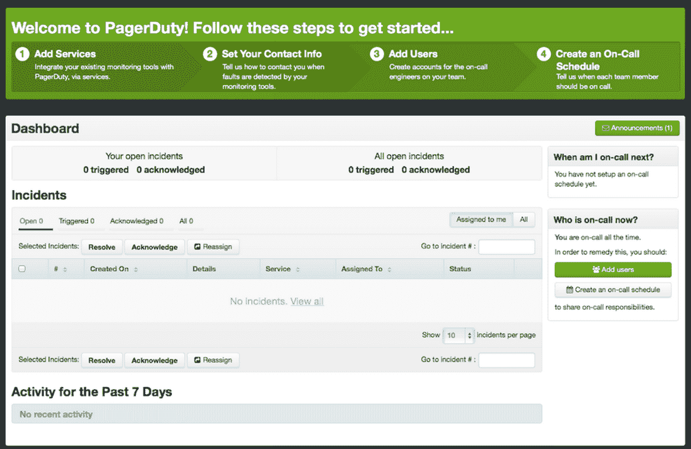
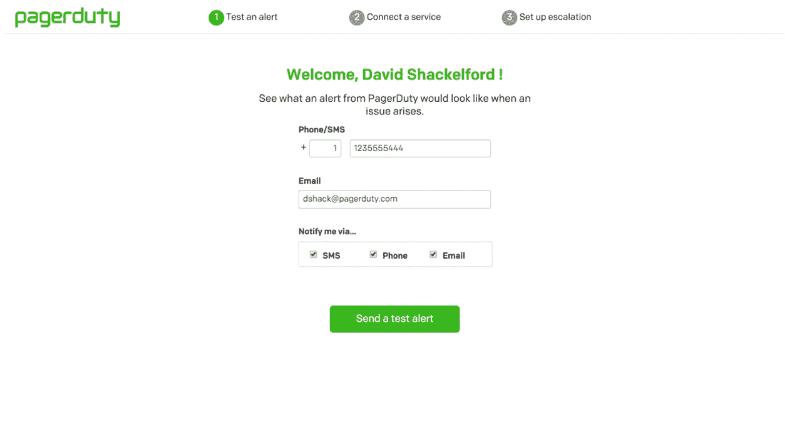

# 用于优化入职的 PagerDuty 堆栈| Twilio Segment 博客

> 原文：<https://segment.com/blog/pagerduty-onboarding-analytics-stack/?utm_source=wanqu.co&utm_campaign=Wanqu+Daily&utm_medium=website>

在[page duty](https://pagerduty.com/)，可靠性是我们的面包和黄油，这从用户第一次与我们的平台互动开始:我们的试用版。

## 改善入职培训

(简单介绍一下我们的背景，PagerDuty 是一个运营绩效平台，帮助公司获得可见性、可靠的警报和更快的事件解决时间。)

我们从客户那里听说我们的服务易于设置和开始，但我们也知道还有改进的空间。用户有时会在没有看到我们所有功能的情况下完成试用，或者不会完成帐户设置，这导致他们错过了一些提醒。我们希望帮助我们所有的客户取得成功，我们知道如果我们做得好，我们也将提高我们的试用到付费的转化率。

在开始重新设计之前，我们与我们的客户、支持团队和 UX 团队进行了交谈，但我们也希望用定量数据来补充他们的定性反馈。我们希望使用[遥测](https://en.wikipedia.org/wiki/Telemetry)(数据的自动测量和传输)来准确了解用户在我们的产品中做了什么，以及他们在哪里受到了阻碍，因此我们可以提供更好的第一次体验。

## 测量基线

在我们开始改变之前，我们需要建立一个基线:用户是如何通过应用程序的？他们的道路符合我们的期望吗？这些路径是否与我们试图推动它们通过的入职流程相匹配？

在研究了用户分析领域后，我们发现 [Mixpanel](https://mixpanel.com/) 和 [Kissmetrics](https://kissmetrics.com/) 最适合回答这类问题。然而，采用这些工具的投资(金钱和实现时间)是巨大的——以至于我们想要测试这两者以确保我们选择了正确的工具。但是，全面测试此类工具的唯一方法是针对实时数据运行它们。

这就是[段](https://segment.com/)出现的原因。我们很高兴能找到一个工具，让我们可以进行单个[跟踪调用](https://segment.com/docs/spec/track/)，并同时在多个下游工具中查看数据。Segment 使得同时测试两个平台变得很容易，随着更多的部门在寻找更多的分析工具，未来快速集成的前景也让我们兴奋不已。

## 分析比赛

我们用关于用户流量和转换漏斗的问题来测试 Kissmetrics 和 Mixpanel 是否能帮助我们理解当前的事态。使用 Segment，我们跟踪了 web 应用程序中的每个页面以及我们能想到的尽可能多的事件(不包括一些超高容量的事件，如事件触发)。然后，我们的 UX、产品和产品营销团队开始研究这些工具，评估它们回答我们的使用问题的能力。

在使用这两个工具几个星期后，我们使用了 Kissmetrics。老实说，它们都很棒，但我们更喜欢 Kissmetrics 中的漏斗计算。他们还提供了多种方法来侧加载和后加载带外数据，如销售接触，所以 Kiss 是赢家。

在整个过程中，我们还了解到我们[应该跟踪更少的事件](http://www.slideshare.net/500startups/wmd-2015-diana-smith)。如果我们要再做一次，我们将只收集表示非常重要的用户行为的事件，这些事件有助于我们对这个项目的度量。当你追踪太多的事件时，它变得嘈杂。

## 改善体验

梳理完数据后，我们的用户体验团队有了很多想法来开发新的入职流程。我们模拟了几种方法，并针对客户和公司内部人员对它们进行了审查。然后，我们尝试了我们认为最能传达我们的价值主张并帮助客户快速上手的设计。我们的方法既包括注册后的整页接管，也包括之后的“培育栏”,向客户展示完成设置的后续步骤。

实施后，我们跟踪了接管向导每个阶段的客户流失情况，以了解我们做得如何。我们还测量了**“试用参与度”**，这是一个客户可能从试用状态转换的内部计算(其他人称为[“啊哈时刻”](http://blog.modeanalytics.com/facebook-aha-moment-simpler-than-you-think/))。使用 Kissmetrics，很容易衡量新设计如何与这一指标相匹配。

旧:

新:

## 结果呢

在推出新体验后，**我们看到前面提到的“参与度”指标**提高了 25%,这是使用 Kissmetrics 的每周群组报告测得的。Kissmetrics 向我们展示了使用新向导后，新用户会在试用的早期积极地使用产品，并使用产品中的更多功能。此外，更少的新用户最终处于“失败状态”，例如在没有设置通知规则的情况下处于待命状态。

从那时起，我们已经在试用漏斗上运行了各种实验，每周群组报告对于查看这些实验的效果以及确定我们的改变是否真正有助于用户非常有帮助。

定性反馈对于全面了解产品变化如何影响用户体验也很重要。在这方面，我们的技术水平相当低——我将从 Kissmetrics 获得的用户列表转储到 CSV 中，然后向他们发送了一份快速的微型调查，看看新入职是否有任何不清楚的地方。我们还从我们的销售团队和支持团队收集了内部反馈，以确认客户认为我们的新体验易于使用和理解。

为了获得更多关于人们如何使用 PagerDuty 的背景信息，我们还将细分数据发送到 [Google Analytics](http://www.google.com/analytics/) ，这是一种查看元行为趋势的好方法。Kiss 可以告诉你**谁**在做什么，但是谷歌分析更适合问类似“哪些功能用得最多？”或者“我们的大部分用户用的是什么安卓版本？”谷歌对漏斗顶端分析(营销网站)的管理也稍好一些，而一旦用户真正试用，Kissmetrics 就更加强大。

## 后续步骤

自从我们在向导上的最初工作以来，我们已经扩展了我们的分析使用，以查看试用帐户和活跃客户的行为。每当我准备在产品的特定领域开始工作时，我都会使用 Kissmetrics 列出该领域高度活跃的用户，然后联系他们，了解他们如何使用我们的功能，以及他们的难点和目标是什么。我们还使用 Segment 实现了移动跟踪，因为我们的一些客户主要通过我们的移动应用程序使用我们的服务，并安装了 ruby gem 进行代码级跟踪。

我们希望对我们的 onboarding 进行大量的改进，但由于它现在做得很好，我们的下一个项目将是调查同步 A/B 测试。我们行动迅速，如果我们在产品变化的同时进行销售或营销活动，有时很难理清什么影响了什么。分割测试试用体验应该让我们获得更清晰的数据，了解我们的重新设计如何改善我们试用用户的体验，并最终帮助我们对理想的体验做出更好的决定。

## 我们学到了什么

像任何新计划一样，我们在第一次实施分析时学到了很多东西。以下是我们的一些建议——希望对你也有帮助。

*   选择跟踪什么是一门艺术——事件太少，你可能会错过一个关键的行动；太多的话会很吵。Segment 还没有发布他们的[“跟踪计划”功能](https://segment.com/blog/introducing-the-tracking-plan/)，所以我们必须在 Google Docs 中管理我们的跟踪事件列表。这并不美好——事实上，如果我们再做一次，在我们完成评估后，我会开始一个新的账户，跟踪更少的事件。

*   在细分市场和下游分析工具中，使用独立的生产和开发环境是绝对关键的。我们对它进行了设置，因此我们所有本地、试运行和负载测试环境中的事件都转到“page duty-dev ”,只有生产 web 堆栈中的事件转到主帐户。此外，我们添加了过滤器，以确保我们不会将内部员工账户上的活动纳入我们的指标。

*   没有人解决同时查看用户级和账户级漏斗数据的问题。我们目前正在寻找一个使用两个不同 Kiss 实例的 Kissmetrics 变通方法，但令我们惊讶的是，没有人能在两个级别上处理旋转。

*   用户隐私和信任对我们来说非常重要。PagerDuty 认真对待其隐私政策，在选择我们的分析堆栈时，我们确保任何处理用户和客户数据的供应商都有强有力的[隐私政策](https://www.pagerduty.com/privacy-policy/)，包括安全港合规性。

我希望我们的故事对你有所帮助！如果您有任何问题或反馈，请在 Twitter 上联系我。

* * *

非常感谢来自 PagerDuty 的 Dave 撰写了这篇文章！如果您有兴趣分享您的片段故事，我们欢迎您的加入。邮箱**上手！**