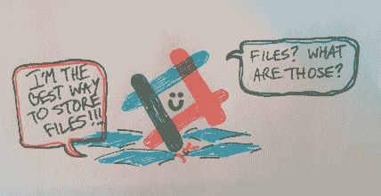

# Dropbox:第一个死亡的十玉米——欢迎来到丹麦

> 原文：<http://alexdanco.com/2015/08/24/dropbox-the-first-dead-decacorn/?utm_source=wanqu.co&utm_campaign=Wanqu+Daily&utm_medium=website>

突发新闻！股市崩盘了！大家都慌了！独角兽要死了！！！

好吧，也许我们有点反应过度了。但今天(8 月 24 日，星期一)股市出现了 4%的小幅“修正”

[bit of panicking in the tech world](http://techcrunch.com/2015/08/24/facebook-down-12-1-apple-down-10-google-down-6-5-microsoft-down-5-8-as-stock-markets-plummet/#.m4l5jy:8p3c)

苹果、谷歌、脸书和亚马逊(以及更多)的股票都大幅缩水。(蒂姆·库克赶来救援

[saved the day](https://twitter.com/carlquintanilla/status/635799629947404288)

…大约半个小时。和 maaaay 可能有

[broken some rules](http://fortune.com/2015/08/24/tim-cook-sec/)

。尽管如此，他还是努力了！)

不过，今天的骚动确实给“我们处于泡沫之中”的说法火上浇油。火——尤其是将会有一些

[dead Unicorns](http://fortune.com/2015/03/15/bill-gurley-predicts-dead-unicorns-in-startup-land-this-year/)

很快。著名的 Doomicorn 爱好者比尔·格利

[plenty to say](https://twitter.com/bgurley/status/634572713168793600)

关于这一点，毫无疑问，今天科技界的一些午餐讨论都围绕着这个令人困扰的问题——哪些 1B+技术公司将会消亡，何时消亡？那么第一批十亿美元以上的公司呢？

我当然觉得，不管有没有泡沫，我们都会看到一两家这种虚构的公司在某个时候破产，不管是什么情况。无论市场泡沫或投资者恐慌的状态如何，科技世界变化的速度如此之快，以至于真的没有办法让每一家大型私营科技公司在被竞争对手击败、被破坏或被彻底淘汰后存活太长时间。我不在乎他们的集体高管层有多少创新和活力；在某个时候，他们中的一些人会突然震惊地意识到…他们不再重要了。恐怖啊！一个大问题是不可避免的——正如列宁所问的——谁，谁？谁会死，死在谁的手上？

初创公司最初最大的恐惧不是来自其他公司的竞争，而是担心被忽视和不相关。过了某个增长阶段，现在你开始担心你的竞争对手——如果他们能把它造得更好、更便宜、更快、更强呢？不过，在另一点上(我会围绕 1B 的估值关口进行争论)，你的同行不再是你最大的担忧。如果你身价 10 亿美元，你可能做得足够好，以至于你的直接竞争对手不能在一夜之间把你彻底打败。相反，你的噩梦变成了比被淘汰更可怕的命运:被超越。具体来说，*被比你高一级或低一级的人盖过。*

这在实践中是什么样子的？这是微软对个人电脑制造商所做的，然后是网络浏览器对微软所做的。这就是 Android/iOS 对手机制造商所做的，也是脸书反过来试图对他们做的。对于那些黯然失色的人来说，这是很可怕的，因为这种变化发生得如此缓慢*又如此突然*:康柏曾经是最好的个人电脑制造商之一，直到突然之间 Windows 才是最重要的，而不是运行它的机器。过了一会儿，Windows 统治了世界，微软称王——但所有有趣的事情都开始发生在网络浏览器内部。我的观点是:康柏没有被打败，因为其他人出现并制造了更好的台式电脑。他们失败了，因为突然之间，Windows 成了重要的东西——而像戴尔这样的其他 PC 制造商更适合在模块化商品的新现实中茁壮成长。

在我的独角兽预测之前，我再次强调——当数十亿美元的科技公司死亡时，通常不是死于它们的直接竞争对手之手。这仅仅是因为他们从某一天成为他们所做的最好的人，到第二天仍然是他们所做的最好的人，但这并不重要。当这些公司真的很大时——即 100 亿美元以上——这很重要。

那么谁会是第一个倒下的十粒玉米呢？我的赌注是 Dropbox。但不是-

[as has been the worry](http://blogs.smartertools.com/2012/05/10/how-google-drive-beats-dropbox-and-skydrive/)

因为 Google Drive、Skydrive 或任何云托管的文件存储解决方案。正如我们之前看到的，最可怕的不是你的直接竞争对手。

Dropbox 会死在 Slack 手里。

你可能没有想到 Dropbox 和 Slack 是竞争对手，因为它们不是——从典型的意义上来说。事实上，“我们整合了你已经使用的所有服务，比如 Dropbox”

[part of Slack’s pitch](https://www.youtube.com/watch?v=B6zVzWU95Sw)

早期。这是因为 Slack 和 Dropbox 并不是真正的同行:它们是工作场所堆栈中的邻居:

你可能会认为 Slack 这样的交流和工作流工具是对 Dropbox 这样的存储和版本控制服务的极大补充——你是对的。但是，随着 Slack 在技术领域和外部世界迅速崛起，他们和其他类似的人正在改变我们工作本身的要求。

[As Benedict Evans writes succinctly](http://ben-evans.com/benedictevans/2015/5/21/office-messaging-and-verbs)

新的工具开始是为了适应现有的工作流，但是随着时间的推移，工作流会发展到充分利用这些工具。他指的是每天通过电子邮件在无数部门传阅的无处不在的内部演示文稿，其中充满了公司指标和要点，他沉思道:“powerpoint 文件可以被一个制作幻灯片的网络应用程序所取代，它可以让两个人同时进行工作。但是它

*should*

取而代之的是具有实时数据、意外变化警报和聊天频道或 Slack 集成的 SaaS 仪表板。Powerpoint 被完全不是演示的东西杀死了。“这对 Slack 来说是好事，但为什么对 Dropbox 持悲观态度呢？

Dropbox 做两件重要的事情:存储你的东西，和分享你的东西。两者都很棒。但是存储本身已经不再是一个好行业了——云中硬盘空间的成本已经

[all but converged to zero](https://virtualizationreview.com/articles/2015/03/31/amazon-cuts-cloud-storage-prices-to-nearly-nothing.aspx)

在过去的几年里，在亚马逊的基础设施和谷歌的影响下，一场激烈的逐底竞争开始了。然而，Dropbox 幸存了下来，不是因为它提供了最便宜或最多的存储空间，而是因为它的文件共享和版本管理工具仍然相当不错。和

[they recognize that syncing files isn’t enough](http://www.forbes.com/sites/miguelhelft/2015/07/29/dropbox-is-under-siege-but-its-not-slowing-down/)

–他们表示，围绕这一核心职能提供服务和体验应该能达到目的。但是 Dropbox 存在的最大问题并不在于它提供文件管理服务的能力有多强:Dropbox 的问题在于它是一项出色的文件管理服务

*we just don’t care about files that much any more. *

在许多方面，Dropbox 代表了那种古老而受人尊敬的办公方式的完美最终形式:文件系统。在“过去”，办公室配备了成堆的橱柜用于存储，复印机用于复制，内部邮件部门(有时有可怕的气动管道)用于传输。然后，计算机出现了，我们自然地以我们一贯的方式组织我们的东西:通过虚拟文件和文件夹(用看起来像真东西的图标)。当你开始习惯新技术时，一些熟悉感不会有坏处。然后我们集体采用了电子邮件，用总是太大的繁琐附件发送我们的文件。然后云出现了，随之而来的承诺是我们所有的文件都将永远存在于云中，每个人都可以访问，永远，完全同步。那么问题出在哪里？

Dropbox 的问题在于，我们的工作习惯正在进化，以更好地利用现有资源；具体来说，互联网的强大力量。在互联网上,“文件”的概念有点奇怪，如果你停下来想想的话。当你考虑像 Evernote 这样的组织工具，像 Trello 这样的任务管理工具，以及像 Slack 这样的沟通渠道时，文件看起来非常过时。文件是存在于物理位置的离散对象；互联网……恰恰相反。虽然信息和互联网的诞生和早期发展会包含熟悉的、老派的想法和组织系统是有道理的，但在某些时候另一只鞋肯定会掉下来。对我来说，懈怠感觉像是第一次

*truly*

互联网和移动原生生产力平台——尤其是当它从消息传递扩展到

[workflow automation](http://venturebeat.com/2015/05/15/think-slack-is-just-a-billion-dollar-chat-app-you-havent-seen-how-this-company-is-using-it/)

,

[helper bots](http://www.wired.com/2015/08/slack-overrun-bots-friendly-wonderful-bots/)

天知道还有什么。Dropbox 可能是文件管理的巅峰，但 Slack 是下一步的开始。

我不认为文件会完全消失；无论如何，短期内不会。它们肯定会在很长一段时间内以数据结构的形式存在于我们的服务器和手机深处——然而大多数人对它们的存在漠不关心。我非常确定 Dropbox 数十亿美元的估值并不是对这一新现实的预期——它只是我们当前世界的一个投影，快进播放。这是极其短视的。Dropbox 可能不是第一个慢慢滑向无关紧要和死亡的独角兽，但它会发生。有了它，我们将最终结束一种古老、有用和庄严的做事方式——不起眼的锉刀——这种方式本应过着长久而有尊严的生活。

好吧，去 WordPress 上发布这个。谢谢，懒虫。🙂

### 像这样:

像 装...

### *相关*

