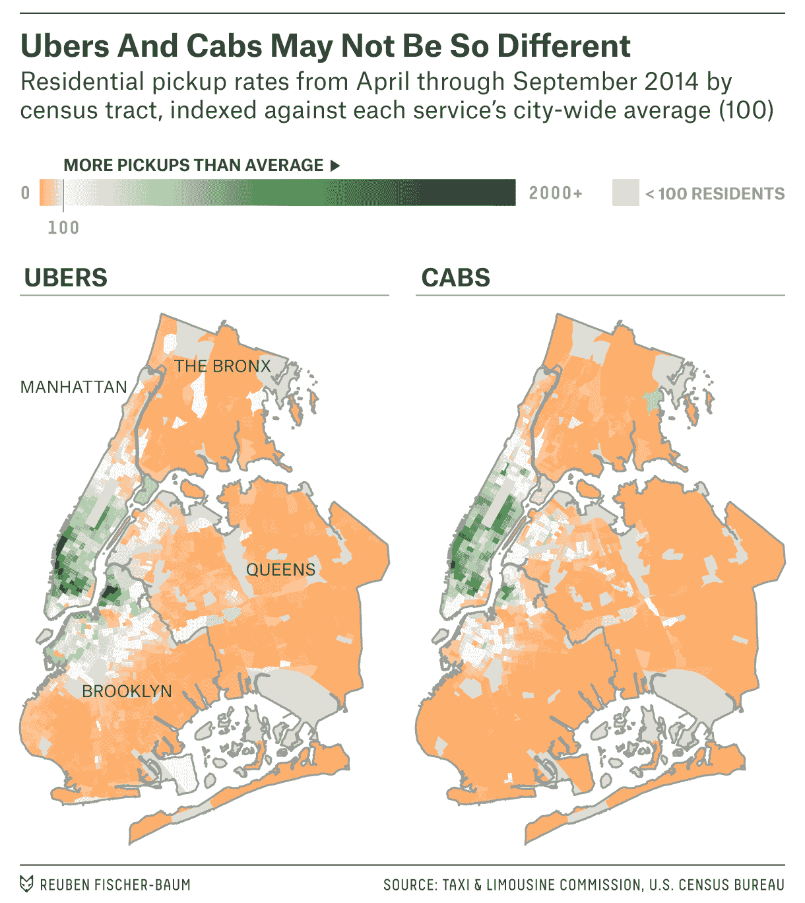
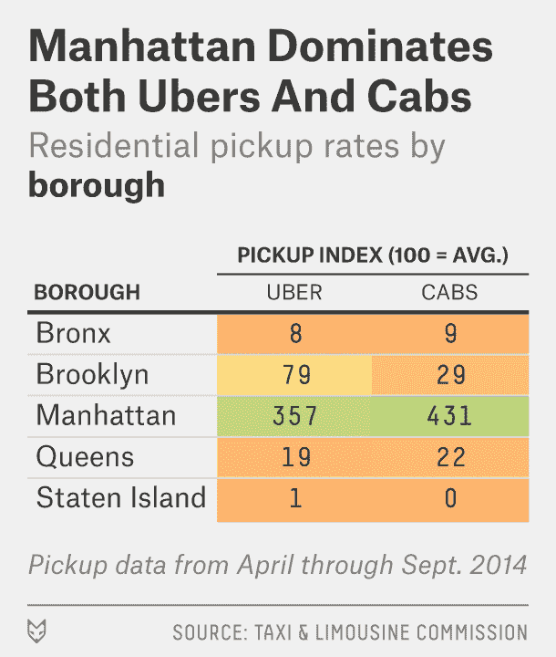
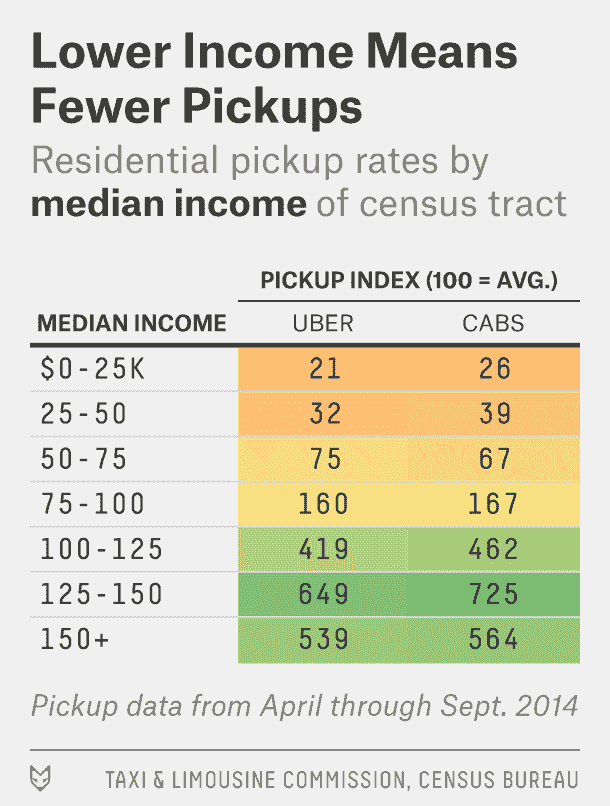
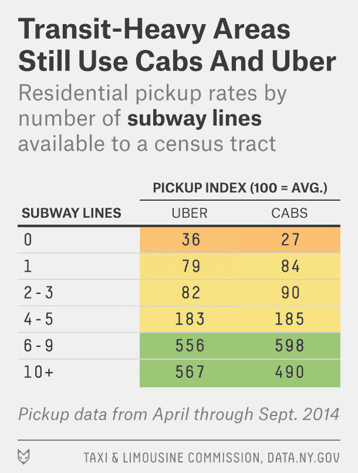
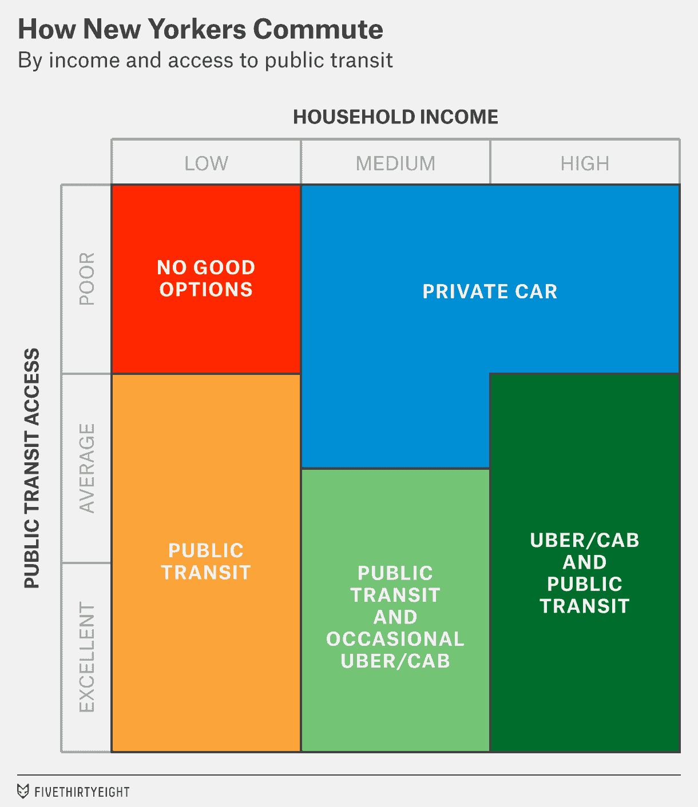
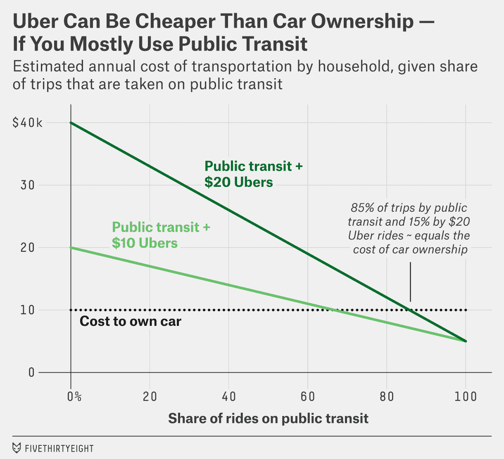

# 公共交通应该是优步的新朋友

> 原文：<https://fivethirtyeight.com/features/public-transit-should-be-ubers-new-best-friend/?utm_source=wanqu.co&utm_campaign=Wanqu+Daily&utm_medium=website>

如果优步对得起其 500 亿美元的估值，它,[将不得不做更多的事情来赢得历史上由出租车和豪华轿车行业占据的市场— 它将不得不识别新类型的客户。](https://fivethirtyeight.com/features/uber-isnt-worth-17-billion/)

最大的潜在市场是那些拥有自己汽车的人:普通美国家庭每年在私人汽车上花费大约 8500 美元；再乘以 1.25 亿个家庭，你就会有一个每年超过 1 万亿美元的市场。即使是说服一小部分家庭放弃他们的汽车去优步，对公司来说也是非常有利可图的。

但是如果优步要实现其在拥有汽车方面具有成本竞争力的目标，它可能会有一个不太可能的盟友:公共交通。(主要)公共交通和一些优步游乐设施的组合，比优步单独的价格更能为更多的顾客所承受。

纽约市是美国最大的公共交通市场——事实上，美国大约 40%的公共交通出行发生在纽约地铁区。碰巧的是，我们有一些关于纽约人如何使用优步、公共交通和其他服务的非常好的数据。本月早些时候，我们[发表了一份基于 2014 年 4 月至 9 月约 9300 万次优步和出租车出行的分析](https://fivethirtyeight.com/features/uber-is-serving-new-yorks-outer-boroughs-more-than-taxis-are/)，其中包括我们通过信息自由法请求获得的有关优步出行的信息。该分析主要集中在优步和出租车覆盖率之间的差异:例如，与出租车相比，优步在布鲁克林的使用比例更高。

但总体来说，优步接走的人和乘坐出租车的人没有太大区别。优步和出租车都不成比例地服务于曼哈顿的富人区，或者仅仅是穿过曼哈顿的桥梁和隧道。更重要的是，这些客户通常居住在公共交通便利的社区。换句话说，公共交通和出租汽车的结合是纽约人多年来一直依赖的东西。

看看我们在下面制作的地图，按人口普查区域，按人均追踪优步和出租车的接送情况。数据包括对每个人口普查区居民与工人比例的调整，目的是识别源于个人居住地的交通工具，而不是他们工作、购物、上学或休闲的地方。

正如你所看到的，优步和出租车的使用有很多共同点。人均优步使用量和人均出租车使用量之间的相关系数为 0.89，离 1 的完美相关性不远。

我们还可以通过不同的地理和人口统计类别来考虑这些差异，其中 100 代表每项服务的人均住宅使用量。例如，这里有一个区使用出租车和优步的频率比较。

截至 2014 年年中，曼哈顿人使用优步的平均频率是纽约居民的 3.6 倍，乘坐出租车的平均频率是纽约居民的 4.3 倍。请记住，我们的方法试图调整曼哈顿的许多皮卡来自商业而不是住宅区的事实；如果没有这种调整，差距会更大。最接近优步行政区的是布鲁克林，那里的出租车使用频率比整个城市低 70%，但优步的乘坐频率仅低 20%。除此之外，各服务之间的差异非常小。在皇后区和布朗克斯区，优步和出租车的使用是相当相称的。在斯塔滕岛，没有公路直接连接到曼哈顿，优步和出租车的使用是非常罕见的。

虽然优步和出租车的使用存在一些地理差异，但乘客的人口统计数据似乎基本相同。特别是，这两种服务的乘客都高度集中在较富裕的地区。举例来说，一个年收入中值为 135，000 美元的人口普查区居民乘坐优步和出租车的次数分别是年收入中值为 35，000 美元的居民的 20 倍和 20 倍。

这提醒我们，出租车或优步是一笔很大的开销。鉴于目前黄色出租车的[票价表，乘坐纽约出租车 5 英里的路程可能要花费 20 美元，包括合理的小费，视交通情况而定。(优步成本较低的服务之一 UberX 的定价与 T2 非常相似。)相比之下，地铁票价为 2.75 美元——大约便宜 17 美元。如果乘坐出租车可以为乘客节省 15 分钟——考虑到地铁有时比堵车时的出租车更快，这可能是一个慷慨的估计——这意味着她必须将自己的时间价值定在每小时 68 美元或以上，才能让乘坐出租车变得值得，这相当于她每周工作 40 小时，每年可以获得约 14 万美元的收入。对于高薪律师或银行家来说，这不算什么，但该市的家庭收入中值接近 5 万美元。](http://www.nyc.gov/html/tlc/html/passenger/taxicab_rate.shtml)

## 地铁是典型的纽约交通方式

纽约的租车市场有多大？我们的数据集包括 2014 年六个月内 9300 万次出租车和优步出行。将这一数字翻倍并四舍五入，你就会得到每年大约 2 亿次的乘坐次数。相比之下，纽约地铁[在 2014 年](http://web.mta.info/nyct/facts/ridership/)提供了 17.5 亿次乘坐，大约是这个数字的九倍。2014 年，MTA 也有近 8 亿次公交出行。

与出租车和优步相比，纽约的公共交通相对公平。在人均收入低于 50，000 美元的人口普查区，62%的工人乘坐公共交通工具上下班；但在人均收入 10 万美元或更高的地区，53%的人也是如此。

对于少数中上阶层和富裕的纽约人来说，优步和出租车服务可能会取代相对较差的地铁服务。例如，在休斯顿街和 59 街之间的曼哈顿最西边，出租车和优步的使用量尤其大，这个区域目前还没有地铁服务(尽管随着[7 号线延长线](https://en.wikipedia.org/wiki/7_Subway_Extension)的完工，服务将会改善)。在地铁服务拥挤的地区，出租车和优步的使用率也很高，比如沿列克星敦大道线的上东区和沿 L 线的威廉斯堡。

但在大多数情况下，优步和出租车在公共交通也是一个好选择的地方提供服务。我们收集了关于有多少条地铁线位于人口普查区边界线四分之一英里范围内的数据。在附近没有地铁线路的人口普查区，出租车的使用率只有纽约整体的 27 %,优步是 36%。即使附近只有一条地铁线，出租车和优步的使用也明显高于人口普查区，而且这种情况还会继续增加，直到你到达附近有 10 条或更多地铁线的少数人口普查区。即使你考虑到离曼哈顿中城的距离，这种差异仍然存在:那里的公共交通很差，出租车和优步服务也不常见。

## 即使在纽约，汽车也是一件大事

所有这些可能看起来违反直觉:为什么在公共交通是一个好选择的社区，出租车和优步使用率很高？原因可能是，在公共交通历来不是一个好选择的社区，私人汽车仍然是主要的交通方式。在纽约，拥有汽车并不像你从媒体对曼哈顿或布鲁克林富裕社区生活的描述中推断的那样罕见。相反，根据美国社区调查，几乎一半的纽约家庭拥有汽车，开车上班的纽约人是打车上班的 10 倍以上。

换句话说:鉴于拥有汽车的固定成本很高，纽约家庭做出的第一个也是最重要的交通选择是是否拥有一辆汽车。没有汽车的居民可能会使用公共交通、出租车、Ubers 和其他替代方式(如骑自行车和拼车)的组合来到达他们需要去的地方。从这个意义上说，优步、出租车和公共交通是相辅相成的，而不是竞争对手。

但是交通选择也受到通勤者收入的限制。我们的数据表明，我们可以根据纽约人的收入和乘坐公共交通的便利程度，将他们分为五大类。

**第 1 组——低收入、公共交通条件差:**在附近没有地铁线路的人口普查区，66%的家庭拥有私家车。然而，这些社区中的一个例外是那些年收入低于 35，000 美元的社区:那里的汽车拥有率仍然很低。鉴于纽约的生活成本很高，对于一个普通的美国家庭来说，35000 美元的收入相当于大约 20000 美元的 T2，这使得即使是一辆旧车也很难买得起。像这样的家庭没有很好的选择。

**第二组——低收入、公共交通便利:**人口普查区中收入中值低于 35，000 美元、至少有一条地铁线路的家庭是公共交通的大量用户，他们大约三分之二的通勤时间都是通过公共交通上班。

**第三组——中高收入，公共交通差:**如果你是纽约人，公共交通相对较差，但有足够的收入买得起车，你的选择就很明显了。像大多数美国人一样，你会买辆车。在收入中值为 35，000 美元或以上但附近没有地铁线路的人口普查区，大约 72%的家庭拥有汽车。这些人口普查区集中在斯塔滕岛和皇后区的东部，比纽约市的其他地区更接近郊区(换句话说，更像美国的其他地区)。

优步对最后两组更感兴趣:

**第四组——中等收入、中等或更好的公共交通:**你可能认为汽车拥有者集中在纽约的上层阶级，但事实并非如此。相反，在年收入中值约为 75，000 美元的人口普查区，汽车拥有量达到峰值。这部分是因为纽约公共交通最差的社区往往是中产阶级，这些社区的人更有可能需要汽车。

最有趣的例子可能是那些可以方便地乘坐公共交通工具出行的顾客。假设一个家庭每年出行约 2000 次，[符合全国平均水平](http://nhts.ornl.gov/2009/pub/stt.pdf)。(如果这听起来像很多次旅行，记住这个数字是每个家庭的，而不是每个人的。)它可以每年花 1 万美元购买汽车，也可以使用公共交通(每程 2.5 美元)加上优步和出租车。

如果一个家庭可以乘坐公共交通工具出行，那么这是最便宜的选择。但假设它不能。在拥有一辆汽车变得更便宜之前，它能承受多少次优步之旅？

如果优步的单程成本约为 20 美元——大约相当于一辆 UberX 现在在交通正常的情况下在纽约行驶 5 英里的成本——那么优步将占家庭出行的 15%，优步和公共交通的组合仍将比拥有一辆汽车更便宜。一方面，这一数字意味着家庭仍然需要良好的公共交通，因为它必须以这种方式完成 85%的旅程。另一方面，2000 次旅行中的 15%仍然是每年 300 次优步骑行。

优步也推出了一些更便宜的服务，比如拼车服务。假设乘坐优步的价格可以减半，每次 10 美元。在这种情况下，这个家庭大约三分之一的出行可以选择优步，剩下的时间选择公共交通，这仍然比拥有汽车便宜。

但是，如果没有公共交通的帮助，优步要在拥有汽车方面具有成本竞争力还有很长的路要走。在美国，车主乘车花费 4 或 5 美元，包括固定支出(主要是买车的费用)和汽油等边际支出。即使是优步最便宜的服务，如 UberPool，也没有这个价格的竞争力。

像这样的分析表明优步已经比拥有汽车更便宜，这在一定程度上取决于对机会成本的考虑。当别人开车送你而不是你自己开车的时候，你可能会更有效地利用时间。但是这些机会成本因人而异，取决于人们对时间的重视程度。

**第五组——高收入、中等或更好的公共交通:**事实上，目前优步和纽约出租车的主要消费者都是高收入乘客，他们能够高度重视自己的时间。相对而言，他们中很少有人拥有汽车，也许是因为对他们来说，坐出租车或优步比自己开车更方便。然而，很可能这些客户中的许多人也经常使用公共交通，特别是当(像在高峰时间)地铁可能比优步或出租车更快的时候。

换句话说，优步目前在纽约的市场主要是由那些想要节省时间，或者至少是节省生产时间的人组成的(当你不能乘坐 C 列车时，你可以在你的优步里打私人电话)。从优步的角度来看，这有好有坏:这是一个有很多钱可以花的受众，但也是一个出租车和其他拼车服务正在大力争夺的受众。

但是，如果优步也能接触到想要省钱的中产阶级消费者，那么潜在的受众就要广泛得多。也许在遥远的(甚至不太遥远的)未来，优步可以建造自己的“公共”交通系统，使乘坐费用如此低廉，以至于比美国人现在平均花费 4 美元或 5 美元乘坐私人汽车出行还要便宜。与此同时，它可能会在可以使用优步公共交通的“[汽车切割](https://twitter.com/cdixon/status/635968508820615168)”客户中获得更大的成功。这可能意味着优步的增长更多地集中在纽约、旧金山和芝加哥等城市，以及欧洲和亚洲，这些城市已经拥有相当强大的公共交通网络。

Carl Bialik、Andrew Flowers 和 Dhrumil Mehta 对本文有贡献。

* * *

 **阅读更多:** [优步为纽约外围区提供的服务比出租车还多](https://fivethirtyeight.com/features/uber-is-serving-new-yorks-outer-boroughs-more-than-taxis-are/)