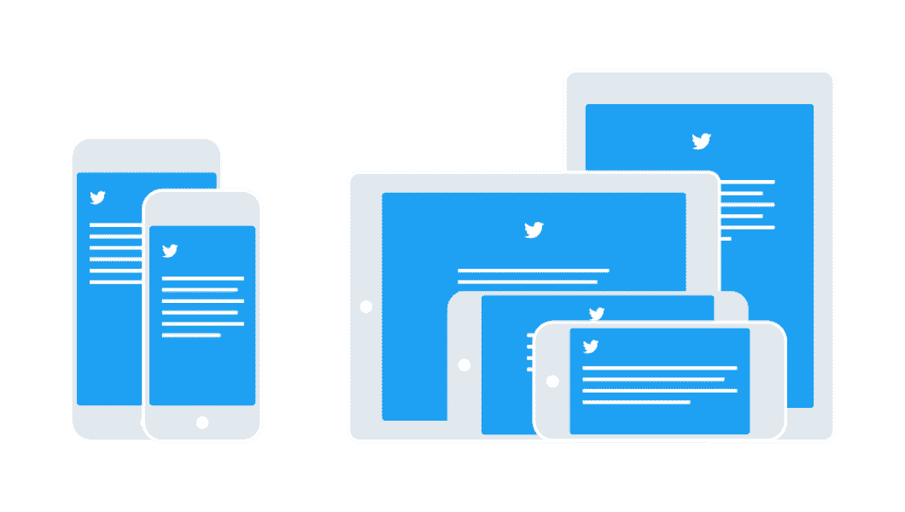
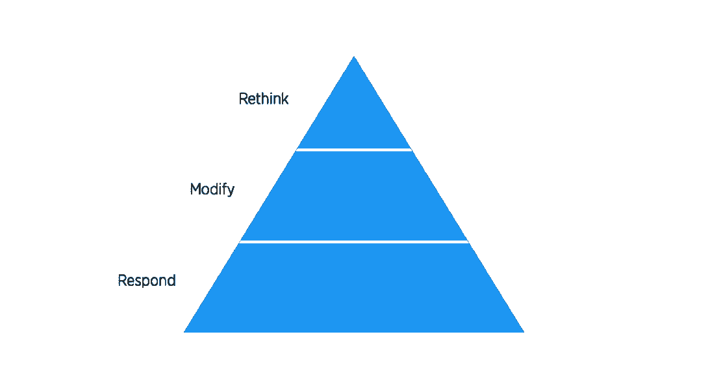
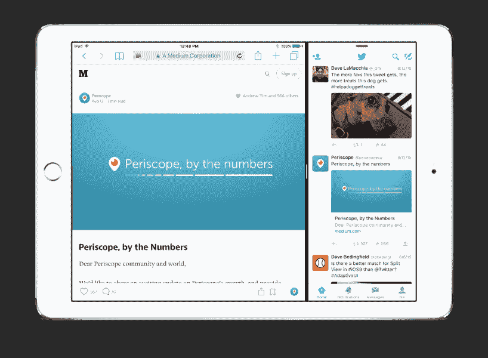

# 为 iOS 构建一个更加统一的 Twitter

> 原文：<https://blog.twitter.com/2015/building-a-more-unified-twitter-for-ios?utm_source=wanqu.co&utm_campaign=Wanqu+Daily&utm_medium=website>

之前，iPhone 和 iPad 的 Twitter 提供了非常不同的体验。现在，无论你使用哪种设备，这些设备上的 Twitter 应用程序都将更加一致。从今天开始，iPad 用户将能够创建和查看[条修改后的报价推文](https://twitter.com/twitter/status/585225218093932544)，在搜索中探索[热门话题](https://blog.twitter.com/2015/updating-trends-on-mobile)，[访问产品和位置页面](https://blog.twitter.com/2015/testing-new-ways-to-make-it-easier-to-discover-products-and-places)等等。我们想告诉你我们是如何做到这一点的。

虽然他们共享一些代码，但是 iPad 的 Twitter 和 iPhone 的 Twitter 最初是分开开发和设计的。每个应用程序都是为其平台量身定制的，但需要大量额外的工作来开发。很多时候，这意味着 iPad 版 Twitter 的功能落后于其他更新。为了解决这个问题，我们必须重新思考我们的方法。

**生态系统**

今天，有许多大小和种类的设备，每个都有不同的功能和使用案例。多年来，网页设计师一直在使用响应性网页设计来应对这一挑战。其理念是流畅地设计和构建，允许界面适应不同的条件，以便它总是能够为特定设备提供优化的体验。苹果开始在带有自动布局的 iOS 6 中引入灵活布局，在带有大小类的 iOS 8 中采用真响应。

我们使用这些方法作为我们的模型。我们对新 iPad 体验的开发反映了响应式理念，这促使我们开发了一个适应多设备生态系统的框架。我们称这个框架为“自适应 UI”

[T2】](https://g.twimg.com/blog/blog/image/image_1_3.png)

**自适应 UI**
在任何 iOS 设备上阅读你的时间线都应该是一种很棒的体验，无论屏幕大小或方向如何。为此，我们必须考虑不同的设备及其特性。因此，我们建立了自己的响应系统，从创造良好阅读体验的印刷元素开始，并以此为基础进行构建。

我们关注的特征包括:

*   设备类型(手机或平板电脑)
*   方向
*   画布(当前视图的大小)
*   尺寸等级(无论画布是小而紧凑还是宽而广阔)
*   排版设置和限制

[T2】](https://g.twimg.com/blog/blog/image/image_2_1.png)

通过检查这些特征，我们可以确定一个最佳的行长度，使阅读舒适和容易，不管你选择的文本大小。我们可以调整基线类型的大小，使内容相对于视图的大小感觉正确。我们可以根据您的屏幕方向调整图像显示，为您提供更好的照片浏览体验。我们可以改变信息的呈现方式:在手机上使用推送导航的视图可以在足够宽的屏幕上并排显示。我们可以优化行为:如果我们不适应环境，在手机上拇指容易接触到的东西在平板电脑上可能很难接触到。

通过响应这些特征并在有意义的地方修改演示，我们能够为所有 iOS 设备支持 Twitter，并仅在必要时重新考虑体验。我们把它想象成一个金字塔:*大多数东西只是简单地自动响应*，像内容宽度响应文本大小变化；*有些东西需要修改*比如档案标题，如果我们不修改布局，它会占据大设备一半的屏幕；*只有一些事情需要重新考虑*，比如直接信息，当你有足够宽的屏幕时，对话列表可以与对话并排放置。这意味着，当我们从现在开始开发一个新的 Twitter 功能时，我们可以更容易地同时在多个设备上发布，并为每个设备提供合适的体验。

[T2】](https://g.twimg.com/blog/blog/image/image_4_0.png)

此外，这种方法让我们设计超越现在。当新的设备或功能出现时——比如 iOS 9 中的[多任务处理(允许两个应用程序并行运行)，或者 iPhone 6 和 6 Plus——多亏了这个系统，我们可以在它们发布后立即支持它们，几乎不需要额外的努力。](https://developer.apple.com/ios/pre-release/)

[T2】](https://g.twimg.com/blog/blog/image/image_3_0.png)

> 自适应 UI 鼓励我们要有战略眼光，在最重要的地方投资。

**全新的粉底**

自适应 UI 是我们的设计和工程团队长期深入合作的结果。我们创建了自适应 UI 作为 Twitter 的下一代引擎来驱动用户界面，我们已经将它融入了 iOS 版 Twitter 的方方面面。我们还灌输了一种思考*环境*而不是*设备*的方式，并为所有可能的环境进行设计。

到目前为止，我们得到的是一个基线，使一切工作顺利。尽可能无缝地重写系统是一项巨大的努力。我们的第一步是建立景观支持，这是我们在今年夏天早些时候为 iPhone 6 Plus 提供的。从这一努力中，我们学到了很多关于如何以及何时适应变化的条件。这是我们更新 iPad 支持的基础。现在，我们有了更健壮的新工具，并允许更快的迭代。自适应 UI 使我们能够支持新设备，并更快地为人们带来新的 Twitter 功能。但是正如你所料，不同的设备在特性和功能上会有所不同。未来，我们的目标是让 iPad 和 iPhone 的 Twitter 实现功能对等。

最终，它不再是 iPhone 版的 Twitter 和 iPad 版的 Twitter:它是 iOS 版的 Twitter，现在将针对不同的环境进行优化。这种自由有助于我们让 Twitter 成为所有人的最佳体验，无论使用何种设备。

这种新的体验目前正在推出。

*与[戴夫·贝丁菲尔德](https://twitter.com/dbedingfield)、[肖恩·汤普森](https://twitter.com/cyanhex)、[杰森·索福尼亚](https://twitter.com/sofo)、[杰森·哈里斯](https://twitter.com/smeger)和[阿贝·怀特](https://twitter.com/aabewhite)合作设计。*