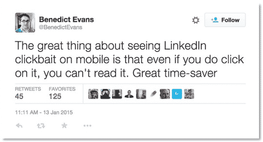
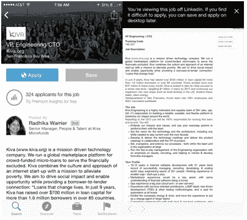

# LinkedIn 的移动战略一团糟| VentureBeat

> 原文：<http://venturebeat.com/2015/09/18/linkedins-mobile-strategy-is-a-mess/?utm_source=wanqu.co&utm_campaign=Wanqu+Daily&utm_medium=website>

你错过了明年 2022 年 GamesBeat 峰会的一个环节吗？所有会议现在都可以在我们的点播库中观看。[点击这里开始观看](https://attendees.bizzabo.com/412979/agenda?date=1666742400000)。

* * *

Linkedin 是历史上最成功的 Web 2.0 公司之一，但它的成功在移动领域止步不前。

LinkedIn 的主要移动应用长期以来一直试图做其网络产品所做的一切:网络、个人资料、提要、搜索和消息功能。然而，这种对一个应用程序的广泛关注意味着没有一个应用程序得到很好的执行。以前用过 LinkedIn app 的人都知道我在说什么*。*

值得称赞的是，LinkedIn 似乎确实希望重新构想其移动产品，正如其最新的收入公告中明确指出的那样，并且正在积极试验“应用星座”战略(如脸书)，包括求职、招聘、Pulse(新闻)等应用程序及其最新应用程序 Elevate。不幸的是，对于 LinkedIn 这样规模的公司来说，这些产品都没有获得你所期望的那种吸引力。

[

<noscript></noscript>](https://venturebeat.com/wp-content/uploads/2015/09/LinkedIn-downloads.jpg?resize=574%2C143&strip=all?strip=all) 

上图:从移动行动收集的数据(2015 年 1 月 1 日-2015 年 8 月 31 日)。

大多数 LinkedIn 应用程序的下载量低得惊人。此外，LinkedIn 主应用程序不会驱动任何其他应用程序的安装或参与(通过深层链接)。是一种完全破碎不完整的体验。

[

<noscript></noscript>](https://venturebeat.com/wp-content/uploads/2015/09/linkedin-clickbait.jpg?resize=540%2C292&strip=all?strip=all) 

让我们来看看 LinkedIn 如何在移动领域解决一些主要的公司支柱:

**Talent Solutions** 是 LinkedIn 部门，连接求职者和雇主。这是 LinkedIn 的头号收入来源(在 Q2 为 4.43 亿美元)——但如果你通过手机使用 LinkedIn，你不会知道这一点。

[

<noscript></noscript>](https://venturebeat.com/wp-content/uploads/2015/09/linkedin-illegible.jpg?resize=403%2C360&strip=all?strip=all) 

上图:LinkedIn 的求职应用建议用户“稍后在桌面上申请。”

例如，LinkedIn Jobs 应用程序使得在移动设备上申请工作变得非常困难。你可以搜索和保存机会，但通过手机完成交易很难——有时它让你在应用程序上申请，有时它让你*回到桌面*。当你点击“申请”按钮时，你会看到这样一条信息:“你正在 LinkedIn 上查看这份工作。如果你觉得申请有困难，你可以稍后在桌面上保存并申请。”这是一个巨大的机会，浪费了。与 Switch 等产品相比，LinkedIn 的求职搜索感觉像是来自石器时代，Switch 通过类似火绒的简单滑动将求职者和雇主联系起来。

人才解决方案系列中的另一款应用是 LinkedIn Recruiter 应用，该应用在 iOS 和 Android 上有 25 万次安装。尽管 App Store 和 Play Store 的评论都很严厉，但 Android 版本自 2014 年 7 月以来就没有更新过，并且受到无法滚动等问题的困扰。与此同时，在 iOS 上，该应用程序自 3 月份以来就没有更新过，总共有三个一星评价——这已经足够了。

总的来说，在工作和招聘应用程序中，以及 LinkedIn 星座中的其他应用程序中，没有努力实现无缝体验。如果你登录了 LinkedIn 的主应用程序，你仍然需要登录其他应用程序。这些应用程序几乎没有自动化、愉悦或意外收获。

营销解决方案(又称广告)代表了公司收益的另一个重要部分——22%。不幸的是，LinkedIn 又一次错过了移动优化广告单元或定位的机会。

LinkedIn 的移动增长率是其他平台的两倍，但显示广告的收入同比下降了 30%。随着 LinkedIn 一半的流量通过移动设备流动，广告商对优质移动广告渠道的需求一如既往地高，你会认为优化移动广告将是一个主要焦点。为了测试该公司的广告平台的能力，我继续测试了整个过程。我发现，LinkedIn 的广告无法推动应用程序的安装，广告单元只能*为网络*创建和定向，并且无法辨别流量/转换是否来自移动设备。简而言之:彻底失败。

最后，总的来说，LinkedIn 没有在自己的网络之外使用任何社交网络数据——这可能是其数据对专注于商业的出版商和其他类似公司具有巨大价值的地方。潜力巨大，但 LinkedIn 在移动广告领域还有很长很长的路要走。或许它应该效仿 Twitter，收购像 MoPub 这样的广告市场？

消息传递和沟通是 LinkedIn 价值所在的核心，也是该公司整个生态系统中最薄弱的环节。根据其在 Q2 的公告，消息是公司的支柱之一，但它仍然难以置信地笨重。如果你是 LinkedIn 用户，你知道我的意思。幸运的是，LinkedIn [最近发布了新版本的消息功能](https://venturebeat.com/2015/08/31/linkedins-messaging-tool-gets-new-chat-like-interface-support-for-emojis-stickers-and-gifs/)，包括 gif、表情符号和贴纸。我们将看到这些新功能如何改变 LinkedIn 的用户行为，而不是 Slack 这样的现代信息解决方案。

在最新的 LinkedIn 应用程序 Elevate 中，你甚至不能在消息标签中从*创建新消息。您必须搜索一个配置文件，然后选择从配置文件视图向他们发送消息。精神错乱。*

如果 LinkedIn 不小心，Slack 可能会有机会剥夺 LinkedIn 最重要的价值主张:专业人士之间有效的网络和沟通。LinkedIn 应该向脸书学习，建立或收购一个独立的、成熟的消息应用。它正在朝着正确的方向前进。

综上所述，LinkedIn 已经一点一点地构建了应用程序来适应其 Web 2.0 产品，而不是开始以移动为先重新想象服务应该是什么样子。

目前的移动战略没有反映出 LinkedIn 对移动流量和参与度的日益依赖。五大支柱中的大多数在整个应用星座中都是不一致的。LinkedIn 必须重新思考其移动战略，否则就有被 Slack、Switch 等有进取心的公司甩在身后的风险。我有两种看法:LinkedIn 可以走脸书路线，继续重建或收购新的应用程序，以适应新的应用程序星座，在这种情况下，它的每个应用程序都必须作为一个独立的应用程序设计良好、有用、完整，并与其他应用程序深度链接。或者，它可以效仿微信，创造一种强大的一体化体验——这只有在它为用户澄清和精简其价值主张后才有可能实现。

在这一点上，LinkedIn 在移动方面还非常落后。

Edith Yeung 是 T2 500 家创业公司和 500 家移动公司的合伙人。她之前是海豚浏览器的业务开发和营销副总裁。

9 月 19 日更新:这篇文章的前一个版本错误地将一些 LinkedIn 下载统计数据归因于 App Annie。这些号码已被删除。

**VentureBeat 的使命**是成为技术决策者获取变革性企业技术知识和进行交易的数字城市广场。[发现我们的简报。](https://info.venturebeat.com/website-preference-center.html)