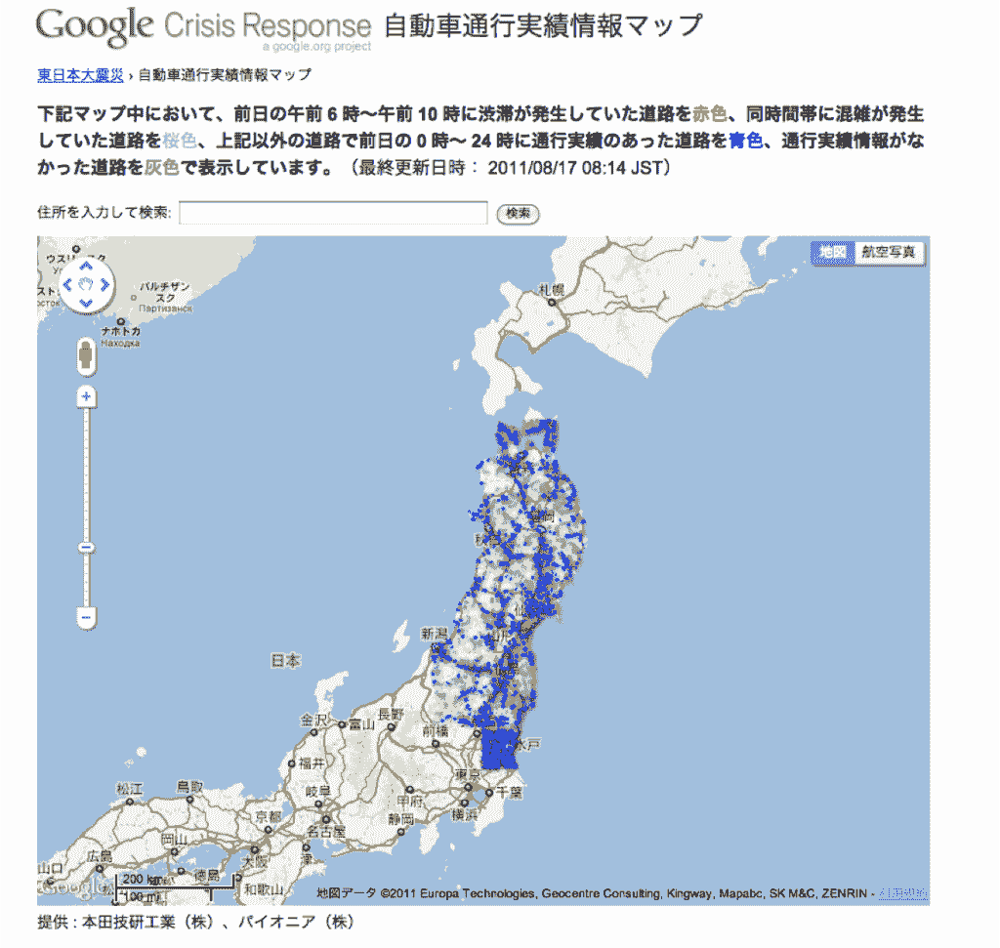
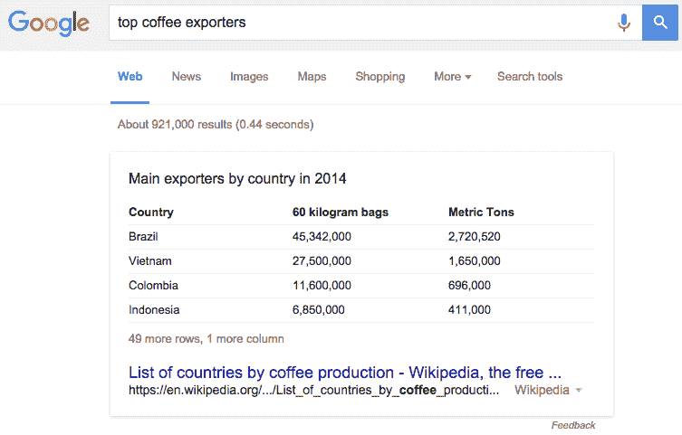

# 谷歌十年——ACM SIGMOD 博客

> 原文：<http://wp.sigmod.org/?p=1851>

我最近庆祝了我在谷歌的十周年纪念日，并决定借此机会分享我对过去十年的一些反思。在加入 Google 之前，我是华盛顿大学计算机科学与工程系的教员，在那里我创建了

[database research group](http://db.cs.washington.edu)

如今，这一领域比十年前更加繁荣。在 UW 任职期间，我还创办了两家初创公司 Nimble Technology 和 Transformic Inc .在过去的八年里，我一直在谷歌研究院领导结构化数据研究团队。这些思考将涉及从学术界到工业界的转变，我在谷歌的项目选择和一些一般性的建议。我还应该指出，我的观察非常严重地偏向于谷歌的研究和工程之间的密切合作模式，这与我在加入 UW 之前的 90 年代在美国电话电报公司贝尔实验室的第一次工业实验室经历非常不同。

你在工业研究实验室面临的一个关键挑战是如何选择你的项目。你希望你的项目是有趣的研究，但也有助于你的公司。作为一名初级研究人员，你通常会选择加入一个项目，而在你职业生涯的后期，你会提出并领导自己的项目。不管你多大，你都必须做出明智的决定。

众所周知，您不应该选择一个产品团队可能在短期内(例如，长达一年)着手的项目。等你有结果的时候，他们已经做了。他们可能不会做得像你一样好或一样优雅，但在这一点上这并不重要。在像谷歌及其同类公司这样快速发展的公司里，遵循这一建议可能会很有挑战性，因为其中三分之一的工程师拥有博士学位。另一方面，你也不想走在公司的发展轨迹前面太远，所以你需要选择一旦有了实质性的成果，你就可以想象应用的项目。

找到好项目的最好方法是与公司不同部门的人交谈，或者直接与客户交谈，如果可能的话。这样的对话也能确保你建立的人际关系在应用你的技术的时候是无价的。提前考虑技术转让也很重要。我用“技术转让”这个词是因为它很常用，但实际上我非常不喜欢这个词。“转移”的概念通常意味着从技术开发者到实践者的转移，从而排除了一些技术可以产生影响的最有效的方式。

然而，在这里我想强调一条不同的建议，它指导了我在谷歌的大部分工作。

### 选择发挥你优势的项目

在谷歌，我们的优势在于丰富的数据和愿意试用我们新产品的热切用户。我将用两个例子来说明。

#### 谷歌融合表

数据库太难使用，并且大多数拥有数据的人不具备设置和维护数据库应用程序的技能，这是数据库社区中长期存在的一个问题。因此，世界上大部分数据都存储在数据库系统之外。谷歌融合表(于 2009 年 6 月推出)的愿景是为大众创建一个数据库系统。当然，我们不得不在系统的功能上做出妥协，但我们的想法是有效地支持几种常见的数据管理工作流，并使大量数据所有者能够享受数据管理的好处。

在这样做的时候，我们利用了谷歌的优势之一，即拥有一个由热情(但要求很高)的用户组成的国际社区，他们愿意尝试新产品，并帮助我们快速推进这些产品。在推出 Fusion Tables 的 24 小时内，来自 100 多个国家的用户查看了该产品，反馈开始涌入。我们能够验证我们关于哪些用例是引人注目的假设，并对它们进行微调。

Fusion Tables 有效支持的主要工作流程是从原始数据(csv 文件、电子表格)到有意义的可视化，这也可以嵌入到用户自己的站点中。这样做，我们发挥了谷歌的另一个优势，我们的可扩展地图基础设施。在地图上可视化数据适用于广泛的领域(一点也不奇怪)。融合表用于[广泛的应用](https://sites.google.com/site/fusiontablestalks/stories)，例如救灾(例如，在 2011 年日本地震之后或纽约飓风之前为需要的数据提供关键信息)，成为记者最喜爱的工具(以至于他们在自己的会议上讲授融合表的教程)，可视化多发性硬化症患者的位置和潜在护理者的位置之间的差异(从而能够将适当的资源输送给需要的患者)。

 
**图 1:***2011 年日本地震后使用谷歌融合表创建的可视化。可视化显示了地震和海啸后哪些路段可以行驶。在需要的时候，这个和其他的可视化每天都有数千万的点击量。*

聚变桌没有技术转让。我们完全在 Google Research 内部构思、开发、发布和维护该产品。即使在 2009 年，从谷歌研究院推出一个外部产品也是很棘手的，因为来自研究院的贡献倾向于启用或增强现有产品，而不是作为独立产品推出。然而，Fusion Tables 向谷歌组织和普及世界信息的使命致敬，在该公司没有明显的位置。将产品完全放在研究中的缺点是它没有正常产品的资源，这减缓了它的发展。见证数据如何帮助有需要的人，以及时传递给他们，这是一种令人振奋的体验！

#### 电子表格

第二个示例项目是 Web tables——研究 Web 上 HTML 表格的集合，并在响应查询时提供给 Google 用户。这个项目纯粹是出于求知欲(这同时触动了我和迈克·卡法瑞拉)，我们相信这些桌子一定是有用的。我们在这种情况下发挥的优势是，我们可以在 Google 索引上运行一个 MapReduce，并在一个下午内获得 HTML 表的初始语料库！然后，我们可以检查查询流，估计有多少查询可以由 HTML 表很好地提供服务。当然，在接下来的几年里，我们试图识别出只占语料库不到 1%的好表。

与 Fusion Tables 不同，我们只是在产品推出后才发表论文，我们在提供搜索服务之前就发表了关于 WebTables 的[论文](http://dl.acm.org/citation.cfm?id=1453916)，因为我们认为我们正在为社区做出有意义的贡献。出于各种原因，从项目开始到我们推出一个针对表格的[搜索引擎](https://research.google.com/tables)，花了将近四年时间，又花了两年时间，我们终于找到了圣杯:在 Google 搜索结果页面和代码片段中显示 HTML 表格中的行。为了达到这个目标，团队必须保证非常高的查询匹配 HTML 表的精度。在路上，我们发现了一个意想不到的应用，HTML 表格作为谷歌文档的研究工具。

 
**图 2:***Google 搜索结果中 HTML 表的行*

在这方面，技术也不是典型意义上的转让。最初的搜索引擎是由谷歌研究院的一个团队推出的。大约 10 分钟后，我们获准在谷歌搜索结果主页面上推出 HTML 表格，一名来自搜索质量的谷歌人找到我，建议几名负责制作 web 表格的研究人员加入他的团队。对他们中的一些人来说，这一举动是一个很好的及时的机会，从那以后，他们一直在搜索团队中推动这一进程。否则 HTML 表格永远不会出现。

WebTables 必须面对另一个常见的挑战，即研究创新必须适合形成产品或搜索服务的一系列想法，并且必须在这种背景下展示独特的价值。特别是，当我们在处理 HTML 表格时，谷歌搜索经历了一次重大转变，它开始从我们的知识图(KG)中回答查询。KG 包含关于世界上著名实体(人、公司、位置)的事实，并且它适合于回答“头部查询”，即在查询流中出现最频繁并且可以由结构化数据回答的查询。HTML 表的承诺是它们可以找到数据来回答 KG 不可能回答的又长又重的查询。然而，随着 KG 工作的扩展，这个头变得越来越宽，每次 KG 增加另一个领域，就会对 WebTables 的覆盖范围造成另一个削弱。尽管如此，WebTables 仍然回答了许多 KG 无法回答的查询，并且每天取悦全球用户数百万次。

### 结束语

最后，我想分享一些建议。

#### 永远不要停止写代码

不管你的角色如何演变，试着永远不要停止编码(或者如果你不能编码，参与代码评审)。您不一定需要编写团队关键路径上的代码(事实上，您可能不应该这样做)，也不需要一个季度接一个季度地编写代码，但是您应该尝试定期编写一些代码。我的两个好朋友给了我编写代码的灵感，他们是斯坦福大学的教授 Pat Hanrahan 和 Dan Boneh，他们都是各自领域无可争议的领导者，经常参与一些编码活动。在 Google，我发现在构建后来演变成 Fusion Tables 的产品的最初阶段，在探索 WebTables 的新想法时，以及在构建第一个完整版本的[biper media](http://static.googleusercontent.com/media/research.google.com/en//pubs/archive/41894.pdf)时，我有机会编码，这是一个用于挖掘模式属性长尾的系统。我的编码活动总是卓有成效。他们要么启动了一个新项目，要么对一个项目的方向进行了重大改变。他们还使我能够与我的团队成员在完全不同的细节层次上进行讨论(让每个人都开心)。在一个编码实践和工具变化如此迅速的世界里，编码经常帮助我保持领先。最重要的是，我喜欢它们，它们让我想起了多年前吸引我进入我们领域的乐趣！

#### 永远不要停止看数据

多年来，我意识到在处理复杂和大量数据的任务时，有一种特质与成功密切相关:痴迷地查看大量数据，直到获得洞察力的能力。作为计算机科学的博士，我们没有必要被训练去花几个小时看数据。我们更擅长痴迷地调整算法，让它做正确的事情，但我们经常在看了一些示例数据项后感到厌倦(美国数据库管理人员可能比平均水平更差！).在谷歌，我们有数据的天赋，但令我惊讶的是，研究人员和工程师经常回避数据。我一次又一次地发现，痴迷于数据的工程师和研究人员最终发现了关键的观察结果，这些观察结果使他们能够开发出有效的算法。此外，当你提出一个想法的时候，当你口中说出例子的时候，你听起来会更有说服力。

#### 学术界与工业界

作为一名前学术界人士，我经常被问及学术界和工业界的区别。对此有许多答案，包括在工业中你需要解决整个问题，而不是挑选你希望优雅解决的小块。然而，主要的区别是以下几点，这些区别可能非常微妙，也许只有在事后才显而易见。(我最初是在加入谷歌之前从 Prabhakar Raghavan 那里听到这个观察结果的，但我花了十年的时间才将其内化)。在学术界，当你追求自己对科学和技术的热情时，对教师的评价会对你个人职业生涯的进一步发展产生压力，无论是通过出版物、毕业和提升你的学生，还是成为一名优秀的教育家。你必然是你自己思想的拥护者，我认为这最终是科学进步的关键因素。相比之下，要想在工业界取得成功，无论是在工程领域还是在研究领域，你往往需要把个人目标和想法放在一边。你需要找到最有效的方法来获得一个伟大的产品或服务(或其中的一部分)，即使这意味着找到正确的想法组合。你会因为对产品提出关键想法而获得奖励，但你会因为完成工作、跨团队有效协作以及取悦客户而获得更多奖励。这条建议对创办初创公司的学者可能更有用。一旦你在大学进行的伟大研究的基础上建立了自己的公司，公司就有了自己的生命，最重要的目标是创造用户想要的产品。

#### 工作生活平衡

已经有很多关于寻找工作生活平衡的文章。我的 2 分钱很简单。你不能通过减少工作量来达到平衡。你通过找到一种将你从工作中抽离出来的激情来达到平衡。当然，家庭在这个阶梯上是第一位的，但是我们经常需要一些其他的激情。就我而言，写一本关于咖啡的书是我最美妙的经历。我并没有计划将它作为工作生活平衡疗法，我只是在事后才意识到。除了和孩子在一起的时间，我发现晚上研究和写作咖啡(更不用说作为学习的一部分，我不得不去异国旅行)给了我几个小时的休息时间，不用考虑工作。

##### 致谢:

不管你在哪里，做什么，最重要的是和优秀的人一起工作。我不可能感谢所有和我一起在谷歌工作的人，但我会提到几个。贾扬特·马德哈万、埃克托·冈萨雷斯和彦俊·兰根是谷歌融合桌早期的幕后推手。Mike Cafarella 启动了 WebTables 项目，当他还是实习生的时候，他带领一群实习生开发了第一个版本。于聪和布洛斯·哈伯将 WebTables 的最初原型转变为面向外部的服务，并推动了表格语料库的创建和维护。贾扬特·马德哈万、洪雷·李、斯里·巴拉克里什南、于聪、布洛斯·哈布和阿夫申·罗斯塔米扎德一起工作，在谷歌搜索结果页面上获得 HTML 表格。贾扬特·马德哈万是我心目中痴迷于数据并从中获取惊人价值的典型例子。我也很幸运地与董露娜、吴菲、吴忠、大卫·柯、阿尔吉斯·波利佐提斯、克里斯·奥尔斯顿、娜塔莎·诺伊、罗德·麦克切斯尼、苏迪普·罗伊、史蒂文·旺和萧瑜、三位了不起的休假访问者克里斯蒂安·詹森、扎克·艾夫斯和苏尼塔·萨拉瓦吉以及 40 多名(！)暑期实习生。