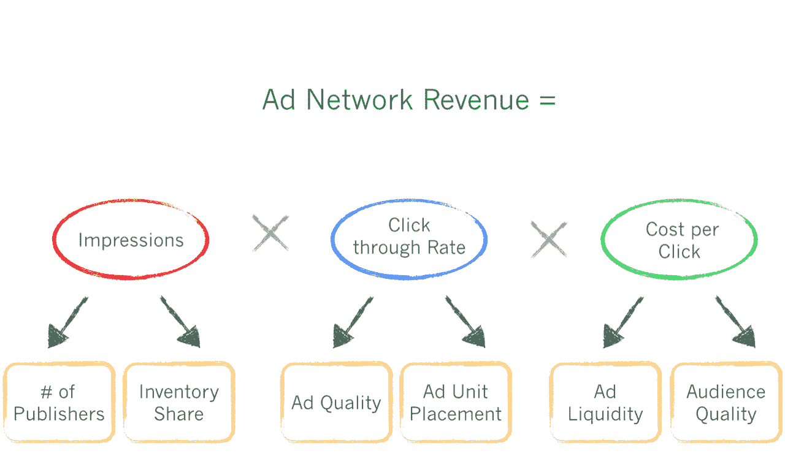
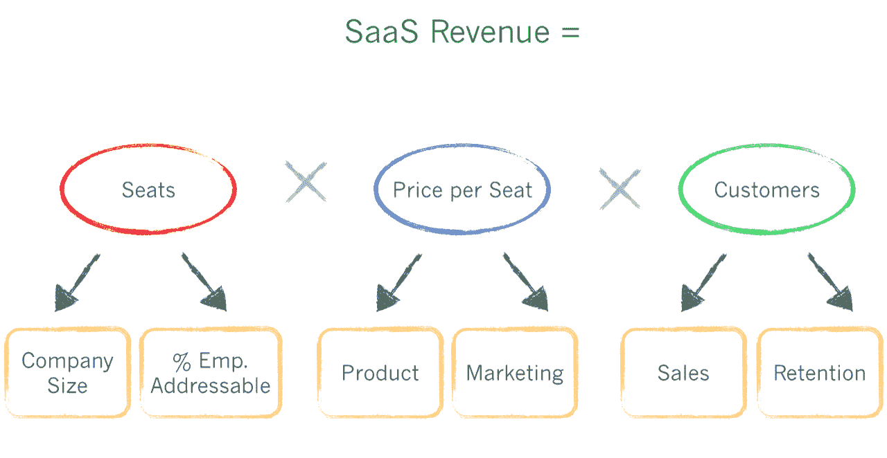
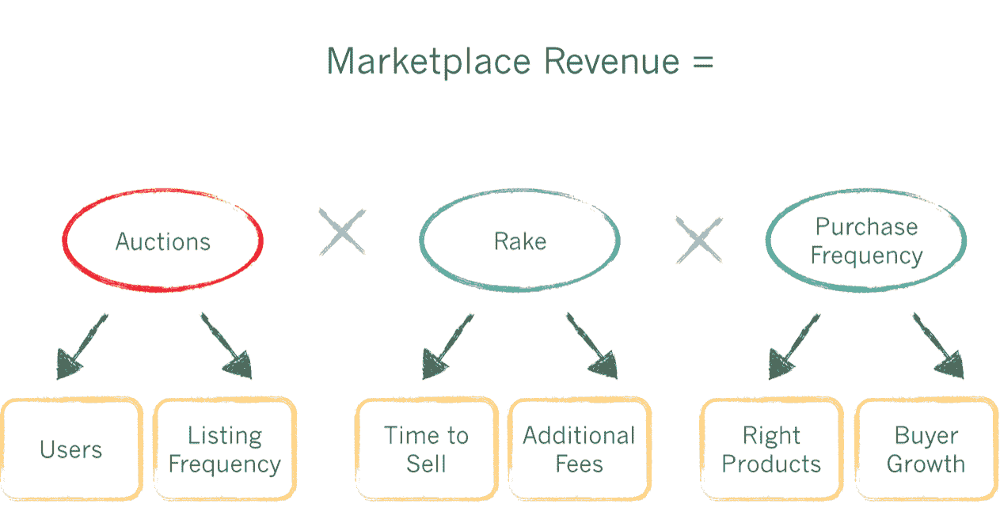

# 初创企业最佳实践 17——利用初创企业的基本方程式进行战略规划

> 原文：<http://tomtunguz.com/the-fundamental-equation-of-a-startup/?utm_source=wanqu.co&utm_campaign=Wanqu+Daily&utm_medium=website>

[T2】](https://res.cloudinary.com/dzawgnnlr/image/upload/q_auto/f_auto/w_auto/adnetwork_equation.png)

“描述我们业务的等式是什么？”在我们第一次见面时，我们在谷歌的新主管斯科特问道。我只在那里呆了几个季度，所以当他问我时，我吃了一惊。我从来没有这样看待我们的生意，但在他问了这个问题后，我想知道为什么我没有。回想起来似乎很明显。

开始时是一个简单的问题，现在变成了一个复杂而深刻的练习。在他的第一周左右，通过许多像我一样的采访，斯科特为 AdSense 开发了这个等式，它填满了一个白板。我在上面以简化的形式复制了它。

斯科特运用这个等式来理解企业是如何运作的。他改进和完善了这个等式，直到他确定了所有对收入有贡献的部分。这些问题让他了解了历史产品开发决策、广告商和出版商的政策以及公司的价值观。他们揭示了该公司的优势，但也清楚地表明，支撑之前决策的许多假设不再正确。识别这些错误并加以纠正，带来了巨大的收入增长。

在我们的谈话中，这个等式成了一个重要的管理工具。当我们讨论新项目时，Scott 会让我在白板上指出该项目在等式中的位置——该项目影响了哪一个杠杆，以及该项目是否能显著加快收入增长。伙计，它明确了事情的轻重缓急。

这个等式在他办公室的白板上放了很多年。每次我经过他的办公室，我都会瞥一眼那个等式，我会微笑。多么精辟的管理工具。

除了帮助质疑假设、区分项目优先级和协调团队之外，单一方程的想法还能诊断出最佳关注点。顶线指标每增加 5%，收入就会增加 5%。但是印象数增加 5%意味着更多的出版商收购。相比之下，每次点击成本增加 5%意味着获得更多的广告客户。根据当时的比较单位经济学，斯科特可以推荐正确的道路。

这是一家 SaaS 公司的一阶方程:

[T2】](https://res.cloudinary.com/dzawgnnlr/image/upload/q_auto/f_auto/w_auto/saas_equation.png)

一个用于市场:

[T2】](https://res.cloudinary.com/dzawgnnlr/image/upload/q_auto/f_auto/w_auto/marketplace_equation.png)

在那次经历之后，我开始相信，使用企业的基本等式可以成为一个很好的最佳实践，可以对产品、营销、销售和客户成功的关键计划进行优先排序。这也是一个很好的工具，可以将团队对话从日常任务提升到更具战略性的计划。