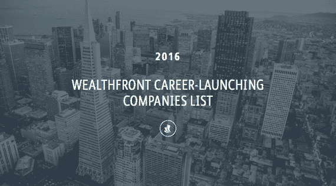
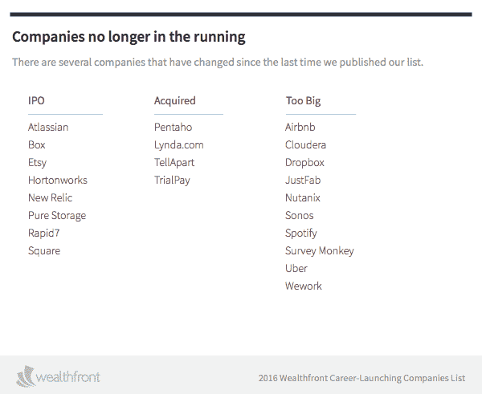
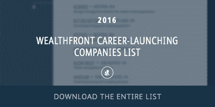

# 2016 财富前线职业启动公司名单

> 原文：<https://blog.wealthfront.com/2016-career-launching-companies-list/?utm_source=wanqu.co&utm_campaign=Wanqu+Daily&utm_medium=website>

[T2】](https://cdn.wealthfront.com/public.email.images/WF-2016-CareerGuide.pdf)

编者按:查看我们的 [2021 职业启动公司名单](https://www.wealthfront.com/blog/career-launching-companies-list/)。

今天，我们很高兴推出第四份美国中型科技公司年度榜单。我们发布这份名单是因为我们相信这些公司是年轻人开始职业生涯的理想场所。大多数 Wealthfront 客户都是二三十岁，他们的财务成功主要来自于他们职业生涯的成功。在你职业生涯的早期，没有什么比获得成功更重要——也没有什么比在一家成功的公司工作更能标志成功(关于这一逻辑的完整解释，请参见我们最初名单附带的帖子: [48 家打造职业生涯的热门科技公司](https://www.wealthfront.com/blog/hot-mid-size-silicon-valley-companies/))。

为了符合我们的名单，一家公司目前必须拥有 2000 万至 3 亿美元的收入(T0)和 T2(T1)，并且至少在未来四年内 T4 的增长率超过 50%。我们通过调查以下 16 家风险投资公司的合作伙伴来构建我们的名单:Accel Partners、Andreessen Horowitz、Benchmark、DAG Ventures、Dragoneer、Greylock Partners、Index Ventures、Lightspeed、Kleiner Perkins cau field&Byers、Matrix Partners、Redpoint Ventures、Ribbit Capital、Sequoia Capital、the Social + Capital Partnership、Spark Capital 和 TCV。[点击此处下载完整列表。](https://cdn.wealthfront.com/public.email.images/WF-2016-CareerGuide.pdf)

**去年以来的变化**

今年的榜单包括 136 家公司，比去年的 106 家增加了 30 家。我们增加了 59 家公司，比我们之前的记录高出 50%。我们放弃了 29 家公司，其中包括 8 家申请上市或已经上市的公司，4 家被收购的公司，10 家收入超过 3 亿美元上限的公司，以及 7 家增长太慢而无法继续获得资格的公司:

[T2】](https://www.wealthfront.com/blog/wp-content/uploads/2015/10/companies_no-2.png)

我对 IPO 的缺乏、新增公司的数量以及对我们的名单来说已经变得太大的私营公司的数量感到特别震惊。对于所有那些认为泡沫正在形成的人，我邀请你们告诉我历史上有那么多引人注目的科技公司诞生的另一个时代。

上世纪 90 年代末，我们有大量有趣的业务，但很少有公司的收入势头像现在这样强劲。那时候，我们永远不会看到 11 家收入超过 3 亿美元的快速增长的私营公司。

我实际上有点担心这些公司中的一些上市时间太长了。当他们中的一些人准备好的时候，他们的增长率将会下降。正如我们在[帮助你出售科技 IPO 股票的制胜风险投资策略](https://www.wealthfront.com/blog/should-i-sell-my-stock/)中解释的那样，公开市场对增长率下降的公司并不友好。

**其他有趣的事实**

像往常一样，大多数公司(57%)都位于旧金山湾区。大多数湾区公司(60%)仍然位于旧金山，而不是硅谷，尽管令人惊讶的是，这一比例比去年 70%的峰值有所下降。

[T2】](https://www.wealthfront.com/blog/wp-content/uploads/2015/10/2016_WF_CareerLaunching_Geos.png)

当谈到托管公司时，纽约和波士顿是湾区的遥远竞争对手，这些公司可能会变得非常大，尽管纽约和波士顿的份额略有增加。犹他州是引人注目的后起之秀，从 1 家增加到 5 家。

企业公司保持在 60%的水平，略高于去年的 59%。有趣的是，56%的上市公司或增长过快的公司都是以企业为中心的公司。这一数据与普遍持有的观点形成了对比，即消费品公司有机会创造更大的最终价值。

湾区又一次只有五家以消费者为中心的公司总部不在旧金山。想在半岛工作的人，可能需要找稍微早一点的阶段公司。有趣的是，只有三家硬件公司留在了名单上，而且只有一家位于湾区。当你考虑到半导体和硬件公司创造了硅谷时，这是令人惊讶的。

**你的职业关系到你的财务前景**

很多人问我们，为什么一个理财顾问会公布这样的名单。我们的答案是，与投资决策相比，你的职业决策可能会对你的最终净资产产生更大的影响。

我们希望 2016 年的列表对您有所帮助。虽然我们总是有可能错过一些公司，但我们相信，对于寻求职业生涯差异化成功的专业人士来说，这份名单是一个很好的开始。

[T2】](https://cdn.wealthfront.com/public.email.images/WF-2016-CareerGuide.pdf)

**披露**

页面、随附列表和链接电子书中包含的信息仅供参考，不应被视为投资建议。Wealthfront 对本页或附带的电子书或列表中包含的信息的准确性或完整性不做任何陈述或保证。本页或随附电子书或列表中的任何内容都不应被解释为购买或出售任何证券的邀约、要约或建议。金融咨询服务只提供给成为财富前沿客户的投资者。过去的表现不能保证未来的结果。