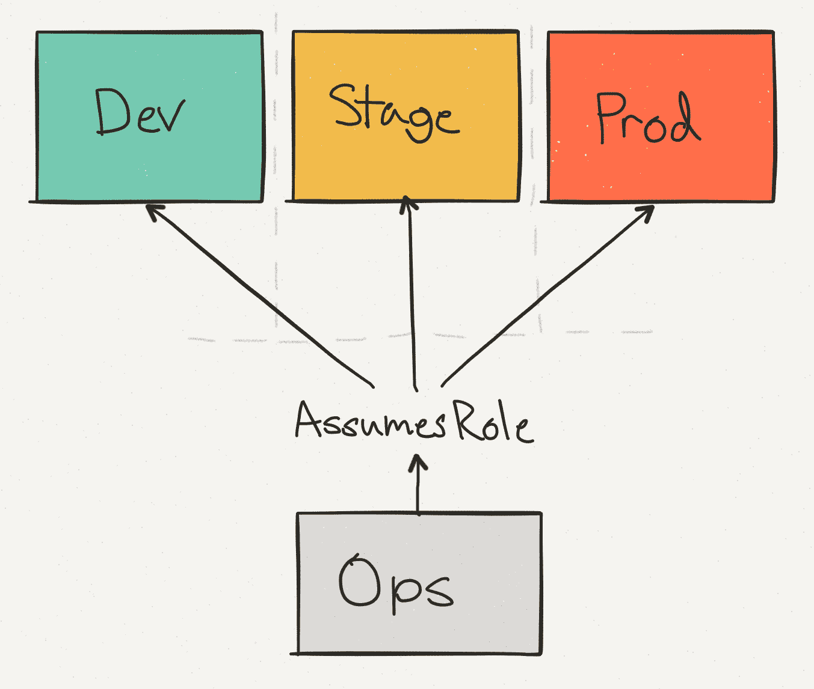
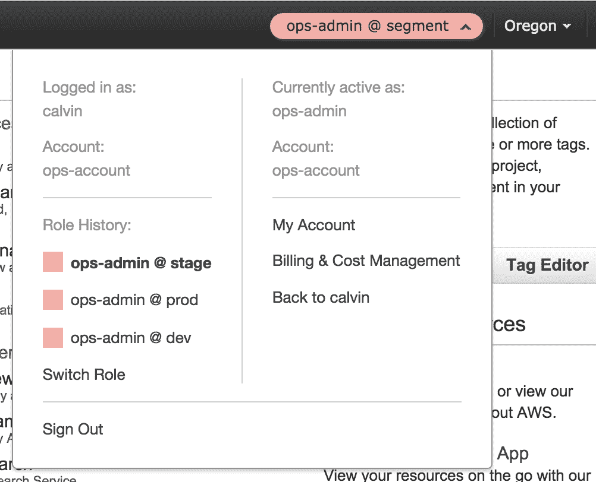
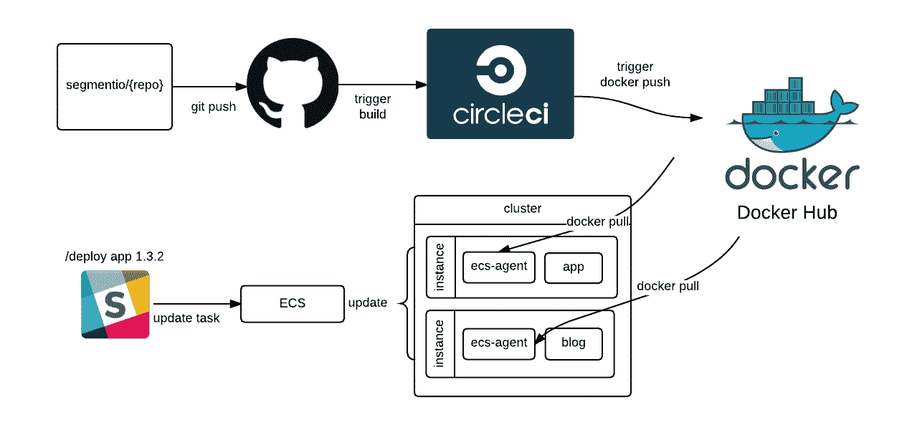
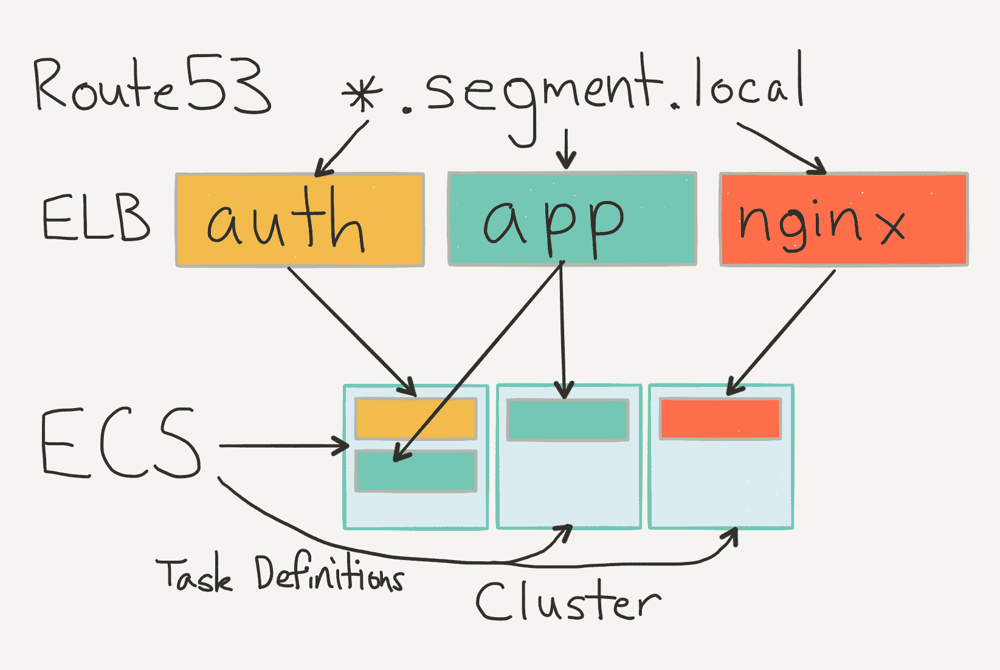
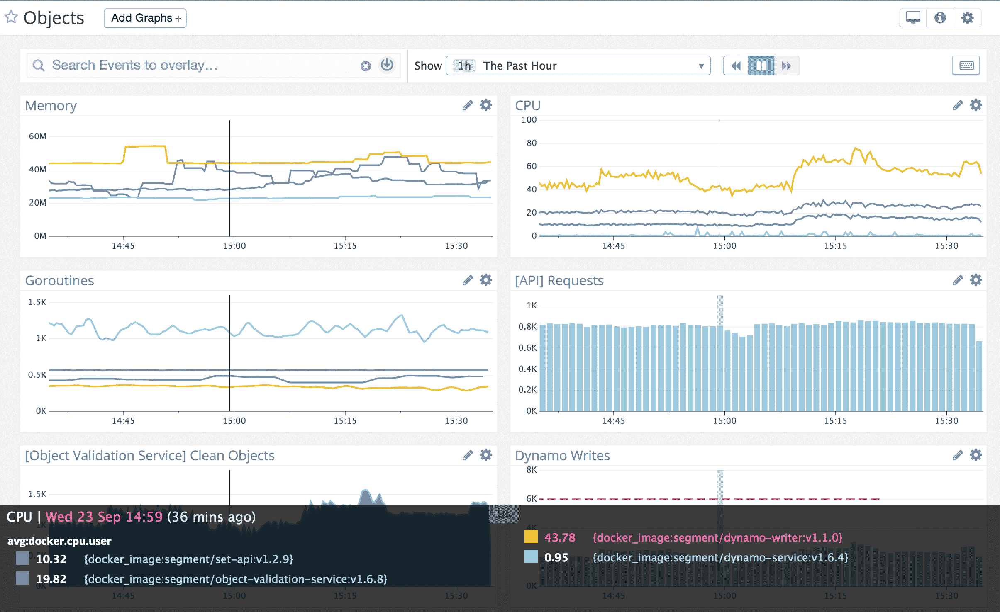
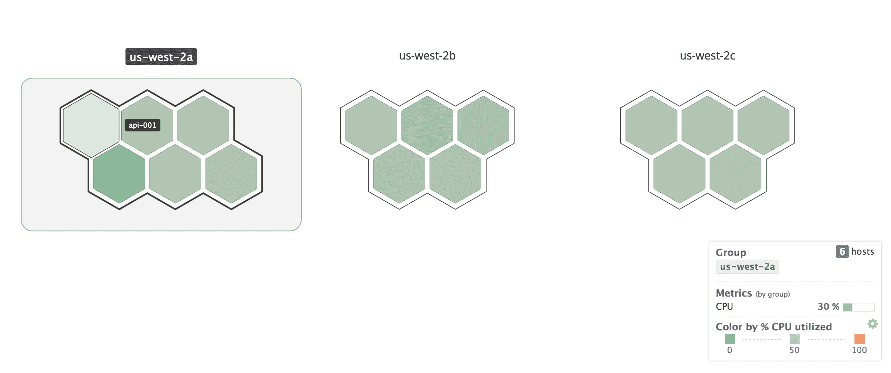

# 利用 Docker、ECS 和 Terraform 重建我们的基础设施| Twilio 细分市场博客

> 原文：<https://segment.com/blog/rebuilding-our-infrastructure/?utm_source=wanqu.co&utm_campaign=Wanqu+Daily&utm_medium=website>

在 Segment 的早期，我们的基础设施相当混乱。我们通过 AWS UI 提供实例，有一个未使用的 ami 的墓地，并且配置以三种不同的方式实现。

随着业务开始起飞，我们扩大了 eng 团队的规模和架构的复杂性。但是从事生产的人仍然局限于少数几个知道神秘问题的人。我们一直在逐步改进流程，但我们需要对我们的基础设施进行更深入的检查，以保持快速发展。

因此，几个月前，我们坐下来问自己:*“如果我们现在设计一个基础设施，它会是什么样子？”*

在 10 周的时间里，我们彻底改造了我们的基础设施。我们淘汰了几乎所有的实例和旧配置，将我们的服务转移到 Docker 容器中运行，并切换到使用新的 AWS 帐户。

我们花了很多时间思考如何建立一个可审计、简单且易于使用的生产设置，同时仍然允许扩展和增长的灵活性。

这是我们的解决方案。

## 独立的 AWS 帐户

我们没有使用区域或标签来分隔不同的 staging 和 prod 实例，而是切换到完全独立的 AWS **帐户**。我们需要确保我们的配置脚本不会影响我们当前运行的服务，使用新帐户意味着我们要从头开始。

`ops`账号作为跳转点和集中登录。组织中的每个人都可以拥有一个 IAM 帐户。

其他环境有一组 IAM 角色可以在它们之间切换。这意味着我们的管理员帐户只有一个登录点，一个限制访问的地方。

例如，Alice 可以访问所有三个环境，但是 Bob 只能访问 dev(自从他删除了生产负载平衡器之后)。但他们都是通过`ops`账户进入的。

我们不用复杂的 IAM 设置来限制访问，而是可以根据环境轻松锁定用户，并根据*角色对他们进行分组。*从界面使用每个账户就像切换当前活动角色一样简单。

我们不用担心暂存箱可能不安全或改变生产数据库，而是免费获得真正的隔离。不需要额外的配置。

能够共享配置代码还有一个额外的好处，这样我们的**暂存环境实际上镜像了 prod** 。配置上的唯一区别是实例的大小和容器的数量。

最后，我们还实现了跨客户的整合计费。我们用相同的发票支付每月账单，并看到按环境划分的成本明细。

## Docker 和 ECS

一旦我们建立了帐户，就该设计服务实际上是如何运行的了。为此，我们求助于码头公司和 T2 EC2 集装箱服务公司。

到今天为止，我们现在在 Docker 容器中运行我们的大部分服务，包括我们的 API 和数据管道。容器每秒接收数千个请求，每月处理 500 亿个事件。

Docker 最大的一个好处是它让团队能够从零开始构建服务。我们不再有一套复杂的资源调配脚本或 ami，我们只需为生产群集提供一个映像，它就会运行。不再有有状态的实例，我们保证在暂存和生产上运行完全相同的代码。

在将我们的服务配置为在容器中运行之后，我们选择 ECS 作为调度器。

在高层次上，ECS 负责在生产中实际运行我们的容器。它负责安排服务，将它们放在单独的主机上，并在连接到 ELB 时实现零停机重新加载。它甚至可以跨 AZs 进行调度，以获得更好的可用性。如果容器失效，ECS 将确保在该集群中的新实例上对其进行重新调度。

转换到 ECS 极大地简化了服务的运行，而无需担心启动作业或配置实例。这很简单，只需添加一个 [Dockerfile](https://gist.github.com/calvinfo/c9ffb5c28133be525c62) ，设置任务定义，并将其与集群相关联。

在我们的设置中，Docker 映像由 CI 构建，然后推送到 Docker Hub。当一个服务启动时，它从 Docker Hub 获取映像，然后 ECS 跨机器对其进行调度。

我们根据关注点和负载情况对服务集群进行分组(例如，针对 API、CDN、App 等的不同集群)。拥有独立的集群意味着我们可以获得更好的可见性，并且可以决定对每个集群使用不同的实例类型(因为 ECS 没有实例关联的概念)。

每个服务都有一个特定的任务定义，指示运行哪个版本的容器、运行多少个实例以及选择哪个集群。

在操作过程中，服务向 ELB 注册自己，并使用健康检查来确认容器确实准备就绪。我们将一个本地 Route53 入口指向 ELB，这样服务就可以彼此对话，并通过 DNS 进行简单的引用。

这个设置很好，因为我们不需要**任何**服务发现。本地 DNS 为我们做所有的簿记工作。

ECS 运行所有服务，我们从 ELBs 获得免费的 cloudwatch 指标。这比在启动时向中央机构注册服务要简单得多。最棒的是，我们不用自己处理州际冲突。

## 使用地形模板

Docker 和 ECS 描述了如何运行我们的每项服务，而 Terraform 则是将它们结合在一起的粘合剂。概括地说，它是一组创建和更新基础架构的配置脚本。你可以把它想象成类固醇上的云的形成——但它不会让你想把眼睛戳出来。

不是运行一组服务器来维护状态，而是只有一组描述集群的脚本。配置在本地运行(将来通过 CI ),并提交给 git，因此我们对生产基础设施的实际情况有一个连续的记录。

这是一个用于设置堡垒节点的 Terraform 模块示例。它创建了所有的安全组、实例和 ami，因此我们能够轻松地为未来环境设置新的跳转点。

我们在 stage 和 prod 中使用相同的模块来建立我们各自的堡垒。我们唯一需要切换的是 IAM 键，我们已经准备好了。

做出改变也是没有痛苦的。Terraform 不会总是拆除整个基础设施，而是会在可能的地方进行更新。

当我们想将 ELB 耗尽超时更改为 60 秒时，只需简单的 find/replace 和一个`terraform apply`。瞧，两分钟后，我们所有 elb 的生产设置都完全改变了。

它是可复制的，可审计的，自我记录的。这里没有黑盒。

我们已经将所有的配置放在一个中央`infrastructure` repo 中，所以很容易发现一个给定的服务是如何设置的。

尽管我们还没有完全到达圣杯。我们希望转换更多的 Terraform 配置，以利用模块的优势，这样就可以合并单个文件，并减少共享样板文件的数量。

在这个过程中，我们发现了一些关于`.tfstate`的问题，因为 Terraform 总是首先从现有的基础设施中读取数据，如果状态不同步，它就会发出抱怨。我们最终只是将我们的`.tfstate`提交给回购，并在做出任何更改后推动它，但我们正在研究 [Atlas](https://atlas.hashicorp.com/) 或通过 CI 应用来解决这个问题。

## 移动到 Datadog

到目前为止，我们已经有了基础架构、资源调配和隔离。最后剩下的是度量和监控，以跟踪生产中运行的一切。

在我们的新环境中，我们已经将所有的指标和监控转移到了 [Datadog](https://datadog.com/) 上，这真是**太棒了**。

我们对 Datadog 的 UI、API 以及与 AWS 的完全集成感到非常满意，但要充分利用该工具，还需要进行一些关键的设置。

我们做的第一件事是与 AWS 和 Cloudtrail 集成。它从 10，000 英尺的高度展示了我们每个环境中正在发生的事情。由于我们正在与 ECS 集成，每次任务定义更新时，Datadog feed 都会更新，因此我们最终会免费获得部署通知。搜索提要的速度惊人地快，并且可以很容易地追溯到上次部署或重新安排服务的时间。

接下来，我们确保将 Datadog-agent 作为一个容器添加到我们的基本 AMI 中( [datadog/docker-dd-agent](https://hub.docker.com/r/datadog/docker-dd-agent/) )。它不仅从主机(CPU、内存等)收集指标，还充当 statsd 指标的接收器。我们的每项服务都会收集有关查询、延迟和错误的自定义指标，以便我们能够在数据狗中进行探索和发出警报。我们的 go toolkit(即将开源)自动收集 ticker 上 [`pprof`](https://golang.org/pkg/net/http/pprof/) 的输出，并发送出去，这样我们就可以监控内存和 goroutines。

更棒的是，该代理可以直观显示环境中跨主机的实例利用率，因此我们可以对可能存在问题的实例或群集有一个较高的概述:

此外，我的队友 Vince 为 Datadog 创建了一个 [Terraform provider，因此我们可以完全根据*实际生产配置*编写我们的警报。我们的警报将被记录下来，并与 prod 中运行的内容保持同步。](https://github.com/segmentio/terraform-datadog)

按照惯例，我们指定两个警报级别:`warning`和`critical`。`warning`的存在是为了让当前在线的任何人知道有什么东西看起来可疑，应该在任何潜在问题之前被触发。`critical`警报是为出现严重系统故障的“半夜叫醒你”问题保留的。

更重要的是，一旦我们过渡到 Terraform 模块，并将 Datadog 提供者添加到我们的服务描述中，那么所有服务最终都会收到*免费*的警报。这些数据将由我们的内部工具包和 Cloudwatch 指标直接提供支持。

## 让美好时光**码头工人运行**

一旦我们有了所有这些东西，这一天终于到来了。

我们首先在新的生产环境和旧的生产环境之间建立了一个 [VPC 对等连接](http://docs.aws.amazon.com/AmazonVPC/latest/UserGuide/vpc-peering.html),允许我们对数据库进行集群化，并在两者之间进行复制。

接下来，我们在新环境中预热 elb，以确保它们能够承受负载。Amazon 不会提供自动调整大小的 elb，所以我们不得不要求他们提前调整(或者自己慢慢调整)来处理增加的负载。

从那时起，只需使用加权路由 53 路由稳步提升从旧环境到新环境的流量，并持续监控一切正常。

今天，我们的 API 运行良好，每秒处理数千个请求，并且完全在 Docker 容器中运行。

但是我们还没完。我们仍在微调我们的服务创建，并减少样板文件，以便团队中的任何人都可以轻松地构建带有适当监控和警报的服务。我们希望围绕容器改进我们的工具，因为服务不再与实例绑定。

我们还计划关注这一领域有前途的技术。 [Convox](https://convox.com/) 团队正在围绕 AWS 基础设施构建令人敬畏的工具。 [Kubernetes](http://kubernetes.io/) 、 [Mesosphere](https://mesosphere.com/) 、 [Nomad](https://nomadproject.io/) 和 [Fleet](https://github.com/coreos/fleet) 看起来是非常酷的调度程序，尽管我们喜欢 ECS 的简单性和集成性。看到他们如何摆脱困境将是令人兴奋的，我们将继续关注他们，看看我们能采纳什么。

在所有这些编排变化之后，我们比以往任何时候都更加坚信将我们的基础设施外包给 AWS。他们通过将许多核心服务产品化，同时保持极具竞争力的价格点，改变了游戏规则。它正在创造一种新的创业公司，可以高效、廉价地生产产品，同时减少维护时间。我们看好将建立在他们生态系统之上的工具。