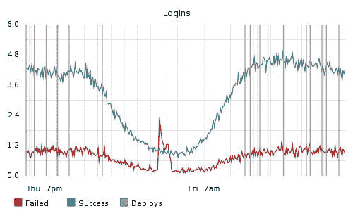
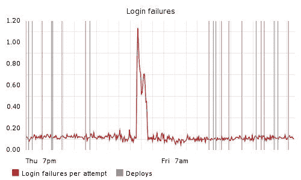
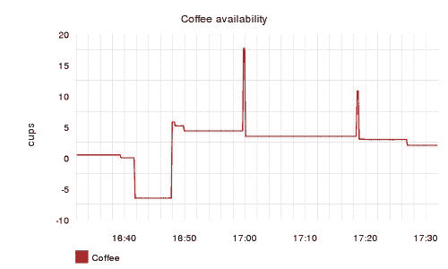
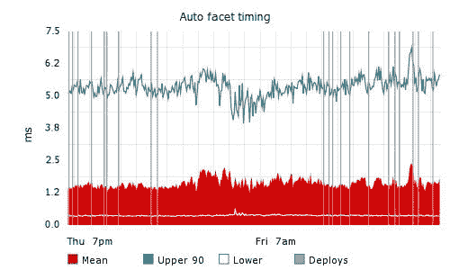

# Etsy 工程|测量一切，测量一切

> 原文：<https://codeascraft.com/2011/02/15/measure-anything-measure-everything/?utm_source=wanqu.co&utm_campaign=Wanqu+Daily&utm_medium=website>

如果 Etsy 的工程学有一种信仰，那就是图形教堂。如果它动了，我们就追踪它。有时我们会画一个还没有移动的东西的图，以防它决定逃跑。一般来说，我们倾向于在三个层次上进行测量:网络、机器和应用。(你可以在 Mike 的[跟踪每一次发布](https://www.etsy.com/codeascraft/track-every-release?ref=codeascraft)的帖子中阅读更多关于我们的图表。)

应用程序度量通常是三者中最难的，但也是最重要的。它们非常特定于您的业务，并且随着您的应用程序的变化而变化(Etsy 变化很大)。我们没有试图计划出我们想要测量的一切，并将其放入经典的[配置管理系统](http://www.opscode.com/chef/)中，而是决定让任何工程师几乎毫不费力地将他们可以计数或计时的任何东西放入图表中。(而且，因为我们可以随时随地推送代码，部署代码也很容易，所以我们可以从“X 多久发生一次？”如果我们想的话，可以画出 X 在半小时内发生的情况。)

## 认识 StatsD

StatsD 是一个简单的 [NodeJS](http://nodejs.org/) 守护进程(我说的“简单”实际上是指简单——NodeJS 使得这种基于事件的系统非常容易编写),它监听 UDP 端口上的消息。(参见 Flickr 的“[计数&计时](http://code.flickr.com/blog/2008/10/27/counting-timing/)”以了解之前对此想法的描述和实现，并查看 github 上的[开源代码以查看我们的版本。)它解析消息，提取度量数据，并定期将数据刷新到](https://github.com/etsy/statsd) [graphite](http://graphite.wikidot.com/) 。

我们喜欢 graphite 有几个原因:它非常容易使用，并且具有非常强大的图形和数据处理能力。我们可以将来自 StatsD 的数据与来自其他指标收集系统的数据结合起来。对 StatsD 来说最重要的是，您可以在 graphite 中创建新的指标，只需向它发送该指标的数据。这意味着工程师开始跟踪新事物没有管理开销:只需告诉 StatsD 您想要跟踪“grue.dinners ”,它就会自动出现在 graphite 中。(顺便说一下，因为我们每 10 秒钟将数据刷新到 graphite，所以我们的 StatsD 指标几乎是实时的。)

不仅开始捕捉某件事情的速率或速度非常容易，而且查看、分享和吹嘘它们也非常容易。

## 为什么是 UDP？

那么，我们为什么要用 UDP 向 StatsD 发送数据呢？嗯，它很快——您不希望为了跟踪应用程序的性能而降低其速度——但是发送 UDP 数据包也是一劳永逸的。StatsD 要么得到数据，要么得不到。应用程序不关心 StatsD 是启动、关闭还是着火；它只是相信事情会成功。如果他们不这样做，我们的统计数据会变得不稳定，但是网站会保持运行。因为我们也在正常运行时间教堂做礼拜，这很好。(图形教会确保我们绘制 UDP 包接收失败的图形，这是内核有效提供的。)

## 测量任何东西

下面是我们如何使用 PHP StatsD 库来实现的:

```
StatsD::increment("grue.dinners");
```

就是这样。这一行代码将动态创建一个新的计数器，并在每次执行时递增。然后你可以去看看你的图表，沉浸在这种美妙之中，或者在半夜发现某人不怀好意:



我们可以使用 graphite 的数据处理工具获取上面的数据，并制作一个图表，突出显示与标准的偏差:



(我们有时使用 graphite 中的“rawData=true”选项来获得一系列数字，这些数字可以输入到自动监控系统中。像这样的图表是非常“可监控的”)

我们不仅仅跟踪像有多少人登录网站这样的小事，我们还跟踪真正重要的事情，比如厨房里还剩多少咖啡:



## 时间也可以

除了普通计数器，我们还可以跟踪时间:

```
$start = microtime(true);
eat_adventurer();
StatsD::timing("grue.dinners", (microtime(true) - $start) * 1000);
```

StatsD 自动跟踪计数、平均值、最大值、最小值和第 90 个百分位时间(这是“正常”最大值的良好度量，忽略异常值)。在这里，我们测量了部分搜索基础设施的执行时间:



## 对数据进行采样

我们早期发现的一件事是，如果我们想要跟踪非常非常频繁发生的事情，我们可以开始用 UDP 包淹没 StatsD。为了解决这个问题，我们增加了采样数据的选项，也就是说，只在一定的时间内发送数据包。对于非常频繁的事件，这仍然给你一个统计上准确的活动视图。

若要仅记录十分之一的事件:

```
StatsD::increment(“adventurer.heartbeat”, 0.1);
```

这里重要的是，发送到 StatsD 的数据包包含采样速率，因此 StatsD 在将数据发送到 graphite 之前，会将这些数字相乘，得出 100%采样速率的估计值。这意味着我们可以随意调整采样率，而不必重新调整结果图的 y 轴。

## 衡量一切

我们发现跟踪一切是快速行动的关键，但唯一的方法是让跟踪一切变得容易。使用 StatsD，我们使工程师能够立即跟踪他们需要跟踪的内容，而不需要耗费时间的配置更改或复杂的流程。

亲自尝试 StatsD:从 github 获取[开源代码并开始测量。我们很想听听你对它的看法。](https://github.com/etsy/statsd)