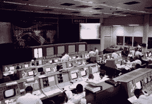

# 做(正确的)事情|通过运输学习

> 原文：<http://blog.learningbyshipping.com/2015/10/12/getting-the-right-stuff-done/?utm_source=wanqu.co&utm_campaign=Wanqu+Daily&utm_medium=website>

产品管理(PM)的一个关键角色，无论是作为专注于产品的创始人(CEO、CTO)还是 PM 领导者，都是确保产品开发工作*专注于*。但是专注是什么意思呢？对于一个团队来说，这并不总是那么清晰。虽然每个人都喜欢专注，但对敏捷、行动和“前进”的热爱是平等的。保持列车运行非常重要，但同样重要但经常被忽视的是确保目的地畅通无阻。

这听起来可能很疯狂，但是对于团队来说，快速行动、完成工作、打破可能对整体工作没有帮助的事情比人们想象的要容易得多。事实上，根据我的经验，随着数据和遥测技术的出现，这一挑战近年来变得更加严峻。有了这些，就很容易找到*需要*去改进应用或服务的工作——数据告诉你，有些东西正在绊倒客户，表现不佳，或者没有被使用。采取行动让你很容易感觉到正确的事情正在发生。感觉是在往前走。每个人都喜欢把事情做好。每个人都感觉很专注。

但是团队是否专注于正确的工作以获得正确的结果？

### 只是一个小小的过程

两个重要的现实代表了领导产品时的持续平衡行为。作为一名项目经理，你正在将**有限的资源**用于**的市场需求**以适应 [*产品市场*](http://pmarchive.com/guide_to_startups_part4.html) 或者努力工作以保持竞争优势。除了新功能之外，还有销售或客户成功*需要*做的工作，这些加在一起大大超过了工程部门所能提供的。

这个问题永远不会消失，并且是产品领导角色的核心——以正确的优先级完成正确的事情。

在每一家运营良好的公司里，都有强烈的行动倾向和对流程的强烈厌恶。 在实践中，没有过程就等于没有过程，只是行动和结果之间没有明确的界限 。一点点的过程(也叫产品管理)可以让你真正专注并完成正确的事情。

通过一点点流程，团队中的每个人都可以:

*   分享对成功的看法
*   清楚了解成功的衡量标准和指标
*   当事情没有按计划进行时，简单的机制来决定什么应该被削减或取消
*   哪些工作会影响哪些成功要素以及哪些衡量标准之间的明显一致性
*   诚实核算投入到哪些大计划中的资源
*   有充分的机会参与决定何时做什么

过程很容易过度，从一个有用的工具变成人们逃避的负担。个人目标一直是尽可能的轻量级，并且有一种方式来考虑这些需求，这些需求是从持续几周、几个月甚至更长时间的项目扩展而来的。

我的指导原则或黄金法则是 **永远不要向那些不能直接帮助他们完成工作的人要求什么**。流程不是关于报告或“管理”，而是关于确保每个人做的工作是最重要的工作和时间。

### 只是一个小小的框架

当大多数人想到提出一个产品路线图或计划时，他们会想到光谱的两端。在一端，通常有一个幻灯片版本，标有月份或年份，以及几个不同粒度级别的项目符号，随着时间的推移，准确性会降低。还有详细的长期战略计划，大多数人都看不懂，这通常是大公司的顾问或员工的工作。

我发现这两者之间有一些东西对设计产品路线图非常有帮助。

路线图可以表示为越来越详细的层次结构。它始于一项**使命**，涵盖了整个公司多年的抱负。从使命开始，遵循代表 12 个月工作的**目标**，这些目标由具体的度量标准或措施以及公司中的各种角色或纪律支持。然后团队聚在一起进行**项目**(或长期项目中的里程碑)，这些项目需要几周时间，并通过向市场发布产品或程序来描述。支持项目创建的是代表个人工作的特性级别的日常任务。

在整个系统中，不断有遥测数据被调用来为公司提供可靠的数据，以便公司做出决策。

#### 代表团

整本[书](http://smile.amazon.com/101-Mission-Statements-Top-Companies-ebook/dp/B00F8F0KWU/ref=asap_bc?ie=UTF8)都是关于使命陈述或者发展使命陈述的过程。没有什么比召开一次会议来起草一份使命宣言更让我抱怨的了。我们都看到了这些努力的结果是被动语态、逗号拼接和令人窒息的语言的尴尬组合。公司的存在是有原因的，这就是使命。

使命是令人向往的，它会指导你很多年，并代表你存在的理由。你所做的一切都应该以你的使命为目标，而你如何做到这一点是框架其余部分的工作。大胆宣称目标是“扰乱”的任务往往有点向后看，或者关注机制而不是结果。相反，定义未来存在状态或新世界观的使命往往是最持久和更积极的。任务最重要的一点是只有一个，而且会持续下去。使命宣言最好能在 t 恤或类似的东西上表达出来。

#### 目标

大多数人都认为他们已经有了目标。不过，目标通常以指标或记分卡的形式来表达，比如下载量最多的应用或数量、每日用户数或预订量。这些很容易表达，是一个创业公司的命脉。挑战在于它们经常变化。像任何好的代码一样，当面对经常变化的东西时，最好的办法是增加一层间接性。目标是指标或度量的抽象视图。

目标是战略概念，如保留、易用性、获取、可管理性、规模、成功等等。通过发展遥测技术，您可以开发指标来支持目标。

通过使用这些抽象概念，你可能会意识到你比工程师(或营销人员、成功伙伴等)有更多的目标。)或者你最终让每个人都为太多的目标而努力。这是专注于目标的过程的一部分。对于任何一种产品，只能有 3-5 个目标，这些目标可以放在一张“幻灯片”上，其中包括工程、销售和客户成果的所有方面。这是一种预先设置一些约束的有意尝试。

然后，随着时间的推移，以特定的方式来衡量目标。度量标准是目标的生命线。你的目标可能是获取，但衡量标准可能是一段时间内的特定保留机制；或者，您的目标可能是提高服务的可扩展性，但衡量标准可能是一段时间的计算使用情况，然后是另一段时间的存储使用情况。

当考虑目标时，它们几乎总是落在团队的特定职能(或角色)上，例如营销、销售或工程。对目标和相关指标进行全面的描述可以让你了解随着团队工作的进展会发生什么变化— *被测量的将会发生什么变化*。

#### 项目

项目很容易理解——它们是客户和市场使用和听到的版本或程序。例如，一个项目可能是对服务、应用程序的全面更新，一个新的市场准入，一次发布，一次活动，或一次重大的基础设施变更。在早期，为一个公司命名项目是微不足道的。然而，很快，项目的数量会激增，并且变得越来越难以跟踪(并且可能难以证明)。有 SDK，企业工具，细分市场活动，不同平台的应用程序或对不同浏览器的支持，等等。

保持一个清晰的活动项目列表的关键原因是，继续某个项目的动力，未能重新分配资源，往往会成为完成重要工作的最大限制。你经常会发现自己在维护一个不再符合当前需求的项目，但惯性使其难以改变。产品管理最重要的任务是确保每个人都知道正在进行的项目。公司规模越大，了解什么项目是活跃的以及团队对这些项目做出什么承诺就越重要。即使在最大的公司里，也只有几十个有意义的项目。

一个项目有一个*结束日期*或*截止日期*——不是一个月或一个季度(那是 30 或 90 个日期)而是一个日期——每个人都知道项目何时发布或完成。

#### 任务

当你从任务到目标再到项目，团队工作最具体的表现就是任务。任务是要部署的实际代码、要编写的白皮书、要使用的 SEO 工具、要举行的发布活动、要设计的功能等等。虽然一些人可能会非常关心或为任务做出贡献，高管通常专注于目标，经理关注整个项目，但每个人都投入到任务中。

任务是由那些将要完成工作的人来定义的，这些人将决定需要多长时间。参与一个项目的每个人可能都有几十项任务。任务应该在 1/2 到 2 天之间——少一些，计算起来太痛苦，多一些，很可能工作没有得到足够的理解，无法可靠地安排。

花时间创建工作项列表有两个主要的好处。首先，项目整体变得越来越可预测，这一点很重要，因为存在依赖性(比如前端和后端，或者营销活动)。第二，当事情不像计划的那样顺利时，对事情的进展有一个清晰的认识，并有一个预先计算的清单，列出通过削减不同的任务可以节省的费用。无论是 Asana，Trello，Sheets，吉拉或更多的关键是有一个系统，而不仅仅是围绕着显示器的便利贴。

经常被忽视的是，当每个人都知道*什么*背后的*为什么*时，他们会更有效率。如果工作列表来自特定的项目，而这些项目的目标是以特定的方式衡量的，那么每个人都会做得更好。这个框架的大部分工作将被证明是从任务到使命的连接。

#### 遥感勘测

贯穿你所有努力的另一个因素是**遥测**。

最成功的组织也是装备齐全的组织。关于代码、客户和整体参与的一切都有遥测技术。

对各种各样的措施保持开放的心态和开放的眼光是非常重要的。只是作为一个规模和操作的问题，你不能让每个人都负责任，或者改变正在做的事情来回应每一项措施。如果你正在学习一些你感兴趣的东西，那就开始钻研吧。也许你会改变你的计划。但是，当你确实需要改变你的计划时，你可以在一个整体框架的背景下这样做，而不仅仅是单个数据点。

框架和遥测技术的结合使得在全球范围内最大化您的投资回报成为可能。仅遥测技术就有局部优化的风险。框架本身只是猜测。