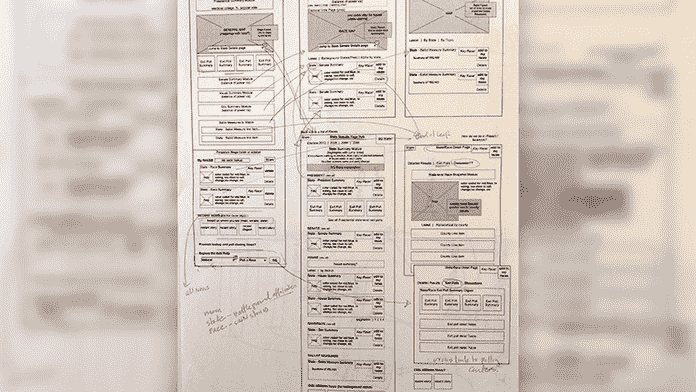
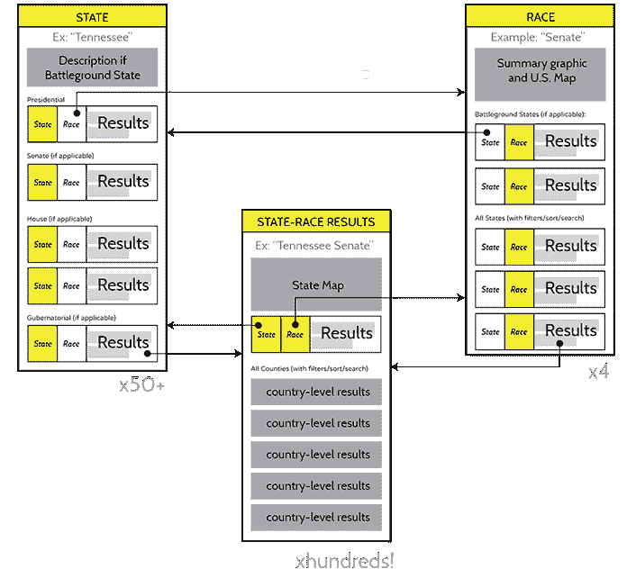
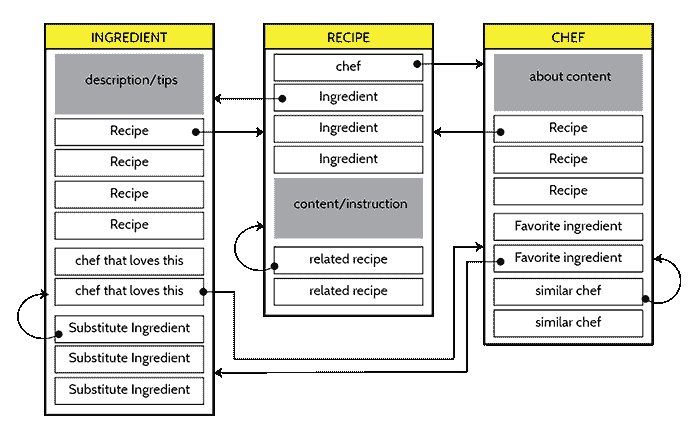
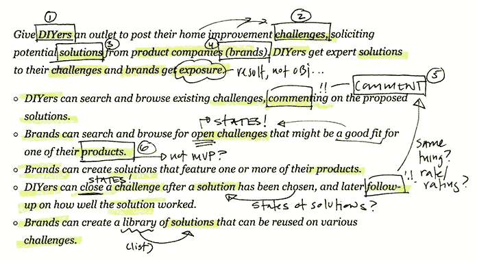
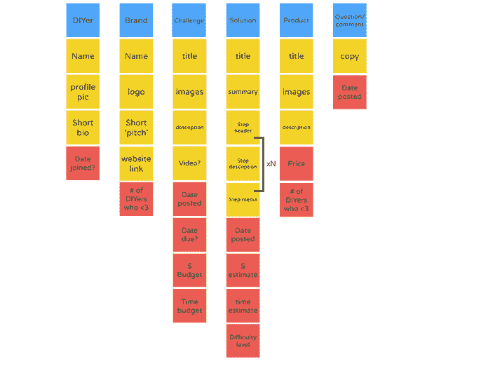
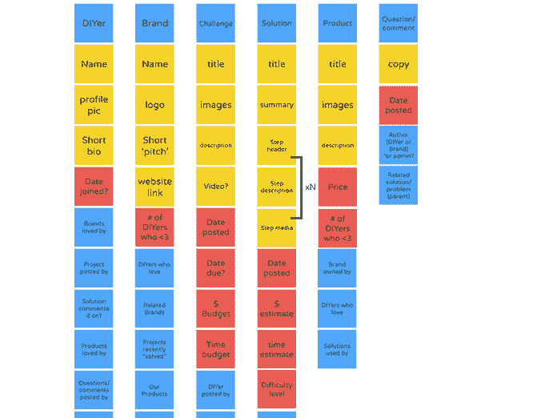
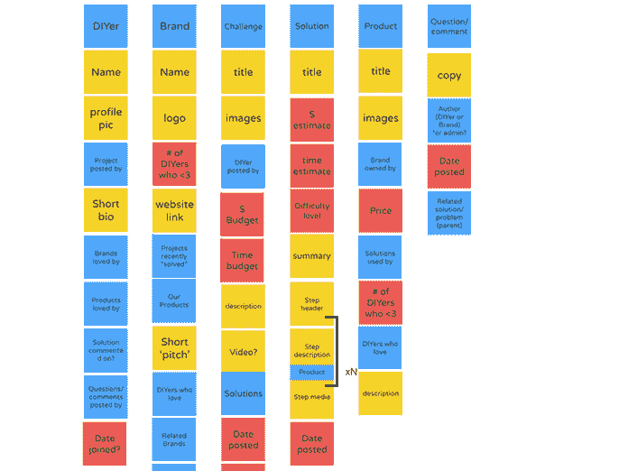

# 面向对象的 UX——一个单独的列表

> 原文：<http://alistapart.com/article/object-oriented-ux?utm_source=wanqu.co&utm_campaign=Wanqu+Daily&utm_medium=website>

2012 年 6 月，当我在 CNN.com 工作时，我的任务是设计选举之夜的用户体验。我生命中接下来的五个月将会献给那个夜晚——但是成功对我来说与谁赢了无关。我关心的是可发现性、数据可视化、变形画布，以及鼠标悬停弹出按钮如何在 iPhone 上工作。历史上第一次，CNN.com 发布了一个响应体验。并且，有史以来第一次，我打算*设计*一个响应式体验。

下文继续

赌注很高。选举之夜对 CNN.com 来说就像超级碗周日。如果执行得好，这是四年周期中收入最高的夜晚之一。更大的压力是，我们的时间很紧，最后期限不会改变。11 月 6 日或破产。

然后我得知第一次开发冲刺在四天后拉开帷幕。*四天？！*我的项目经理淡定的告诉我，“放心吧。开发者只需要*一个模板*用于第一次冲刺。当他们正在构建第一个模板时，您可以继续下一个。”

啊？不先粗略地设计一下机器，我怎么能设计出一个机器上的齿轮呢？

当我们在固定屏幕尺寸的页面上设计时，近视思维还可以；我们可以将筒仓中设计的零件缝合在一起。我对响应式设计一无所知，但我知道我们需要一个干净简单的系统，而不是一堆一堆的页面。所有的工程师和设计师都知道，系统中的活动部件越多，发生灾难的可能性就越大。

因此，在最初的四天里，我没有线框出一个断开的模板。相反，我设计了一个由可重复使用、可互换的部件组成的整体系统。它看起来是这样的:

The diagram of the proposed election night experience I first presented to the CNN.com team.

我将这个图表展示给了一个会议室的涉众，他们希望审查一个“完成”的模板。我展示了与 2008 年的设计相比，我已经减少了组件和模板的数量，而且新系统非常简单，可以放在一张 8.5 × 11 的纸上！令人欣慰的是，房间里的大多数人都看到了我所展示的价值:减少了需要构建的东西。

我在 2012 年制作的图表远非完美，主要是因为我试图在太短的时间内做太多的事情。我在实现上操之过急，屏蔽了弹出菜单和条形图。我仍然认为桌面优先，担心*定位*，而不是*优先*。我打包了一个不成熟的主页，一个体验的封面(我现在将设计*去年*)。我尝试了持久的顶级导航，而不是首先关注内容模块。

虽然并不完美，但该图的精神及其背后的思想引起了我的共鸣。这不是一个网站地图；它没有等级制度。这不是一个故事板；它没有阻塞任务流。相反，这张图描绘了一个系统。它改变了我对 UX 的看法。

去掉交互、持久导航、主页和布局，如果我知道我现在所知道的，这是我当时会创建的图表，显示一个由三个对象组成的系统:[州](http://www2.cnn.com/election/2012/results/state/TN/)、[种族](http://www2.cnn.com/election/2012/results/race/senate/)和[州-种族结果](http://www2.cnn.com/election/2012/results/state/TN/senate/)。

How I’d present the election night experience if I were designing it today.

它成功了:我们积极响应的选举之夜变成了 CNN 高管们所希望的超级碗周日。但我们竭尽全力，在深夜和周末工作，以确保该设计能在无数设备上运行。我不确定我们能否用一个更复杂的设计来完成它。

今天，我已经将这种试射式的经验发展成一种经过验证的、结构化的基于对象的过程。在本文中，我将介绍面向对象的 UX，分享我的对象映射过程，并帮助您开始自己做。

## 移动优先，内容优先，对象优先 [#section2](#section2)

> 总是把对现实世界事物的思考与描述这些事物的文档分开。表示之前的资源。

[Mike Atherton](http://www.slideshare.net/reduxd/modeling-structured-content-ias13-workshop)

我花了大约一年的时间重新训练自己，真正地把移动放在第一位，但是今天，我甚至在设计桌面应用软件时也这样做。对我来说，移动优先仅仅意味着强制优先化。意思是以后再考虑布局。从一个单独的栏目“设计”(也称为列表)开始，强迫自己按照顺序排列内容和功能的优先级。

这种方法与内容优先的概念非常吻合:[“内容外设计”与“画布内设计”相对](https://adactio.com/journal/4523)。你必须知道你在说什么，然后才能分清主次。

有时，这意味着首先要有真实的文本——特别是当你在一个网站上工作时，有大量的常青的或指导性的文本，可以在设计工作开始前进行组织、优先排序、分析和更新。

但是，如果你在一个 99%实例化对象(新闻文章、产品、活动、捐赠)的网站上工作，就没有办法预先建立一个完整的副本——或者永远也不可能。我不得不考虑对象，而不是优先考虑实际的副本。

这就是 OOUX:将对象设计放在程序动作设计之前，通过用户心智模型中的现实世界对象(产品、教程、位置)来思考系统，而不是数字世界的动作(搜索、过滤、比较、结账)。我们在首先定义对象之后确定动作，这与传统的直接进入流程、交互和特性的动作优先过程相反。

最新消息。这就是后端工程师的工作方式。在 80 年代，软件工程社区开始从过程语言过渡到面向对象语言，面向对象语言具有代码重用、数据封装和更容易的软件维护等优点。大多数程序员使用面向对象的语言，如 Java、Ruby、Python、C++或 C#，来实现你的设计。

工程师通过绘制出组成问题域的对象来开始他们的过程——这是 UXers 从第一天就应该做的事情。当他们查看您的线框或原型时，他们首先对您的设计进行逆向工程，解析出对象。他们认为，“对象 *X* 将如何与对象 *Y* 对话？对象 *A* 会由许多对象 *B* s 组成吗？每个对象将具有哪些属性？这类对象会从那类对象继承吗？”

在 web 上，我们进行面向对象的开发，但仍然是程序化的设计，关注于向下钻取的层次结构或线性任务流。但是还有另一个选择。在他 1995 年的书 <cite>[设计面向对象的用户界面](http://www.amazon.com/Designing-Object-Oriented-Interfaces-Addison-Wesley-Technology/dp/080535350X/ref=sr_1_1?s=books&ie=UTF8&qid=1441640610&sr=1-1&keywords=designing+object+oriented+user+interfaces)</cite> 中，设计师兼工程师 Dave Collins 认为基于面向对象原则的前端和后端设计“给软件开发过程带来了连贯性。面向对象揭示了分析、设计和实现的工件之间深层的结构对应

定义模仿用户心智模型的对象为团队交流提供了一个脚手架。它给你一个共同的语言。除了团队凝聚力之外，面向对象的设计还可以帮助您:

*   符合用户的心理模型，改善他们的体验
*   确保简单性，减少因无关设计元素导致的意外复杂性
*   发展和维护你的产品:对象可以被迭代而不影响系统的其他部分，新的对象可以被优雅地合并(相对于附加特性)
*   用可移植的、独立的对象构建更好的 API
*   从结构化内容和有价值的交叉链接中获得 SEO 印象分

然后，有一个我最喜欢的理由:OOUX 帮助你烘焙比以往任何时候都更重要的上下文导航。换句话说，它帮助用户通过内容获取内容。

当用户在一个小屏幕上时，持久导航可能会被隐藏、篡改。但是即使在 17 英寸的显示器上，最漂亮的顶部导航也可能被忽略。当用户第一次访问一个网站时，他们通常会被闪亮的大物件所吸引，只把导航条或搜索栏作为备用方案。正如 Val Jencks 简洁地总结的那样，“我们先看页面上的内容。最上面的导航是防火梯。”

如果用户正在阅读一份食谱，他们下一步会想去哪里？我们应该根据他们正在阅读的食谱来预测他们可能想要探索什么，而不是让他们自己去搜索一个层次菜单或想出一个搜索词。我们当然不应该给他们留下一些“相关的配方”，就认为我们的工作已经完成。他们可能想看厨师发布的所有食谱。或者，也许他们想看到更多使用瑞士甜菜的食谱，根据配料进行旋转？

如果我们是面向对象的思维，我们将*用每个对象可能与其他对象相关的方式*进行实验，超越表面现象。可能厨师有喜欢的食材？在下面的面向对象设计中，用户可以不断地探索这三个对象(食谱、厨师、配料)的实例，而不会陷入死胡同。内容就是导航，一切都在上下文中。

In this object model, recipes, chefs, and ingredients are interconnected, allowing continuous exploration.

如果这个概念感觉很熟悉，您可能已经读过或实践过内容建模。在过去的五年中，许多信息架构师(见[迈克·阿泽顿的作品](http://www.slideshare.net/reduxd/modeling-structured-content-ias13-workshop))和内容策略师(见[雷切尔·洛温格的作品](//alistapart.com/article/content-modelling-a-master-skill))已经开始关注可重用内容类型的系统，并越来越多地参与内容管理系统的设计:内容创建者，不仅仅是最终用户，是主要用户。

萨拉·沃希特-博特彻在她的书《内容无处不在 中鼓励我们在深入研究线框和交互设计之前，先对内容建模:

> 内容建模给你系统的知识；它允许您查看您拥有什么类型的内容，它们包括哪些元素，以及它们如何以标准化的方式操作。

不幸的是，内容建模的艺术对许多 UX 设计师来说仍然是陌生的，他们听到“内容”并认为它不适用于他们。对于将软件作为服务或产品设计的 UXers 来说尤其如此:涉及*内容*的策略有时会被置若罔闻。

对象映射，我在 OOUX 后面的过程，是为那些不处理传统意义上的内容，但仍然需要设计系统的设计者的内容建模——而不仅仅是实现*的[系统。虽然可重用模板和模块的紧密集合是非常宝贵的，但这些设计模式对用户来说没有意义，除非它们得到与用户心理模型相匹配的现实世界对象系统的支持。首先专注于设计现实世界中的对象系统，然后设计一个实现系统，让它变得栩栩如生。这是我所有设计工作的关键，因为它将目标转化为满足这些目标的可执行系统。](http://bradfrost.com/blog/post/atomic-web-design/)*

 *拿出你的便利贴，带上你的团队，清理一些墙壁空间——我想向你介绍一下我的流程。

### 步骤 1:从目标 [#section5](#section5) 中提取对象

我最喜欢的对象映射的好处之一是它提供了一个从目标到设计的完美桥梁。对象映射提供了一个从策略到设计的简洁框架，而不是像《美丽心灵》那样随意地写白板。(请继续在白板上展示所有的[约翰·纳西](https://en.wikipedia.org/wiki/John_Forbes_Nash,_Jr.)，但首先创建一个对象图。它会给你狂野的创造力一个坚实的立足点。)

举个例子，假设我们正在构建一个应用程序，帮助家装品牌连接 DIYers。经过用户访谈、竞争分析和与利益相关方的讨论，我们有了我们的简介:

> 给 DIY 者一个发表他们家装挑战的渠道，从产品公司(品牌)那里寻求潜在的解决方案。DIY 者获得专家解决他们的挑战，品牌获得曝光。
> 
> *   DIYers 可以搜索和浏览现有的挑战，对提出的解决方案进行评论。
> *   品牌可以搜索和浏览可能非常适合其产品的公开挑战。
> *   品牌可以创建以一种或多种产品为特色的解决方案。
> *   DIYers 可以在选择解决方案后结束挑战，并在以后跟进解决方案的效果。
> *   品牌可以创建一个解决方案库，可以在各种挑战中重复使用。

为了提取对象，我们主要突出显示名词。

Highlighting the nouns in our project brief is the first step to mapping our objects.

识别名词非常简单，但是提取对象确实需要一些微妙的艺术:

*   我们特别注意不断出现的名词，比如*挑战*和*解决*。这些将是重要的物品。
*   我们忽略了抽象名词 *exposure* ，因为它描述了一个我们希望从我们的系统中出现的模糊概念，而不是一个将成为我们系统一部分的有形物体。
*   我们忽略*库*，因为这只是其他对象的集合(*解决方案*)。注意像*日历*、*目录*或*地图*这样的词。这些通常只是核心对象的花哨的列表视图:分别是一个*事件*、*产品*或*位置*。例如，大多数处理位置的系统都有一个单一的(也许可以过滤的)地图视图。地图是一种设计机制，而不是对象本身。
*   我们从两个动作中推断出一个对象:“评论”和“跟进”显然，我们将需要某种类型的*注释*对象。
*   我们注意到一个*挑战*对象需要多种状态:已发布、进行中、已关闭和已关闭并有反馈。

通过这 10 到 15 分钟的练习，我们就有了系统的主要构件。让我们把每个物体写在蓝色的贴纸上。

We write each object on its own sticky note to visualize the building blocks of our system.

接下来，我们需要定义对象是由什么组成的。

### 第二步:定义对象的核心内容 [#section6](#section6)

> 内容建模要求你在最高层次上理解你的目标，同时熟悉内容的最细微的属性。

—Sara Wachter-Boettcher, <cite>Content Everywhere</cite>

很好。我们刚刚确定了系统的宏观构件，现在我们必须确定每个构件的最细粒度的元素。这项活动通常保留到最后一刻的详细设计，但是在便利贴的媒介中定义元素是自由的——当你稍后开始绘制草图时，你可以专注于更有创意的方面。此外，就每个对象的组成进行早期对话可以帮助您避免在游戏后期遗漏(或无关)重要元素以及需要跨多个设计文档进行更改的情况。

最重要的是，你可以和你的团队进行对话，比如“DIY 者应该把他们的预算加入到挑战中吗？”*在*之前，非设计师在看线框或布局。这有助于保持对话的重点，而不是停留在预算图标上。

在这个过程的这一点上，我分离了两种类型的元素:核心内容和元数据。核心内容，如文本和图像，放在黄色标签上。元数据——用户可能排序或过滤的任何数据——我放在红色贴纸上。

The granular elements of each of our objects are mapped out with additional sticky notes.

如果你的团队不确定某个潜在的内容，无论如何都要写下来，加上一个问号。继续前进，稍后再回到这个话题。

### 步骤 3:嵌套对象进行交叉链接[#第 7 节](#section7)

现在这个系统活跃起来了。对每个物体做一系列思维实验。从一个对象开始，考虑其他每个对象可以“嵌套”在给定对象中的方式。当您嵌套对象时，您定义了它们之间的关系，并且隐式地定义了上下文导航。使用蓝色标签，试验每个对象如何嵌套它的其他兄弟对象。

We finish out the model by adding sticky notes that show how other content objects can “nest” within each object.

例如，下面是我们的*挑战*对象的对话:

*   DIYer:“简单，DIYer 是挑战的作者。”
*   解决方案:“这是一个挑战的主要嵌套对象。我们需要展示针对这一挑战发布的所有解决方案。”
*   布兰德:“呃，不是真的？Brand 将成为解决方案模块的一部分(作为解决方案的作者)，但可能不会直接嵌入到挑战中。”
*   产品:“同样，解决方案的一部分，而不是直接嵌套。哼。除非 DIYers 能把家里已经有的产品贴出来？”
*   评论:“嗯嗯。可能归入解决方案…我们应该继续对解决方案进行评论吗？或者品牌和 DIY 者应该能够直接向挑战赛提问吗？我们需要对此进行更多的探索。”

注意，并不是所有事情都想通了。有些项目，比如评论讨论，可能最好在草图阶段解决——但是你将有意识地探索一个确定的设计问题，而不是让你措手不及的问题。

### 第四步:强制排名[#第八节](#section8)

呃。这是最困难的一步。在前面的步骤中，将每个元素和嵌套对象写在*单独的*标签上是非常重要的。为什么？因为现在我们需要对元素重新排序，从最重要到最不重要。

Our object model, reordered based on how important each element is.

这个有序列表不一定提供屏幕顶部和底部的直接表示。在设计中，优先权可能体现在尺寸或颜色上。低优先级的内容可能会放在屏幕的顶部，但是在一个折叠的面板中(耶，渐进式披露！).所以，请向你的团队保证，我们只是进行优先排序，而不是设计。

在划分优先级时，想象一下哪些元素对你的用户最重要。哪些位是必须拥有的信息，哪些是最好拥有的信息？当考虑元数据时，考虑最重要的排序和过滤机制。如果默认排序是“受欢迎程度”，那么“喜欢这个的 DIY 者的数量”将是高优先级。

## 一个新的基础和框架

现在你有了一个直接从目标中派生出来的基于对象的系统。但是请记住，虽然这个活动为设计一个*实现系统*、交互和持久导航提供了一个基础，但是它并没有将任何决策刻在石头上。这是初稿！随着您的迭代，对象和元素将被引入、删除和重新排序。您的对象图为继续对话和协作提供了一个框架:与您的客户、您的设计团队和您的开发人员。

OOUX 不是新的端到端流程；这是添加到您当前流程中的新成分。它增加了清晰性、简洁性和凝聚力——增加了你的设计方式，增加了你向世界发布的产品。*